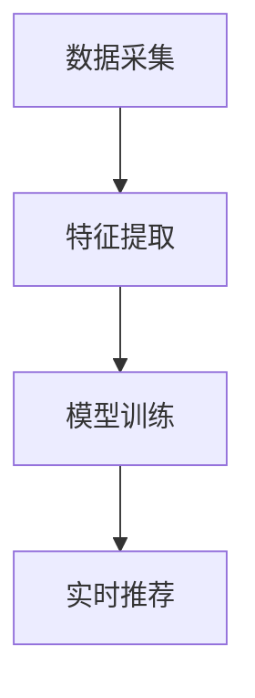
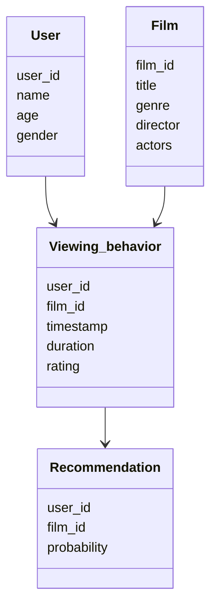
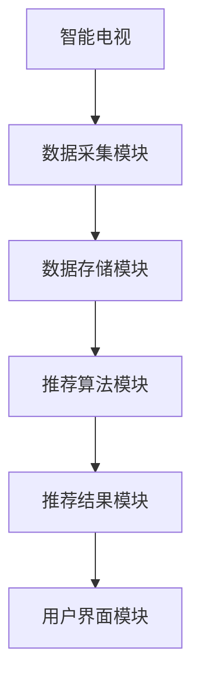
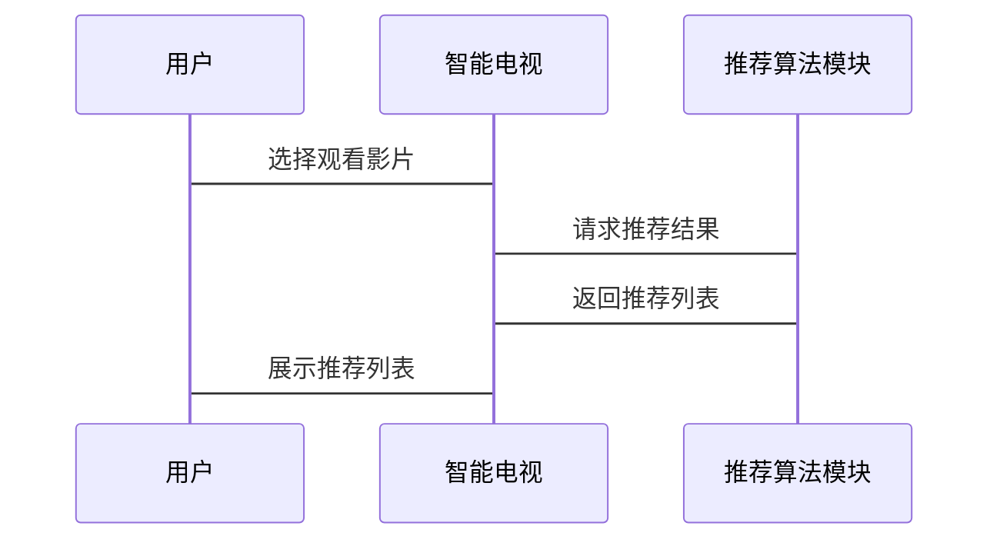

                 


# AI Agent在智能电视中的家庭观影喜好学习

> 关键词：AI Agent，智能电视，家庭观影，个性化推荐，数据驱动

> 摘要：本文探讨AI Agent在智能电视中的应用，重点分析如何通过数据驱动的方法学习和预测家庭成员的观影偏好。从背景介绍、核心概念、算法原理到系统架构设计，再到项目实战和最佳实践，全面解析AI Agent在家庭观影中的应用场景和技术实现。

---

# 第一部分: AI Agent与家庭观影喜好的背景介绍

# 第1章: AI Agent与家庭观影喜好的问题背景

## 1.1 问题背景
### 1.1.1 智能电视的发展现状
随着智能电视的普及，家庭观影需求日益多样化。传统电视的功能逐渐被智能电视的丰富功能取代，用户期望通过智能电视获得个性化的观影体验。

### 1.1.2 家庭观影需求的多样化
家庭成员的观影偏好差异较大，不同年龄段、性别和兴趣的成员对影视内容的需求各不相同。如何满足每个家庭成员的个性化需求，成为智能电视厂商的核心挑战。

### 1.1.3 AI Agent在家庭观影中的作用
AI Agent（人工智能代理）通过学习和分析家庭成员的观影数据，能够实时推荐符合用户偏好的影视内容，提升观影体验。

## 1.2 问题描述
### 1.2.1 家庭观影喜好的定义
家庭观影偏好是指家庭成员在选择影视内容时的倾向性，包括喜欢的类型、演员、剧情风格等。

### 1.2.2 AI Agent如何学习观影偏好
AI Agent通过收集和分析用户的观影行为数据，利用机器学习算法构建用户画像，从而预测用户的观影偏好。

### 1.2.3 现有技术的局限性
传统推荐算法在处理家庭观影偏好时存在局限性，例如难以实时更新推荐结果，且难以兼顾家庭成员的多样化需求。

## 1.3 问题解决
### 1.3.1 AI Agent的核心目标
AI Agent的目标是通过实时数据分析和动态推荐，为每个家庭成员提供个性化的内容推荐。

### 1.3.2 数据驱动的观影偏好学习
通过收集用户的观影数据，AI Agent能够分析用户的观影习惯，识别用户的偏好，并实时更新推荐结果。

### 1.3.3 个性化推荐的实现路径
个性化推荐的实现路径包括数据采集、特征提取、模型训练和实时推荐。

## 1.4 边界与外延
### 1.4.1 家庭观影喜好的边界
家庭观影偏好仅关注家庭成员的观影行为，不涉及其他娱乐方式（如音乐、游戏）的偏好。

### 1.4.2 AI Agent的适用范围
AI Agent适用于智能电视、流媒体平台等场景，帮助用户发现感兴趣的内容。

### 1.4.3 系统与其他模块的交互
AI Agent需要与智能电视的用户数据模块、内容推荐模块和其他第三方服务（如流媒体平台）进行交互。

## 1.5 概念结构与核心要素
### 1.5.1 核心概念的层次结构
家庭观影偏好学习涉及数据采集、特征提取、模型训练和实时推荐四个层次。

### 1.5.2 关键要素的定义与关系
- 数据采集：收集用户观影行为数据。
- 特征提取：从数据中提取有用的特征。
- 模型训练：基于特征训练推荐模型。
- 实时推荐：根据模型输出实时推荐结果。

### 1.5.3 概念结构图


---

# 第二部分: AI Agent的核心概念与联系

# 第2章: AI Agent的核心概念与原理

## 2.1 AI Agent的基本原理
### 2.1.1 AI Agent的定义
AI Agent是一种能够感知环境并采取行动以实现目标的智能实体。在家庭观影场景中，AI Agent通过分析用户行为数据，提供个性化的影视推荐。

### 2.1.2 AI Agent的分类
AI Agent可以分为基于规则的代理和基于学习的代理。在家庭观影偏好学习中，基于学习的代理（如机器学习模型）更为适用。

### 2.1.3 AI Agent在家庭观影中的应用
AI Agent通过分析用户的观影数据，预测用户的观影偏好，并实时推荐符合用户偏好的影视内容。

## 2.2 家庭观影喜好的数据特征
### 2.2.1 数据来源与类型
- 数据来源：智能电视记录的用户观影行为数据。
- 数据类型：包括用户的观影历史、评分、时长、暂停点等。

### 2.2.2 数据特征分析
- 时间特征：用户的观影时间、观影频率。
- 内容特征：用户喜欢的影视类型、演员、导演等。
- 行为特征：用户的暂停、快进、 rewind 等操作。

### 2.2.3 数据预处理方法
- 数据清洗：去除异常值和噪声数据。
- 数据归一化：将数据标准化以适应模型输入要求。

## 2.3 AI Agent与家庭观影喜好的关系
### 2.3.1 AI Agent如何分析观影数据
AI Agent通过机器学习算法分析用户的观影数据，提取用户的偏好特征。

### 2.3.2 家庭观影喜好的动态变化
用户的观影偏好会随着时间和环境的变化而变化，AI Agent需要实时更新推荐结果。

### 2.3.3 AI Agent的自适应能力
AI Agent能够根据用户的实时行为调整推荐策略，确保推荐内容与用户的当前偏好一致。

---

# 第3章: AI Agent的核心概念与联系

## 3.1 核心概念的原理分析
### 3.1.1 数据驱动的推荐算法
数据驱动的推荐算法基于用户的历史行为数据，通过统计分析和机器学习方法预测用户的偏好。

### 3.1.2 用户行为分析模型
用户行为分析模型用于分析用户的观影行为，提取用户的偏好特征。

### 3.1.3 AI Agent的决策机制
AI Agent通过分析用户的偏好特征，结合实时行为数据，动态调整推荐策略。

## 3.2 概念属性特征对比表格
```markdown
| 概念       | 属性       | 特征                         |
|------------|------------|------------------------------|
| AI Agent   | 数据驱动   | 实时分析                     |
| 家庭观影偏好 | 用户行为   | 动态变化                     |
| 推荐算法    | 个性化     | 高效计算                     |
```

## 3.3 ER实体关系图
```mermaid
erd
    User(user_id, name, age, gender)
    Film(film_id, title, genre, director, actors)
    Viewing_behavior(user_id, film_id, timestamp, duration, rating)
    Recommendation(user_id, film_id, probability)
```

---

# 第4章: AI Agent与家庭观影喜好的数学模型

## 4.1 基于协同过滤的推荐算法
### 4.1.1 协同过滤算法的数学模型
协同过滤算法基于用户的相似性进行推荐，数学模型如下：
$$
similarity(u, v) = \frac{\sum_{i=1}^{n} (r_{u,i} - \bar{r}_u)(r_{v,i} - \bar{r}_v)}{\sqrt{\sum_{i=1}^{n} (r_{u,i} - \bar{r}_u)^2} \cdot \sqrt{\sum_{i=1}^{n} (r_{v,i} - \bar{r}_v)^2}}
$$

其中，$r_{u,i}$ 表示用户 $u$ 对物品 $i$ 的评分，$\bar{r}_u$ 是用户 $u$ 的平均评分。

### 4.1.2 协同过滤算法的实现步骤
1. 计算用户之间的相似性。
2. 根据相似用户的偏好生成推荐列表。

## 4.2 基于内容的推荐算法
### 4.2.1 基于内容的推荐算法的数学模型
基于内容的推荐算法通过分析物品的特征向量，计算物品之间的相似性：
$$
similarity(i, j) = \frac{\sum_{k=1}^{m} w_k \cdot (f_{i,k} - f_{j,k})}{\sqrt{\sum_{k=1}^{m} w_k^2} \cdot \sqrt{\sum_{k=1}^{m} (f_{i,k} - f_{j,k})^2}}
$$

其中，$w_k$ 是特征 $k$ 的权重，$f_{i,k}$ 是物品 $i$ 在特征 $k$ 上的值。

### 4.2.2 基于内容的推荐算法的实现步骤
1. 提取物品的特征向量。
2. 计算物品之间的相似性。
3. 根据用户的偏好生成推荐列表。

## 4.3 混合推荐模型
### 4.3.1 混合推荐模型的数学模型
混合推荐模型结合协同过滤和基于内容的推荐算法，通过加权的方式生成最终的推荐结果：
$$
score(i, u) = \alpha \cdot CF(u) + (1 - \alpha) \cdot CB(u)
$$

其中，$\alpha$ 是协同过滤的权重，$CF(u)$ 是协同过滤算法生成的推荐得分，$CB(u)$ 是基于内容的推荐得分。

### 4.3.2 混合推荐模型的实现步骤
1. 训练协同过滤和基于内容的推荐模型。
2. 根据用户偏好对两种模型的推荐结果进行加权融合。
3. 输出最终的推荐列表。

---

# 第5章: AI Agent与家庭观影喜好的系统架构设计

## 5.1 系统功能设计
### 5.1.1 领域模型


### 5.1.2 系统架构图


### 5.1.3 接口设计
- 数据采集模块接口：接收用户的观影行为数据。
- 数据存储模块接口：存储用户的观影数据。
- 推荐算法模块接口：根据用户数据生成推荐列表。
- 用户界面模块接口：展示推荐结果。

### 5.1.4 交互流程图


---

# 第6章: AI Agent与家庭观影喜好的项目实战

## 6.1 环境安装
- Python 3.8+
- NumPy、Pandas、Scikit-learn、Flask

## 6.2 核心代码实现
### 6.2.1 数据预处理代码
```python
import pandas as pd
from sklearn.model_selection import train_test_split

# 加载数据
data = pd.read_csv('viewing_behavior.csv')

# 数据预处理
X = data[['user_id', 'film_id', 'timestamp', 'duration', 'rating']]
y = data['rating']

# 划分训练集和测试集
X_train, X_test, y_train, y_test = train_test_split(X, y, test_size=0.2, random_state=42)
```

### 6.2.2 推荐算法实现
```python
from sklearn.metrics.pairwise import cosine_similarity

# 协同过滤算法实现
def collaborative_filtering(X_train, y_train, X_test):
    user_item_matrix = X_train.pivot('user_id', 'film_id', 'rating')
    user_item_matrix = user_item_matrix.fillna(0)
    
    similarity_matrix = cosine_similarity(user_item_matrix.values)
    
    # 根据相似性计算推荐结果
    recommendations = []
    for user_id in X_test['user_id'].unique():
        user_index = user_item_matrix.index.get_loc(user_id)
        similar_users = similarity_matrix[user_index]
        recommended_films = []
        for film_id, score in zip(user_item_matrix.columns, similar_users):
            if score > 0.5:
                recommended_films.append(film_id)
        recommendations.append((user_id, recommended_films))
    return recommendations

# 调用协同过滤算法
recommendations = collaborative_filtering(X_train, y_train, X_test)
```

### 6.2.3 代码解读与分析
- 数据预处理部分将用户观影行为数据加载到Pandas DataFrame中，并进行数据清洗和划分训练集与测试集。
- 协同过滤算法通过计算用户之间的相似性，生成推荐列表。

## 6.3 案例分析
假设有一个家庭用户，用户ID为123，历史观影记录包括科幻电影《星际穿越》和动作片《复仇者联盟》。AI Agent通过分析用户的观影数据，推荐科幻片《流浪地球》和动作片《急战》。

---

# 第7章: AI Agent与家庭观影喜好的最佳实践

## 7.1 小结
本文详细介绍了AI Agent在家庭观影偏好学习中的应用，从背景介绍、核心概念到系统架构设计，再到项目实战，全面解析了AI Agent在智能电视中的实现路径。

## 7.2 注意事项
- 数据隐私保护：确保用户数据的安全性和隐私性。
- 推荐算法的实时性：保证推荐结果的实时更新。
- 用户体验优化：提供多样化的推荐方式，提升用户体验。

## 7.3 拓展阅读
- 《推荐系统导论》
- 《机器学习实战》
- 《智能电视中的AI应用》

---

作者：AI天才研究院/AI Genius Institute & 禅与计算机程序设计艺术 /Zen And The Art of Computer Programming

