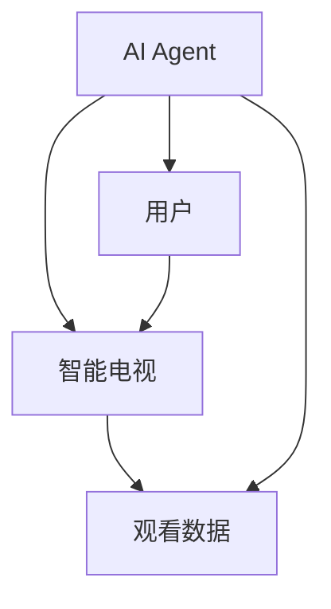
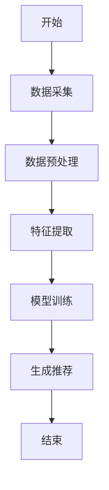
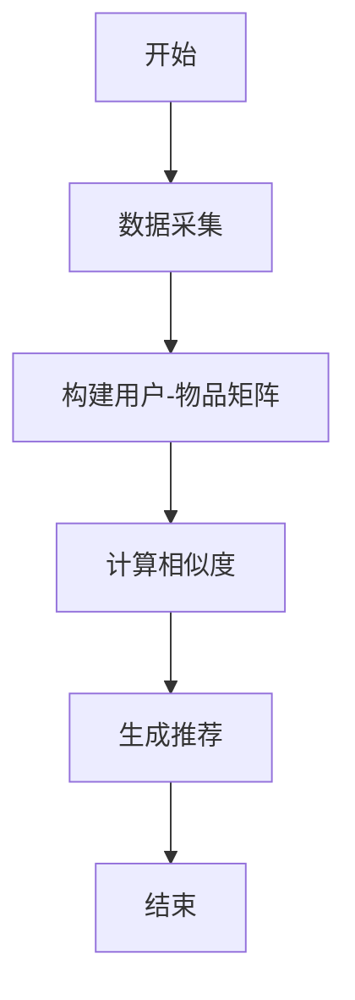
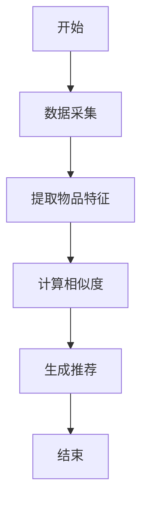
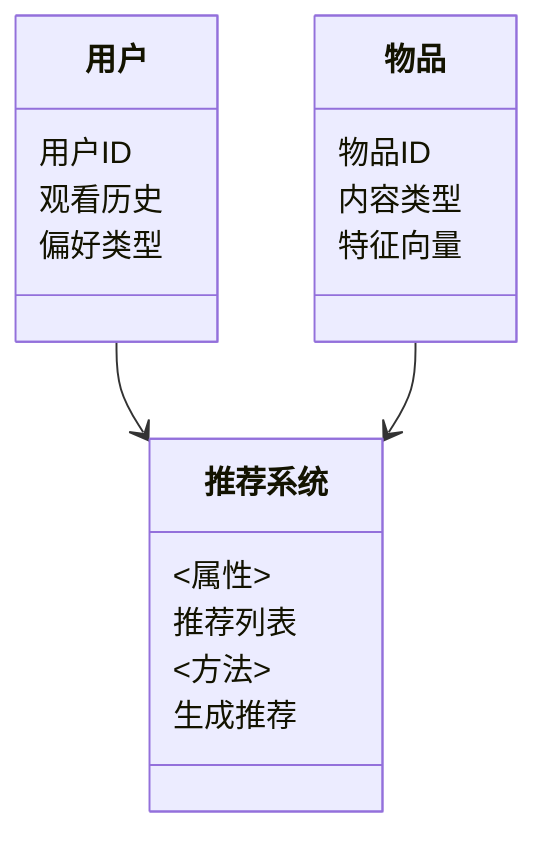
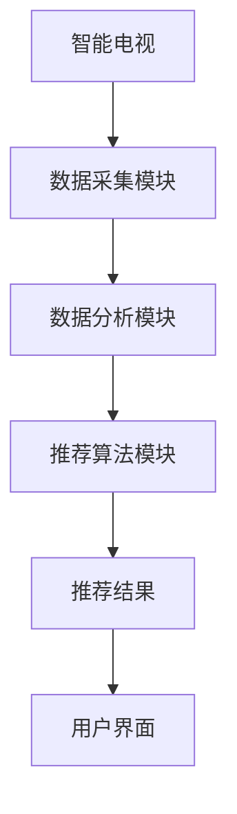
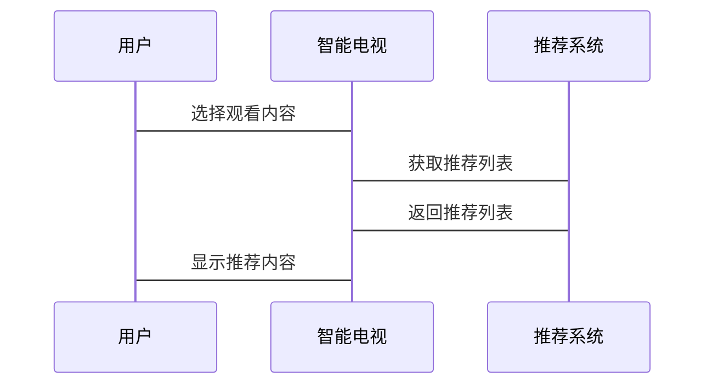

                 


# AI Agent在智能电视中的观看习惯分析

## 关键词
AI Agent, 智能电视, 观看习惯, 数据挖掘, 机器学习, 推荐系统

## 摘要
本文探讨了AI Agent在智能电视中的应用，重点分析其如何通过用户观看习惯的挖掘和分析，优化用户的观看体验。文章从背景介绍、核心概念、算法原理、系统架构到项目实战，详细阐述了AI Agent在智能电视中的实现过程和应用价值。

---

## 第1章: 背景介绍

### 1.1 AI Agent的基本概念

#### 1.1.1 AI Agent的定义
- AI Agent（人工智能代理）是一种能够感知环境并采取行动以实现目标的智能实体。
- **特点**：自主性、反应性、目标导向、社交能力。

#### 1.1.2 AI Agent在智能电视中的应用背景
- 智能电视从传统电视向智能终端的演变。
- AI Agent通过数据挖掘和机器学习，优化用户体验。

### 1.2 观看习惯分析的背景

#### 1.2.1 用户观看习惯的重要性
- 用户行为分析在智能电视中的意义：提升用户体验、优化内容推荐。
- 商业价值：精准广告投放、内容分发优化。

#### 1.2.2 当前观看习惯分析的主要挑战
- 数据采集：隐私问题、数据质量。
- 算法实现：复杂性高、实时性要求。

### 1.3 问题背景与问题描述

#### 1.3.1 问题背景
- 用户需求多样性：不同用户偏好不同内容。
- 传统观看习惯分析的局限性：基于规则的推荐系统不够灵活。

#### 1.3.2 问题描述
- AI Agent在智能电视中的应用场景：个性化推荐、内容过滤、观看行为预测。
- 核心目标：通过分析用户观看习惯，提供个性化内容推荐。

### 1.4 问题解决与边界

#### 1.4.1 AI Agent如何解决观看习惯分析问题
- AI Agent的核心优势：学习能力、自适应性。
- 应用方式：实时数据采集、机器学习模型训练、个性化推荐。

#### 1.4.2 边界与外延
- 应用边界：仅限于智能电视内部数据，不涉及外部平台。
- 概念扩展：AI Agent在智能家居、其他智能设备中的应用。

---

## 第2章: 核心概念与联系

### 2.1 AI Agent的核心概念

#### 2.1.1 AI Agent的核心原理
- 数据采集：收集用户观看数据。
- 数据分析：利用机器学习算法进行模式识别。
- 推荐算法：生成个性化推荐列表。

#### 2.1.2 AI Agent的核心要素
- **数据采集模块**：负责收集用户观看行为数据。
- **数据分析模块**：对数据进行清洗、处理和分析。
- **推荐算法模块**：基于分析结果生成推荐内容。

### 2.2 核心概念的属性特征对比

#### 2.2.1 AI Agent与传统推荐系统的对比

| 特性                | AI Agent推荐系统                | 传统推荐系统                |
|---------------------|--------------------------------|-----------------------------|
| 数据依赖            | 高，依赖实时数据               | 较低，依赖历史数据           |
| 精准度              | 高，基于机器学习               | 较低，基于规则或简单统计     |
| 适应性              | 强，能自适应用户偏好变化        | 较弱，需要手动调整规则       |
| 计算资源            | 高，需要高性能计算             | 较低，计算资源需求较小       |

#### 2.2.2 用户行为与观看习惯的对比

| 特性                | 用户行为                      | 观看习惯                      |
|---------------------|------------------------------|-------------------------------|
| 时间维度            | 即时行为                     | 长期积累                     |
| 数据类型            | 短时数据                     | 长时数据                     |
| 分析目标            | 瞬时反馈                     | 长期趋势                     |

### 2.3 实体关系图



### 2.4 工作流程图



---

## 第3章: 算法原理讲解

### 3.1 协同过滤算法

#### 3.1.1 算法原理
协同过滤是一种基于用户相似性或物品相似性的推荐算法。

#### 3.1.2 算法流程



#### 3.1.3 Python代码实现

```python
def collaborative_filtering(user_data, target_user):
    # 计算用户相似度
    similarities = {}
    for user in user_data:
        if user != target_user:
            similarity = calculate_similarity(user_data[user], user_data[target_user])
            similarities[user] = similarity
    # 推荐物品
    recommendations = []
    for item in user_data[target_user]:
        weighted_ratings = {}
        total_similarity = 0
        for user in similarities:
            rating = user_data[user].get(item, 0)
            weighted_ratings[item] += rating * similarities[user]
            total_similarity += similarities[user]
        if total_similarity > 0:
            recommendations.append((item, weighted_ratings[item] / total_similarity))
    return sorted(recommendations, key=lambda x: x[1], reverse=True)
```

#### 3.1.4 数学模型

协同过滤的相似度计算公式：

$$
\text{similarity}(u, v) = \frac{\sum_{i \in I} (r_ui - \bar{r_u})(r_vi - \bar{r_v})}{\sqrt{\sum_{i \in I} (r_ui - \bar{r_u})^2} \cdot \sqrt{\sum_{i \in I} (r_vi - \bar{r_v})^2}}
$$

其中：
- \( r_ui \) 表示用户 \( u \) 对物品 \( i \) 的评分。
- \( \bar{r_u} \) 表示用户 \( u \) 的平均评分。
- \( I \) 是用户 \( u \) 和 \( v \) 都有的评分物品集合。

---

### 3.2 基于内容的推荐算法

#### 3.2.1 算法原理
基于内容的推荐算法通过分析物品本身的属性来进行推荐。

#### 3.2.2 算法流程



#### 3.2.3 Python代码实现

```python
def content_based_filtering(item_data, target_item):
    # 提取物品特征
    target_features = extract_features(item_data[target_item])
    recommendations = []
    for item in item_data:
        if item != target_item:
            similarity = calculate_similarity(target_features, extract_features(item_data[item]))
            recommendations.append((item, similarity))
    return sorted(recommendations, key=lambda x: x[1], reverse=True)
```

#### 3.2.4 数学模型

余弦相似度计算公式：

$$
\text{similarity}(i, j) = \frac{\sum_{k=1}^{n} w_{ik} w_{jk}}{\sqrt{\sum_{k=1}^{n} w_{ik}^2} \cdot \sqrt{\sum_{k=1}^{n} w_{jk}^2}}
$$

其中：
- \( w_{ik} \) 表示物品 \( i \) 的第 \( k \) 个特征权重。
- \( n \) 是特征的数量。

---

## 第4章: 系统分析与架构设计

### 4.1 问题场景介绍

#### 4.1.1 智能电视的使用场景
- 用户通过遥控器选择内容。
- 系统记录用户的观看历史和偏好。

#### 4.1.2 系统功能需求
- 数据采集：实时记录用户的观看行为。
- 用户画像：构建用户画像。
- 推荐系统：基于用户画像生成推荐列表。

### 4.2 系统架构设计

#### 4.2.1 领域模型类图



#### 4.2.2 系统架构图



#### 4.2.3 系统接口设计

- 数据采集模块接口：
  - `get_user_data(user_id)`
  - `record_view(user_id, item_id, timestamp)`

- 推荐系统接口：
  - `generate_recommendations(user_id)`

#### 4.2.4 系统交互序列图



---

## 第5章: 项目实战

### 5.1 环境搭建

#### 5.1.1 安装必要的库
```bash
pip install numpy pandas scikit-learn
```

#### 5.1.2 编写核心代码

```python
from sklearn.metrics.pairwise import cosine_similarity
from sklearn.feature_extraction.text import TfidfVectorizer

# 数据加载
user_data = {
    'user1': {'item1': 5, 'item2': 4, 'item3': 3},
    'user2': {'item2': 5, 'item4': 4, 'item5': 3},
    'user3': {'item3': 5, 'item6': 4, 'item7': 3}
}

# 协同过滤实现
def collaborative_filtering(user_data, target_user):
    # 计算相似度矩阵
    users = list(user_data.keys())
    similarity_matrix = cosine_similarity([user_data[user] for user in users])
    # 生成推荐
    recommendations = []
    for i, user in enumerate(users):
        if i == target_user:
            continue
        similarity = similarity_matrix[i]
        for item, rating in user_data[user].items():
            recommendations.append((item, rating * similarity))
    # 排序并去重
    recommendations = sorted({item: sum(rating for rating, item in list) for item, rating in recommendations}.items(), key=lambda x: x[1], reverse=True)
    return recommendations

# 示例运行
print(collaborative_filtering(user_data, 'user1'))
```

---

## 第6章: 最佳实践

### 6.1 数据隐私保护
- 数据加密：保护用户隐私。
- 权限控制：限制数据访问权限。

### 6.2 算法优化建议
- 混合推荐：结合协同过滤和基于内容的推荐。
- 模型优化：使用深度学习模型提升推荐精准度。

### 6.3 用户体验提升
- 及时反馈：快速响应用户的操作。
- 个性化界面：根据用户偏好定制界面。

---

## 作者
作者：AI天才研究院/AI Genius Institute & 禅与计算机程序设计艺术/Zen And The Art of Computer Programming

---

这篇文章详细探讨了AI Agent在智能电视中的观看习惯分析，从背景介绍到系统设计，再到项目实战，内容全面且深入。希望对读者有所帮助！

