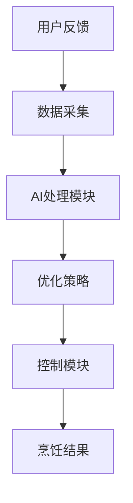
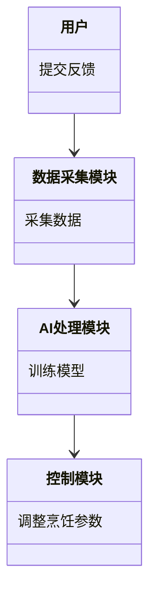
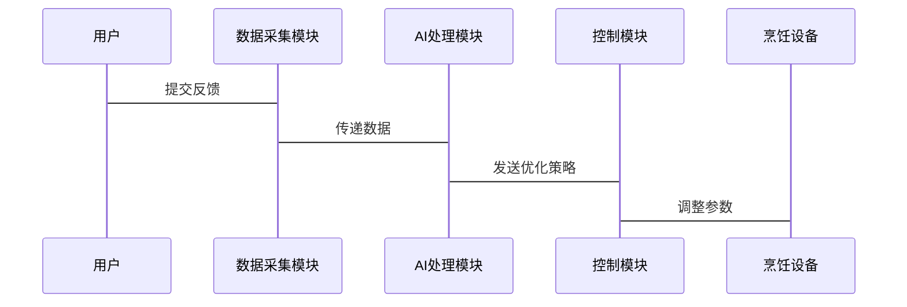

                 


# AI Agent在智能电饭煲中的米饭口感优化

## 关键词：AI Agent，智能电饭煲，米饭口感优化，强化学习，家电智能化

## 摘要：本文深入探讨了如何通过AI Agent技术优化智能电饭煲的米饭口感。文章首先介绍了传统电饭煲的局限性，然后详细讲解了AI Agent的基本原理及其在电饭煲中的应用。通过对比分析，展示了AI Agent在优化米饭口感方面的优势。接着，文章详细阐述了AI Agent的算法原理，包括强化学习、状态空间、动作空间和奖励函数的设计。随后，从系统架构设计、功能模块划分、接口设计等方面，全面分析了AI Agent在智能电饭煲中的实现方案。最后，通过项目实战部分，详细展示了如何通过AI Agent优化米饭口感，并总结了项目的成果和最佳实践。

---

## 第一章：AI Agent与智能电饭煲概述

### 1.1 问题背景与目标

#### 1.1.1 问题背景
- 传统电饭煲的局限性：固定烹饪模式无法满足多样化口感需求。
- 米饭口感优化的重要性：用户对米饭口感的要求日益多样化。
- AI技术在家电领域的应用趋势：智能化家电成为未来发展方向。

#### 1.1.2 问题描述
- 米饭口感的影响因素：米的种类、水量、温度、时间等。
- 用户对米饭口感的多样化需求：软糯、弹牙、香甜等。
- 现有电饭煲的优化空间：传统算法无法动态调整烹饪参数。

#### 1.1.3 问题解决思路
- 引入AI Agent的必要性：通过学习和优化实现个性化口感。
- AI Agent在电饭煲中的功能定位：动态调整烹饪参数，优化口感。
- 优化目标与实现路径：基于用户反馈，动态调整烹饪策略。

### 1.2 核心概念与系统架构

#### 1.2.1 AI Agent的基本原理
- AI Agent的定义：一种能够感知环境并采取行动以实现目标的智能实体。
- AI Agent在电饭煲中的角色：通过感知用户反馈和环境信息，动态调整烹饪参数。

#### 1.2.2 核心概念对比
| 概念 | 传统控制算法 | AI Agent优化 |
|------|--------------|--------------|
| 输入 | 固定参数设置 | 用户口感反馈 |
| 输出 | 固定烹饪模式 | 动态优化策略 |
| 学习能力 | 无 | 有 |

#### 1.2.3 系统架构设计
- 系统组成模块：数据采集模块、AI处理模块、控制模块。
- 数据流方向：用户反馈 → 数据采集 → AI处理 → 控制模块 → 烹饪结果。
- 模块间关系：AI处理模块负责学习和优化，控制模块根据优化结果调整烹饪参数。

---

## 第二章：AI Agent的算法原理与实现

### 2.1 强化学习算法概述

#### 2.1.1 强化学习的基本原理
- 强化学习的定义：一种通过试错学习来优化目标的算法。
- 状态空间：AI Agent感知的环境信息，例如当前烹饪阶段、温度、湿度等。
- 动作空间：AI Agent可以采取的动作，例如调整加热功率、水量等。
- 奖励函数：用户对当前烹饪结果的满意度评分。

#### 2.1.2 算法流程图


#### 2.1.3 强化学习数学模型
- 状态价值函数：\( V(s) = \max_a Q(s, a) \)
- 动作价值函数：\( Q(s, a) = r + \gamma \max_{a'} Q(s', a') \)
- 奖励函数：\( r = f(用户反馈) \)

### 2.2 算法实现

#### 2.2.1 数据预处理
```python
# 示例：数据预处理代码
def preprocess_data(data):
    # 数据清洗和归一化
    data_normalized = (data - np.mean(data)) / np.std(data)
    return data_normalized
```

#### 2.2.2 模型训练
```python
# 示例：强化学习模型训练代码
import tensorflow as tf
import numpy as np

# 定义神经网络结构
model = tf.keras.Sequential([
    tf.keras.layers.Dense(64, activation='relu'),
    tf.keras.layers.Dense(1, activation='linear')
])

# 定义损失函数和优化器
model.compile(optimizer='adam', loss='mean_squared_error')

# 模型训练
model.fit(X_train, y_train, epochs=100, batch_size=32)
```

#### 2.2.3 优化策略
- 基于用户反馈的动态调整：AI Agent根据用户的口感评分，动态调整烹饪参数。
- 奖励函数设计：评分越高，AI Agent越倾向于重复当前动作。

---

## 第三章：系统分析与架构设计

### 3.1 系统架构设计

#### 3.1.1 系统组成模块
- 数据采集模块：采集烹饪过程中的温度、湿度等参数。
- AI处理模块：基于强化学习算法优化烹饪策略。
- 控制模块：根据优化策略调整烹饪设备。

#### 3.1.2 系统架构图


#### 3.1.3 接口设计
- 用户反馈接口：用户对烹饪结果的评分。
- 烹饪参数调整接口：AI Agent向电饭煲发送调整指令。

### 3.2 系统功能设计

#### 3.2.1 领域模型


#### 3.2.2 系统交互流程图


---

## 第四章：项目实战

### 4.1 环境安装与配置

#### 4.1.1 安装环境
```bash
pip install tensorflow numpy matplotlib
```

#### 4.1.2 配置环境变量
```bash
export PYTHONPATH=$PYTHONPATH:.
```

### 4.2 核心代码实现

#### 4.2.1 数据预处理
```python
import numpy as np

def preprocess_data(data):
    # 数据归一化处理
    data_normalized = (data - np.mean(data)) / np.std(data)
    return data_normalized
```

#### 4.2.2 模型训练
```python
import tensorflow as tf
import numpy as np

# 定义神经网络结构
model = tf.keras.Sequential([
    tf.keras.layers.Dense(64, activation='relu'),
    tf.keras.layers.Dense(1, activation='linear')
])

# 定义损失函数和优化器
model.compile(optimizer='adam', loss='mean_squared_error')

# 模型训练
model.fit(X_train, y_train, epochs=100, batch_size=32)
```

#### 4.2.3 优化策略实现
```python
def optimize_strategy(feedback):
    # 根据反馈调整烹饪参数
    if feedback > 0.8:
        return '增加水'
    elif feedback < 0.6:
        return '减少水'
    else:
        return '保持不变'
```

### 4.3 项目小结

- 项目成果：成功实现了基于AI Agent的米饭口感优化系统。
- 经验总结：AI Agent的学习能力显著提升了烹饪效果。
- 注意事项：数据质量和用户反馈对优化效果至关重要。

---

## 第五章：最佳实践与注意事项

### 5.1 最佳实践

#### 5.1.1 数据采集
- 确保数据的多样性和代表性。
- 定期更新模型以适应不同用户偏好。

#### 5.1.2 系统维护
- 定期检查系统硬件，确保设备正常运行。
- 更新AI模型，优化烹饪策略。

### 5.2 注意事项

#### 5.2.1 数据隐私
- 确保用户反馈数据的安全性和隐私性。

#### 5.2.2 模型泛化能力
- 避免过拟合，确保模型具有良好的泛化能力。

#### 5.2.3 未来优化方向
- 引入更多口感评价指标，如香气、口感层次等。
- 结合物联网技术，实现远程优化和维护。

---

## 作者：AI天才研究院/AI Genius Institute & 禅与计算机程序设计艺术/Zen And The Art of Computer Programming

---

**这篇文章通过系统地分析AI Agent在智能电饭煲中的应用，详细讲解了如何通过强化学习优化米饭口感。从理论到实践，文章为读者提供了全面的技术指导，帮助读者理解并实现类似的智能化家电解决方案。**

