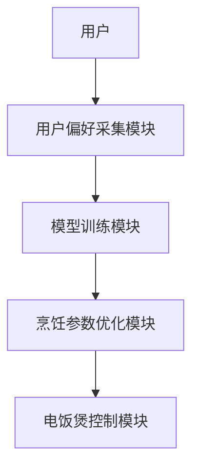
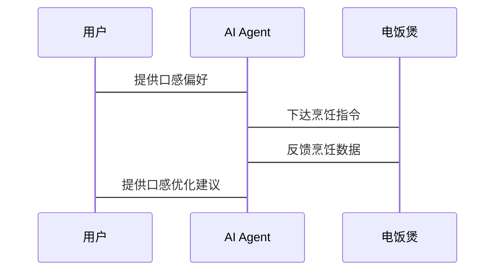

                 


# AI Agent在智能电饭煲中的米饭口感定制

**关键词：** AI Agent, 智能电饭煲, 米饭口感, 个性化定制, 机器学习, 系统架构

**摘要：**  
本文探讨了AI Agent在智能电饭煲中的应用，重点分析了如何通过AI技术实现米饭口感的个性化定制。文章从背景介绍、AI Agent的核心原理、算法实现、系统架构设计到实际项目应用进行了全面解析，详细阐述了如何利用机器学习算法优化烹饪参数，从而实现用户对米饭口感的精准定制。

---

# 第一部分: AI Agent在智能电饭煲中的米饭口感定制背景介绍

## 第1章: AI Agent与智能电饭煲概述

### 1.1 问题背景

#### 1.1.1 米饭口感的重要性  
米饭的口感是衡量烹饪质量的重要指标，直接影响用户的饮食体验。不同用户对米饭的偏好各异，例如，有人喜欢软糯的口感，有人则偏爱Q弹的米粒。

#### 1.1.2 智能电饭煲的发展历程  
从最初的单一加热功能到如今的智能烹饪，电饭煲的功能逐步升级。然而，传统电饭煲的烹饪程序通常固定，难以满足用户的个性化需求。

#### 1.1.3 米饭口感定制的市场需求  
随着消费者对智能化、个性化产品的追求，市场对能够定制米饭口感的智能电饭煲需求日益增长。

### 1.2 问题描述

#### 1.2.1 米饭口感的多样性  
米饭口感的多样性主要受米种、水量、温度和时间的影响。不同米种需要不同的烹饪参数，用户对米饭的软硬度、香甜度等也有不同偏好。

#### 1.2.2 用户对米饭口感的个性化需求  
用户希望电饭煲能够根据个人口味调整烹饪参数，实现“私人定制”的米饭口感。

#### 1.2.3 现有电饭煲的局限性  
传统电饭煲无法根据用户反馈实时调整烹饪参数，难以满足个性化需求。

### 1.3 问题解决

#### 1.3.1 AI Agent的核心作用  
AI Agent可以通过实时感知环境、学习用户偏好，并动态调整烹饪参数，实现米饭口感的个性化定制。

#### 1.3.2 AI Agent在电饭煲中的应用场景  
AI Agent可以实时采集烹饪数据（如温度、湿度、压力），结合用户反馈，优化烹饪程序。

#### 1.3.3 米饭口感定制的实现路径  
通过AI Agent采集用户偏好，建立个性化烹饪模型，动态调整烹饪参数。

### 1.4 边界与外延

#### 1.4.1 AI Agent在电饭煲中的功能边界  
AI Agent的功能主要集中在烹饪过程的优化和参数调整，不涉及其他智能家居设备的协同控制。

#### 1.4.2 米饭口感定制的适用范围  
适用于所有支持AI Agent的智能电饭煲，针对不同米种和用户偏好进行定制。

#### 1.4.3 与其他智能家居设备的协同  
AI Agent可以通过智能家居平台与其他设备协同工作，例如结合智能音箱实现语音控制。

### 1.5 概念结构与核心要素组成

#### 1.5.1 AI Agent的基本构成  
AI Agent由感知模块、学习模块和执行模块组成。

#### 1.5.2 米饭口感定制的核心要素  
包括用户偏好采集、烹饪数据采集、模型优化和参数调整。

#### 1.5.3 系统架构的模块划分  
系统架构分为数据采集模块、模型训练模块、参数调整模块和用户反馈模块。

---

# 第二部分: AI Agent的核心概念与联系

## 第2章: AI Agent的原理与特性

### 2.1 AI Agent的基本原理

#### 2.1.1 AI Agent的定义与分类  
AI Agent是一种能够感知环境、自主决策并执行任务的智能体。根据应用场景的不同，AI Agent可以分为服务型、交互型和学习型。

#### 2.1.2 AI Agent的核心算法  
AI Agent的核心算法包括监督学习、无监督学习和强化学习。

#### 2.1.3 AI Agent的学习机制  
AI Agent通过监督学习和强化学习不断优化自身的决策模型。

### 2.2 AI Agent与传统AI的区别

| 对比维度 | 传统AI | AI Agent |
|----------|--------|----------|
| 自主性    | 依赖规则 | 具有自主决策能力 |
| 环境适应性 | 静态规则 | 能够动态调整策略 |
| 交互能力 | 单向输出 | 可以与用户和环境双向交互 |

### 2.3 AI Agent在智能电饭煲中的应用场景

#### 2.3.1 实时感知与反馈  
AI Agent通过传感器实时采集烹饪过程中的温度、湿度等数据。

#### 2.3.2 用户偏好学习  
AI Agent通过用户反馈学习用户的口味偏好，优化烹饪模型。

#### 2.3.3 自动调整烹饪参数  
AI Agent根据实时数据和用户反馈动态调整烹饪参数，确保米饭口感符合用户预期。

---

## 第3章: 算法原理与实现

### 3.1 算法原理

#### 3.1.1 K-means聚类算法  
K-means是一种常用的无监督学习算法，用于将用户偏好聚类，形成不同的口感类型。

#### 3.1.2 随机森林分类算法  
随机森林是一种集成学习算法，用于分类用户的口感偏好。

#### 3.1.3 算法选择与优化  
选择K-means和随机森林的组合，分别用于数据聚类和分类任务。

### 3.2 算法实现

#### 3.2.1 数据预处理  
数据预处理包括特征提取和标准化。

#### 3.2.2 算法实现步骤  
使用Python代码实现K-means聚类和随机森林分类。

```python
from sklearn.cluster import KMeans
from sklearn.ensemble import RandomForestClassifier

# 数据预处理
X = data.drop('label', axis=1)
y = data['label']

# K-means聚类
kmeans = KMeans(n_clusters=3, random_state=42)
kmeans.fit(X)

# 随机森林分类
rf = RandomForestClassifier(n_estimators=100, random_state=42)
rf.fit(X, y)
```

#### 3.2.3 数学模型与公式  
K-means的损失函数为：
$$ L = \sum_{i=1}^{n} \sum_{j=1}^{k} (x_i - c_j)^2 $$

随机森林的决策树构建过程：
$$ D_{train} \rightarrow \text{生成决策树} $$

### 3.3 算法优化与调参

#### 3.3.1 参数调优  
通过网格搜索优化K-means的聚类数和随机森林的树数。

#### 3.3.2 模型评估  
使用准确率、召回率和F1分数评估模型性能。

---

## 第4章: 系统分析与架构设计

### 4.1 项目背景

#### 4.1.1 项目目标  
通过AI Agent实现米饭口感的个性化定制。

#### 4.1.2 项目范围  
涵盖数据采集、模型训练和系统实现。

### 4.2 系统功能设计

#### 4.2.1 用户偏好采集  
通过问卷调查采集用户的口感偏好。

#### 4.2.2 烹饪数据采集  
通过传感器采集烹饪过程中的温度、湿度等数据。

#### 4.2.3 烹饪参数优化  
根据模型预测结果优化烹饪参数。

### 4.3 系统架构设计

#### 4.3.1 系统架构图  
使用Mermaid绘制系统架构图。



#### 4.3.2 接口设计  
系统接口包括用户输入接口、传感器数据接口和电饭煲控制接口。

#### 4.3.3 交互流程图  
使用Mermaid绘制交互流程图。



---

## 第5章: 项目实战

### 5.1 环境安装

#### 5.1.1 开发环境  
使用Python 3.8及以上版本，安装NumPy、Scikit-learn和Matplotlib库。

#### 5.1.2 硬件设备  
需要电饭煲、传感器和开发板。

### 5.2 核心代码实现

#### 5.2.1 数据采集  
```python
import numpy as np
import pandas as pd

# 读取数据
data = pd.read_csv('rice_data.csv')
```

#### 5.2.2 模型训练  
```python
from sklearn.model_selection import GridSearchCV

# 参数调优
param_grid = {
    'n_clusters': [2, 3, 4],
    'max_iter': [100, 200, 300]
}
grid_search = GridSearchCV(KMeans(), param_grid, cv=5)
grid_search.fit(X)
best_params = grid_search.best_params_
```

#### 5.2.3 系统实现  
```python
# 实现AI Agent
class AIAgent:
    def __init__(self):
        self.model = RandomForestClassifier()
    
    def train(self, X, y):
        self.model.fit(X, y)
    
    def predict(self, X):
        return self.model.predict(X)
```

### 5.3 案例分析与实际应用

#### 5.3.1 案例分析  
以某用户为例，分析AI Agent如何优化其口感偏好。

#### 5.3.2 实际应用  
通过AI Agent实现个性化烹饪，提升用户体验。

---

## 第6章: 最佳实践与总结

### 6.1 最佳实践

#### 6.1.1 数据质量控制  
确保数据采集的准确性和完整性。

#### 6.1.2 算法优化建议  
根据实际需求选择合适的算法组合。

### 6.2 小结

#### 6.2.1 项目总结  
通过AI Agent实现了米饭口感的个性化定制，提升了用户体验。

#### 6.2.2 经验总结  
AI Agent在智能电饭煲中的应用具有广阔前景，但需要解决数据隐私和算法优化等问题。

### 6.3 注意事项

#### 6.3.1 数据隐私保护  
确保用户数据的安全性。

#### 6.3.2 系统稳定性保障  
确保系统在复杂环境下的稳定运行。

### 6.4 拓展阅读

#### 6.4.1 推荐书籍  
《机器学习实战》、《深度学习入门》。

#### 6.4.2 技术博客  
推荐相关技术博客和开源项目。

---

# 作者：AI天才研究院 & 禅与计算机程序设计艺术  
# 结语：  
通过本文的详细分析，我们展示了AI Agent在智能电饭煲中的强大能力，为未来的智能家居发展提供了新的思路。

