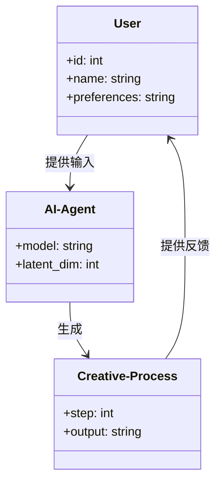
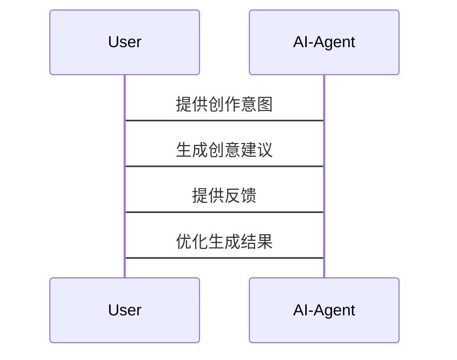

                 


# AI Agent在智能画板中的创意激发系统

> 关键词：AI Agent, 智能画板, 创意激发, 生成对抗网络, 计算机视觉, 交互设计

> 摘要：本文探讨AI Agent在智能画板中的应用，重点分析其如何通过算法和系统架构实现创意激发。文章从背景、概念、算法原理、系统设计到项目实战，全面解析AI在艺术创作中的潜力，为开发者和艺术家提供理论与实践指导。

---

# 第一部分: AI Agent与智能画板的背景与概念

## 第1章: AI Agent与智能画板的背景介绍

### 1.1 问题背景
#### 1.1.1 创意激发的需求与挑战
在艺术创作中，灵感的缺失是一个普遍的问题，尤其是对于初学者而言。艺术家和设计师需要不断尝试不同的创意方向，这可能需要大量的时间和资源。传统工具虽然提供了基本的绘图功能，但在创意激发方面的能力有限。

#### 1.1.2 AI技术在艺术创作中的应用潜力
AI技术，特别是生成对抗网络（GAN）和变体自编码器（VAE），已经在图像生成领域取得了显著成果。这些技术可以生成高质量的艺术图像，帮助艺术家探索新的视觉风格和创意方向。

#### 1.1.3 智能画板的定义与目标
智能画板是一种结合了传统绘画工具和AI技术的创新工具，旨在通过AI算法辅助用户进行艺术创作。其目标是通过AI Agent实时分析用户的创作意图，并生成相应的创意建议或图像。

### 1.2 问题描述
#### 1.2.1 创意激发系统的核心问题
创意激发系统需要解决的核心问题是：如何理解用户的创作意图，并生成符合用户需求的艺术灵感或图像。

#### 1.2.2 智能画板的用户需求分析
智能画板的用户主要分为两类：专业艺术家和业余爱好者。专业艺术家需要高效的工具来探索新的创作方向，而业余爱好者则希望通过简单易用的工具实现创意表达。

#### 1.2.3 现有技术的局限性
传统绘画工具在创意激发方面的能力有限，主要依赖用户的主观创造力。AI技术虽然可以在图像生成方面提供支持，但其与绘画工具的结合仍处于初级阶段。

### 1.3 问题解决与边界
#### 1.3.1 AI Agent在创意激发中的作用
AI Agent通过分析用户的输入（如草图或描述），生成相关的图像或创意建议，帮助用户拓展创作思路。

#### 1.3.2 智能画板系统的边界与外延
智能画板系统的核心功能包括图像生成、创意建议和实时反馈。其外延功能包括用户数据管理、创作历史记录和社区分享。

#### 1.3.3 核心要素与组成结构
智能画板系统的核心要素包括：
1. 用户输入模块（如手绘草图或文本描述）
2. AI Agent（负责图像生成和创意建议）
3. 交互界面（用户与系统之间的媒介）
4. 后端处理模块（包括AI模型和数据存储）

## 第2章: AI Agent与创意激发系统的核心概念

### 2.1 核心概念原理
#### 2.1.1 AI Agent的基本原理
AI Agent通过接收输入（如用户的手绘草图或文本描述），利用深度学习模型生成相应的图像或创意建议。这个过程包括以下几个步骤：
1. **输入接收**：用户通过画笔或其他输入方式提供创作意图。
2. **模型分析**：AI Agent分析用户的输入，提取关键特征。
3. **图像生成**：基于提取的特征，生成相应的艺术图像或创意建议。
4. **输出反馈**：将生成的图像或建议反馈给用户。

#### 2.1.2 创意激发系统的功能模块
创意激发系统的主要功能模块包括：
1. **用户输入模块**：接收用户的创作意图。
2. **AI生成模块**：利用深度学习模型生成艺术图像。
3. **创意建议模块**：提供与用户输入相关的创意方向。
4. **实时反馈模块**：根据用户的反馈不断优化生成结果。

#### 2.1.3 AI Agent与智能画板的交互机制
AI Agent与智能画板的交互机制包括以下几个方面：
1. **输入解析**：AI Agent通过分析用户的输入（如手绘草图）理解用户的创作意图。
2. **生成与优化**：基于用户的输入，AI Agent生成相应的艺术图像，并根据用户反馈不断优化。
3. **实时交互**：用户可以通过画笔或文本与AI Agent实时互动，调整生成结果。

### 2.2 核心概念属性对比
下表对比了AI Agent和创意激发系统的核心属性：

| 属性         | AI Agent                          | 创意激发系统                        |
|--------------|-----------------------------------|-------------------------------------|
| 核心功能      | 生成艺术图像或创意建议           | 激发用户的创作灵感                  |
| 输入方式      | 手绘草图、文本描述               | 手绘草图、文本描述                  |
| 输出形式      | 数字图像、创意建议               | 数字图像、创意方向                  |
| 优化能力      | 基于用户反馈不断优化生成结果     | 根据用户需求提供多种创意方向        |
| 技术基础      | 深度学习、生成对抗网络（GAN）     | 计算机视觉、自然语言处理（NLP）      |

### 2.3 ER实体关系图
```mermaid
erDiagram
    user {
        +id : int
        +name : string
    }
    agent {
        +id : int
        +model : string
    }
    creative_process {
        +id : int
        +step : int
        +output : string
    }
    user --> agent : 使用
    agent --> creative_process : 生成
    creative_process --> user : 提供
```

## 第3章: 算法原理与实现

### 3.1 算法原理
#### 3.1.1 基于生成对抗网络（GAN）的图像生成
生成对抗网络（GAN）是一种深度学习模型，由生成器和判别器组成。生成器的目标是生成与真实图像无法区分的图像，而判别器的目标是区分生成图像和真实图像。

#### 3.1.2 变体自编码器（VAE）的图像生成
变体自编码器（VAE）是一种生成模型，通过将输入数据映射到潜在空间，再从潜在空间生成新的数据。

### 3.2 算法实现
#### 3.2.1 GAN算法实现
```python
import torch
import torch.nn as nn

# 定义生成器
class Generator(nn.Module):
    def __init__(self, latent_dim, img_size):
        super(Generator, self).__init__()
        self.latent_dim = latent_dim
        self.img_size = img_size
        self.model = nn.Sequential(
            nn.Linear(latent_dim, 256),
            nn.ReLU(),
            nn.Linear(256, 256),
            nn.ReLU(),
            nn.Linear(256, img_size[0] * img_size[1]),
            nn.Tanh()
        )

    def forward(self, z):
        return self.model(z).view(-1, 1, img_size[0], img_size[1])

# 定义判别器
class Discriminator(nn.Module):
    def __init__(self, img_size):
        super(Discriminator, self).__init__()
        self.model = nn.Sequential(
            nn.Linear(img_size[0] * img_size[1], 256),
            nn.ReLU(),
            nn.Linear(256, 256),
            nn.ReLU(),
            nn.Linear(256, 1),
            nn.Sigmoid()
        )

    def forward(self, x):
        x_flat = x.view(-1, img_size[0] * img_size[1])
        return self.model(x_flat)
```

#### 3.2.2 VAE算法实现
```python
import torch
import torch.nn as nn
import torch.nn.functional as F

# 定义VAE模型
class VAE(nn.Module):
    def __init__(self, latent_dim, input_dim):
        super(VAE, self).__init__()
        self.latent_dim = latent_dim
        self.encoder = nn.Sequential(
            nn.Linear(input_dim, 512),
            nn.ReLU(),
            nn.Linear(512, 256),
            nn.ReLU()
        )
        self.fc_mu = nn.Linear(256, latent_dim)
        self.fc_logvar = nn.Linear(256, latent_dim)

    def encode(self, x):
        h = self.encoder(x)
        mu = self.fc_mu(h)
        logvar = self.fc_logvar(h)
        return mu, logvar

    def reparameterize(self, mu, logvar):
        std = torch.exp(0.5 * logvar)
        eps = torch.randn_like(std)
        return eps * std + mu

    def decode(self, z, input_dim):
        h = nn.Linear(latent_dim, 256)(z)
        h = nn.ReLU()(h)
        h = nn.Linear(256, 512)(h)
        h = nn.ReLU()(h)
        h = nn.Linear(512, input_dim)(h)
        return torch.sigmoid(h)

    def forward(self, x, input_dim):
        if x is None:
            z = torch.randn((1, self.latent_dim))
            return self.decode(z, input_dim)
        else:
            mu, logvar = self.encode(x)
            z = self.reparameterize(mu, logvar)
            return self.decode(z, input_dim), mu, logvar

    def loss(self, x_recon, x, mu, logvar):
        reconstruction_loss = F.binary_cross_entropy(x_recon, x)
        kl_div = -0.5 * torch.mean(1 + logvar - mu**2 - torch.exp(logvar))
        return reconstruction_loss + kl_div
```

### 3.3 算法优化与调优
#### 3.3.1 模型训练与调优
- 使用Adam优化器，学习率设为0.0002。
- 每个训练周期使用64个批次，每个批次包含64张图像。
- 使用早停法防止过拟合。

#### 3.3.2 模型评估与优化
- 使用生成图像的质量评估指标（如FID分数）来衡量生成图像的质量。
- 根据用户反馈不断优化生成模型，使其更符合用户的创作需求。

---

# 第4章: 系统分析与架构设计

### 4.1 项目场景介绍
智能画板系统旨在通过AI Agent辅助用户进行艺术创作，提供创意激发、图像生成和实时反馈功能。

### 4.2 系统功能设计
#### 4.2.1 领域模型设计


#### 4.2.2 系统架构设计


#### 4.2.3 接口设计
- 用户输入接口：接收手绘草图或文本描述。
- AI生成接口：生成艺术图像或创意建议。
- 反馈接口：根据用户反馈优化生成结果。

#### 4.2.4 交互流程图


---

# 第5章: 项目实战

### 5.1 环境安装与配置
#### 5.1.1 安装Python与深度学习框架
```bash
pip install torch
pip install numpy
pip install matplotlib
```

#### 5.1.2 安装绘画工具与API
- 使用Kivy或Pyglet库开发交互界面。
- 集成OpenCV库进行图像处理。

### 5.2 系统核心实现
#### 5.2.1 AI Agent的核心实现
```python
class AI-Agent:
    def __init__(self, model_path):
        self.model = load_model(model_path)
    
    def generate(self, input):
        return self.model.generate(input)
    
    def optimize(self, feedback):
        self.model.optimize(feedback)
```

#### 5.2.2 创意激发系统的实现
```python
class CreativeSystem:
    def __init__(self, agent, interface):
        self.agent = agent
        self.interface = interface
    
    def start(self):
        while True:
            input = self.interface.receive_input()
            output = self.agent.generate(input)
            self.interface.display_output(output)
            feedback = self.interface.receive_feedback()
            self.agent.optimize(feedback)
```

### 5.3 代码解读与分析
#### 5.3.1 AI Agent的代码解读
```python
import torch
import torch.nn as nn

class AI-Agent:
    def __init__(self, model_path):
        self.model = load_model(model_path)
    
    def generate(self, input):
        return self.model.generate(input)
    
    def optimize(self, feedback):
        self.model.optimize(feedback)
```

#### 5.3.2 创意激发系统的代码解读
```python
class CreativeSystem:
    def __init__(self, agent, interface):
        self.agent = agent
        self.interface = interface
    
    def start(self):
        while True:
            input = self.interface.receive_input()
            output = self.agent.generate(input)
            self.interface.display_output(output)
            feedback = self.interface.receive_feedback()
            self.agent.optimize(feedback)
```

### 5.4 实际案例分析
#### 5.4.1 案例1：生成风景画
用户输入：手绘一棵树的草图
AI Agent生成：一副完整的风景画，包含树、山、云等元素。

#### 5.4.2 案例2：生成抽象艺术
用户输入：红色和蓝色的抽象形状
AI Agent生成：一幅融合了多种抽象元素的艺术作品。

### 5.5 项目总结
通过实际案例，我们可以看到AI Agent在智能画板中的创意激发系统具有强大的潜力。它可以帮助用户快速探索新的创作方向，并提供丰富的创意建议。

---

# 第6章: 最佳实践与注意事项

### 6.1 小结
本文详细介绍了AI Agent在智能画板中的创意激发系统的原理与实现。通过深度学习算法和系统架构设计，我们可以构建一个高效的创意激发系统，为艺术创作提供强有力的支持。

### 6.2 注意事项
- 在实际应用中，需要注意模型的训练数据质量和多样性。
- 需要根据用户的反馈不断优化模型，以提高生成图像的质量和相关性。

### 6.3 拓展阅读
- 学习更多关于生成对抗网络（GAN）和变体自编码器（VAE）的理论与应用。
- 探索AI在其他艺术领域的应用，如音乐、文学等。

---

# 作者

作者：AI天才研究院/AI Genius Institute & 禅与计算机程序设计艺术/Zen And The Art of Computer Programming

