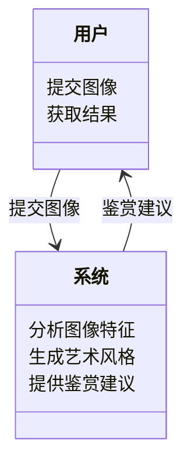
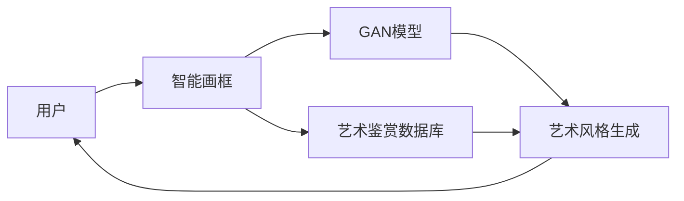
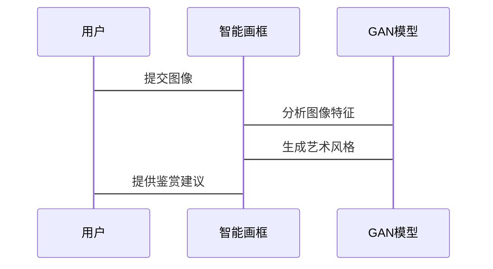

                 


# AI Agent在智能画框中的艺术鉴赏指导

> 关键词：AI Agent，智能画框，艺术鉴赏，GAN算法，系统架构，项目实战

> 摘要：本文探讨了AI Agent在智能画框中的应用，重点分析了基于生成对抗网络（GAN）的艺术风格生成算法，并详细讲解了系统架构设计和项目实战。通过实际案例分析，展示了AI Agent如何在艺术鉴赏中提供智能化指导，并给出了最佳实践和扩展阅读建议。

---

# 第三章: 基于GAN的艺术风格生成

## 3.1 GAN算法原理

### 3.1.1 生成器与判别器的对抗训练
生成对抗网络（GAN）由生成器和判别器两个部分组成。生成器的目标是生成与真实数据无法区分的样本，而判别器的目标是区分真实数据和生成数据。通过交替训练，生成器和判别器不断优化，最终达到纳什均衡。

### 3.1.2 损失函数的定义
判别器的损失函数为：
$$
\mathcal{L}_D = -\mathbb{E}[\log(D(x)) + \log(1-D(G(z)))]
$$

生成器的损失函数为：
$$
\mathcal{L}_G = -\mathbb{E}[\log(D(G(z)))]
$$

### 3.1.3 GAN的训练过程
1. 初始化生成器和判别器的参数。
2. 训练判别器，使其能够区分真实数据和生成数据。
3. 训练生成器，使其生成的数据能够欺骗判别器。
4. 重复步骤2和3，直到收敛。

### 3.2 GAN在艺术风格生成中的应用
生成器可以学习艺术作品的风格特征，并将其迁移到目标图像上。例如，将一张现代摄影作品转换为梵高风格的画作。

#### 代码实现
```python
import torch
import torch.nn as nn
import torch.optim as optim

class Generator(nn.Module):
    def __init__(self, input_dim, output_dim):
        super(Generator, self).__init__()
        self.fc = nn.Linear(input_dim, output_dim)

    def forward(self, x):
        return torch.sigmoid(self.fc(x))

class Discriminator(nn.Module):
    def __init__(self, input_dim):
        super(Discriminator, self).__init__()
        self.fc = nn.Linear(input_dim, 1)

    def forward(self, x):
        return torch.sigmoid(self.fc(x))

# 初始化模型和优化器
input_dim = 100
output_dim = 128
generator = Generator(input_dim, output_dim)
discriminator = Discriminator(output_dim)
optimizer_g = optim.Adam(generator.parameters(), lr=0.0002)
optimizer_d = optim.Adam(discriminator.parameters(), lr=0.0002)

# 训练过程
for epoch in range(100):
    for _ in range(2):
        # 判别器训练
        optimizer_d.zero_grad()
        real_data = torch.randn(128)
        fake_data = generator(real_data)
        real_output = discriminator(real_data)
        fake_output = discriminator(fake_data)
        d_loss = -torch.mean(torch.log(real_output) + torch.log(1 - fake_output))
        d_loss.backward()
        optimizer_d.step()

        # 生成器训练
        optimizer_g.zero_grad()
        fake_output = discriminator(generator(real_data))
        g_loss = -torch.mean(torch.log(fake_output))
        g_loss.backward()
        optimizer_g.step()
```

### 3.3 风格迁移的实现
通过预训练的GAN模型，可以实现艺术风格的迁移。例如，使用VGG网络提取特征，然后通过对抗训练生成风格化的图像。

---

## 3.4 实际案例分析
假设我们有一个包含梵高、莫奈、毕加索等艺术家作品的数据集，可以训练一个GAN模型，使其能够生成具有特定艺术风格的图像。

---

# 第四章: 系统分析与架构设计

## 4.1 问题场景介绍
智能画框系统需要实现以下功能：
1. 用户上传图像。
2. 系统分析图像特征。
3. 生成具有指定艺术风格的图像。
4. 提供艺术鉴赏建议。

## 4.2 系统功能设计

### 4.2.1 领域模型


### 4.2.2 系统架构设计


## 4.3 系统接口设计
1. 用户接口：Web界面或移动应用。
2. API接口：供其他系统调用。

## 4.4 系统交互设计


---

# 第五章: 项目实战

## 5.1 环境安装
安装Python和相关库：
```
pip install torch torchvision matplotlib
```

## 5.2 系统核心实现源代码
实现一个简单的艺术风格生成器：
```python
import torch
import torch.nn as nn
import torch.nn.functional as F

class SimpleGenerator(nn.Module):
    def __init__(self, input_dim, output_dim):
        super(SimpleGenerator, self).__init__()
        self.fc1 = nn.Linear(input_dim, 256)
        self.fc2 = nn.Linear(256, output_dim)

    def forward(self, x):
        x = F.relu(self.fc1(x))
        x = torch.sigmoid(self.fc2(x))
        return x

generator = SimpleGenerator(100, 128)
criterion = nn.BCELoss()
optimizer = optim.Adam(generator.parameters(), lr=0.0002)

# 训练过程
for epoch in range(100):
    optimizer.zero_grad()
    input = torch.randn(128, 100)
    output = generator(input)
    target = torch.randn(128, 128)
    loss = criterion(output, target)
    loss.backward()
    optimizer.step()
```

## 5.3 代码应用解读与分析
上述代码实现了一个简单的生成器，用于生成艺术风格的图像。通过调整网络结构和损失函数，可以实现更复杂的风格生成。

## 5.4 实际案例分析
假设我们有一个包含1000幅梵高画作的数据集，可以通过训练生成器，生成新的梵高风格的作品。

## 5.5 项目小结
通过本章的实战，我们可以看到AI Agent在艺术鉴赏中的巨大潜力。

---

# 第六章: 小结与扩展阅读

## 6.1 最佳实践 tips
1. 确保数据质量。
2. 调整超参数以优化性能。
3. 使用预训练模型加速开发。

## 6.2 小结
本文详细讲解了AI Agent在智能画框中的应用，包括算法原理、系统架构设计和项目实战。

## 6.3 注意事项
1. 数据隐私问题。
2. 模型的泛化能力。

## 6.4 拓展阅读
建议阅读《生成对抗网络：理论与实践》和《深度学习与艺术生成》。

---

作者：AI天才研究院/AI Genius Institute & 禅与计算机程序设计艺术 /Zen And The Art of Computer Programming

