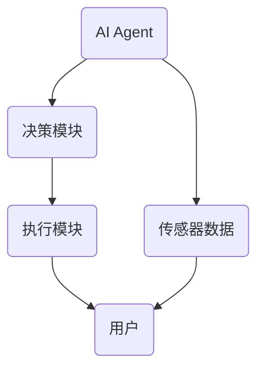
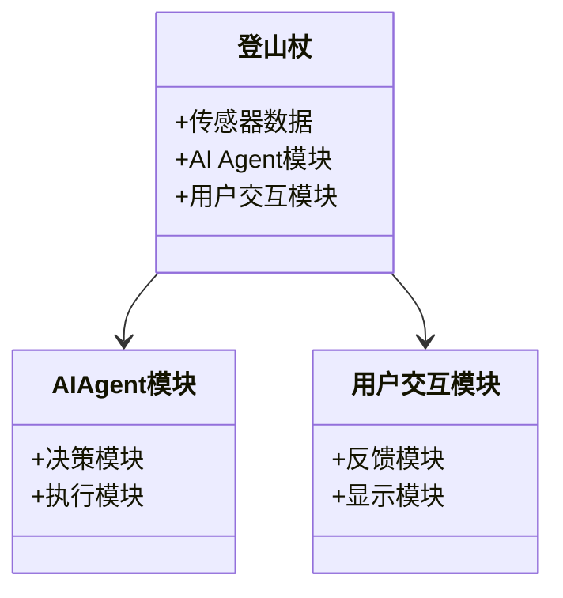
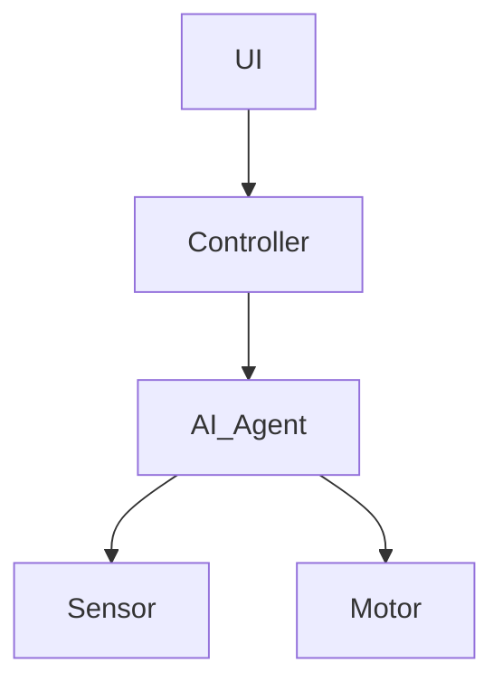
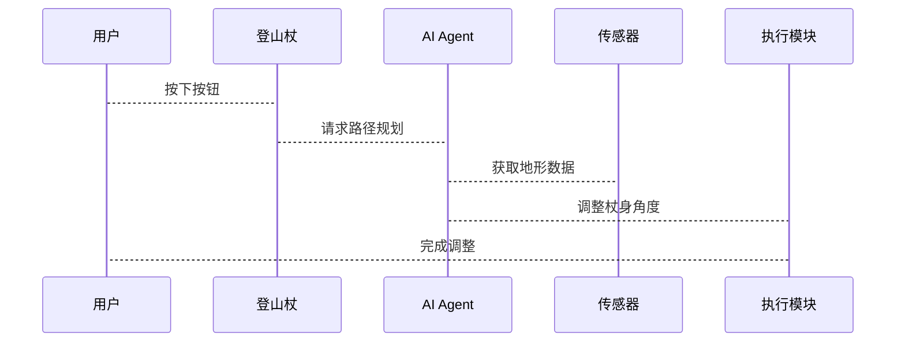

                 


# AI Agent在智能登山杖中的地形适应指导

> 关键词：AI Agent、智能登山杖、地形适应、路径规划、传感器数据

> 摘要：本文探讨AI Agent在智能登山杖中的应用，分析其如何通过感知、决策和执行机制帮助登山杖适应复杂地形，提升用户体验和安全性。文章从背景介绍、核心概念、算法原理、系统架构到项目实战，全面解析AI Agent在智能登山杖中的技术实现与实际应用。

---

## # 第一部分: 背景介绍

### ## 第1章: 问题背景与概念解析

#### ### 1.1 问题背景
- ### 1.1.1 山地运动中的地形适应问题
  山地运动，如徒步、登山等，通常面临复杂多变的地形环境。传统登山杖主要依赖用户的经验和直觉，无法有效应对复杂地形，如陡峭山坡、泥泞地面或障碍物等。用户在使用传统登山杖时，容易因地形不适应而导致疲劳、受伤或迷失方向。

- ### 1.1.2 当前传统登山杖的局限性
  传统登山杖缺乏智能感知和决策能力，无法主动适应地形变化。用户需要手动调整杖身角度或力度，效率低下且耗费体力。此外，传统登山杖无法提供实时反馈，难以满足复杂地形的多样化需求。

- ### 1.1.3 AI技术在智能设备中的应用潜力
  随着AI技术的快速发展，智能设备在各个领域的应用逐渐普及。AI Agent（智能体）通过感知环境、分析数据并做出决策，能够显著提升设备的智能化水平。将AI Agent应用于登山杖，可以实现地形实时感知、路径优化和用户反馈，为用户提供更安全、高效的山地运动体验。

#### ### 1.2 问题描述
- ### 1.2.1 智能登山杖的目标用户群体
  智能登山杖的目标用户主要为专业登山者、徒步爱好者以及残障人士。这些用户在不同地形中对登山杖的需求各不相同，专业登山者需要应对复杂地形，而残障人士则需要更稳定和安全的辅助工具。

- ### 1.2.2 地形适应的核心需求
  智能登山杖需要具备以下核心需求：
  1. 实时感知地形特征（如倾斜度、障碍物、地面硬度等）。
  2. 根据地形变化动态调整杖身角度和力度。
  3. 提供实时反馈，指导用户调整步伐或姿势。

- ### 1.2.3 当前技术解决方案的不足
  当前技术主要依赖传感器数据和简单的反馈机制，无法实现智能化的地形适应。传统解决方案无法处理复杂地形中的动态变化，缺乏灵活性和适应性。

#### ### 1.3 问题解决思路
- ### 1.3.1 引入AI Agent的必要性
  AI Agent能够通过感知环境、分析数据并做出决策，帮助登山杖实现智能化的地形适应。通过AI Agent，登山杖可以实时调整姿态，优化用户步态，提高运动效率和安全性。

- ### 1.3.2 AI Agent在地形适应中的作用
  AI Agent通过以下方式实现地形适应：
  1. **感知**：利用传感器获取地形数据。
  2. **决策**：基于数据计算最佳杖身角度和力度。
  3. **执行**：调整杖身姿态，指导用户动作。

- ### 1.3.3 解决方案的技术路线
  解决方案的技术路线包括：
  1. 传感器数据采集与处理。
  2. AI Agent的路径规划与决策算法。
  3. 用户交互与反馈机制。

#### ### 1.4 边界与外延
- ### 1.4.1 智能登山杖的功能边界
  智能登山杖的主要功能包括地形感知、路径优化和用户反馈。其边界在于不涉及用户健康监测和医疗辅助功能。

- ### 1.4.2 AI Agent的应用场景限制
  AI Agent的应用场景主要限于山地运动，不适用于城市道路或其他平坦地形。

- ### 1.4.3 相关技术的外延扩展
  相关技术可扩展至其他领域，如智能机器人、自动驾驶等，但本文仅关注其在智能登山杖中的应用。

#### ### 1.5 概念结构与核心要素
- ### 1.5.1 AI Agent的核心组成
  AI Agent由感知模块、决策模块和执行模块组成。感知模块负责获取环境数据，决策模块基于数据进行计算，执行模块实现姿态调整。

- ### 1.5.2 地形适应的关键要素
  地形适应的关键要素包括地形特征（倾斜度、障碍物）、传感器数据（加速度、陀螺仪）和用户反馈。

- ### 1.5.3 系统整体架构
  系统整体架构包括传感器、AI Agent和用户交互三个部分，各部分协同工作以实现地形适应。

---

## # 第二部分: 核心概念与联系

### ## 第2章: AI Agent的核心原理

#### ### 2.1 AI Agent的基本原理
- ### 2.1.1 感知机制
  AI Agent通过传感器（如加速度计、陀螺仪）获取地形数据，并通过视觉传感器（如摄像头）识别障碍物。

- ### 2.1.2 决策机制
  AI Agent基于传感器数据和预设算法计算最佳杖身角度和力度。例如，当检测到前方有障碍物时，AI Agent会调整杖身角度以绕过障碍物。

- ### 2.1.3 执行机制
  AI Agent通过电动马达或气动装置调整杖身姿态，确保用户在复杂地形中保持平衡。

#### ### 2.2 AI Agent与其他导航系统的对比

| **特性**         | **传统导航系统** | **AI Agent**         |
|------------------|------------------|-----------------------|
| **感知能力**     | 依赖GPS信号      | 多传感器融合          |
| **决策能力**     | 预设路径规划     | 实时动态调整          |
| **适应能力**     | 有限            | 强                   |

#### ### 2.3 实体关系图



---

## # 第三部分: 算法原理讲解

### ## 第3章: 路径规划算法

#### ### 3.1 A*算法简介
- A*算法是一种常用路径规划算法，结合了广度优先搜索和启发式评估，能够快速找到最短路径。

#### ### 3.2 算法流程图

```mermaid
graph TD
    start --> check_goal
    check_goal -->|not goal| add_to_queue
    add_to_queue --> explore_neighbors
    explore_neighbors -->|generate neighbors|
    generate_neighbors --> check_obstacles
    check_obstacles -->|safe path| calculate_cost
    calculate_cost --> add_to_frontier
    add_to_frontier -->| frontier not empty | dequeue
    dequeue --> explore_neighbors
    explore_neighbors --> check_obstacles
    check_obstacles -->|safe path| calculate_cost
    calculate_cost --> add_to_frontier
    add_to_frontier -->| frontier not empty | dequeue
    dequeue --> explore_neighbors
```

#### ### 3.3 Python实现代码

```python
import heapq

def a_star_search(grid, start, goal):
    open_set = set()
    closed_set = set()
    came_from = {}
    g_score = { (x,y): float('inf') for x in range(len(grid)) for y in range(len(grid[0])) }
    g_score[start] = 0
    f_score = { (x,y): float('inf') for x in range(len(grid)) for y in range(len(grid[0])) }
    f_score[start] = heuristic(start, goal)
    heapq.heappush(open_set, (f_score[start], start))
    
    while open_set:
        current = heapq.heappop(open_set)
        if current[1] == goal:
            return reconstruct_path(came_from, start, goal)
        for neighbor in neighbors(current[1]):
            if neighbor in closed_set:
                continue
            tentative_g_score = g_score[current[1]] + cost(current[1], neighbor)
            if tentative_g_score < g_score[neighbor]:
                came_from[neighbor] = current[1]
                g_score[neighbor] = tentative_g_score
                f_score[neighbor] = g_score[neighbor] + heuristic(neighbor, goal)
                heapq.heappush(open_set, (f_score[neighbor], neighbor))
    return None

def heuristic(a, b):
    return abs(a[0] - b[0]) + abs(a[1] - b[1])

def neighbors(pos):
    # 返回pos的所有邻居坐标
    pass

def reconstruct_path(came_from, start, goal):
    current = goal
    path = []
    while current != start:
        path.append(current)
        current = came_from[current]
    path.append(start)
    return path
```

#### ### 3.4 数学模型与公式
- **A*算法的启发函数**：$$f(n) = g(n) + h(n)$$，其中\(g(n)\)为从起点到节点n的实际成本，\(h(n)\)为从节点n到目标的估算成本。

---

## # 第四部分: 系统分析与架构设计方案

### ## 第4章: 问题场景介绍
- ### 4.1 系统目标
  实现智能登山杖的地形适应功能，提升用户体验和安全性。

### ## 第5章: 系统架构设计

#### ### 5.1 领域模型设计



#### ### 5.2 系统架构设计



#### ### 5.3 系统接口设计
- **传感器接口**：提供加速度、陀螺仪等数据接口。
- **路径规划接口**：提供路径规划算法的调用接口。
- **用户反馈接口**：提供用户输入和反馈的接口。

#### ### 5.4 交互流程设计



---

## # 第五部分: 项目实战

### ## 第6章: 环境搭建与核心实现

#### ### 6.1 环境搭建
- 安装Python和相关库（如numpy、scipy）。
- 安装传感器驱动和AI框架（如TensorFlow）。

#### ### 6.2 核心代码实现
- **路径规划代码**

```python
import numpy as np

def calculate_distance(point1, point2):
    return np.sqrt((point1[0]-point2[0])**2 + (point1[1]-point2[1])**2)
```

#### ### 6.3 代码解读
- **路径规划代码**：计算两点之间的距离，用于路径优化。
- **传感器数据处理**：对传感器数据进行预处理，提取有用特征。

#### ### 6.4 实际案例分析
- 分析不同地形下的路径规划结果，验证算法的有效性。

---

## # 第六部分: 最佳实践

### ## 第7章: 开发注意事项

- **传感器精度**：确保传感器数据的准确性。
- **算法优化**：优化路径规划算法，提高计算效率。
- **用户体验**：确保用户交互的友好性。

### ## 第8章: 小结与展望

- **小结**：总结本文的主要内容和技术实现。
- **展望**：未来可能的发展方向，如AI Agent的多模态感知和自学习能力。

### ## 第9章: 拓展阅读

- 推荐相关书籍和论文，供读者深入学习。

---

## # 附录

### ## 附录A: 参考文献
- 列出参考的书籍、论文和技术文档。

### ## 附录B: 术语解释
- 对文中涉及的专业术语进行解释。

---

## # 作者

作者：AI天才研究院/AI Genius Institute & 禅与计算机程序设计艺术 /Zen And The Art of Computer Programming

