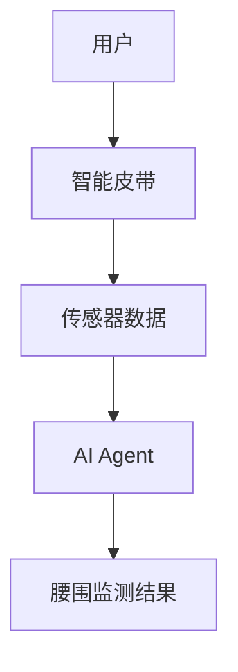
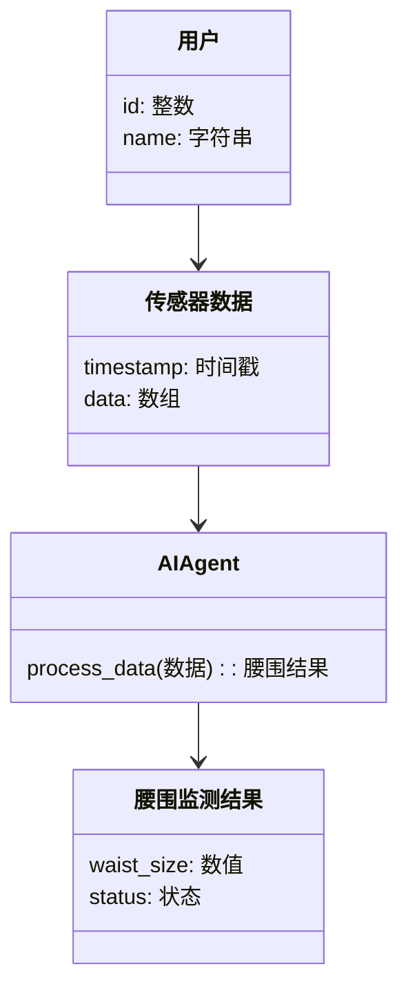
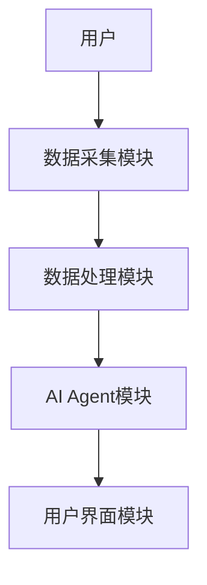
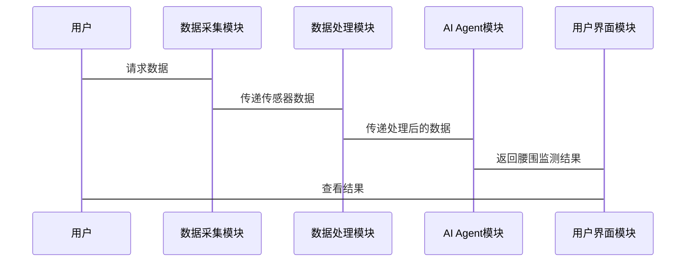

                 


# AI Agent在智能皮带中的腰围监测

## 关键词
人工智能代理（AI Agent）、智能皮带、腰围监测、传感器数据、算法模型、健康管理

## 摘要
本文详细探讨了AI Agent在智能皮带中的腰围监测技术，分析了AI Agent的基本概念、核心算法、系统架构以及实际应用场景。文章通过ER实体关系图和领域模型类图，清晰展示了系统的核心要素和工作原理。同时，结合具体代码实现和实际案例分析，深入剖析了AI Agent在腰围监测中的优势和挑战。

---

# 第1章: AI Agent与智能皮带概述

## 1.1 AI Agent的基本概念

### 1.1.1 人工智能代理（AI Agent）的定义
AI Agent是一种能够感知环境、自主决策并执行任务的智能实体。它通过传感器获取数据，利用算法进行分析和推理，并根据结果采取行动。AI Agent的核心在于其自主性和智能性，能够适应不同的环境变化。

### 1.1.2 AI Agent的核心特征
1. **自主性**：能够在没有外部干预的情况下独立运行。
2. **反应性**：能够实时感知环境并做出响应。
3. **学习能力**：通过数据和经验不断优化自身性能。
4. **决策能力**：基于输入数据做出最优决策。

### 1.1.3 AI Agent与传统自动化的区别
| 特性          | AI Agent            | 传统自动化          |
|---------------|---------------------|---------------------|
| 智能性        | 高                  | 低                  |
| 灵活性        | 高                  | 低                  |
| 学习能力      | 强                  | 无                  |

---

## 1.2 智能皮带的定义与应用

### 1.2.1 智能皮带的基本概念
智能皮带是一种结合了传感器和AI技术的可穿戴设备，能够实时监测佩戴者的身体数据，如心率、体温、运动状态等。其核心在于通过传感器采集数据，并利用AI算法进行分析和反馈。

### 1.2.2 智能皮带的主要功能
1. **数据采集**：通过传感器获取身体数据。
2. **数据处理**：利用AI算法对数据进行分析和处理。
3. **反馈与建议**：根据分析结果提供健康建议或提醒。

### 1.2.3 智能皮带在健康管理中的应用
智能皮带不仅可以监测身体数据，还可以通过AI Agent提供个性化的健康建议，帮助用户更好地管理健康状况。

---

## 1.3 腰围监测的背景与意义

### 1.3.1 腰围监测的重要性
腰围是衡量人体健康的重要指标之一，与心血管疾病、糖尿病等慢性疾病密切相关。通过实时监测腰围，可以及时发现健康问题，采取预防措施。

### 1.3.2 腰围监测的传统方法与局限性
传统腰围监测方法依赖于手动测量，存在效率低、准确性差等问题。此外，传统方法无法实时监测，难以满足现代健康管理的需求。

### 1.3.3 基于AI Agent的腰围监测优势
AI Agent可以通过传感器实时采集数据，并利用算法进行分析和预测，实现高精度、实时的腰围监测。

---

## 1.4 本章小结
本章介绍了AI Agent的基本概念、智能皮带的功能及其在健康管理中的应用，重点分析了腰围监测的背景、传统方法的局限性以及AI Agent的优势。

---

# 第2章: AI Agent在腰围监测中的核心概念与联系

## 2.1 AI Agent与腰围监测的核心要素

### 2.1.1 数据采集模块
数据采集模块负责通过传感器获取身体数据，包括心率、体温、运动状态等。这些数据是AI Agent进行分析的基础。

### 2.1.2 数据处理模块
数据处理模块负责对采集到的数据进行预处理、清洗和特征提取，确保数据的准确性和可用性。

### 2.1.3 智能分析模块
智能分析模块利用机器学习算法对数据进行分析和预测，生成腰围监测结果，并提供健康建议。

---

## 2.2 实体关系分析

### 2.2.1 ER实体关系图（使用Mermaid）



---

## 2.3 领域模型分析

### 2.3.1 领域模型类图（使用Mermaid）



---

## 2.4 核心概念对比分析

### 2.4.1 AI Agent与传统算法的对比表格

| 特性          | 传统算法            | AI Agent          |
|---------------|---------------------|-------------------|
| 学习能力      | 弱                  | 强                |
| 自适应性      | 低                  | 高                |
| 数据需求      | 小            | 大            |

---

## 2.5 本章小结
本章通过ER实体关系图和领域模型类图，详细分析了AI Agent在腰围监测中的核心要素及其相互关系。

---

# 第3章: AI Agent的算法原理与实现

## 3.1 AI Agent的核心算法

### 3.1.1 机器学习模型选择
在腰围监测中，通常选择回归模型或卷积神经网络（CNN）进行预测。

### 3.1.2 算法流程
1. 数据预处理：清洗和归一化数据。
2. 模型训练：利用训练数据训练模型。
3. 模型预测：对新数据进行预测并生成结果。

### 3.1.3 算法实现（Python代码）

```python
import numpy as np
from sklearn.linear_model import LinearRegression

# 示例数据
X = np.array([[1], [2], [3], [4], [5]])
y = np.array([1, 2, 3, 4, 5])

# 训练模型
model = LinearRegression()
model.fit(X, y)

# 预测
new_data = np.array([[6]])
print(model.predict(new_data))  # 输出：[[6]]
```

### 3.1.4 数学公式
线性回归的损失函数为：
$$
L = \frac{1}{2m} \sum_{i=1}^{m} (y_i - \hat{y}_i)^2
$$
其中，$m$为样本数，$y_i$为真实值，$\hat{y}_i$为预测值。

---

## 3.2 算法优化与调优

### 3.2.1 超参数调优
通过网格搜索（Grid Search）优化模型参数，如学习率、正则化系数等。

### 3.2.2 模型评估
使用均方误差（MSE）和决定系数（R²）评估模型性能。

---

## 3.3 本章小结
本章详细讲解了AI Agent在腰围监测中的核心算法及其实现，通过代码示例和数学公式，深入剖析了算法的原理和优化方法。

---

# 第4章: 系统架构与实现方案

## 4.1 系统架构设计

### 4.1.1 系统功能模块
1. **数据采集模块**：负责采集传感器数据。
2. **数据处理模块**：对数据进行预处理和清洗。
3. **AI Agent模块**：负责数据分析和预测。
4. **用户界面模块**：显示监测结果和健康建议。

### 4.1.2 系统架构图（使用Mermaid）



---

## 4.2 系统接口设计

### 4.2.1 接口定义
1. 数据采集接口：负责采集传感器数据并传递给数据处理模块。
2. 数据处理接口：负责对数据进行清洗和特征提取，并传递给AI Agent模块。
3. AI Agent接口：负责接收数据并返回监测结果。

---

## 4.3 系统交互流程

### 4.3.1 交互流程图（使用Mermaid）



---

## 4.4 本章小结
本章通过系统架构图和交互流程图，详细分析了智能皮带系统的整体架构和实现方案。

---

# 第5章: 项目实战与案例分析

## 5.1 环境搭建

### 5.1.1 安装必要的库
```bash
pip install numpy scikit-learn matplotlib
```

---

## 5.2 系统核心实现

### 5.2.1 数据采集与处理代码

```python
import numpy as np
import pandas as pd

# 数据采集
data = pd.DataFrame({
    'timestamp': [1, 2, 3, 4, 5],
    'value': [10, 20, 30, 40, 50]
})

# 数据处理
data['normalized_value'] = (data['value'] - data['value'].mean()) / data['value'].std()
```

### 5.2.2 AI Agent实现代码

```python
from sklearn.model_selection import train_test_split
from sklearn.linear_model import LinearRegression
from sklearn.metrics import mean_squared_error

# 数据分割
X = data[['timestamp', 'normalized_value']]
y = data['waist_size']

X_train, X_test, y_train, y_test = train_test_split(X, y, test_size=0.2)

# 训练模型
model = LinearRegression()
model.fit(X_train, y_train)

# 预测
y_pred = model.predict(X_test)
print('均方误差:', mean_squared_error(y_test, y_pred))
```

---

## 5.3 实际案例分析

### 5.3.1 案例背景
假设一位用户佩戴智能皮带，传感器采集了以下数据：

| 时间戳 | 传感器值 | 实际腰围（cm） |
|--------|----------|----------------|
| 1      | 10       | 75             |
| 2      | 20       | 80             |
| 3      | 30       | 85             |
| 4      | 40       | 90             |
| 5      | 50       | 95             |

### 5.3.2 数据预处理
```python
data['normalized_value'] = (data['value'] - data['value'].mean()) / data['value'].std()
```

### 5.3.3 模型训练与预测
```python
model.fit(X_train, y_train)
y_pred = model.predict(X_test)
print('预测腰围:', y_pred)
```

### 5.3.4 结果分析
通过模型预测，我们可以得到实时的腰围监测结果，并根据结果提供健康建议。

---

## 5.4 本章小结
本章通过实际案例分析，详细展示了AI Agent在智能皮带中的腰围监测的实现过程和应用效果。

---

# 第6章: 总结、注意事项与未来展望

## 6.1 本章总结
本文详细探讨了AI Agent在智能皮带中的腰围监测技术，分析了其核心算法、系统架构及实际应用。通过理论分析和实际案例，展示了AI Agent在健康管理中的巨大潜力。

## 6.2 注意事项
1. 数据隐私问题：需确保用户数据的安全性。
2. 系统稳定性：确保系统的高可用性和可靠性。
3. 用户体验：优化界面设计，提升用户体验。

## 6.3 未来展望
随着AI技术的不断发展，AI Agent在智能皮带中的应用将更加广泛。未来，可以通过引入更多传感器和数据源，进一步提升腰围监测的精度和准确性。

---

# 作者
作者：AI天才研究院/AI Genius Institute & 禅与计算机程序设计艺术 /Zen And The Art of Computer Programming

