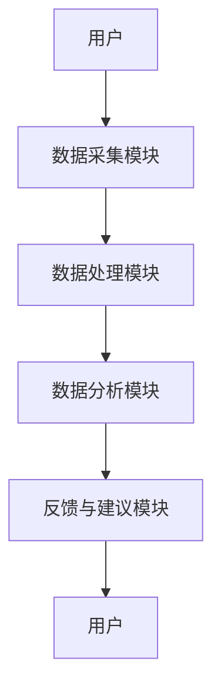
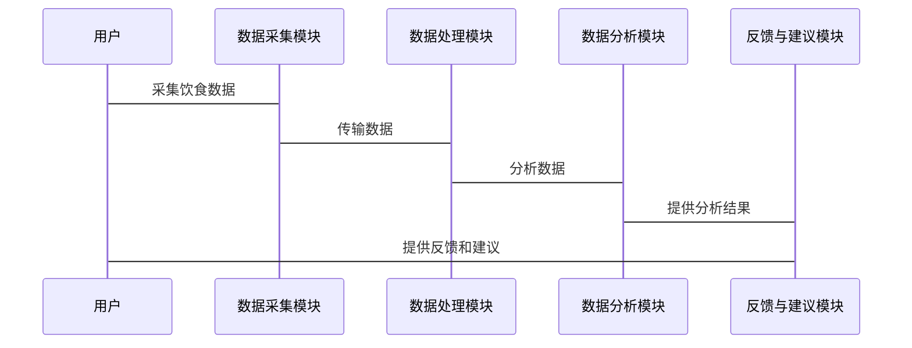

                 


```markdown
# AI Agent在智能皮带中的饮食习惯监测

> 关键词：AI Agent，智能皮带，饮食习惯，监测，算法原理，系统架构，项目实战

> 摘要：本文将详细介绍AI Agent在智能皮带中的饮食习惯监测的应用，从背景介绍、核心概念到算法原理、系统架构，再到项目实战和最佳实践，全面解析这一技术的实现过程和实际应用。

---

## 第一部分: AI Agent在智能皮带中的饮食习惯监测背景介绍

### 第1章: AI Agent与智能皮带概述
#### 1.1 AI Agent的基本概念
##### 1.1.1 什么是AI Agent
AI Agent（人工智能代理）是指能够感知环境、自主决策并执行任务的智能实体。它能够通过传感器获取信息，利用算法进行分析，并根据结果采取相应行动。

##### 1.1.2 AI Agent的核心特点
- **自主性**：能够独立决策和行动。
- **反应性**：能够实时感知环境变化并做出反应。
- **目标导向**：以特定目标为导向，优化行动策略。
- **学习能力**：通过数据和经验不断优化自身的算法模型。

##### 1.1.3 AI Agent的应用场景
AI Agent广泛应用于智能家居、自动驾驶、医疗健康、金融投资等领域。在智能皮带中的应用，主要集中在健康监测和行为分析方面。

#### 1.2 智能皮带的基本概念
##### 1.2.1 智能皮带的功能与特点
智能皮带是一种集成了多种传感器和智能算法的穿戴设备，能够实时监测用户的生理指标和行为习惯。其特点包括：
- **轻便舒适**：设计符合人体工学，佩戴无负担。
- **多功能集成**：整合了心率监测、步频检测、饮食记录等多种功能。
- **智能反馈**：能够通过振动或APP提醒用户调整饮食习惯。

##### 1.2.2 智能皮带与传统皮带的区别
- **智能化**：传统皮带仅用于固定衣物，而智能皮带具备传感器和智能算法。
- **数据采集**：智能皮带能够采集用户的生理数据和行为数据。
- **交互方式**：支持通过APP或语音助手进行数据查看和设置调整。

##### 1.2.3 智能皮带的应用价值
智能皮带在健康监测、行为分析、运动指导等领域具有重要应用价值。通过实时监测用户的饮食习惯，智能皮带能够为用户提供个性化的健康建议。

#### 1.3 饮食习惯监测的背景与意义
##### 1.3.1 饮食习惯监测的重要性
饮食习惯直接关系到人体健康，不良的饮食习惯可能导致肥胖、糖尿病等多种疾病。通过实时监测用户的饮食习惯，可以及时发现并纠正不良习惯，预防疾病的发生。

##### 1.3.2 智能皮带在饮食习惯监测中的作用
智能皮带通过内置的传感器和AI算法，能够实时监测用户的饮食行为，如饮食时间、饮食量、食物种类等，并通过数据反馈帮助用户改善饮食习惯。

##### 1.3.3 饮食习惯监测的边界与外延
饮食习惯监测的边界主要集中在用户的饮食行为和生理指标上，外延则涉及健康数据分析、个性化健康建议等领域。

---

### 第2章: AI Agent在智能皮带中的饮食习惯监测的核心概念
#### 2.1 AI Agent与饮食习惯监测的关系
##### 2.1.1 AI Agent在饮食习惯监测中的角色
AI Agent在智能皮带中的饮食习惯监测中扮演着核心角色，主要负责数据采集、分析和反馈。

##### 2.1.2 饮食习惯监测的核心要素
- **数据采集**：通过传感器获取用户的饮食行为数据。
- **数据分析**：利用AI算法对数据进行分析，识别用户的饮食习惯。
- **反馈与建议**：根据分析结果，向用户提出饮食调整建议。

##### 2.1.3 AI Agent与饮食习惯监测的系统结构
AI Agent在智能皮带中的结构包括感知层、决策层和执行层。感知层负责数据采集，决策层负责数据分析和决策，执行层负责反馈和建议。

#### 2.2 核心概念原理
##### 2.2.1 AI Agent的感知与决策机制
AI Agent通过传感器获取用户的饮食行为数据，利用机器学习算法进行分析，识别用户的饮食习惯，并根据分析结果做出决策。

##### 2.2.2 饮食习惯监测的数据采集与分析
智能皮带通过内置的传感器采集用户的饮食行为数据，如饮食时间、饮食量、食物种类等，并利用AI算法进行分析，识别用户的饮食习惯。

##### 2.2.3 AI Agent与智能皮带的交互流程
AI Agent通过传感器获取数据，利用算法进行分析，并通过APP或语音助手向用户反馈分析结果和建议。

#### 2.3 核心概念对比表
| 对比维度 | 传统饮食习惯监测 | AI Agent监测 |
|----------|------------------|--------------|
| 数据采集 | 手动记录         | 自动采集     |
| 数据分析 | 人工分析         | AI自动分析   |
| 反馈方式 | 事后提醒         | 实时反馈     |

#### 2.4 ER实体关系图
```mermaid
erDiagram
    user {
        id
        name
        age
        gender
    }
   饮食数据 {
        id
        时间
        食物种类
        食量
        用户ID
    }
    AI Agent {
        id
        模型版本
        状态
    }
    智能皮带 {
        id
        设备型号
        用户ID
        AI Agent ID
    }
    关系 {
        用户 - 饮食数据 : 1..N
        智能皮带 - AI Agent : 1..1
        智能皮带 - 用户 : 1..N
    }
```

---

### 第3章: AI Agent在智能皮带中的饮食习惯监测的算法原理
#### 3.1 算法原理概述
AI Agent在智能皮带中的饮食习惯监测主要采用机器学习算法，通过对用户的饮食行为数据进行分析，识别用户的饮食习惯，并根据分析结果做出相应的反馈和建议。

#### 3.2 算法流程
1. 数据采集：通过智能皮带的传感器采集用户的饮食行为数据。
2. 数据预处理：对采集到的数据进行清洗和特征提取。
3. 数据分析：利用机器学习算法对数据进行分析，识别用户的饮食习惯。
4. 反馈与建议：根据分析结果，向用户提出饮食调整建议。

#### 3.3 算法实现
##### 3.3.1 数据预处理
```python
import pandas as pd
import numpy as np

# 读取数据
data = pd.read_csv('diet_data.csv')

# 去除缺失值
data = data.dropna()

# 标准化处理
from sklearn.preprocessing import StandardScaler
scaler = StandardScaler()
data_scaled = scaler.fit_transform(data)
```

##### 3.3.2 数据分析
```python
from sklearn.cluster import KMeans

# 聚类分析
kmeans = KMeans(n_clusters=3, random_state=0)
clusters = kmeans.fit_predict(data_scaled)

# 输出聚类结果
print(clusters)
```

##### 3.3.3 反馈与建议
```python
# 根据聚类结果给出建议
for cluster in np.unique(clusters):
    print(f"Cluster {cluster}: 建议调整饮食习惯。")
```

#### 3.4 算法优化
##### 3.4.1 算法选择
- **监督学习**：适用于已标注的数据。
- **无监督学习**：适用于无标注的数据。
- **强化学习**：适用于需要动态调整的场景。

##### 3.4.2 算法优化策略
- **特征选择**：选择对饮食习惯影响最大的特征。
- **模型调优**：通过交叉验证优化模型参数。
- **集成学习**：通过集成多个模型提高准确率。

#### 3.5 算法实现的数学模型
- **线性回归**：用于预测用户的饮食量。
  $$ y = \beta_0 + \beta_1 x + \epsilon $$
- **支持向量机**：用于分类用户的饮食习惯。
  $$ \text{最大化} \quad \sum_{i=1}^{n} \gamma [y_i - (\beta_0 + \beta_1 x_i)] $$

---

### 第4章: AI Agent在智能皮带中的饮食习惯监测的系统架构设计
#### 4.1 系统功能设计
##### 4.1.1 功能模块划分
- **数据采集模块**：负责采集用户的饮食行为数据。
- **数据处理模块**：负责对数据进行清洗和特征提取。
- **数据分析模块**：负责对数据进行分析，识别用户的饮食习惯。
- **反馈与建议模块**：负责根据分析结果向用户提出饮食调整建议。

##### 4.1.2 功能流程图


#### 4.2 系统架构设计
##### 4.2.1 系统架构图


##### 4.2.2 系统接口设计
- **数据接口**：用于数据采集模块与数据处理模块之间的数据传输。
- **反馈接口**：用于反馈与建议模块向用户发送反馈信息。

#### 4.3 系统交互流程图


---

### 第5章: AI Agent在智能皮带中的饮食习惯监测的项目实战
#### 5.1 项目环境安装
##### 5.1.1 系统要求
- 操作系统：Windows/Mac/Linux
- Python版本：3.6+
- 依赖库：pandas, numpy, scikit-learn

##### 5.1.2 安装依赖
```bash
pip install pandas numpy scikit-learn
```

#### 5.2 系统核心实现
##### 5.2.1 数据采集模块
```python
import pandas as pd

# 读取数据
data = pd.read_csv('diet_data.csv')

# 数据预处理
data = data.dropna()
```

##### 5.2.2 数据分析模块
```python
from sklearn.cluster import KMeans

# 聚类分析
kmeans = KMeans(n_clusters=3, random_state=0)
clusters = kmeans.fit_predict(data)
```

##### 5.2.3 反馈与建议模块
```python
# 输出反馈
for cluster in np.unique(clusters):
    print(f"Cluster {cluster}: 建议调整饮食习惯。")
```

#### 5.3 项目小结
通过本项目的实践，我们了解了AI Agent在智能皮带中的饮食习惯监测的实现过程，包括数据采集、数据分析和反馈与建议等模块的实现。

---

### 第6章: AI Agent在智能皮带中的饮食习惯监测的最佳实践
#### 6.1 实践技巧
##### 6.1.1 数据隐私保护
- 数据加密存储
- 数据匿名化处理

##### 6.1.2 模型优化建议
- 使用集成学习提高准确率
- 定期更新模型参数

#### 6.2 注意事项
- 数据采集要准确
- 模型要定期校准
- 反馈信息要简洁明了

#### 6.3 未来展望
随着AI技术的不断发展，智能皮带在饮食习惯监测中的应用将更加广泛和深入。未来的智能皮带将具备更强大的AI算法和更丰富的功能，为用户提供更加个性化的健康服务。

---

## 小结

本文详细介绍了AI Agent在智能皮带中的饮食习惯监测的应用，从背景介绍、核心概念到算法原理、系统架构，再到项目实战和最佳实践，全面解析了这一技术的实现过程和实际应用。希望本文能够为相关领域的研究和实践提供有价值的参考。

---

**作者：AI天才研究院/AI Genius Institute & 禅与计算机程序设计艺术 /Zen And The Art of Computer Programming**
```

