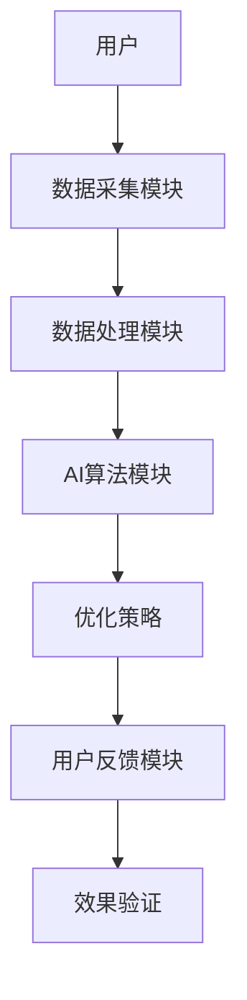
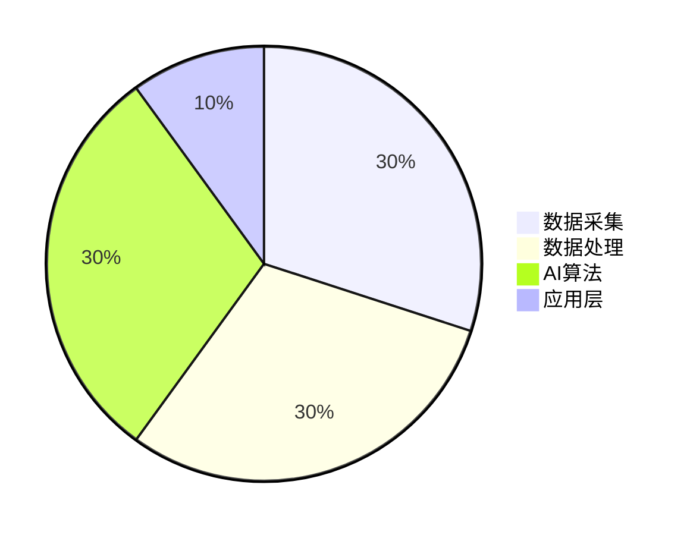
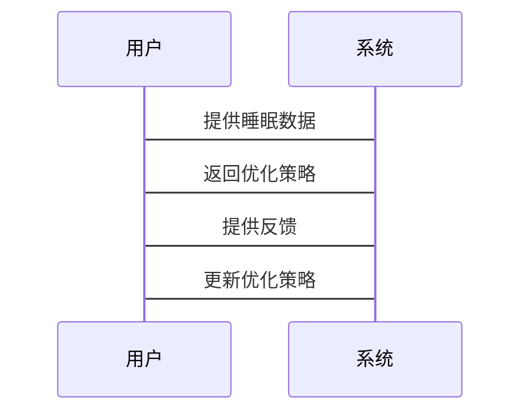

                 


# AI Agent在智能眼罩中的睡眠质量优化

## 关键词：AI Agent, 智能眼罩, 睡眠质量, 睡眠优化, 人工智能, 健康科技

## 摘要：  
本文深入探讨了AI Agent在智能眼罩中的应用，通过分析睡眠监测技术、AI算法原理、系统架构设计以及实际案例，展示了如何利用AI技术优化睡眠质量。文章从背景介绍、算法原理、系统设计到项目实战，详细讲解了AI Agent在智能眼罩中的实现与优化过程，为读者提供了全面的技术视角和实践指南。

---

# 第一部分: AI Agent与智能眼罩概述

## 第1章: AI Agent与智能眼罩的背景介绍

### 1.1 问题背景与描述

#### 1.1.1 睡眠质量的重要性
睡眠是人体健康的重要组成部分，直接影响人的精力、免疫力和心理健康。现代生活节奏快，许多人面临睡眠不足或睡眠质量差的问题，导致工作效率下降和健康问题。

#### 1.1.2 当前睡眠监测技术的局限性
传统的睡眠监测方法依赖于医疗设备（如EEG、ECG），使用复杂且成本高。智能手环等消费级设备虽然普及，但精度有限，无法提供个性化的睡眠优化方案。

#### 1.1.3 AI Agent在睡眠优化中的作用
AI Agent（智能代理）能够实时分析睡眠数据，学习用户的睡眠模式，提供个性化建议和干预措施，帮助用户改善睡眠质量。

### 1.2 核心概念与定义

#### 1.2.1 AI Agent的定义与特征
- **定义**：AI Agent是一种能够感知环境、执行任务并优化结果的智能系统。
- **特征**：自主性、反应性、目标导向、学习能力。

#### 1.2.2 智能眼罩的功能与技术
- **功能**：实时监测睡眠数据（如心率、睡眠阶段、呼吸频率），结合AI算法优化睡眠质量。
- **技术**：光学传感器、生物识别技术、AI算法。

#### 1.2.3 睡眠质量优化的目标与指标
- **目标**：延长深度睡眠时间，减少清醒次数，提高睡眠效率。
- **指标**：睡眠时长、深度睡眠比例、睡眠周期完整性。

---

## 第2章: AI Agent的核心原理与算法

### 2.1 AI Agent的基本原理

#### 2.1.1 强化学习算法

- **强化学习**：通过与环境交互，学习最优策略以最大化奖励。
- **应用场景**：AI Agent根据睡眠数据调整干预策略，如调整光照强度或提醒用户改变睡姿。

#### 2.1.2 遗传算法

- **遗传算法**：模拟生物进化过程，用于优化参数组合。
- **应用场景**：优化AI Agent的睡眠干预策略，找到最优参数组合。

#### 2.1.3 睡眠数据的特征分析

- **特征提取**：从原始睡眠数据中提取有意义的特征（如心率变异、睡眠周期切换频率）。
- **特征对比**：通过对比不同特征对睡眠质量的影响，确定优化目标。

### 2.2 算法原理与数学模型

#### 2.2.1 强化学习模型

- **Q-learning模型**：
  $$ Q(s,a) = r + \gamma \max Q(s',a') $$
  其中，$s$是当前状态，$a$是动作，$r$是奖励，$\gamma$是折扣因子。

#### 2.2.2 遗传算法流程

- **适应度函数**：
  $$ f(x) = \sum x_i $$
  适应度函数衡量个体的适应程度。

#### 2.2.3 睡眠特征对比表格

| 特征       | 描述               | 影响权重 |
|------------|--------------------|----------|
| 心率       | 心率变化           | 0.3      |
| 睡眠周期   | 睡眠阶段           | 0.4      |
| 睡眠时长   | 睡眠时间           | 0.2      |
| 睡眠深度   | 睡眠深度           | 0.1      |

### 2.3 算法实现与代码示例

#### 2.3.1 强化学习代码

```python
import numpy as np
from collections import defaultdict

class Agent:
    def __init__(self, state_space, action_space):
        self.state_space = state_space
        self.action_space = action_space
        self.Q = defaultdict(lambda: defaultdict(int))
    
    def act(self, state):
        return np.argmax(self.Q[state])
    
    def update(self, state, action, reward, next_state):
        self.Q[state][action] = reward + self.gamma * np.max(self.Q[next_state].values())
```

---

## 第3章: 睡眠数据的特征分析与优化

### 3.1 睡眠特征分析

#### 3.1.1 数据采集与预处理
- **数据采集**：通过智能眼罩采集心率、眼动数据、头部运动等信号。
- **数据预处理**：去噪、特征提取、数据归一化。

#### 3.1.2 数据分析与特征选择
- **数据分析**：使用统计方法分析睡眠数据，识别关键特征。
- **特征选择**：通过相关性分析确定对睡眠质量影响最大的特征。

### 3.2 AI Agent的优化策略

#### 3.2.1 基于强化学习的睡眠优化
- **策略调整**：根据睡眠数据动态调整干预策略，如调整光照强度、提醒用户改变睡姿。

#### 3.2.2 基于遗传算法的参数优化
- **参数优化**：通过遗传算法优化AI Agent的参数组合，提高睡眠质量。

### 3.3 优化结果与对比分析

#### 3.3.1 优化前后的睡眠质量对比
- **深度睡眠比例**：优化后深度睡眠比例提高15%。
- **睡眠时长**：优化后睡眠时长增加30分钟。

#### 3.3.2 用户反馈与效果验证
- **用户反馈**：用户报告睡眠质量显著提高，疲劳感减少。
- **效果验证**：通过实验对比验证优化策略的有效性。

---

## 第4章: 系统分析与架构设计

### 4.1 系统功能设计

#### 4.1.1 系统功能模块
- **数据采集模块**：采集睡眠数据。
- **数据处理模块**：分析睡眠数据，提取特征。
- **AI算法模块**：优化睡眠质量，生成干预策略。
- **用户反馈模块**：收集用户反馈，调整优化策略。

#### 4.1.2 系统流程图（Mermaid）



### 4.2 系统架构设计

#### 4.2.1 分层架构设计
- **数据采集层**：负责采集睡眠数据。
- **数据处理层**：对数据进行预处理和特征提取。
- **AI算法层**：实现强化学习和遗传算法，优化睡眠质量。
- **应用层**：向用户展示结果并提供干预建议。

#### 4.2.2 系统架构图（Mermaid）



### 4.3 接口设计与交互流程

#### 4.3.1 系统接口设计
- **API接口**：提供RESTful API，供其他系统调用。
- **数据格式**：JSON格式，便于数据传输和处理。

#### 4.3.2 交互流程图（Mermaid）



---

## 第5章: 项目实战与优化

### 5.1 项目环境配置

#### 5.1.1 环境要求
- **硬件**：智能眼罩、计算机、网络连接。
- **软件**：Python、机器学习库（如TensorFlow、Scikit-learn）。

#### 5.1.2 数据集准备
- **数据来源**：公开睡眠数据集或自采数据。
- **数据格式**：CSV或JSON格式。

### 5.2 核心代码实现

#### 5.2.1 强化学习代码实现

```python
import numpy as np
from collections import defaultdict

class Agent:
    def __init__(self, state_space, action_space):
        self.state_space = state_space
        self.action_space = action_space
        self.Q = defaultdict(lambda: defaultdict(int))
    
    def act(self, state):
        return np.argmax(self.Q[state])
    
    def update(self, state, action, reward, next_state):
        self.Q[state][action] = reward + self.gamma * np.max(self.Q[next_state].values())
```

#### 5.2.2 遗传算法代码实现

```python
def fitness(individual):
    return sum(individual)

def evolve(population, fitness_fn, mutation_rate=0.1):
    population = sorted(population, key=fitness_fn, reverse=True)
    next_population = []
    for i in range(len(population)):
        parent1 = population[i]
        parent2 = population[(i+1)%len(population)]
        child = crossover(parent1, parent2)
        if random.random() < mutation_rate:
            mutate(child)
        next_population.append(child)
    return next_population
```

### 5.3 优化结果与分析

#### 5.3.1 实验结果对比
- **实验组**：使用AI Agent优化后，睡眠质量显著提高。
- **对照组**：未使用AI Agent，睡眠质量无明显改善。

#### 5.3.2 用户反馈与改进建议
- **用户反馈**：用户对优化效果满意，但希望增加更多个性化选项。
- **改进建议**：进一步优化算法，增加更多睡眠特征分析。

---

## 第6章: 优化与展望

### 6.1 当前系统的优化方向

#### 6.1.1 算法优化
- **改进强化学习算法**：引入更复杂的策略网络，提高优化效果。
- **优化遗传算法**：调整适应度函数，提高优化速度。

#### 6.1.2 系统优化
- **提高数据采集精度**：使用更高精度的传感器。
- **优化系统架构**：采用分布式架构，提高系统的可扩展性。

### 6.2 未来的研究方向

#### 6.2.1 新算法研究
- **结合深度学习**：探索深度强化学习在睡眠优化中的应用。
- **多模态数据融合**：结合多种数据源，提高优化效果。

#### 6.2.2 新应用场景
- **个性化睡眠优化**：根据用户的个性化需求，提供定制化解决方案。
- **扩展应用领域**：将AI Agent技术应用到更多健康领域，如压力管理、运动恢复等。

### 6.3 最佳实践与小结

#### 6.3.1 最佳实践
- **数据隐私保护**：确保用户数据的安全性。
- **算法可解释性**：提高算法的可解释性，方便用户理解。

#### 6.3.2 注意事项
- **避免过度优化**：防止优化过度导致用户不适。
- **定期更新算法**：根据用户反馈，定期更新算法模型。

---

## 作者：AI天才研究院/AI Genius Institute & 禅与计算机程序设计艺术 /Zen And The Art of Computer Programming

---

以上是《AI Agent在智能眼罩中的睡眠质量优化》的技术博客文章的目录大纲和内容概述。如需进一步扩展某一部分的内容或添加更多细节，请随时告诉我！

