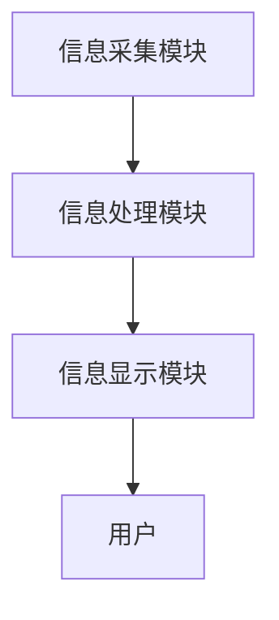

                 


# AI Agent在智能眼镜中的实时信息显示

> 关键词：AI Agent, 智能眼镜, 实时信息显示, 人工智能, 增强现实, 系统架构设计, 项目实战

> 摘要：本文将详细探讨AI Agent在智能眼镜中的实时信息显示技术。通过分析AI Agent的核心原理、智能眼镜的信息显示系统、实时信息显示的算法实现、系统架构设计以及项目实战，全面解读AI Agent在智能眼镜中的应用背景、技术实现和未来发展方向。本文将从理论到实践，逐步引导读者理解并掌握AI Agent在智能眼镜中的实时信息显示技术。

---

# 第一部分: AI Agent与智能眼镜概述

# 第1章: AI Agent与智能眼镜的背景介绍

## 1.1 AI Agent的基本概念

### 1.1.1 AI Agent的定义与特点

AI Agent（人工智能代理）是一种能够感知环境、自主决策并执行任务的智能实体。它具备以下特点：
- **自主性**：能够在没有外部干预的情况下独立运作。
- **反应性**：能够实时感知环境并做出响应。
- **目标导向性**：基于目标驱动行为。
- **学习能力**：能够通过数据和经验进行优化和改进。

### 1.1.2 AI Agent的核心要素与功能

AI Agent的核心要素包括：
1. **感知模块**：用于获取环境信息（如视觉、听觉等）。
2. **决策模块**：基于感知信息进行分析和决策。
3. **执行模块**：根据决策结果执行具体操作。
4. **学习模块**：通过反馈不断优化自身性能。

### 1.1.3 AI Agent的应用场景与优势

AI Agent广泛应用于多个领域，包括：
- 智能助手（如Siri、Alexa）。
- 自动驾驶。
- 智慧城市。
- 游戏AI。

其优势在于能够通过自主学习和实时决策提高系统的智能化水平。

## 1.2 智能眼镜的发展历程

### 1.2.1 智能眼镜的定义与分类

智能眼镜是一种结合了增强现实（AR）技术的可穿戴设备，能够将虚拟信息与现实世界无缝结合。常见的智能眼镜类型包括：
- **消费级智能眼镜**：如谷歌眼镜（Google Glass）。
- **工业级智能眼镜**：用于工业检测、远程协作等领域。

### 1.2.2 智能眼镜的技术发展现状

目前，智能眼镜的主要技术包括：
- **AR显示技术**：通过透明屏幕或投影显示虚拟信息。
- **语音交互技术**：支持语音命令和自然语言理解。
- **传感器技术**：集成摄像头、麦克风、加速度计等多种传感器。

### 1.2.3 智能眼镜的市场应用与未来趋势

智能眼镜目前主要应用于消费电子、医疗、教育、工业等领域。未来，随着AI技术的进一步发展，智能眼镜将更加智能化，具备更强的实时信息处理和决策能力。

## 1.3 AI Agent在智能眼镜中的应用背景

### 1.3.1 AI Agent与智能眼镜的结合

AI Agent与智能眼镜的结合，能够实现智能化的信息处理和显示。例如：
- **实时信息显示**：AI Agent可以根据用户的视线和环境信息，实时显示相关的虚拟信息。
- **语音交互**：AI Agent可以理解用户的语音指令，执行相应的操作。

### 1.3.2 AI Agent在智能眼镜中的问题背景

在智能眼镜中应用AI Agent面临以下挑战：
- **实时性要求高**：需要快速处理和显示信息。
- **资源受限**：智能眼镜的硬件资源有限，需要优化算法。
- **隐私问题**：涉及到用户隐私数据的处理和传输。

### 1.3.3 实时信息显示的核心问题与挑战

实时信息显示的核心问题包括：
- **信息采集与处理**：如何高效采集和处理环境信息。
- **信息显示优化**：如何在有限的屏幕上优化显示效果。
- **用户交互设计**：如何设计直观的用户交互界面。

---

## 1.4 本章小结

本章介绍了AI Agent的基本概念、智能眼镜的发展历程以及AI Agent在智能眼镜中的应用背景。通过分析AI Agent的核心要素和智能眼镜的技术特点，为后续章节的深入探讨奠定了基础。

---

# 第2章: AI Agent在智能眼镜中的核心概念

## 2.1 AI Agent的核心原理

### 2.1.1 AI Agent的基本工作原理

AI Agent通过感知环境、分析信息、做出决策并执行操作来实现功能。其核心流程如下：
1. **感知环境**：通过传感器获取环境信息。
2. **信息处理**：对感知信息进行分析和理解。
3. **决策制定**：基于分析结果制定行动计划。
4. **执行操作**：根据决策结果执行具体操作。

### 2.1.2 AI Agent的感知与决策机制

AI Agent的感知机制包括：
- **视觉感知**：通过摄像头获取图像信息。
- **听觉感知**：通过麦克风获取语音信息。
- **触觉感知**：通过触摸屏或传感器获取触觉信息。

AI Agent的决策机制包括：
- **规则驱动**：基于预设规则进行决策。
- **学习驱动**：通过机器学习模型进行预测和决策。

### 2.1.3 AI Agent的自适应与学习能力

AI Agent可以通过机器学习算法不断优化自身的感知和决策能力。例如：
- **监督学习**：通过标注数据进行训练。
- **无监督学习**：通过聚类分析发现数据规律。
- **强化学习**：通过与环境交互获得奖励，优化决策策略。

## 2.2 智能眼镜的信息显示系统

### 2.2.1 智能眼镜的信息显示技术

智能眼镜的信息显示技术包括：
- **AR显示技术**：将虚拟信息叠加在现实场景中。
- **高清显示技术**：提升显示效果的清晰度和色彩还原度。
- **动态调节技术**：根据环境光线自动调节屏幕亮度。

### 2.2.2 实时信息显示的关键技术

实时信息显示的关键技术包括：
- **低延迟数据处理**：减少数据处理时间，提升实时性。
- **高效渲染技术**：快速生成和显示虚拟信息。
- **多模态信息融合**：将多种信息（如图像、语音）融合显示。

### 2.2.3 智能眼镜的信息显示系统架构

智能眼镜的信息显示系统架构包括：
1. **数据采集模块**：负责采集环境信息。
2. **信息处理模块**：对采集到的信息进行分析和处理。
3. **显示模块**：将处理后的信息以AR形式显示。

## 2.3 AI Agent与智能眼镜的结合模型

### 2.3.1 AI Agent与智能眼镜的实体关系

AI Agent与智能眼镜的实体关系如下：
- **AI Agent**：负责信息处理和决策。
- **智能眼镜**：负责信息显示和用户交互。

### 2.3.2 AI Agent在智能眼镜中的功能模块划分

AI Agent在智能眼镜中的功能模块包括：
1. **信息采集模块**：采集用户视线和环境信息。
2. **信息处理模块**：分析和理解采集到的信息。
3. **决策模块**：基于分析结果制定行动计划。
4. **执行模块**：执行相应的显示操作。

### 2.3.3 AI Agent与智能眼镜的交互流程

AI Agent与智能眼镜的交互流程如下：
1. **信息采集**：智能眼镜采集用户视线和环境信息。
2. **信息传输**：将采集到的信息传输给AI Agent。
3. **信息处理**：AI Agent对信息进行分析和理解。
4. **决策制定**：AI Agent基于分析结果制定显示策略。
5. **信息显示**：智能眼镜根据显示策略生成并显示虚拟信息。

---

## 2.4 本章小结

本章详细介绍了AI Agent的核心原理、智能眼镜的信息显示技术以及AI Agent与智能眼镜的结合模型。通过分析AI Agent与智能眼镜的交互流程，为后续章节的算法实现和系统设计奠定了理论基础。

---

# 第3章: AI Agent在智能眼镜中的算法原理

## 3.1 AI Agent的核心算法

### 3.1.1 信息处理算法

信息处理算法包括：
- **图像处理算法**：如边缘检测、目标识别。
- **语音处理算法**：如语音识别、语义理解。

### 3.1.2 决策算法

决策算法包括：
- **规则驱动算法**：基于预设规则进行决策。
- **机器学习算法**：如随机森林、支持向量机（SVM）。
- **深度学习算法**：如卷积神经网络（CNN）、循环神经网络（RNN）。

### 3.1.3 优化算法

优化算法包括：
- **遗传算法**：用于优化参数。
- **粒子群优化算法**：用于优化搜索空间。
- **梯度下降算法**：用于训练神经网络。

## 3.2 实时信息显示的算法实现

### 3.2.1 数据采集与预处理算法

数据采集与预处理算法包括：
- **图像预处理**：如去噪、锐化。
- **语音预处理**：如降噪、特征提取。

### 3.2.2 信息识别与分类算法

信息识别与分类算法包括：
- **目标识别算法**：如物体识别、人脸识别。
- **文本识别算法**：如OCR识别、手写识别。

### 3.2.3 信息显示优化算法

信息显示优化算法包括：
- **AR显示算法**：如虚拟信息与现实场景的融合。
- **动态调整算法**：如根据光线变化自动调节显示亮度。

## 3.3 算法的数学模型与公式

### 3.3.1 信息处理的数学模型

信息处理的数学模型如下：
$$
f(x) = \sum_{i=1}^{n} w_i x_i + b
$$
其中，$x_i$ 是输入特征，$w_i$ 是权重，$b$ 是偏置。

### 3.3.2 决策算法的数学公式

决策算法的数学公式如下：
$$
y = \text{sigmoid}(w^T x + b)
$$
其中，$w$ 是权重向量，$x$ 是输入向量，$b$ 是偏置。

### 3.3.3 优化算法的数学推导

优化算法的数学推导如下：
$$
\theta_{new} = \theta - \alpha \frac{\partial L}{\partial \theta}
$$
其中，$\theta$ 是参数，$\alpha$ 是学习率，$L$ 是损失函数。

## 3.4 算法实现的代码示例

### 3.4.1 数据预处理代码

```python
import numpy as np
from sklearn.preprocessing import StandardScaler

# 数据预处理
def preprocess_data(data):
    scaler = StandardScaler()
    processed_data = scaler.fit_transform(data)
    return processed_data
```

### 3.4.2 信息识别代码

```python
import tensorflow as tf
from tensorflow.keras.layers import Dense, InputLayer
from tensorflow.keras.models import Sequential

# 信息识别模型
model = Sequential([
    InputLayer(input_shape=(n_features,)),
    Dense(64, activation='relu'),
    Dense(1, activation='sigmoid')
])

model.compile(optimizer='adam', loss='binary_crossentropy', metrics=['accuracy'])
```

### 3.4.3 信息显示优化代码

```python
def optimize_display(display_info):
    # 动态调整显示参数
    adjusted_info = []
    for info in display_info:
        adjusted_info.append(info * (1 + np.random.normal(0, 0.1)))
    return adjusted_info
```

---

## 3.5 本章小结

本章详细介绍了AI Agent在智能眼镜中的核心算法，包括信息处理算法、决策算法和优化算法。通过具体的代码示例和数学公式，帮助读者理解算法的实现原理和应用场景。

---

# 第4章: AI Agent在智能眼镜中的系统架构设计

## 4.1 系统架构概述

### 4.1.1 系统整体架构

AI Agent在智能眼镜中的系统架构包括：
1. **感知层**：负责采集环境信息。
2. **处理层**：负责信息处理和决策。
3. **显示层**：负责信息显示和用户交互。

### 4.1.2 系统功能模块划分

系统功能模块包括：
- **信息采集模块**：负责采集用户视线和环境信息。
- **信息处理模块**：负责信息分析和决策。
- **信息显示模块**：负责信息显示和用户交互。

### 4.1.3 系统组件之间的关系

系统组件之间的关系如下：
- **信息采集模块**与**信息处理模块**之间通过数据总线进行通信。
- **信息处理模块**与**信息显示模块**之间通过控制信号进行交互。

---

## 4.2 系统功能设计

### 4.2.1 信息采集模块

信息采集模块的功能包括：
- **图像采集**：通过摄像头获取图像信息。
- **语音采集**：通过麦克风获取语音信息。
- **传感器采集**：通过各种传感器获取环境数据。

### 4.2.2 信息处理模块

信息处理模块的功能包括：
- **图像处理**：对采集到的图像进行预处理和识别。
- **语音处理**：对采集到的语音进行识别和理解。
- **决策制定**：基于处理结果制定显示策略。

### 4.2.3 信息显示模块

信息显示模块的功能包括：
- **AR显示**：将虚拟信息叠加在现实场景中。
- **动态调整**：根据环境变化自动调整显示参数。
- **用户交互**：支持用户通过语音或手势进行交互。

## 4.3 系统架构的Mermaid图



---

## 4.4 本章小结

本章详细介绍了AI Agent在智能眼镜中的系统架构设计，包括系统整体架构、功能模块划分和组件之间的关系。通过Mermaid图展示了系统的交互流程，为后续章节的项目实战奠定了基础。

---

# 第5章: AI Agent在智能眼镜中的项目实战

## 5.1 项目背景与目标

### 5.1.1 项目背景

本项目旨在开发一个基于AI Agent的智能眼镜系统，实现实时信息显示功能。

### 5.1.2 项目目标

项目的具体目标包括：
1. 实现AI Agent的信息采集和处理功能。
2. 实现智能眼镜的AR显示功能。
3. 实现用户与智能眼镜的实时交互。

## 5.2 项目环境与工具

### 5.2.1 开发环境

开发环境包括：
- **操作系统**：Windows 10 或 macOS。
- **开发工具**：PyCharm、VS Code。
- **框架与库**：TensorFlow、OpenCV、PyTorch。

### 5.2.2 传感器与硬件

传感器与硬件包括：
- **摄像头**：用于图像采集。
- **麦克风**：用于语音采集。
- **显示屏**：用于AR显示。

## 5.3 系统核心实现

### 5.3.1 信息采集模块的实现

```python
import cv2

# 图像采集
cap = cv2.VideoCapture(0)
while cap.isOpened():
    ret, frame = cap.read()
    if not ret:
        break
    # 处理图像
    processed_frame = cv2.cvtColor(frame, cv2.COLOR_BGR2RGB)
    # 显示图像
    cv2.imshow('Processed Frame', processed_frame)
    if cv2.waitKey(1) == ord('q'):
        break
cap.release()
cv2.destroyAllWindows()
```

### 5.3.2 信息处理模块的实现

```python
import tensorflow as tf
from tensorflow.keras.models import load_model

# 加载预训练模型
model = load_model('model.h5')
# 预测结果
predictions = model.predict(processed_data)
```

### 5.3.3 信息显示模块的实现

```python
import numpy as np
import cv2

# AR显示
def ar_display(frame, overlay_image):
    overlay_image = cv2.resize(overlay_image, (frame.shape[1], frame.shape[0]))
    alpha = 0.7
    beta = 1 - alpha
    result = cv2.addWeightedImage(frame, overlay_image, alpha, beta)
    return result
```

## 5.4 项目实战案例分析

### 5.4.1 案例背景

本案例旨在实现一个简单的实时信息显示功能，即在用户视线范围内显示天气信息。

### 5.4.2 案例实现步骤

1. **数据采集**：通过摄像头采集用户视线信息。
2. **信息处理**：分析视线信息，获取用户关注的区域。
3. **信息显示**：在用户关注的区域内显示天气信息。

### 5.4.3 案例代码实现

```python
import requests
import cv2

# 获取天气信息
def get_weather_info(city):
    response = requests.get(f'http://api.openweathermap.org/data/2.5/weather?q={city}&units=metric&appid=YOUR_API_KEY')
    return response.json()

# 天气信息显示
def display_weather(frame, weather_info):
    cv2.putText(frame, f"Temperature: {weather_info['main']['temp']}", (10, 30), cv2.FONT_HERSHEY_SIMPLEX, 1, (0, 255, 0), 2)
    cv2.putText(frame, f"Humidity: {weather_info['main']['humidity']}", (10, 60), cv2.FONT_HERSHEY_SIMPLEX, 1, (0, 255, 0), 2)
    return frame
```

---

## 5.5 项目小结

本章通过具体的项目实战，详细讲解了AI Agent在智能眼镜中的实现过程。通过代码示例和案例分析，帮助读者掌握AI Agent在智能眼镜中的实际应用。

---

# 第6章: 总结与展望

## 6.1 本章小结

本文详细探讨了AI Agent在智能眼镜中的实时信息显示技术。通过分析AI Agent的核心原理、智能眼镜的信息显示系统、实时信息显示的算法实现、系统架构设计以及项目实战，全面解读了AI Agent在智能眼镜中的应用背景、技术实现和未来发展方向。

## 6.2 注意事项与最佳实践

在实际应用中，需要注意以下几点：
- **数据安全**：确保用户数据的安全性。
- **系统优化**：优化算法和系统架构，提高实时性。
- **用户体验**：设计直观的用户交互界面，提升用户体验。

## 6.3 未来展望

随着AI技术的不断发展，AI Agent在智能眼镜中的应用前景广阔。未来，可以通过以下方向进一步优化和扩展：
- **更强大的AI算法**：如深度学习、强化学习。
- **更高效的硬件支持**：如高性能芯片、微型传感器。
- **更丰富的应用场景**：如医疗、教育、娱乐等领域。

---

# 作者：AI天才研究院/AI Genius Institute & 禅与计算机程序设计艺术 /Zen And The Art of Computer Programming

