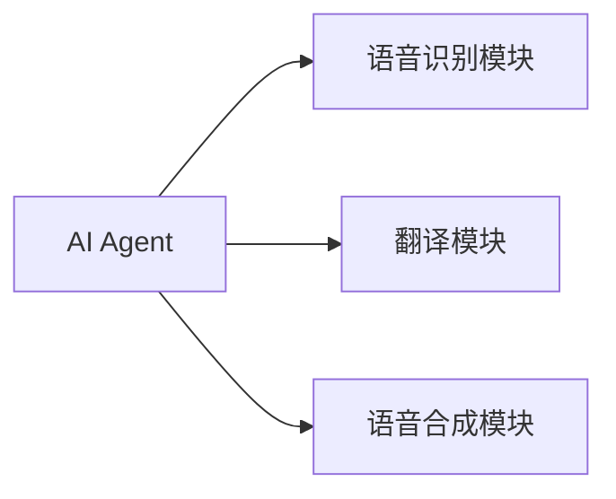
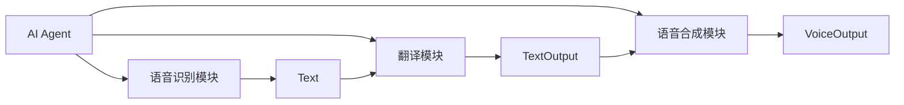

                 


# AI Agent在智能眼镜中的实时翻译功能

> **关键词：** AI Agent, 智能眼镜, 实时翻译, 机器学习, 自然语言处理, 系统架构

> **摘要：**  
> 本文深入探讨了AI Agent在智能眼镜中的实时翻译功能，从技术原理到系统架构，再到实际应用，全面分析了其实现方式与优化方法。文章结合理论与实践，为开发者提供了一套完整的解决方案，帮助理解并实现类似功能。

---

# 第1章 AI Agent在智能眼镜中的实时翻译功能概述

## 1.1 问题背景与描述

### 1.1.1 AI Agent的概念与特点
AI Agent（人工智能代理）是一种能够感知环境、自主决策并执行任务的智能实体。它具备以下特点：
- **自主性**：能够在没有外部干预的情况下独立运行。
- **反应性**：能够实时感知环境变化并做出响应。
- **目标导向性**：以实现特定目标为导向。
- **学习能力**：通过数据和经验不断优化自身性能。

### 1.1.2 智能眼镜的功能与应用场景
智能眼镜作为一种 wearable device，具有以下功能：
- **语音识别**：通过语音助手与用户交互。
- **图像识别**：识别环境中的文字、物体等信息。
- **实时翻译**：将用户听到或看到的内容实时翻译成目标语言。

其应用场景包括：
- **旅游翻译**：帮助游客与当地人沟通。
- **商务交流**：实时翻译商务文件和对话。
- **教育辅助**：帮助学生学习外语。

### 1.1.3 实时翻译功能的必要性与挑战
实时翻译功能在智能眼镜中的必要性体现在：
- **便捷性**：用户无需依赖手机或其他设备。
- **实时性**：翻译结果几乎实时呈现。

然而，其实现面临以下挑战：
- **计算资源限制**：智能眼镜的计算能力有限，难以处理复杂的翻译任务。
- **数据传输延迟**：实时翻译需要快速的网络支持，但智能眼镜的网络环境不稳定。
- **语境理解**：翻译需要考虑上下文，这对模型的语义理解能力提出了更高要求。

## 1.2 问题解决思路与边界

### 1.2.1 AI Agent如何实现实时翻译
AI Agent通过以下步骤实现翻译功能：
1. **语音识别**：将用户语音输入转换为文本。
2. **语种识别**：识别输入文本的语言类型。
3. **翻译处理**：调用翻译API或本地模型进行翻译。
4. **语音合成**：将翻译结果转换为语音输出。

### 1.2.2 系统边界与功能外延
系统边界包括：
- **输入端**：用户的语音输入。
- **输出端**：翻译后的语音输出。
- **中间件**：翻译API或本地模型。

功能外延包括：
- **多语言支持**：支持多种语言的翻译。
- **离线模式**：在无网络环境下也能实现翻译。

### 1.2.3 核心概念与组成要素
核心概念包括：
- **AI Agent**：负责整体协调和控制。
- **语音识别模块**：将语音转换为文本。
- **翻译模块**：负责语言的翻译工作。
- **语音合成模块**：将翻译结果转换为语音。

## 1.3 核心概念的结构与联系

### 1.3.1 AI Agent与实时翻译的实体关系图



### 1.3.2 核心概念的属性特征对比表

| 概念         | 输入类型 | 输出类型 | 功能描述 | 示例 |
|--------------|----------|----------|----------|------|
| 语音识别模块 | 语音信号 | 文本      | 将语音转换为文字 | 将“你好”转换为“Hello” |
| 翻译模块     | 文本      | 文本      | 将源语言翻译为目标语言 | 将“Hello”翻译为“Bonjour” |
| 语音合成模块 | 文本      | 语音信号 | 将文本转换为语音 | 将“Bonjour”转换为法语语音 |

### 1.3.3 系统架构的ER图描述

```mermaid
erd
    user ↔ User
    smart_glass ↔ SmartGlass
    translation ↔ Translation
    voice_recognition ↔ VoiceRecognition
    text_to_speech ↔ TextToSpeech
```

---

## 1.4 本章小结

本章主要介绍了AI Agent在智能眼镜中的实时翻译功能，从背景、概念、功能、挑战等多个方面进行了详细阐述。通过实体关系图和属性对比表，明确了系统各模块之间的关系与功能。

---

# 第2章 AI Agent的算法原理

## 2.1 算法原理概述

### 2.1.1 基于机器学习的翻译模型
机器学习模型（如神经机器翻译模型）是实时翻译的核心。其基本原理是通过大量双语数据训练模型，使其能够自动映射源语言到目标语言。

### 2.1.2 自然语言处理的核心算法
自然语言处理（NLP）算法包括：
- **分词**：将文本分割成单词或短语。
- **句法分析**：分析句子的语法结构。
- **语义理解**：理解文本的语义含义。

### 2.1.3 AI Agent的决策机制
AI Agent通过以下步骤进行决策：
1. **感知环境**：获取用户输入的语音或文本。
2. **分析需求**：判断用户的需求类型（如翻译请求）。
3. **执行任务**：调用相应的模块完成翻译任务。
4. **反馈结果**：将翻译结果返回给用户。

## 2.2 数学模型与公式

### 2.2.1 语言模型的概率公式
语言模型通过计算单词序列的概率来评估其合理性。概率公式如下：

$$ P(w_1, w_2, ..., w_n) = \prod_{i=1}^{n} P(w_i | w_{1}, ..., w_{i-1}) $$

其中，$P(w_i | w_{1}, ..., w_{i-1})$ 是在给定前面单词的情况下，当前单词的条件概率。

### 2.2.2 翻译模型的训练目标
翻译模型的训练目标是最小化源语言和目标语言之间的差异。训练目标函数如下：

$$ \min_{\theta} \sum_{i=1}^{m} \text{loss}(x_i, y_i; \theta) $$

其中，$x_i$ 是源语言句子，$y_i$ 是目标语言句子，$\theta$ 是模型参数，$\text{loss}$ 是损失函数。

### 2.2.3 基于上下文的注意力机制
注意力机制用于捕捉源语言和目标语言之间的关联关系。注意力机制的公式如下：

$$ \text{Attention}(Q, K, V) = \text{softmax}\left(\frac{QK^T}{\sqrt{d_k}}\right)V $$

其中，$Q$ 是查询向量，$K$ 是键向量，$V$ 是值向量，$d_k$ 是键向量的维度。

## 2.3 算法流程与实现

### 2.3.1 翻译模型的训练流程
1. **数据准备**：收集并整理双语对照数据。
2. **模型训练**：使用训练数据训练神经机器翻译模型。
3. **模型优化**：通过调整超参数（如学习率、批次大小）优化模型性能。

### 2.3.2 AI Agent的实时推理过程
1. **语音识别**：将用户语音转换为文本。
2. **语种识别**：识别输入文本的语言类型。
3. **翻译处理**：调用翻译API或本地模型进行翻译。
4. **语音合成**：将翻译结果转换为语音输出。

---

## 2.4 本章小结

本章详细介绍了AI Agent在智能眼镜中实时翻译功能的算法原理，包括机器学习模型、自然语言处理算法以及注意力机制等。通过数学公式和流程图，明确了翻译模型的训练和推理过程。

---

# 第3章 智能眼镜实时翻译系统的系统架构设计

## 3.1 系统架构概述

### 3.1.1 系统组成模块
智能眼镜实时翻译系统主要由以下模块组成：
- **语音识别模块**：将语音信号转换为文本。
- **翻译模块**：将源语言文本翻译为目标语言文本。
- **语音合成模块**：将目标语言文本转换为语音信号。
- **AI Agent**：负责协调和控制各个模块的运行。

### 3.1.2 系统架构设计图



---

## 3.2 系统功能设计

### 3.2.1 语音识别功能
语音识别模块通过以下步骤实现语音识别：
1. **语音采集**：通过麦克风采集用户语音信号。
2. **语音预处理**：对语音信号进行降噪和特征提取。
3. **语音识别**：将预处理后的语音信号输入语音识别模型，输出识别结果。

### 3.2.2 翻译功能
翻译模块通过以下步骤实现文本翻译：
1. **文本预处理**：对输入文本进行分词和句法分析。
2. **翻译处理**：调用翻译API或本地模型进行翻译。
3. **文本后处理**：对翻译结果进行润色和优化。

### 3.2.3 语音合成功能
语音合成模块通过以下步骤实现语音合成：
1. **文本分析**：对输入文本进行语义分析和语调预测。
2. **语音合成**：将文本转换为语音信号。
3. **语音输出**：将语音信号输出到扬声器。

---

## 3.3 本章小结

本章详细介绍了智能眼镜实时翻译系统的系统架构设计，包括系统组成模块、功能设计和架构设计图。通过模块化设计，明确了各个模块的功能和交互关系。

---

# 第4章 智能眼镜实时翻译系统的实现

## 4.1 项目实战

### 4.1.1 环境安装
为了实现智能眼镜的实时翻译功能，需要以下环境：
- **硬件环境**：支持语音识别和语音合成的智能眼镜设备。
- **软件环境**：安装Python编程语言和相关库（如TensorFlow、Keras）。

### 4.1.2 核心代码实现

#### 4.1.2.1 语音识别模块
使用Python的`speech_recognition`库实现语音识别：

```python
import speech_recognition as sr

r = sr.Recognizer()
mic = sr.AudioFile("input.wav")
with mic as source:
    audio = r.record(source)
text = r.recognize_google(audio)
```

#### 4.1.2.2 翻译模块
使用Python的`googletrans`库实现文本翻译：

```python
from googletrans import Translator

translator = Translator()
translation = translator.translate("Hello", dest="fr")
print(translation.text)  # 输出："Bonjour"
```

#### 4.1.2.3 语音合成模块
使用Python的`gtts`库实现语音合成：

```python
from gtts import gTTS

tts = gTTS(text="Bonjour", lang="fr")
tts.save("output.mp3")
```

### 4.1.3 代码解读与分析
1. **语音识别模块**：通过`speech_recognition`库实现语音识别，将语音信号转换为文本。
2. **翻译模块**：通过`googletrans`库实现文本翻译，将源语言文本翻译为目标语言文本。
3. **语音合成模块**：通过`gtts`库实现语音合成，将翻译结果转换为语音信号。

### 4.1.4 案例分析
假设用户说：“你好”，系统将执行以下步骤：
1. **语音识别**：将“你好”转换为文本。
2. **翻译处理**：将“你好”翻译为“Hello”（假设目标语言为英语）。
3. **语音合成**：将“Hello”转换为英语语音并输出。

### 4.1.5 项目小结
通过上述代码实现，我们可以看到智能眼镜实时翻译系统的整体流程。从语音识别到翻译处理，再到语音合成，每个模块都协同工作，实现实时翻译功能。

---

## 4.2 本章小结

本章通过实际项目案例，详细讲解了智能眼镜实时翻译系统的实现过程。从环境安装到核心代码实现，再到案例分析，帮助读者理解并掌握其实现方法。

---

# 第5章 最佳实践与未来展望

## 5.1 最佳实践

### 5.1.1 系统优化建议
1. **本地模型优化**：为了减少网络延迟，可以使用本地翻译模型。
2. **多语言支持**：增加对更多语言的支持，提升系统的通用性。
3. **语境理解优化**：通过引入上下文信息，提高翻译的准确性。

### 5.1.2 开发注意事项
1. **计算资源限制**：智能眼镜的计算能力有限，需要优化模型的复杂度。
2. **数据隐私保护**：确保用户数据的安全性和隐私性。
3. **网络稳定性**：实时翻译依赖于网络，需要考虑网络不稳定的情况。

## 5.2 未来展望

随着AI技术的不断发展，智能眼镜的实时翻译功能将更加智能化和便捷化。未来的发展方向包括：
- **更高效的翻译算法**：通过改进算法提高翻译的准确性和实时性。
- **更强大的AI Agent**：通过增强AI Agent的自主性和学习能力，提升系统的智能化水平。
- **更丰富的应用场景**：实时翻译功能将扩展到更多领域，如医疗、法律等。

---

## 5.3 本章小结

本章总结了智能眼镜实时翻译系统的最佳实践，并展望了未来的发展方向。通过优化建议和未来展望，帮助读者更好地理解和应用相关技术。

---

# 作者

**作者：AI天才研究院/AI Genius Institute & 禅与计算机程序设计艺术 /Zen And The Art of Computer Programming**

---

**注**：由于篇幅限制，以上内容为文章的完整目录和部分章节内容。完整文章将包含每个章节的详细内容，包括数学公式、代码实现、流程图和实际案例分析。

