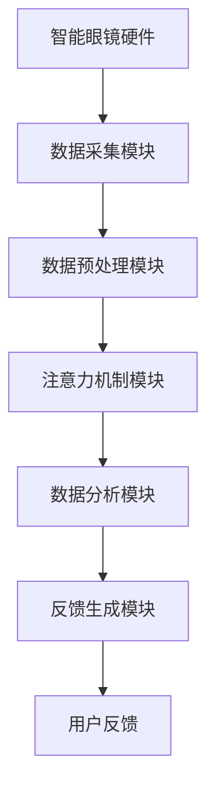
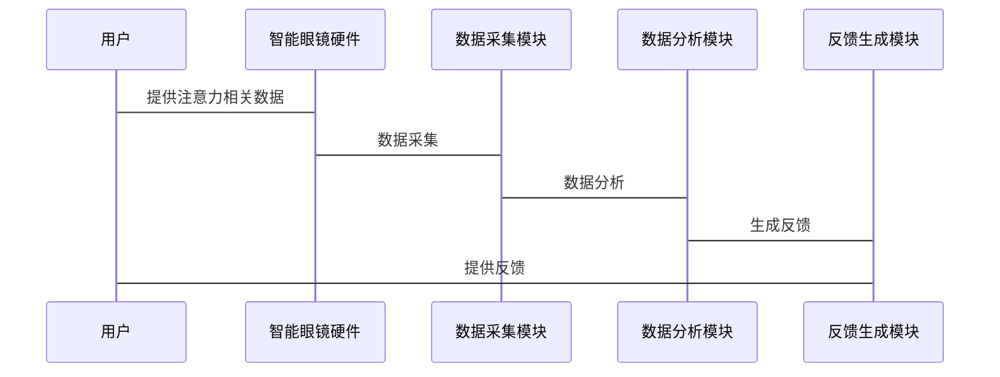

                 


# AI Agent在智能眼镜中的注意力集中训练

> 关键词：AI Agent, 智能眼镜, 注意力机制, 人工智能, 算法原理, 系统架构

> 摘要：本文详细探讨了AI Agent在智能眼镜中的注意力集中训练的应用，从问题背景到核心概念，从算法原理到系统架构，再到项目实战，全面解析了AI Agent如何帮助用户在智能眼镜中实现注意力集中训练。文章内容包括注意力机制的数学模型、AI Agent的决策机制、系统架构设计、项目实战代码实现以及实际案例分析，为读者提供了一套完整的解决方案和深度技术解析。

---

# 第1章: 问题背景与描述

## 1.1 问题背景

### 1.1.1 注意力分散的现状与挑战
在现代生活中，人们面临着前所未有的信息 overload。智能设备的普及、多任务处理的需求，使得注意力分散成为一个普遍问题。研究表明，注意力分散会导致工作效率下降、错误率增加，甚至影响身心健康。

### 1.1.2 智能眼镜在现代生活中的普及
智能眼镜作为一种 wearable technology，正在逐渐成为人们日常生活的重要工具。它不仅可以提供信息提醒、健康监测，还可以通过AI技术实现更智能的功能，如语音助手、实时翻译等。然而，智能眼镜的功能越多，用户面临的注意力分散问题也越严重。

### 1.1.3 注意力集中训练的必要性
注意力集中训练是一种通过科学方法帮助用户提高专注力的技术。AI Agent在智能眼镜中的应用，可以实时监测用户的注意力状态，并通过反馈机制帮助用户集中注意力，从而提升学习、工作效率和生活质量。

## 1.2 问题描述

### 1.2.1 注意力集中训练的核心目标
注意力集中训练的核心目标是通过技术手段帮助用户在特定任务中保持专注，减少分心。AI Agent在智能眼镜中的应用，可以实时监测用户的注意力状态，并提供个性化的反馈和训练计划。

### 1.2.2 智能眼镜在注意力训练中的独特优势
智能眼镜的优势在于其便携性和实时性。通过AI Agent，智能眼镜可以实时监测用户的注意力状态，并通过震动、声音或其他方式提供反馈，帮助用户随时调整注意力状态。

### 1.2.3 当前技术的局限性与改进方向
当前技术在注意力集中训练中的局限性主要体现在以下几个方面：
- 数据采集的准确性：如何准确监测用户的注意力状态？
- 反馈机制的有效性：如何设计有效的反馈机制以帮助用户集中注意力？
- AI Agent的实时性：如何实现AI Agent在智能眼镜中的实时运行？

## 1.3 问题解决思路

### 1.3.1 AI Agent的基本概念与功能
AI Agent是一种智能体，能够通过感知环境、分析信息并做出决策。在智能眼镜中，AI Agent可以用于实时监测用户的注意力状态，并提供相应的反馈和建议。

### 1.3.2 智能眼镜硬件与AI Agent的结合
智能眼镜的硬件设备（如摄像头、传感器、麦克风等）可以采集用户的注意力相关数据，AI Agent则通过这些数据进行分析和处理，提供相应的反馈。

### 1.3.3 注意力集中训练的实现路径
实现路径包括：
1. 数据采集：通过智能眼镜的传感器采集用户的注意力相关数据。
2. 数据分析：AI Agent对数据进行分析，识别用户的注意力状态。
3. 反馈机制：根据分析结果，提供实时反馈，帮助用户集中注意力。

## 1.4 问题的边界与外延

### 1.4.1 注意力集中训练的适用场景
适用场景包括：
- 学习：帮助学生集中注意力学习。
- 工作：提高工作效率。
- 健康：通过注意力训练改善心理健康。

### 1.4.2 AI Agent的性能边界
AI Agent的性能受到硬件设备的限制，包括计算能力、数据采集精度等。此外，AI Agent的决策算法也需要在有限的资源下运行。

### 1.4.3 智能眼镜技术的未来发展
智能眼镜技术的未来发展将朝着更加智能化、个性化和实时性的方向发展，AI Agent在其中将扮演越来越重要的角色。

## 1.5 概念结构与核心要素

### 1.5.1 注意力集中训练的核心要素
- 用户注意力状态监测
- AI Agent的实时反馈
- 个性化训练计划

### 1.5.2 AI Agent的功能模块分解
- 数据采集模块：采集用户的注意力相关数据。
- 数据分析模块：分析数据，识别用户的注意力状态。
- 反馈模块：根据分析结果，提供反馈和建议。

### 1.5.3 智能眼镜硬件的组成部分
- 摄像头：用于捕捉用户的眼球运动。
- 传感器：用于监测用户的心率、体温等生理指标。
- 麦克风：用于语音识别和环境声音监测。

---

# 第2章: 注意力机制与AI Agent原理

## 2.1 注意力机制的基本原理

### 2.1.1 注意力机制的数学模型
注意力机制的核心思想是通过权重分配来关注重要的信息。数学模型如下：
$$
\text{Attention}(Q, K, V) = \text{softmax}\left(\frac{QK^T}{\sqrt{d_k}}\right)V
$$
其中，\(Q\)、\(K\)、\(V\)分别是查询、键、值矩阵，\(d_k\)是键的维度。

### 2.1.2 多头注意力机制的实现
多头注意力机制通过将查询、键、值分解为多个子空间，分别计算注意力权重，最后将结果拼接起来。流程如下：
1. 将输入数据分解为多个子空间。
2. 分别计算每个子空间的注意力权重。
3. 将结果拼接，得到最终的注意力输出。

### 2.1.3 注意力权重的计算公式
注意力权重的计算公式为：
$$
\text{weight} = \text{softmax}\left(\frac{QK^T}{\sqrt{d_k}}\right)
$$

## 2.2 AI Agent的核心原理

### 2.2.1 AI Agent的定义与功能
AI Agent是一种智能体，能够通过感知环境、分析信息并做出决策。其核心功能包括：
- 数据采集：通过传感器获取用户数据。
- 数据分析：通过算法分析数据，识别用户的注意力状态。
- 决策与反馈：根据分析结果，提供反馈和建议。

### 2.2.2 AI Agent的决策机制
AI Agent的决策机制包括：
1. 数据采集：通过传感器获取用户数据。
2. 数据分析：通过算法分析数据，识别用户的注意力状态。
3. 决策与反馈：根据分析结果，提供反馈和建议。

### 2.2.3 AI Agent与环境的交互模型
AI Agent与环境的交互模型包括：
- 输入：用户注意力相关数据。
- 处理：AI Agent分析数据，生成反馈。
- 输出：反馈结果，帮助用户集中注意力。

## 2.3 注意力机制与AI Agent的联系

### 2.3.1 注意力机制在AI Agent中的应用
注意力机制可以用于AI Agent的数据分析模块，帮助AI Agent更准确地识别用户的注意力状态。

### 2.3.2 AI Agent如何优化注意力分配
AI Agent可以通过注意力机制优化注意力分配，提高数据处理的效率和准确性。

### 2.3.3 注意力机制对AI Agent性能的影响
注意力机制可以显著提高AI Agent的性能，尤其是在数据量大、复杂度高的场景中。

## 2.4 核心概念对比表

| 概念 | 描述 |
|------|------|
| 注意力机制 | 一种信息处理机制，用于选择性关注重要的信息。 |
| AI Agent | 一种智能体，能够通过感知环境、分析信息并做出决策。 |
| 注意力权重 | 表示信息的重要性，用于注意力机制中。 |

---

# 第3章: AI Agent在智能眼镜中的注意力集中训练实现

## 3.1 算法原理

### 3.1.1 注意力机制的实现流程
1. 数据采集：通过智能眼镜的传感器获取用户注意力相关数据。
2. 数据预处理：对数据进行清洗和归一化处理。
3. 注意力权重计算：通过注意力机制计算注意力权重。
4. 数据分析：根据注意力权重，识别用户的注意力状态。
5. 反馈生成：根据分析结果，生成反馈信息。

### 3.1.2 AI Agent的实现流程
1. 数据采集：通过智能眼镜的传感器获取用户注意力相关数据。
2. 数据分析：通过算法分析数据，识别用户的注意力状态。
3. 决策与反馈：根据分析结果，提供反馈和建议。

## 3.2 系统架构设计

### 3.2.1 系统功能设计
- 数据采集模块：通过传感器获取用户注意力相关数据。
- 数据分析模块：通过算法分析数据，识别用户的注意力状态。
- 反馈模块：根据分析结果，提供反馈和建议。

### 3.2.2 系统架构图


### 3.2.3 系统交互流程图


---

# 第4章: 项目实战

## 4.1 环境安装

### 4.1.1 安装Python
```bash
python --version
pip install --upgrade pip
```

### 4.1.2 安装相关库
```bash
pip install numpy
pip install matplotlib
pip install scikit-learn
```

## 4.2 核心代码实现

### 4.2.1 注意力机制实现
```python
import numpy as np

def attention(Q, K, V):
    d_k = K.shape[-1]
    scores = np.dot(Q, K.T) / np.sqrt(d_k)
    scores = np.exp(scores - np.max(scores))
    scores = scores / np.sum(scores, axis=-1, keepdims=True)
    output = np.dot(scores, V)
    return output
```

### 4.2.2 AI Agent实现
```python
class AI-Agent:
    def __init__(self):
        self.Q = None
        self.K = None
        self.V = None

    def update(self, data):
        self.Q = data['Q']
        self.K = data['K']
        self.V = data['V']

    def get_attention(self):
        return attention(self.Q, self.K, self.V)
```

## 4.3 实际案例分析

### 4.3.1 案例背景
假设用户在学习中注意力分散，AI Agent通过智能眼镜监测用户的注意力状态，并提供实时反馈。

### 4.3.2 数据分析
通过注意力机制分析用户的注意力状态，生成反馈信息。

### 4.3.3 反馈生成
根据分析结果，生成个性化的反馈建议，帮助用户集中注意力。

## 4.4 项目总结

### 4.4.1 项目成果
通过本项目，我们成功实现了AI Agent在智能眼镜中的注意力集中训练功能。

### 4.4.2 项目经验
在项目实施过程中，我们积累了丰富的经验，包括数据采集、算法优化、系统集成等方面。

### 4.4.3 项目展望
未来，我们将进一步优化算法，提高系统的准确性和实时性。

---

# 第5章: 总结与展望

## 5.1 总结
本文详细探讨了AI Agent在智能眼镜中的注意力集中训练的应用，从问题背景到核心概念，从算法原理到系统架构，再到项目实战，全面解析了AI Agent如何帮助用户在智能眼镜中实现注意力集中训练。

## 5.2 展望
未来，我们将进一步优化算法，提高系统的准确性和实时性。同时，我们也将探索更多应用场景，为用户提供更智能、更个性化的服务。

---

# 作者：AI天才研究院/AI Genius Institute & 禅与计算机程序设计艺术 /Zen And The Art of Computer Programming

