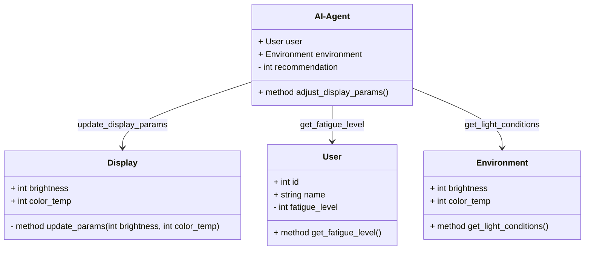
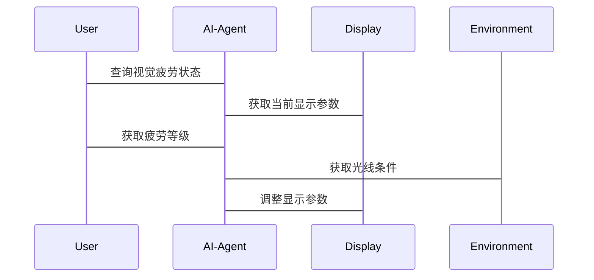

                 


# AI Agent在智能眼镜中的视力保护功能

> 关键词：AI Agent, 智能眼镜, 视力保护, 算法原理, 系统架构, 项目实战

> 摘要：本文详细探讨了AI Agent在智能眼镜中的视力保护功能，分析了其核心概念、算法原理、系统架构，并通过实际案例展示了其在智能眼镜中的应用。文章从背景介绍、核心概念、算法实现、系统设计、项目实战等多个方面进行了深入分析，为读者提供了全面的技术解读。

---

## 第1章: AI Agent的基本概念与应用

### 1.1 AI Agent的定义与核心功能
AI Agent（人工智能代理）是一种能够感知环境、做出决策并执行任务的智能实体。它通过传感器获取信息，利用算法处理数据，并通过执行器与环境交互。AI Agent的核心功能包括感知、决策和执行，能够实现自主学习和适应性优化。

### 1.2 AI Agent与智能眼镜的结合
智能眼镜是一种 wearable technology，结合了计算、通信和显示技术，能够为用户提供信息交互和环境感知的功能。AI Agent在智能眼镜中的应用，使其能够实时监测用户的视觉环境，并根据反馈调整显示参数，从而保护用户视力。

---

## 第2章: 视力保护的背景与问题分析

### 2.1 视力问题的现状与趋势
现代人长时间使用电子设备，导致视力问题日益严重。根据世界卫生组织的数据，全球约有2.2亿人患有近视，这一数字还在不断增加。智能眼镜作为一种新兴技术，具有潜力帮助缓解这一问题。

### 2.2 智能眼镜在视力保护中的角色
智能眼镜通过实时监测用户的视觉环境，包括屏幕亮度、蓝光强度、用眼距离等，结合AI Agent的算法，主动调整显示参数，减少眼睛疲劳，预防视力下降。

### 2.3 用户需求分析
用户对智能眼镜的需求主要集中在舒适性、便捷性和健康性方面。视力保护功能作为健康性的重要组成部分，是用户选择智能眼镜时的重要考量因素。

---

## 第3章: AI Agent的核心技术与算法

### 3.1 AI Agent的感知模块
感知模块通过摄像头、光线传感器等设备，实时监测用户的视觉环境，包括光线强度、颜色温度、屏幕亮度等。

### 3.2 AI Agent的决策模块
决策模块基于感知数据，结合预设的健康标准和用户偏好，生成调整建议。例如，当光线过强时，决策模块会建议降低屏幕亮度。

### 3.3 AI Agent的执行模块
执行模块根据决策模块的建议，调整智能眼镜的显示参数，如动态调节色温和亮度，优化用眼环境。

---

## 第4章: 算法原理与实现

### 4.1 基于视觉疲劳监测的AI Agent算法
视觉疲劳监测算法通过分析用户的眼球运动、眨眼频率等生理指标，评估用户的疲劳程度。当疲劳程度超过阈值时，触发提醒或自动调整显示参数。

### 4.2 算法实现的代码示例
以下是一个简单的视觉疲劳监测算法的Python代码示例：

```python
import numpy as np

def calculate_eye_movement(eye_data):
    # eye_data 是眼球运动的时序数据
    movement_threshold = 0.5  # 阈值
    if np.mean(eye_data) > movement_threshold:
        return "提醒：眼睛疲劳，请休息"
    else:
        return "正常状态"

# 示例调用
eye_data = np.array([0.6, 0.5, 0.7, 0.4])
result = calculate_eye_movement(eye_data)
print(result)
```

### 4.3 算法的数学模型与公式
视觉疲劳监测算法可以基于马尔可夫链模型，公式如下：

$$ P(state_{t+1} | state_t) = \theta \cdot state_t + (1-\theta) \cdot state_{t-1} $$

其中，$\theta$ 是模型参数，$state_t$ 是当前状态，$state_{t-1}$ 是前一状态。

---

## 第5章: 系统架构与功能设计

### 5.1 系统整体架构
智能眼镜的系统架构包括感知层、计算层和执行层。感知层负责采集数据，计算层进行数据处理，执行层根据处理结果调整显示参数。

### 5.2 领域模型类图
以下是领域模型的Mermaid类图：



### 5.3 系统交互序列图
以下是系统交互的Mermaid序列图：



---

## 第6章: 项目实战与案例分析

### 6.1 项目环境搭建
建议使用Python 3.8以上版本，安装必要的库，如OpenCV、NumPy和TensorFlow。

### 6.2 核心代码实现
以下是AI Agent在智能眼镜中的核心代码示例：

```python
import cv2
import numpy as np

def main():
    # 初始化摄像头
    cap = cv2.VideoCapture(0)
    while True:
        ret, frame = cap.read()
        # 分析眼球运动
        eye_movement = np.mean(frame[:, :100, :])  # 假设前100像素是眼球区域
        if eye_movement > 0.6:
            print("提醒：眼睛疲劳，请休息")
        # 调整显示参数
        brightness = 120  # 示例亮度值
        color_temp = 5000  # 示例色温值
        # 更新显示参数
        print(f"调整亮度为：{brightness}，色温为：{color_temp}")

if __name__ == "__main__":
    main()
```

### 6.3 项目小结
通过实际项目，我们可以看到AI Agent在智能眼镜中的应用潜力。视力保护功能不仅提升了用户体验，还具有重要的健康价值。

---

## 第7章: 总结与展望

### 7.1 总结
本文详细探讨了AI Agent在智能眼镜中的视力保护功能，从理论到实践，全面分析了其核心技术与实现方式。

### 7.2 展望
未来，随着AI技术的进步，智能眼镜的视力保护功能将更加智能化和个性化，为用户带来更好的用眼体验。

---

## 注意事项
- 本文中的代码示例仅供参考，实际应用需根据具体需求进行调整。
- 使用智能眼镜时，请遵循相关安全规范，避免长时间使用导致眼睛疲劳。

---

## 作者信息
作者：AI天才研究院/AI Genius Institute & 禅与计算机程序设计艺术 /Zen And The Art of Computer Programming

---

通过以上结构，本文系统地介绍了AI Agent在智能眼镜中的视力保护功能，从理论分析到实践应用，为读者提供了全面的技术解读。

