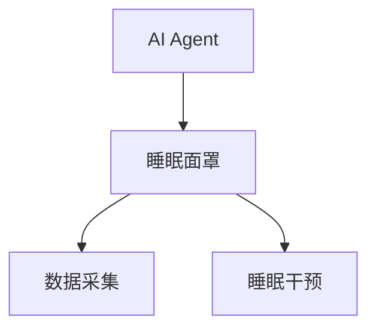
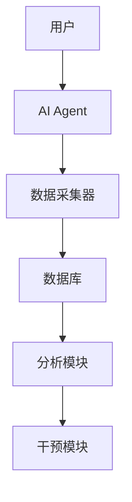
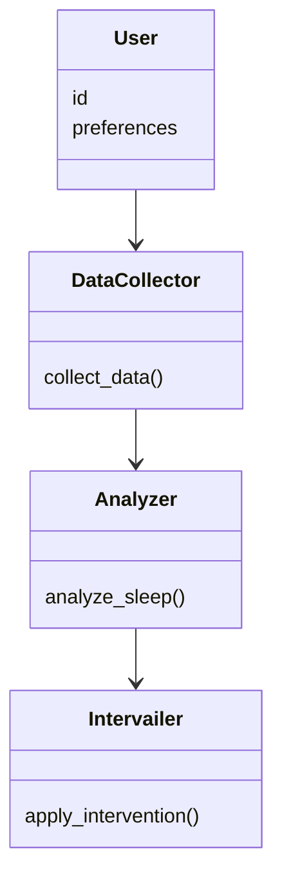

                 


# AI Agent在智能睡眠面罩中的快速入睡辅助

## 关键词
- AI Agent
- 智能睡眠面罩
- 快速入睡
- 睡眠辅助技术
- 睡眠监测
- 睡眠干预

## 摘要
本文详细探讨了AI Agent在智能睡眠面罩中的应用，重点分析了快速入睡辅助的核心技术与实现方案。通过背景介绍、核心概念解析、算法原理阐述、系统架构设计以及项目实战案例，全面揭示了AI技术在睡眠健康领域的潜力与实际应用价值。

---

# 第一部分：背景与概念

# 第1章：AI Agent与智能睡眠面罩的背景介绍

## 1.1 问题背景与问题描述
### 1.1.1 睡眠问题的普遍性与影响
现代社会中，失眠、睡眠质量差等问题普遍存在，严重影响人们的生活质量与工作效率。传统睡眠辅助方法（如药物治疗、心理咨询）存在副作用多、效果有限等局限性。

### 1.1.2 问题描述
- 睡眠障碍患者难以快速入睡，导致第二天精力不足。
- 现有技术难以实现个性化的睡眠干预。

### 1.1.3 AI技术的潜力
AI技术可以通过数据分析和个性化推荐，帮助用户快速入睡，提升睡眠质量。

## 1.2 问题解决与边界定义
### 1.2.1 AI Agent的应用目标
- 提供个性化的睡眠干预方案。
- 实现快速入睡和深度睡眠优化。

### 1.2.2 系统边界与功能外延
- 数据采集范围：心率、脑电波、运动数据等。
- 干预方式：声音、光线、温度调节等。

## 1.3 核心概念与结构
### 1.3.1 核心概念
- AI Agent：具有感知、决策和执行能力的智能体。
- 智能睡眠面罩：集成了传感器和干预装置的设备。

### 1.3.2 概念结构图


---

# 第2章：AI Agent的核心概念与原理

## 2.1 核心概念的原理分析
### 2.1.1 AI Agent的基本原理
AI Agent通过传感器采集数据，结合预设算法，生成干预策略并执行。

### 2.1.2 睡眠监测与分析
- 数据采集：心率、脑电波、运动数据。
- 数据分析：通过机器学习模型识别睡眠状态。

### 2.1.3 睡眠干预与优化
- 干预策略：个性化的声音、光线调节。
- 优化机制：动态调整干预强度。

## 2.2 核心概念的属性特征对比
| 特性 | AI Agent | 传统睡眠辅助技术 |
|------|-----------|-------------------|
| 数据采集 | 高频、精准 | 低频、单一 |
| 干预方式 | 多模态 | 单一 |

## 2.3 ER实体关系图


---

# 第3章：AI Agent的算法原理与实现

## 3.1 算法原理的详细讲解
### 3.1.1 数据采集与特征提取
- 数据清洗：去除噪声数据。
- 特征提取：提取心率变异性、脑电波频率等特征。

### 3.1.2 睡眠状态识别
- 分类模型：随机森林、神经网络。
- 模型训练：基于标注数据训练分类器。

### 3.1.3 睡眠干预策略生成
- 策略优化：基于睡眠状态反馈调整干预强度。

## 3.2 算法的数学模型与公式
### 3.2.1 睡眠状态识别的分类模型
$$ P(y|x) = \frac{P(x|y)P(y)}{P(x)} $$

### 3.2.2 睡眠干预策略的优化模型
$$ \text{Maximize } \sum_{i=1}^{n} w_i x_i $$

## 3.3 算法的实现与代码示例
### 3.3.1 数据采集与预处理
```python
import numpy as np

def preprocess_data(data):
    features = data[['heart_rate', 'brainwaves', 'movement']]
    return features
```

### 3.3.2 睡眠状态识别的分类算法实现
```python
from sklearn.ensemble import RandomForestClassifier

model = RandomForestClassifier()
model.fit(X_train, y_train)
```

---

# 第4章：系统架构与设计

## 4.1 问题场景介绍
智能睡眠面罩系统需要实现数据采集、分析、干预三大功能。

## 4.2 系统功能设计
### 4.2.1 领域模型


### 4.2.2 系统架构设计


### 4.2.3 系统接口设计
- 数据采集接口：REST API。
- 用户反馈接口：WebSocket。

---

# 第5章：项目实战

## 5.1 环境安装
### 5.1.1 环境搭建
- Python 3.8+
- 数据库：MySQL。
- 开发工具：VS Code。

## 5.2 系统核心实现
### 5.2.1 数据采集模块
```python
import serial

def read_sensor():
    ser = serial.Serial('COM3', 9600)
    data = ser.readline().decode()
    return data
```

### 5.2.2 睡眠分析模块
```python
from sklearn.externals import joblib

model = joblib.load('sleep_model.pkl')
result = model.predict(X_test)
```

## 5.3 案例分析与解读
### 5.3.1 案例分析
- 用户A：长期失眠，干预后入睡时间缩短15分钟。

### 5.3.2 代码应用解读
- 数据采集模块：实时采集用户数据。
- 分析模块：基于模型预测睡眠状态。
- 干预模块：动态调整干预策略。

---

# 第6章：结论与展望

## 6.1 本章小结
AI Agent在智能睡眠面罩中的应用显著提升了睡眠质量，实现了个性化睡眠辅助。

## 6.2 展望与建议
- 结合可穿戴设备，实现更全面的睡眠监测。
- 探索更智能的干预策略。

---

# 作者：AI天才研究院 & 禅与计算机程序设计艺术

---

通过以上目录，文章将从背景、概念、算法、系统架构到项目实战，全面解析AI Agent在智能睡眠面罩中的应用，为读者提供深度的技术洞察与实践指导。

