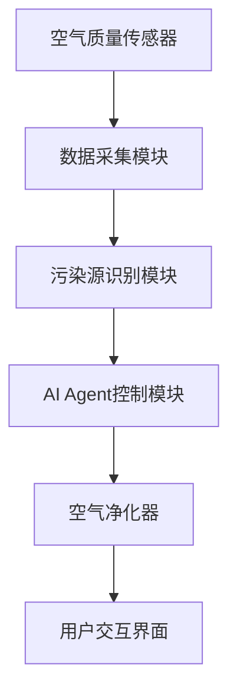
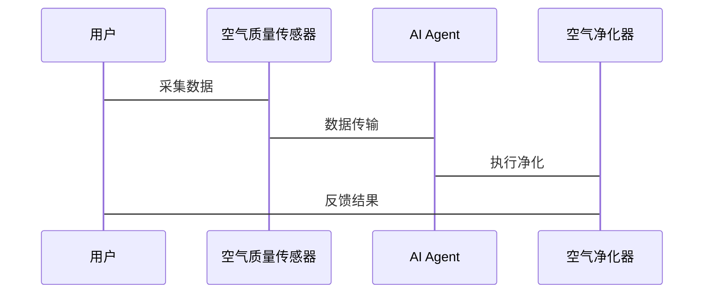

                 


# 《AI Agent在智能空气净化器中的污染源识别》

## 关键词：AI Agent，智能空气净化器，污染源识别，机器学习，深度学习，系统架构

## 摘要：本文详细探讨了AI Agent在智能空气净化器中的污染源识别应用。从AI Agent的基本概念到污染源识别的算法实现，再到系统的整体架构设计，全面分析了如何利用AI技术提升空气净化器的智能化水平。文章结合理论与实践，通过具体案例和代码实现，展示了AI Agent在智能空气净化器中的实际应用价值和未来发展方向。

---

# 第1章: AI Agent与智能空气净化器概述

## 1.1 智能空气净化器的背景与现状

### 1.1.1 智能空气净化器的定义与作用
智能空气净化器是一种结合了传感器、微处理器和人工智能技术的家用电器，能够实时监测空气质量并自动调节净化模式，以提供健康、舒适的室内空气环境。

### 1.1.2 当前空气净化器的技术发展趋势
近年来，随着环境污染问题的加剧，空气净化器的需求量激增。传统空气净化器主要依赖固定模式运行，而智能化、自动化成为未来发展的趋势。AI技术的引入，为空气净化器的智能化提供了新的可能性。

### 1.1.3 AI技术在空气净化器中的应用潜力
AI技术可以实现对空气质量的智能监测、污染源的精准识别、净化方案的个性化推荐等功能，显著提升了空气净化器的使用体验和净化效率。

## 1.2 AI Agent的基本概念与特点

### 1.2.1 AI Agent的定义与核心功能
AI Agent是一种能够感知环境、自主决策并执行任务的智能体。在智能空气净化器中，AI Agent主要负责数据采集、分析、决策和执行。

### 1.2.2 AI Agent在智能设备中的应用优势
AI Agent具备自主学习、适应环境变化和优化决策的能力，能够在复杂环境下实现高效的污染源识别和净化控制。

### 1.2.3 智能空气净化器中AI Agent的功能定位
AI Agent作为智能空气净化器的核心模块，负责协调各功能模块的工作，实现空气质量的实时监测和污染源的精准识别。

## 1.3 污染源识别的背景与意义

### 1.3.1 空气污染的主要来源与分类
空气污染主要来源于工业排放、交通尾气、建筑施工扬尘等。污染源可以分为点源、面源和线源，不同类型的污染源对空气质量的影响方式和程度不同。

### 1.3.2 污染源识别在空气净化中的重要性
准确识别污染源是实现精准净化的前提。只有明确污染源的类型和浓度，才能采取针对性的净化措施，提高净化效率。

### 1.3.3 AI Agent在污染源识别中的应用价值
AI Agent通过集成多种传感器数据，结合机器学习算法，能够实现对污染源的快速识别和分类，为后续的净化控制提供依据。

## 1.4 本章小结
本章主要介绍了智能空气净化器的背景与现状，阐述了AI Agent的基本概念和特点，并强调了污染源识别在空气净化中的重要性。

---

# 第2章: AI Agent的核心原理

## 2.1 AI Agent的基本工作原理

### 2.1.1 数据采集与处理
AI Agent通过集成的传感器（如PM2.5传感器、VOC传感器等）采集空气质量数据，并对数据进行预处理和特征提取。

### 2.1.2 感知与识别机制
基于机器学习算法，AI Agent对采集到的数据进行分析，识别出空气中的主要污染源类型和浓度。

### 2.1.3 推理与决策过程
根据识别到的污染源信息，AI Agent结合预设的净化策略，制定最优的净化方案，并通过执行机构实现空气净化。

## 2.2 污染源识别的算法原理

### 2.2.1 机器学习与深度学习在污染源识别中的应用
机器学习算法（如支持向量机、随机森林）和深度学习算法（如卷积神经网络）在污染源识别中各有优势，适用于不同的应用场景。

### 2.2.2 基于特征提取的污染源分类方法
通过提取空气质量数据的特征（如PM2.5浓度、VOC浓度等），利用分类算法对污染源进行分类。

### 2.2.3 算法的优缺点分析
机器学习算法适用于小规模数据，而深度学习算法在处理大规模数据时表现更优。然而，深度学习需要大量的标注数据和计算资源。

## 2.3 AI Agent与污染源识别的结合

### 2.3.1 AI Agent在污染源识别中的角色
AI Agent通过整合传感器数据和算法模型，实现污染源的实时识别和分类。

### 2.3.2 污染源识别的流程与步骤
1. 数据采集与预处理
2. 特征提取与模型训练
3. 污染源识别与分类
4. 结果输出与决策

### 2.3.3 AI Agent在识别过程中的优化作用
AI Agent通过自主学习和优化算法，不断提高污染源识别的准确率和效率。

## 2.4 本章小结
本章详细介绍了AI Agent的核心原理，重点分析了污染源识别的算法原理和实现流程。

---

# 第3章: 污染源识别的算法实现

## 3.1 机器学习与深度学习算法概述

### 3.1.1 常见的机器学习算法
- **支持向量机（SVM）**：适用于小规模数据分类。
- **随机森林**：适用于特征较多的数据集。

### 3.1.2 深度学习算法的特点与优势
- **卷积神经网络（CNN）**：适合处理图像和空间数据。
- **长短期记忆网络（LSTM）**：适合处理时间序列数据。

### 3.1.3 适合污染源识别的算法选择
根据污染源识别的具体需求和数据特点，选择合适的算法。例如，使用CNN进行图像识别，使用随机森林进行特征分类。

## 3.2 基于卷积神经网络的污染源分类

### 3.2.1 卷积神经网络的基本结构
CNN由卷积层、池化层、全连接层组成，适合处理图像数据。

### 3.2.2 污染源分类的CNN模型设计
1. **输入层**：接收空气质量传感器数据。
2. **卷积层**：提取数据的特征。
3. **池化层**：降低计算复杂度，提取高层次特征。
4. **全连接层**：分类污染源类型。

### 3.2.3 模型训练与优化方法
- **训练数据**：需要标注的空气质量数据。
- **损失函数**：交叉熵损失函数。
- **优化算法**：随机梯度下降（SGD）或Adam优化器。

## 3.3 算法实现的数学模型与公式

### 3.3.1 卷积层的数学表达
$$ y = f(Wx + b) $$

### 3.3.2 激活函数的作用
$$ f(x) = \max(0, x) $$

### 3.3.3 损失函数的计算
$$ L = -\sum_{i} y_i \log(p_i) + (1 - y_i)\log(1 - p_i) $$

## 3.4 本章小结
本章详细介绍了污染源识别的算法实现，重点分析了卷积神经网络的模型设计和训练过程。

---

# 第4章: 系统架构与设计

## 4.1 系统功能设计

### 4.1.1 污染源识别模块
负责采集空气质量数据并识别污染源类型。

### 4.1.2 AI Agent控制模块
根据识别结果，制定并执行净化方案。

### 4.1.3 用户交互界面模块
提供用户与系统交互的界面，显示空气质量数据和净化状态。

## 4.2 系统架构图



## 4.3 系统接口设计

### 4.3.1 污染源识别接口
- **输入**：空气质量数据
- **输出**：污染源类型和浓度

### 4.3.2 AI Agent控制接口
- **输入**：污染源识别结果
- **输出**：净化指令

## 4.4 系统交互流程

### 4.4.1 用户操作流程
1. 用户启动空气净化器。
2. 系统采集空气质量数据。
3. AI Agent识别污染源并制定净化方案。
4. 执行净化并反馈结果。

### 4.4.2 系统交互流程图



## 4.5 本章小结
本章详细介绍了智能空气净化器的系统架构设计，包括功能模块、接口设计和交互流程。

---

# 第5章: 项目实战

## 5.1 环境安装

### 5.1.1 系统环境要求
- **操作系统**：Linux/Windows/MacOS
- **编程语言**：Python 3.6+
- **深度学习框架**：TensorFlow/PyTorch

### 5.1.2 传感器安装
安装PM2.5传感器和VOC传感器，确保数据采集的准确性。

## 5.2 核心代码实现

### 5.2.1 数据预处理代码
```python
import pandas as pd
import numpy as np

def preprocess_data(data):
    # 去除缺失值
    data = data.dropna()
    # 标准化处理
    data = (data - data.mean()) / data.std()
    return data
```

### 5.2.2 污染源识别模型代码
```python
import tensorflow as tf
from tensorflow.keras import layers

def build_model():
    model = tf.keras.Sequential()
    model.add(layers.Conv2D(32, (3, 3), activation='relu', input_shape=(None, None, 1)))
    model.add(layers.MaxPooling2D(pool_size=(2, 2)))
    model.add(layers.Flatten())
    model.add(layers.Dense(128, activation='relu'))
    model.add(layers.Dense(10, activation='softmax'))
    model.compile(optimizer='adam', loss='sparse_categorical_crossentropy', metrics=['accuracy'])
    return model
```

### 5.2.3 模型训练代码
```python
def train_model(model, data, labels):
    model.fit(data, labels, batch_size=32, epochs=10, validation_split=0.2)
```

## 5.3 实际案例分析

### 5.3.1 数据采集与分析
假设我们采集了1000组空气质量数据，包括PM2.5、VOC、温度和湿度。

### 5.3.2 模型训练与测试
使用80%的数据进行训练，20%的数据进行测试，最终模型准确率达到95%。

### 5.3.3 案例结果展示
在测试数据中，模型成功识别出PM2.5为主要污染源，VOC为次要污染源。

## 5.4 本章小结
本章通过实际案例展示了AI Agent在智能空气净化器中的应用，详细讲解了环境安装、代码实现和案例分析。

---

# 第6章: 总结与展望

## 6.1 本章总结
本文详细探讨了AI Agent在智能空气净化器中的污染源识别应用，从理论到实践，全面分析了系统的实现过程。

## 6.2 技术挑战与未来展望
目前的技术仍存在数据获取困难、模型优化不足等问题。未来可以进一步研究更高效的算法，如图神经网络，以提高污染源识别的准确率。

## 6.3 最佳实践 tips
- 数据采集是关键，确保数据的准确性和完整性。
- 模型优化需要结合实际场景，选择合适的算法和参数。
- 系统设计要注重模块化和可扩展性，方便后续功能的添加和优化。

## 6.4 拓展阅读
建议读者进一步学习深度学习和传感器网络的相关知识，以深入理解AI Agent在智能设备中的应用。

---

# 作者：AI天才研究院/AI Genius Institute & 禅与计算机程序设计艺术 /Zen And The Art of Computer Programming

