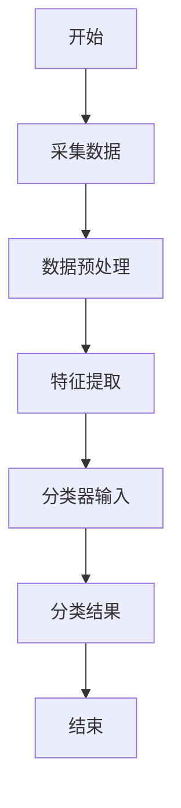

                 


# AI Agent在智能空气净化器中的污染源识别

> 关键词：AI Agent，智能空气净化器，污染源识别，传感器技术，机器学习，环境监测，系统架构

> 摘要：本文详细探讨了AI Agent在智能空气净化器中的污染源识别应用。首先介绍了AI Agent和智能空气净化器的基本概念，接着分析了污染源识别的核心算法和实现原理，然后讨论了传感器技术和数据融合方法，最后通过系统架构设计和实战案例展示了污染源识别的实现过程。文章还结合了数学模型和Python代码示例，深入剖析了AI Agent在污染源识别中的应用潜力。

---

## 第1章: 背景与概述

### 1.1 AI Agent与智能空气净化器的背景

#### 1.1.1 智能空气净化器的发展历程
智能空气净化器是一种结合了传感器技术、数据处理算法和执行机构的智能设备，旨在通过实时监测空气质量和智能调节净化模式来改善室内空气质量。随着环境污染问题的日益严重，智能空气净化器逐渐成为家庭和公共场所的重要设备。

#### 1.1.2 AI技术在环境监测中的应用
人工智能技术在环境监测中的应用日益广泛，尤其是在污染源识别方面。通过机器学习算法，AI Agent能够实时分析传感器数据，识别出空气中的污染源类型和浓度，从而实现精准的净化控制。

#### 1.1.3 污染源识别的重要性
污染源识别是智能空气净化器的核心功能之一。通过准确识别污染源类型（如PM2.5、甲醛、 VOC等），AI Agent可以优化净化策略，提高净化效率，同时减少能源浪费。

### 1.2 污染源识别的核心概念

#### 1.2.1 污染源识别的定义与目标
污染源识别是指通过传感器数据和算法分析，确定空气污染物的类型、浓度和来源。其目标是实现污染物的精准识别和实时监测，为智能空气净化器提供科学依据。

#### 1.2.2 污染源识别的关键技术
污染源识别的关键技术包括传感器数据采集、特征提取、分类算法和数据融合等。

#### 1.2.3 污染源识别的边界与外延
污染源识别的边界主要集中在空气污染物的检测和分类，而外延则包括数据采集、传感器校准、算法优化等多个方面。

---

## 第2章: AI Agent的核心原理与技术

### 2.1 AI Agent的基本概念

#### 2.1.1 AI Agent的定义与分类
AI Agent是一种能够感知环境、自主决策并执行任务的智能实体。根据功能不同，AI Agent可以分为感知型、决策型和执行型三种类型。

#### 2.1.2 AI Agent的核心技术特点
AI Agent的核心技术特点包括自主性、反应性、目标导向性和学习能力。这些特点使其能够适应复杂的环境变化。

#### 2.1.3 AI Agent与传统算法的区别
AI Agent的核心优势在于其自主性和智能性。与传统算法相比，AI Agent能够主动感知环境并动态调整策略。

### 2.2 智能空气净化器中的AI Agent架构

#### 2.2.1 感知模块
感知模块负责采集空气质量和环境数据，包括PM2.5、温度、湿度等。

#### 2.2.2 决策模块
决策模块基于感知数据，通过机器学习算法识别污染源类型，并制定净化策略。

#### 2.2.3 执行模块
执行模块根据决策模块的指令，启动相应的净化设备，如风扇、滤网等。

---

## 第3章: 污染源识别的算法原理

### 3.1 污染源识别的基本原理

#### 3.1.1 数据采集与预处理
传感器数据采集后需要进行预处理，包括去噪、归一化等步骤。

#### 3.1.2 特征提取与分类
通过特征提取，将传感器数据转化为有意义的特征向量，然后利用分类算法（如SVM、随机森林）进行污染源识别。

#### 3.1.3 分类器的设计与优化
分类器的设计需要考虑数据分布、特征相关性等因素，通过交叉验证进行参数优化。

### 3.2 基于AI Agent的污染源识别算法

#### 3.2.1 算法流程图


#### 3.2.2 算法实现的数学模型
污染源识别的分类器可以基于支持向量机（SVM）实现：
$$
\text{目标函数：} \quad \text{minimize} \quad \frac{1}{2} \sum_{i=1}^n \alpha_i^2
$$
$$
\text{约束条件：} \quad \sum_{i=1}^n y_i \alpha_i x_i \cdot x_j - \text{bias} \geq 0
$$

#### 3.2.3 算法的优缺点分析
SVM的优点是分类性能好，缺点是参数敏感性和计算复杂度高。

---

## 第4章: 传感器技术与数据融合

### 4.1 传感器的基本原理

#### 4.1.1 常见传感器类型
常用的传感器包括PM2.5传感器、甲醛传感器、温湿度传感器等。

#### 4.1.2 传感器的性能指标
传感器性能指标包括灵敏度、响应时间、测量精度等。

#### 4.1.3 传感器的数据采集方法
传感器数据采集可以通过I2C、SPI等接口完成。

### 4.2 数据融合技术

#### 4.2.1 数据融合的定义与目标
数据融合是指将多源传感器数据进行整合，提高识别精度。

#### 4.2.2 数据融合的实现方法
常用的数据融合方法包括加权平均、主成分分析和粒子滤波等。

#### 4.2.3 数据融合在污染源识别中的应用
通过数据融合，可以有效提高污染源识别的准确性和鲁棒性。

---

## 第5章: 系统架构与设计

### 5.1 系统架构设计

#### 5.1.1 系统功能模块划分
系统功能模块包括数据采集、数据处理、污染源识别、净化控制等。

#### 5.1.2 系统架构的优缺点分析
分层架构的优点是模块化程度高，缺点是跨层通信复杂。

#### 5.1.3 系统架构的实现方案
采用分层架构，包括感知层、数据处理层和应用层。

### 5.2 系统接口设计

#### 5.2.1 系统接口的定义
系统接口包括传感器接口、数据处理接口和用户界面接口。

#### 5.2.2 接口的设计原则
接口设计应遵循标准化、模块化和可扩展性原则。

#### 5.2.3 接口实现的注意事项
接口实现需要考虑数据格式、通信协议和错误处理。

---

## 第6章: 项目实战与实现

### 6.1 环境搭建与工具安装

#### 6.1.1 开发环境的选择
推荐使用Python和Raspberry Pi进行开发。

#### 6.1.2 工具的安装与配置
需要安装传感器驱动、Python库（如paho-mqtt）和机器学习库（如scikit-learn）。

#### 6.1.3 开发环境的测试
通过简单的传感器测试程序验证开发环境的正确性。

### 6.2 系统核心实现

#### 6.2.1 数据采集模块的实现
代码示例：
```python
import paho.mqtt.client as mqtt
import time

# 传感器数据采集
def on_message(client, userdata, message):
    print("数据：", message.payload.decode())

client = mqtt.Client()
client.connect("localhost", 1883)
client.subscribe("air_quality")
client.on_message = on_message
client.loop_start()
time.sleep(10)
client.loop_stop()
client.disconnect()
```

#### 6.2.2 数据处理与分类模块的实现
代码示例：
```python
from sklearn import svm

# 训练分类器
model = svm.SVC()
model.fit(X_train, y_train)

# 预测污染源类型
y_pred = model.predict(X_test)
```

### 6.3 实际案例分析与解读

#### 6.3.1 案例背景
假设空气质量传感器采集到PM2.5浓度为120 μg/m³，甲醛浓度为0.1 mg/m³。

#### 6.3.2 分类结果
分类器识别出主要污染源为PM2.5，次要污染源为甲醛。

#### 6.3.3 系统响应
系统启动高效模式，同时提醒用户开启窗户通风。

---

## 第7章: 总结与展望

### 7.1 本章总结
本文详细探讨了AI Agent在智能空气净化器中的污染源识别应用，涵盖了背景分析、算法原理、系统架构和实战实现等内容。

### 7.2 未来展望
未来的研究方向包括更高效的传感器技术、更智能的算法优化和更人性化的用户界面设计。

---

## 作者：AI天才研究院 & 禅与计算机程序设计艺术

--- 

以上是《AI Agent在智能空气净化器中的污染源识别》的完整目录和内容框架，涵盖了从理论到实践的各个方面。

