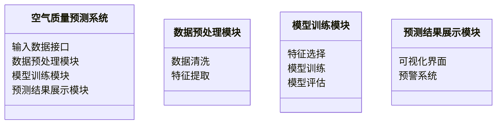
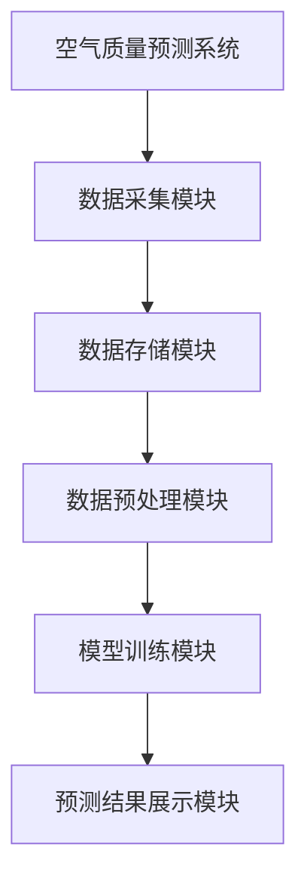
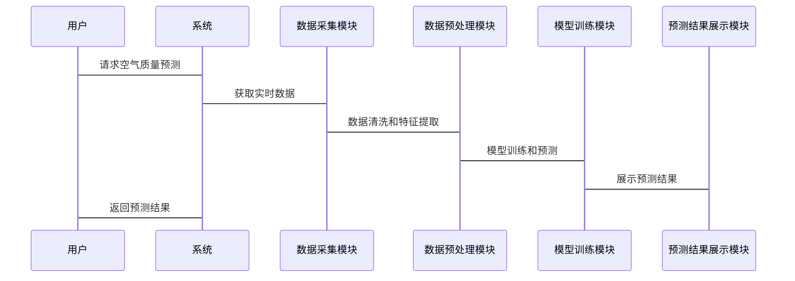

                 


# AI Agent在智能空气质量预报中的实践

## 关键词：空气质量，AI Agent，预测模型，环境监测，机器学习，深度学习

## 摘要：  
本文探讨了AI Agent在智能空气质量预报中的实践应用。通过分析空气质量预测的重要性、AI Agent的核心概念以及它们的结合方式，详细介绍了支持向量回归（SVR）和长短期记忆网络（LSTM）算法在空气质量预测中的原理与实现。同时，通过系统架构设计和项目实战，展示了如何构建一个基于AI Agent的空气质量预测系统，并提供了最佳实践和注意事项。

---

# 第一部分: AI Agent与智能空气质量预报的背景与概念

## 第1章: AI Agent与空气质量预测的背景介绍

### 1.1 空气质量预测的重要性

#### 1.1.1 空气污染的现状与挑战
空气污染是全球性的环境问题，主要来源于工业排放、交通尾气和自然因素（如 wildfires）。空气质量的恶化不仅影响居民健康，还可能导致经济损失和生态系统破坏。实时监测和预测空气质量成为环境保护的重要手段。

#### 1.1.2 空气质量预测的意义与价值
空气质量预测可以帮助政府制定有效的环保政策，指导公众减少暴露在恶劣环境中的风险，同时为企业提供生产决策支持。通过预测，可以提前采取措施，降低污染对社会和经济的影响。

#### 1.1.3 AI技术在环境监测中的应用前景
AI技术在环境监测中的应用越来越广泛，尤其是在空气质量预测方面。AI Agent可以通过实时数据处理、自主决策和反馈机制，显著提高预测的准确性和实时性。

### 1.2 AI Agent的基本概念与特点

#### 1.2.1 AI Agent的定义与核心要素
AI Agent是一种智能实体，能够感知环境、自主决策并执行任务。其核心要素包括感知能力、推理能力、决策能力和执行能力。

#### 1.2.2 AI Agent的分类与应用场景
AI Agent可以分为简单反射型、基于模型的反应型、目标驱动型和实用驱动型。在空气质量预测中，AI Agent通常用于实时数据处理、模型优化和结果反馈。

#### 1.2.3 AI Agent与传统算法的对比分析
AI Agent具有自主性和适应性，能够在复杂环境中动态调整策略。与传统算法相比，AI Agent更适用于实时性要求高、数据动态变化的场景。

### 1.3 空气质量预测的数学模型与方法

#### 1.3.1 时间序列分析的基本原理
时间序列分析通过历史数据预测未来趋势，常用的方法包括ARIMA和GARCH。这些方法适用于平稳数据，但在空气质量预测中可能受限于非线性特征。

#### 1.3.2 机器学习在空气质量预测中的应用
机器学习方法如随机森林和梯度提升树在空气质量预测中表现出色，但它们对特征工程的依赖较高，且难以捕捉时间依赖性。

#### 1.3.3 深度学习模型在空气质量预测中的优势
深度学习模型（如LSTM和Transformer）能够自动提取特征，并有效处理时间序列数据中的长依赖关系，显著提高了预测精度。

## 1.4 本章小结
本章介绍了空气质量预测的重要性，AI Agent的核心概念及其在环境监测中的应用前景。通过对比传统算法和深度学习模型，明确了AI Agent在空气质量预测中的优势和适用场景。

---

## 第2章: AI Agent与空气质量预测的核心概念

### 2.1 AI Agent的核心原理

#### 2.1.1 AI Agent的自主性与反应性
AI Agent具有自主决策能力，能够根据环境变化调整行为。反应性使其能够实时感知数据变化并做出快速响应。

#### 2.1.2 AI Agent的决策机制与学习能力
基于强化学习的AI Agent能够通过奖励机制优化决策策略。学习能力使其能够从历史数据中提取规律，提高预测准确性。

#### 2.1.3 AI Agent的环境感知与数据处理能力
AI Agent通过多种传感器和数据源获取空气质量数据，利用特征提取和数据融合技术，提高数据的可用性和预测的准确性。

### 2.2 空气质量预测模型的原理与实现

#### 2.2.1 空气质量预测模型的输入与输出
输入：历史空气质量数据、气象数据、污染源数据  
输出：未来某时刻的空气质量指数（AQI）

#### 2.2.2 空气质量预测模型的特征提取方法
特征提取：主成分分析（PCA）、经验模分析（EMD）  
特征选择：LASSO回归、随机森林特征重要性

#### 2.2.3 空气质量预测模型的评估指标
均方误差（MSE）、均方根误差（RMSE）、平均绝对误差（MAE）、R²值

### 2.3 AI Agent与空气质量预测模型的结合方式

#### 2.3.1 AI Agent作为预测模型的驱动者
AI Agent负责数据的实时采集、预处理和模型调用，输出预测结果并提供反馈。

#### 2.3.2 AI Agent作为预测模型的优化器
AI Agent通过强化学习优化模型参数，提高预测精度和效率。

#### 2.3.3 AI Agent作为预测模型的实时反馈机制
AI Agent根据实际监测数据调整预测模型，实现闭环反馈，提高预测的准确性。

## 2.4 本章小结
本章详细介绍了AI Agent的核心原理及其在空气质量预测中的应用。通过对比分析，明确了AI Agent与传统预测模型的结合方式及其优势。

---

## 第3章: 支持向量回归（SVR）算法原理

### 3.1 SVR算法的基本原理

#### 3.1.1 支持向量机的基本概念
支持向量机（SVM）是一种监督学习算法，适用于分类和回归问题。支持向量回归（SVR）是SVM的回归版本。

#### 3.1.2 SVR算法的数学模型
SVR的目标是最小化预测误差的上界：
$$
\text{min} \frac{1}{2} \|w\|^2 + C \sum_{i=1}^n (\xi_i + \xi_i^*)
$$
其中，$w$是权重向量，$C$是惩罚系数，$\xi_i$和$\xi_i^*$是松弛变量。

#### 3.1.3 SVR算法的优化过程
通过拉格朗日乘子法和对偶优化，将问题转化为对偶空间中的线性回归问题。

### 3.2 SVR算法在空气质量预测中的应用

#### 3.2.1 数据预处理与特征选择
数据预处理：标准化、去噪  
特征选择：基于LASSO回归的特征重要性排序

#### 3.2.2 SVR模型的训练与调优
训练过程：使用交叉验证选择最优参数  
调优：调整惩罚系数$C$和核函数参数

#### 3.2.3 SVR模型的预测效果分析
通过对比不同算法的预测结果，评估SVR模型的性能。

## 3.3 本章小结
本章详细介绍了SVR算法的基本原理及其在空气质量预测中的应用。通过对比分析，明确了SVR算法的优势和局限性。

---

## 第4章: 长短期记忆网络（LSTM）算法原理

### 4.1 LSTM算法的基本原理

#### 4.1.1 LSTM的结构与工作原理
LSTM由输入门、遗忘门和输出门组成：
$$
i_t = \sigma(g_{in}(x_t, h_{t-1}))
$$
$$
f_t = \sigma(g_{forget}(x_t, h_{t-1}))
$$
$$
o_t = \sigma(g_{out}(x_t, h_{t-1}))
$$
$$
h_t = i_t \cdot \tilde{h}_t + f_t \cdot h_{t-1}
$$

#### 4.1.2 LSTM算法的数学模型
通过门控机制实现长程依赖关系的建模，适用于时间序列数据。

#### 4.1.3 LSTM算法的优化过程
通过反向传播和梯度下降优化模型参数。

### 4.2 LSTM算法在空气质量预测中的应用

#### 4.2.1 数据预处理与特征选择
数据预处理：标准化、滑动窗口  
特征选择：基于随机森林的特征重要性排序

#### 4.2.2 LSTM模型的训练与调优
训练过程：使用交叉验证选择最优超参数  
调优：调整学习率、批量大小和训练轮数

#### 4.2.3 LSTM模型的预测效果分析
通过对比不同算法的预测结果，评估LSTM模型的性能。

## 4.3 本章小结
本章详细介绍了LSTM算法的基本原理及其在空气质量预测中的应用。通过对比分析，明确了LSTM算法的优势和局限性。

---

## 第5章: 系统架构设计与实现

### 5.1 空气质量预测系统的场景介绍
空气质量预测系统需要实时采集和处理多源数据，包括气象数据、污染源数据和历史空气质量数据。

### 5.2 系统功能设计（领域模型）



### 5.3 系统架构设计



### 5.4 系统接口设计
API接口：数据接口、模型接口和结果接口  
数据格式：JSON格式

### 5.5 系统交互设计



## 5.6 本章小结
本章详细介绍了空气质量预测系统的场景、功能设计、架构设计和交互设计。通过系统架构图和序列图，明确了各模块之间的关系和数据流。

---

## 第6章: 项目实战与案例分析

### 6.1 环境安装与配置

```python
# 安装依赖
pip install numpy
pip install pandas
pip install scikit-learn
pip install keras
pip install tensorflow
```

### 6.2 核心实现代码

#### 数据预处理

```python
import pandas as pd
import numpy as np

# 数据加载
data = pd.read_csv('air_quality.csv')

# 数据清洗
data.dropna(inplace=True)
data = data.iloc[:, 1:]  # 去除时间列
data = data.values
```

#### 特征选择

```python
from sklearn.feature_selection import SelectFromModel
from sklearn.linear_model import Lasso

# 特征选择
selector = SelectFromModel(Lasso(alpha=0.1))
selector.fit(data, labels)
selected_features = selector.transform(data)
```

#### 模型训练

```python
from keras.models import Sequential
from keras.layers import LSTM, Dense

# LSTM模型
model = Sequential()
model.add(LSTM(64, input_shape=(timesteps, features)))
model.add(Dense(1))
model.compile(loss='mean_squared_error', optimizer='adam')
model.fit(X_train, y_train, epochs=100, batch_size=32)
```

#### 预测结果展示

```python
import matplotlib.pyplot as plt

# 可视化预测结果
plt.plot(y_test, label='真实值')
plt.plot(y_pred, label='预测值')
plt.legend()
plt.show()
```

### 6.3 案例分析

#### 案例1: 北京市空气质量预测

```python
# 数据加载
data = pd.read_csv('beijing_air_quality.csv')

# 数据预处理
data = data.dropna()
data = data.iloc[:, 1:]

# 特征选择
selector = SelectFromModel(Lasso(alpha=0.1))
selector.fit(data, labels)
selected_features = selector.transform(data)

# 模型训练
model = Sequential()
model.add(LSTM(64, input_shape=(timesteps, features)))
model.add(Dense(1))
model.compile(loss='mean_squared_error', optimizer='adam')
model.fit(X_train, y_train, epochs=100, batch_size=32)

# 预测结果展示
y_pred = model.predict(X_test)
plt.plot(y_test, label='真实值')
plt.plot(y_pred, label='预测值')
plt.legend()
plt.show()
```

---

## 第7章: 最佳实践与注意事项

### 7.1 最佳实践

#### 7.1.1 数据预处理的关键点
- 数据清洗：去除缺失值和异常值
- 特征工程：选择关键特征，降低维度

#### 7.1.2 模型选择的技巧
- 根据数据特点选择模型：时间序列数据适合LSTM，非时间序列数据适合SVR
- 调参：通过交叉验证选择最优参数

#### 7.1.3 系统优化的建议
- 使用分布式计算优化训练速度
- 异常处理：实时监控数据和模型预测结果

### 7.2 注意事项

#### 7.2.1 数据质量的重要性
- 数据的准确性和完整性直接影响预测结果
- 数据来源和采集方式需要可靠

#### 7.2.2 模型调优的技巧
- 避免过拟合：使用交叉验证和正则化
- 选择合适的评估指标：MAE、MSE、RMSE、R²值

#### 7.2.3 结果解释的准确性
- 预测结果需要结合实际环境情况解释
- 预警系统需要考虑数据的实时性和准确性

### 7.3 拓展阅读

#### 7.3.1 推荐书籍
- 《深度学习》—— Ian Goodfellow
- 《机器学习实战》—— 周志华

#### 7.3.2 推荐论文
- "Long Short-Term Memory Networks for Sequence Prediction"  
- "Support Vector Machines: Theory and Applications"

---

## 作者：AI天才研究院/AI Genius Institute & 禅与计算机程序设计艺术 /Zen And The Art of Computer Programming

---

通过以上步骤，我们详细介绍了AI Agent在智能空气质量预报中的实践。从理论到实现，从系统设计到项目实战，全面剖析了空气质量预测的核心技术与应用实践。

