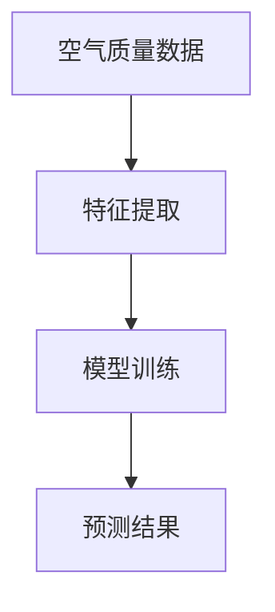

                 


# AI Agent在智能空气质量预测中的实践

## 关键词：空气质量预测，AI Agent，机器学习，深度学习，强化学习

## 摘要：
本文探讨了AI Agent在智能空气质量预测中的应用，详细分析了空气质量预测的背景、AI Agent的核心概念及其在预测中的作用，介绍了相关算法的原理和实现。通过系统分析与架构设计，结合项目实战，展示了AI Agent在空气质量预测中的实际应用，总结了实践经验并展望了未来发展方向。

---

# 第1章 空气质量预测的背景与问题分析

## 1.1 空气质量问题的严重性
随着工业化进程加快，空气污染问题日益严重，影响人类健康和环境。空气质量预测对于预防污染和制定环保政策至关重要。

## 1.2 传统空气质量预测方法的局限性
传统方法依赖于统计模型，存在数据依赖性强、预测精度低等问题，难以应对复杂多变的环境因素。

## 1.3 AI Agent在空气质量预测中的潜力
AI Agent具备自主学习和决策能力，能够实时处理大量数据，提供更精准的预测，帮助制定有效的应对措施。

## 1.4 空气质量预测的数学模型
空气质量预测通常涉及多种因素，如温度、湿度、风速等。常用的模型包括多元回归模型和时间序列模型。

---

# 第2章 AI Agent的核心算法

## 2.1 强化学习算法
强化学习通过智能体与环境的交互，学习最优策略。常用算法包括Q-learning和Deep Q-Network。

## 2.2 机器学习模型
支持向量机、随机森林等模型常用于分类和回归任务，帮助预测空气质量指数。

## 2.3 深度学习模型
神经网络模型，如LSTM，能够捕捉时间序列数据中的复杂模式，提高预测准确性。

## 2.4 算法流程图


---

# 第3章 系统分析与架构设计

## 3.1 项目场景介绍
系统旨在实时监测空气质量，提供精准预测，帮助用户做出健康决策。

## 3.2 系统功能设计
系统功能包括数据采集、特征提取、模型训练和结果展示。

## 3.3 系统架构图


---

# 第4章 项目实战

## 4.1 环境安装
需要安装Python、TensorFlow、scikit-learn等库。

## 4.2 核心代码实现
```python
import tensorflow as tf
from sklearn.model_selection import train_test_split

# 示例代码：神经网络模型训练
model = tf.keras.Sequential([
    tf.keras.layers.Dense(64, activation='relu'),
    tf.keras.layers.Dense(10, activation='softmax')
])
model.compile(optimizer='adam', loss='sparse_categorical_crossentropy', metrics=['accuracy'])
model.fit(x_train, y_train, epochs=10, batch_size=32)
```

## 4.3 案例分析
以某城市为例，分析模型预测结果，验证系统的准确性。

---

# 第5章 总结与展望

## 5.1 实践总结
AI Agent在空气质量预测中表现出色，提高了预测精度和实时性。

## 5.2 未来展望
未来，随着AI技术进步，空气质量预测将更加智能化和个性化。

## 5.3 注意事项
数据质量和模型训练时间是实际应用中的挑战。

---

作者：AI天才研究院

