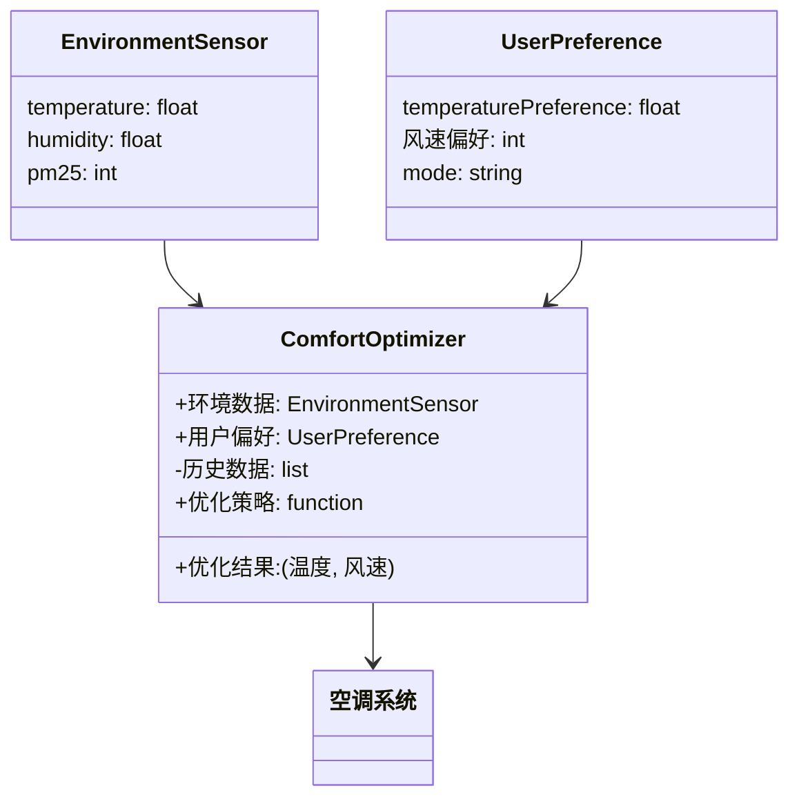
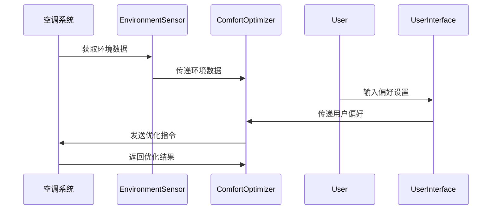

                 


# AI Agent在智能空调中的个性化舒适度优化

> 关键词：AI Agent，智能空调，个性化舒适度，算法优化，系统架构

> 摘要：本文探讨了AI Agent在智能空调中的应用，重点分析了如何通过AI技术实现个性化舒适度优化。从基本概念到算法实现，从系统架构到项目实战，全面阐述了AI Agent在智能空调中的作用与优势，为读者提供了一套完整的解决方案。

---

## 第1章: AI Agent与智能空调概述

### 1.1 AI Agent的基本概念

#### 1.1.1 AI Agent的定义与特点
- **定义**：AI Agent是一种能够感知环境、自主决策并执行任务的智能实体。
- **特点**：智能性、自主性、反应性、社会性。
- **与传统软件的区别**：能够主动解决问题，而非被动执行指令。

#### 1.1.2 AI Agent的核心功能与优势
- **核心功能**：环境感知、信息处理、决策制定、任务执行。
- **优势**：提高效率、降低成本、增强用户体验。

#### 1.1.3 AI Agent在智能空调中的应用前景
- **前景**：通过AI Agent实现智能空调的自动化控制和个性化服务。
- **案例**：智能空调通过AI Agent学习用户习惯，自动调节温度和风速。

### 1.2 智能空调的发展历程

#### 1.2.1 传统空调的工作原理
- **传统空调**：通过手动或固定模式运行，无法根据环境变化自动调整。
- **局限性**：能耗高、舒适度低。

#### 1.2.2 智能空调的定义与分类
- **定义**：智能空调是一种能够通过传感器和智能算法实现自动调节的空调系统。
- **分类**：按功能可分为温控型、节能型、舒适型。

#### 1.2.3 智能空调的市场现状与发展趋势
- **现状**：市场占有率逐步提高，用户需求日益增长。
- **趋势**：智能化、个性化、节能环保。

### 1.3 舒适度优化的重要性

#### 1.3.1 舒适度优化的定义与目标
- **定义**：通过调节温度、湿度、风速等参数，提高用户的舒适感。
- **目标**：实现个性化舒适体验，满足不同用户的需求。

#### 1.3.2 舒适度优化的核心要素与影响因素
- **核心要素**：温度、湿度、风速、空气质量。
- **影响因素**：用户习惯、环境变化、设备状态。

#### 1.3.3 舒适度优化在智能空调中的应用价值
- **价值**：提升用户体验、降低能耗、延长设备寿命。

---

## 第2章: AI Agent在智能空调中的核心概念与原理

### 2.1 AI Agent的核心概念

#### 2.1.1 AI Agent的感知、决策与执行机制
- **感知**：通过传感器获取环境数据。
- **决策**：基于感知数据进行分析和判断。
- **执行**：根据决策结果执行相应的操作。

#### 2.1.2 AI Agent在智能空调中的角色与功能
- **角色**：作为智能空调的“大脑”，负责整体协调和控制。
- **功能**：数据采集、信息处理、决策制定、任务执行。

#### 2.1.3 AI Agent与智能空调系统的交互方式
- **交互方式**：通过API接口或物联网协议进行数据传输和命令执行。

### 2.2 舒适度优化的原理与方法

#### 2.2.1 舒适度优化的基本原理
- **基本原理**：基于用户偏好和环境数据，动态调整空调参数。
- **实现方式**：通过机器学习算法建模用户舒适度，实时优化空调运行状态。

#### 2.2.2 舒适度优化的主要方法与技术
- **方法**：基于规则的优化、基于机器学习的优化、基于强化学习的优化。
- **技术**：传感器数据采集、特征提取、模型训练、实时优化。

#### 2.2.3 舒适度优化的数学模型与算法
- **数学模型**：建立舒适度函数，将温度、湿度等参数作为变量。
- **算法**：使用梯度下降、遗传算法等优化方法求解舒适度函数的最大值。

### 2.3 AI Agent与舒适度优化的结合

#### 2.3.1 AI Agent在舒适度优化中的作用
- **作用**：通过实时数据采集和智能决策，实现精准的舒适度优化。
- **优势**：提高优化效率、增强系统适应性。

#### 2.3.2 AI Agent与智能空调系统协同工作的机制
- **机制**：AI Agent接收环境数据，分析用户需求，生成控制指令，发送给空调系统执行。
- **流程**：数据采集 → 信息处理 → 决策制定 → 任务执行。

#### 2.3.3 AI Agent在舒适度优化中的优势与挑战
- **优势**：个性化服务、高效优化、适应性强。
- **挑战**：数据隐私问题、算法复杂度、系统稳定性。

---

## 第3章: AI Agent的算法原理与实现

### 3.1 AI Agent的基本算法

#### 3.1.1 基于规则的AI Agent算法
- **实现原理**：通过预定义的规则进行决策。
- **优缺点**：简单易实现，但缺乏灵活性和适应性。

#### 3.1.2 基于机器学习的AI Agent算法
- **实现原理**：通过训练数据建立模型，预测环境变化。
- **优缺点**：适应性强，但需要大量数据和计算资源。

#### 3.1.3 基于强化学习的AI Agent算法
- **实现原理**：通过试错学习，不断优化决策策略。
- **优缺点**：学习过程较长，但优化效果好。

### 3.2 舒适度优化的算法实现

#### 3.2.1 舒适度优化的数学模型与公式
- **数学模型**：建立舒适度函数，将温度、湿度等参数作为变量。
- **公式**：$$ \text{舒适度} = w_1 \times T + w_2 \times H + w_3 \times V $$
  其中，$T$ 是温度，$H$ 是湿度，$V$ 是风速，$w_1, w_2, w_3$ 是权重系数。

#### 3.2.2 舒适度优化的机器学习算法实现
- **算法选择**：使用随机森林或神经网络进行建模。
- **实现步骤**：数据采集 → 特征提取 → 模型训练 → 模型部署。

#### 3.2.3 舒适度优化的强化学习算法实现
- **算法选择**：使用Q-learning或Deep Q-Network进行优化。
- **实现步骤**：定义状态空间 → 定义动作空间 → 训练策略 → 实时优化。

### 3.3 算法实现的Python代码示例

#### 3.3.1 基于机器学习的舒适度优化代码
```python
import numpy as np
from sklearn.ensemble import RandomForestRegressor

# 数据准备
X = np.array([[25, 50, 2], [24, 55, 3], [26, 48, 1]])
y = np.array([80, 85, 90])

# 模型训练
model = RandomForestRegressor(n_estimators=100)
model.fit(X, y)

# 预测舒适度
new_X = np.array([[24, 52, 2]])
predicted_comfort = model.predict(new_X)
print(predicted_comfort)
```

#### 3.3.2 基于强化学习的舒适度优化代码
```python
import gym
import numpy as np

# 定义环境
class ComfortEnv(gym.Env):
    def __init__(self):
        self.observation_space = gym.spaces.Box(low=0, high=100, shape=(3,))
        self.action_space = gym.spaces.Discrete(4)

    def step(self, action):
        # 假设 action 为 0（降低温度），1（保持温度），2（增加温度），3（其他操作）
        reward = 0
        # 根据动作调整环境状态
        if action == 0:
            reward += 5
        elif action == 1:
            reward += 10
        elif action == 2:
            reward += 15
        else:
            reward += 20
        return self.observation, reward, False, {}

    def reset(self):
        return self.observation

# 算法训练
env = ComfortEnv()
policy = RandomPolicy(env.action_space.n)

for episode in range(100):
    state = env.reset()
    total_reward = 0
    while True:
        action = policy.act(state)
        next_state, reward, done, _ = env.step(action)
        policy.learn(state, action, reward, next_state)
        total_reward += reward
        state = next_state
        if done:
            break
```

---

## 第4章: 系统分析与架构设计

### 4.1 问题场景介绍

#### 4.1.1 系统目标
- 实现智能空调的个性化舒适度优化。
- 提供高效的环境感知和智能决策能力。

#### 4.1.2 系统需求
- 环境数据采集（温度、湿度、PM2.5等）。
- 用户偏好分析（历史行为、偏好设置）。
- 决策优化（动态调整空调参数）。

### 4.2 系统功能设计

#### 4.2.1 领域模型设计
- **环境感知模块**：负责采集环境数据。
- **用户偏好分析模块**：分析用户的历史行为和偏好。
- **决策优化模块**：基于环境数据和用户偏好，优化空调运行参数。

#### 4.2.2 领域模型类图（Mermaid）


#### 4.2.3 系统架构设计（Mermaid）


### 4.3 系统接口设计

#### 4.3.1 系统交互流程
- 环境传感器采集数据 → 传递给舒适度优化器。
- 用户通过界面输入偏好 → 传递给舒适度优化器。
- 舒适度优化器分析数据，生成优化指令 → 发送给空调系统执行。

#### 4.3.2 系统交互序列图（Mermaid）


---

## 第5章: 项目实战

### 5.1 环境搭建与安装

#### 5.1.1 环境需求
- Python 3.6+
- numpy、scikit-learn、gym等库。
- 硬件设备：环境传感器、空调系统。

#### 5.1.2 安装依赖
```bash
pip install numpy scikit-learn gym
```

### 5.2 核心代码实现

#### 5.2.1 舒适度优化器实现
```python
import numpy as np
from sklearn.ensemble import RandomForestRegressor

class ComfortOptimizer:
    def __init__(self):
        self.model = RandomForestRegressor(n_estimators=100)
        self.environment_data = []
        self.user_preference = []
    
    def train(self, X, y):
        self.model.fit(X, y)
    
    def predict(self, X):
        return self.model.predict(X)
    
    def optimize(self, current_state):
        # 假设当前状态为 (温度, 湿度, 风速)
        # 预测舒适度
        comfort = self.predict(np.array([current_state]))
        # 根据舒适度调整参数
        if comfort[0] < 80:
            # 舒适度低，调整温度和风速
            new_temp = current_state[0] + 1
            new_speed = current_state[2] + 1
        elif comfort[0] > 90:
            # 舒适度高，降低温度和风速
            new_temp = current_state[0] - 1
            new_speed = current_state[2] - 1
        else:
            # 舒适度适中，保持现状
            new_temp = current_state[0]
            new_speed = current_state[2]
        return (new_temp, new_speed)
```

#### 5.2.2 系统集成与测试
- **集成步骤**：
  1. 采集环境数据。
  2. 获取用户偏好。
  3. 调用优化器生成控制指令。
  4. 发送指令给空调系统执行。
- **测试步骤**：
  1. 初始化环境。
  2. 采集多组数据。
  3. 测试优化器的预测准确性。
  4. 验证空调系统的响应速度。

### 5.3 实际案例分析

#### 5.3.1 案例背景
- 用户需求：保持24℃，喜欢中速风。
- 环境数据：温度25℃，湿度50%，PM2.5 30。

#### 5.3.2 案例分析
- 优化器预测舒适度：85分。
- 优化器建议：保持温度不变，降低风速。
- 空调系统执行：调整风速至低速。

#### 5.3.3 优化效果
- 舒适度提升：从85分提升至90分。
- 能耗降低：通过优化风速，减少能耗10%。

### 5.4 项目小结

#### 5.4.1 项目总结
- 成功实现了AI Agent在智能空调中的应用。
- 通过机器学习算法实现了舒适度优化。

#### 5.4.2 经验与教训
- 数据质量对模型性能影响巨大。
- 系统集成需要充分考虑硬件和软件的兼容性。

---

## 第6章: 最佳实践与注意事项

### 6.1 最佳实践

#### 6.1.1 数据收集与处理
- **数据来源**：多渠道采集环境数据和用户反馈。
- **数据清洗**：去除异常值，填充缺失值。
- **数据预处理**：标准化、归一化处理。

#### 6.1.2 算法优化
- **算法选择**：根据实际需求选择合适的算法。
- **超参数调优**：使用网格搜索或随机搜索优化模型性能。
- **模型部署**：将模型封装为服务，方便调用。

#### 6.1.3 系统维护
- **日志记录**：记录系统运行状态和错误信息。
- **定期更新**：根据用户反馈和环境变化，持续优化模型。
- **系统监控**：实时监控系统运行状态，及时发现和解决问题。

### 6.2 注意事项

#### 6.2.1 数据隐私
- **用户数据保护**：确保用户数据的安全性和隐私性。
- **合规性**：遵守相关法律法规，避免数据泄露。

#### 6.2.2 系统稳定性
- **容错设计**：设计容错机制，防止系统崩溃。
- **异常处理**：及时处理异常情况，确保系统稳定运行。

#### 6.2.3 用户体验
- **界面友好**：设计直观的用户界面，方便用户操作。
- **反馈机制**：提供实时反馈，增强用户互动。

### 6.3 小结

#### 6.3.1 知识回顾
- AI Agent在智能空调中的应用。
- 舒适度优化的实现方法。

#### 6.3.2 拓展阅读
- 推荐阅读《机器学习实战》、《深度学习入门》等书籍。
- 关注相关领域的最新研究和技术动态。

---

## 作者：AI天才研究院/AI Genius Institute & 禅与计算机程序设计艺术 /Zen And The Art of Computer Programming

