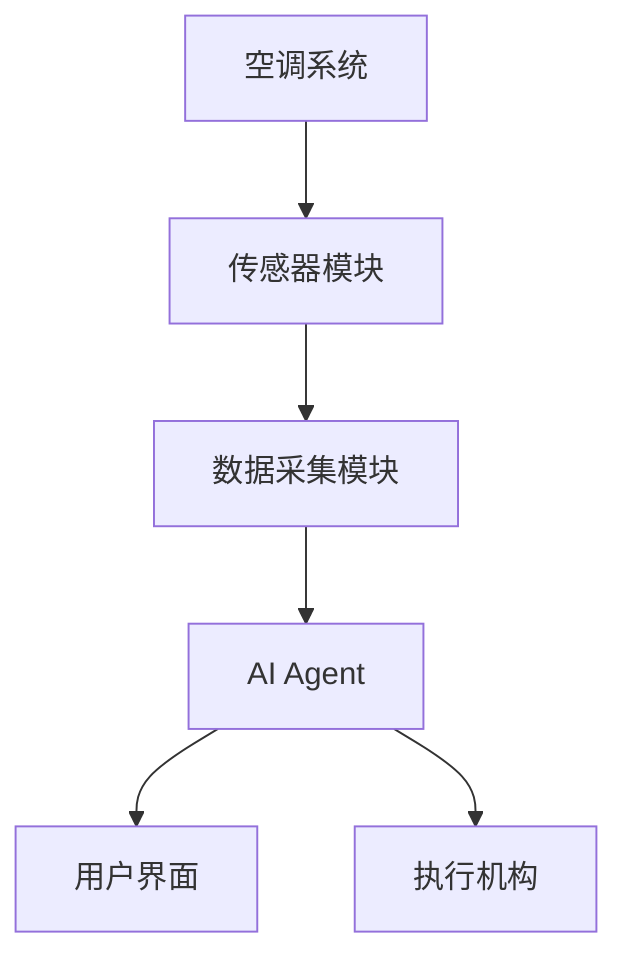
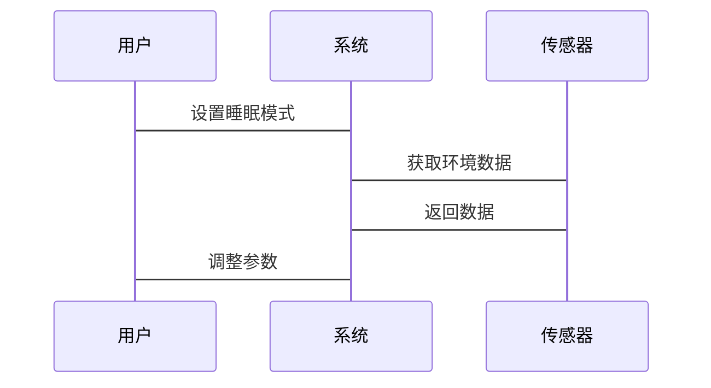

                 


# AI Agent在智能空调中的睡眠模式优化

> **关键词：** AI Agent, 智能空调, 睡眠模式, 优化算法, 系统架构

> **摘要：**  
本文探讨了AI Agent在智能空调中的睡眠模式优化应用，从背景、原理到系统设计和项目实现，详细分析了如何通过AI技术提升睡眠舒适度。文章结合理论与实践，为智能空调的优化提供新思路。

---

## 第1章: 背景与问题背景

### 1.1 AI Agent与智能空调的背景

#### 1.1.1 AI Agent的基本概念
AI Agent（智能体）是能够感知环境并采取行动以实现目标的实体。在空调系统中，AI Agent通过传感器数据优化运行策略，提升用户体验。

#### 1.1.2 智能空调的发展历程
从传统空调到智能空调，经历了联网化、数据化和智能化的演变，AI Agent的应用成为智能空调的核心技术。

#### 1.1.3 睡眠模式优化的必要性
睡眠质量受环境影响，AI Agent通过优化温湿度、空气质量和噪音，提升睡眠舒适度。

### 1.2 睡眠模式优化的核心问题

#### 1.2.1 睡眠质量的影响因素
温度、湿度、空气质量、噪音和光线影响睡眠。AI Agent需实时监测并调整环境参数。

#### 1.2.2 空调环境对睡眠的影响
传统空调固定模式难以适应个人需求，AI Agent通过动态调整提供个性化舒适环境。

#### 1.2.3 优化目标与挑战
优化目标是提高睡眠质量，挑战包括数据采集、算法设计和系统集成。

---

## 第2章: AI Agent的核心概念与原理

### 2.1 AI Agent的基本原理

#### 2.1.1 定义与特点
AI Agent具备感知、决策和执行能力，能动态调整空调运行策略。

#### 2.1.2 AI Agent的分类
分为基于规则和基于学习的Agent，后者通过机器学习优化策略。

#### 2.1.3 AI Agent在空调中的应用
通过传感器数据和用户反馈，AI Agent实时优化空调运行参数。

### 2.2 AI Agent与智能空调的结合

#### 2.2.1 传感器数据采集
AI Agent通过温湿度、PM2.5和CO2传感器获取环境数据。

#### 2.2.2 用户行为分析
分析用户的使用习惯，个性化调整睡眠模式。

#### 2.2.3 环境感知与反馈
AI Agent根据环境变化和用户反馈调整运行策略。

---

## 第3章: AI Agent优化睡眠模式的算法原理

### 3.1 睡眠优化算法概述

#### 3.1.1 基于机器学习的算法
使用回归和分类模型预测最优参数。

#### 3.1.2 强化学习的应用
通过奖励机制优化决策过程。

#### 3.1.3 算法选择与比较
对比监督学习和强化学习的优劣，选择最适合的应用场景。

### 3.2 算法实现细节

#### 3.2.1 数据预处理
处理传感器数据，提取特征变量。

#### 3.2.2 模型训练
使用训练数据优化模型参数。

#### 3.2.3 模型评估与优化
通过测试数据评估模型性能，调整参数提升准确率。

---

## 第4章: 系统分析与架构设计

### 4.1 系统架构概述

#### 4.1.1 系统组成模块
包括数据采集、AI Agent、用户界面和执行机构。

#### 4.1.2 各模块功能描述
数据采集获取环境数据，AI Agent分析并发出指令，用户界面显示状态，执行机构调整参数。

#### 4.1.3 系统整体架构图
使用Mermaid绘制系统架构图：



### 4.2 系统接口与交互设计

#### 4.2.1 数据接口规范
定义传感器数据格式和通信协议。

#### 4.2.2 用户界面设计
设计直观的界面，显示环境数据和运行状态。

#### 4.2.3 系统交互流程
使用Mermaid绘制交互流程图：



---

## 第5章: 项目实战与实现

### 5.1 环境搭建与工具安装

#### 5.1.1 开发环境配置
安装Python、TensorFlow和传感器API。

#### 5.1.2 工具链安装
安装Jupyter Notebook和数据可视化工具。

#### 5.1.3 数据集准备
收集温湿度、PM2.5和CO2数据。

### 5.2 核心代码实现

#### 5.2.1 数据采集模块
代码读取传感器数据：

```python
import serial

ser = serial.Serial('COM3', 9600)
data = ser.readline().decode().strip()
```

#### 5.2.2 算法实现模块
使用机器学习模型优化参数：

```python
import numpy as np
from sklearn.linear_model import LinearRegression

# 训练模型
model = LinearRegression()
model.fit(X_train, y_train)

# 预测最优温度
predicted_temp = model.predict(X_test)
```

#### 5.2.3 系统集成模块
将各模块整合，实现AI Agent控制：

```python
class AI-Agent:
    def __init__(self):
        self.model = LinearRegression()
        self.model.fit(X_train, y_train)

    def optimize(self, data):
        return self.model.predict(data)
```

---

## 第6章: 系统测试与优化

### 6.1 测试方案设计

#### 6.1.1 测试用例设计
设计不同环境下的测试用例。

#### 6.1.2 测试环境搭建
配置测试设备和环境。

#### 6.1.3 测试结果分析
分析模型准确率和系统稳定性。

### 6.2 系统优化与改进

#### 6.2.1 性能优化
优化算法提升计算速度。

#### 6.2.2 功能改进
增加更多环境参数监测。

#### 6.2.3 稳定性提升
改进系统抗干扰能力。

---

## 第7章: 总结与展望

### 7.1 项目总结

#### 7.1.1 核心成果
成功实现AI Agent优化睡眠模式，提升舒适度。

#### 7.1.2 经验与教训
数据质量对模型影响大，需加强数据预处理。

#### 7.1.3 未来展望
探索更复杂的算法和更多应用场景。

### 7.2 最佳实践与注意事项

#### 7.2.1 开发规范
遵循行业标准，确保代码可维护性。

#### 7.2.2 问题排查
定期检查系统运行状态，及时解决故障。

#### 7.2.3 安全注意事项
确保数据安全，防止信息泄露。

### 7.3 拓展阅读与学习资源

#### 7.3.1 推荐书籍
- 《机器学习实战》
- 《深度学习入门》

#### 7.3.2 在线课程
- Coursera: 《机器学习基础》
- edX: 《人工智能入门》

#### 7.3.3 开源项目
- GitHub: 开源AI Agent项目

---

## 附录: AI Agent优化睡眠模式的数学模型与公式

### 3.1.1 机器学习模型的损失函数
$$ L = \frac{1}{2m} \sum_{i=1}^{m} (y_i - \hat{y_i})^2 $$

### 3.1.2 强化学习的奖励机制
$$ R = r_1 + r_2 + \dots + r_n $$

---

作者：AI天才研究院 & 禅与计算机程序设计艺术

---

这篇文章通过系统化的分析，详细讲解了AI Agent在智能空调中的应用，从理论到实践，为读者提供了全面的视角。希望对您有所帮助！

