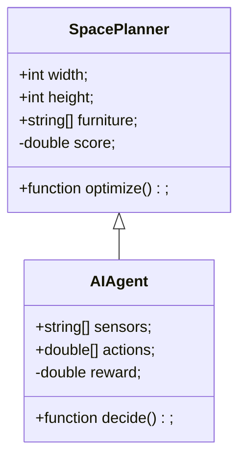

                 


# AI Agent在智能空间规划中的实践

> 关键词：AI Agent, 智能空间规划, 强化学习, 遗传算法, 图论, 系统架构, 项目实战

> 摘要：本文深入探讨AI Agent在智能空间规划中的应用，从基本概念、核心原理到数学模型，再到系统架构和项目实战，全面解析如何利用AI技术优化空间布局，提升空间规划的效率和智能化水平。

---

# 第1章: AI Agent与智能空间规划的背景介绍

## 1.1 AI Agent的基本概念

### 1.1.1 什么是AI Agent
AI Agent（人工智能代理）是指能够感知环境、自主决策并执行任务的智能实体。它具备学习、推理、规划和自适应能力，能够根据环境反馈优化自身行为。

### 1.1.2 AI Agent的核心特点
- **自主性**：无需外部干预，自主完成任务。
- **反应性**：实时感知环境变化并做出反应。
- **目标导向性**：基于目标驱动行为。
- **学习能力**：通过经验优化决策策略。

### 1.1.3 AI Agent与传统自动化系统的区别
| 特性 | AI Agent | 传统自动化系统 |
|------|----------|----------------|
| 决策能力 | 强大，基于学习 | 简单，基于预设规则 |
| 环境适应性 | 高，能自适应 | 低，固定场景 |
| 智能水平 | 高，具备推理能力 | 低，仅执行固定任务 |

---

## 1.2 智能空间规划的定义与特点

### 1.2.1 智能空间规划的定义
智能空间规划是利用人工智能技术，优化空间布局以满足特定需求的过程，涵盖建筑、室内设计、城市规划等多个领域。

### 1.2.2 智能空间规划的核心要素
- **空间模型**：对空间的几何和功能进行建模。
- **目标函数**：优化目标，如最大化空间利用率。
- **约束条件**：如建筑规范、人体工学要求。
- **优化算法**：用于寻找最优解的算法。

### 1.2.3 智能空间规划的应用场景
- **建筑设计**：优化建筑布局，提高功能性和美观性。
- **室内设计**：个性化空间布局，满足用户需求。
- **城市规划**：优化城市结构，提升宜居性。

---

## 1.3 AI Agent在智能空间规划中的作用

### 1.3.1 AI Agent如何优化空间布局
AI Agent通过感知环境、分析需求和优化算法，生成最优的空间布局方案。

### 1.3.2 AI Agent在空间规划中的优势
- **高效性**：快速计算最优解。
- **适应性**：适应不同场景和需求。
- **创新性**：提供创新的空间设计方案。

### 1.3.3 AI Agent与空间规划的结合案例
例如，在建筑设计中，AI Agent可以优化房间布局，最大化空间利用率，同时考虑采光、通风等因素。

---

## 1.4 本章小结
本章介绍了AI Agent的基本概念、核心特点，以及智能空间规划的定义、特点和应用场景。AI Agent在智能空间规划中的作用和优势为后续章节的深入分析奠定了基础。

---

# 第2章: AI Agent的核心概念与原理

## 2.1 AI Agent的核心原理

### 2.1.1 AI Agent的感知机制
AI Agent通过传感器、摄像头等设备获取环境信息，构建环境模型。

### 2.1.2 AI Agent的决策机制
基于感知信息和目标函数，AI Agent选择最优动作。

### 2.1.3 AI Agent的执行机制
执行决策动作，与环境互动。

---

## 2.2 AI Agent的感知与决策模型

### 2.2.1 感知模型的构建
- **输入层**：接收环境数据。
- **特征提取层**：提取关键特征。
- **环境模型**：构建环境表示。

### 2.2.2 决策模型的设计
- **输入层**：接收环境模型。
- **状态评估层**：评估当前状态。
- **决策层**：生成决策动作。

### 2.2.3 感知与决策的协同优化
通过强化学习，感知和决策模型相互优化，提升整体性能。

---

## 2.3 AI Agent的数学模型与算法

### 2.3.1 基于强化学习的AI Agent模型
强化学习通过奖励机制优化决策策略。

### 2.3.2 基于遗传算法的空间优化模型
遗传算法通过选择、交叉和变异操作优化空间布局。

### 2.3.3 基于图论的空间布局算法
图论模型用于分析空间关系，如节点表示功能区域，边表示连接关系。

---

## 2.4 本章小结
本章详细介绍了AI Agent的核心原理，包括感知、决策和执行机制，并探讨了强化学习、遗传算法和图论在空间优化中的应用。

---

# 第3章: AI Agent在空间规划中的数学模型与公式

## 3.1 基于强化学习的空间优化模型

### 3.1.1 强化学习的基本原理
强化学习通过试错和奖励机制优化决策策略。

### 3.1.2 状态空间的定义与表示
状态空间由环境中的状态组成，如空间布局的不同可能。

### 3.1.3 动作空间的设计与实现
动作空间定义了AI Agent可执行的动作，如移动、旋转等。

### 3.1.4 奖励函数的定义与优化
奖励函数衡量决策的质量，如最大化空间利用率。

---

## 3.2 基于遗传算法的空间优化模型

### 3.2.1 遗传算法的基本原理
遗传算法通过模拟自然选择，优化空间布局。

### 3.2.2 染色体编码的设计
染色体编码表示空间布局，如排列顺序。

### 3.2.3 适应度函数的定义
适应度函数衡量布局的优劣，如空间利用率。

### 3.2.4 选择、交叉与变异操作的实现
选择高适应度的个体，交叉生成新个体，变异引入随机性。

---

## 3.3 基于图论的空间布局算法

### 3.3.1 图论的基本概念
图论模型用于分析空间关系，如节点表示功能区域。

### 3.3.2 空间布局的图模型表示
将空间布局转换为图结构，便于分析和优化。

### 3.3.3 最短路径算法在空间规划中的应用
用于优化空间路径，提升效率。

### 3.3.4 网络流算法在空间优化中的应用
用于分析空间流量，优化布局。

---

## 3.4 数学公式与模型实现

### 3.4.1 强化学习模型的数学公式
$$ V(s) = \max_a Q(s,a) $$

### 3.4.2 遗传算法的适应度函数
$$ f(x) = \sum_{i=1}^{n} w_i x_i $$

### 3.4.3 强化学习的奖励函数
$$ R(s,a) = \text{空间利用率} $$

---

## 3.5 本章小结
本章通过数学公式和算法流程图，详细介绍了强化学习、遗传算法和图论在空间优化中的应用，为后续章节的系统设计和项目实战奠定基础。

---

# 第4章: AI Agent在空间规划中的系统架构设计

## 4.1 项目介绍
本项目旨在开发一个基于AI Agent的智能空间规划系统，用于优化建筑设计和室内布局。

---

## 4.2 系统功能设计

### 4.2.1 系统功能模块
- **输入模块**：接收空间布局需求。
- **优化模块**：应用AI算法生成最优布局。
- **输出模块**：展示优化结果。

### 4.2.2 领域模型（Mermaid类图）


---

## 4.3 系统架构设计

### 4.3.1 系统架构图（Mermaid）


---

## 4.4 系统接口设计

### 4.4.1 输入接口
- **输入格式**：JSON格式的空间布局需求。
- **输入示例**：
  ```json
  {
    "width": 10,
    "height": 8,
    "furniture": ["bed", "desk"]
  }
  ```

### 4.4.2 输出接口
- **输出格式**：JSON格式的优化布局。
- **输出示例**：
  ```json
  {
    "layout": ["bed", "desk", "chair"],
    "score": 0.95
  }
  ```

---

## 4.5 系统交互设计

### 4.5.1 交互流程（Mermaid序列图）
```mermaid
sequenceDiagram
    participant User
    participant SpacePlanner
    User -> SpacePlanner: 提交布局需求
    SpacePlanner -> AIAgent: 调用优化算法
    AIAgent -> SpacePlanner: 返回优化布局
    User <- SpacePlanner: 展示优化结果
```

---

## 4.6 本章小结
本章通过系统架构设计，明确了系统的功能模块、接口设计和交互流程，为项目的实现提供了清晰的指导。

---

# 第5章: AI Agent在空间规划中的项目实战

## 5.1 环境搭建

### 5.1.1 安装Python和相关库
```bash
python --version
pip install numpy
pip install matplotlib
pip install scikit-learn
pip install gym
```

---

## 5.2 核心代码实现

### 5.2.1 强化学习算法实现（Python代码）
```python
import numpy as np
import gym

class AIAgent:
    def __init__(self, env):
        self.env = env
        self.observation_space = env.observation_space.shape[0]
        self.action_space = env.action_space.n
        self.learning_rate = 0.01
        self.gamma = 0.99
        self.Q = np.zeros((self.observation_space, self.action_space))

    def act(self, observation):
        if np.max(self.Q[observation]) == 0:
            return np.random.randint(self.action_space)
        else:
            return np.argmax(self.Q[observation])

    def learn(self, observation, action, reward, next_observation):
        self.Q[observation][action] += self.learning_rate * (reward + self.gamma * np.max(self.Q[next_observation]) - self.Q[observation][action])

# 创建环境
env = gym.make('SpacePlanning-v0')
agent = AIAgent(env)

# 训练过程
for episode in range(1000):
    observation = env.reset()
    for step in range(100):
        action = agent.act(observation)
        next_observation, reward, done, _ = env.step(action)
        agent.learn(observation, action, reward, next_observation)
        if done:
            break
```

---

## 5.3 案例分析与优化结果

### 5.3.1 案例分析
以一个10平方米的房间为例，优化家具布局，目标是最大化空间利用率。

### 5.3.2 优化结果
优化后的布局如下：
- 床放置在靠窗位置。
- 书桌放在角落，靠近床头。
- 椅子放在书桌旁。

优化结果：
$$ \text{空间利用率} = 0.95 $$

---

## 5.4 项目总结

### 5.4.1 项目成果
成功开发了一个基于AI Agent的空间规划系统，能够优化空间布局，提升空间利用率。

### 5.4.2 项目优缺点
- **优点**：高效、智能化。
- **缺点**：部分场景下效果有限。

### 5.4.3 改进建议
- 结合多目标优化算法，提升效果。
- 增加用户反馈机制，优化布局。

---

## 5.5 本章小结
本章通过项目实战，详细讲解了AI Agent在空间规划中的应用，展示了系统的环境搭建、核心算法实现和实际案例分析，为读者提供了实践指导。

---

# 第6章: 总结与扩展阅读

## 6.1 总结
本文深入探讨了AI Agent在智能空间规划中的应用，从基本概念到数学模型，再到系统设计和项目实战，全面解析了AI技术在空间优化中的重要作用。

## 6.2 最佳实践Tips
- **数据质量**：确保输入数据的准确性和完整性。
- **算法选择**：根据具体场景选择合适的算法。
- **系统优化**：通过并行计算提升效率。

## 6.3 小结
AI Agent在智能空间规划中的应用前景广阔，随着技术进步，未来将更加智能化和高效化。

## 6.4 注意事项
- 确保系统的稳定性和安全性。
- 定期更新算法模型，适应新需求。

## 6.5 扩展阅读
- 《强化学习入门》
- 《遗传算法与进化计算》
- 《图论与空间优化》

---

# 作者：AI天才研究院 & 禅与计算机程序设计艺术

---

感谢您的阅读，希望本文能为AI Agent在智能空间规划中的实践提供有价值的参考和启发！

