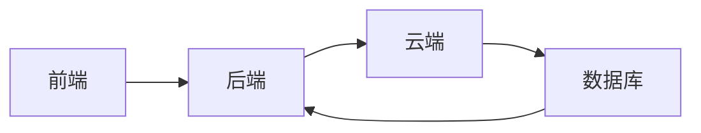

                 


---

# AI Agent在智能穿戴设备中的应用：健康监测与生活助手

**关键词**：AI Agent，智能穿戴设备，健康监测，生活助手，算法原理

**摘要**：  
本文详细探讨了AI Agent在智能穿戴设备中的应用，特别是在健康监测与生活辅助领域。文章从背景介绍、核心概念、算法原理、系统架构设计、项目实战到最佳实践等方面展开，深入分析了AI Agent在智能穿戴设备中的技术实现与应用价值。通过理论与实践结合的方式，为读者提供了一套完整的解决方案，帮助他们更好地理解和应用AI Agent技术。

---

## 第1章: 背景介绍

### 1.1 问题背景  
智能穿戴设备近年来发展迅速，已成为人们生活中不可或缺的一部分。这些设备通过传感器收集用户的身体数据（如心率、体温、运动数据等），并将数据传输到云端进行分析。然而，如何高效地利用这些数据，提供个性化的健康建议和生活辅助服务，成为当前智能穿戴设备领域的重要课题。AI Agent作为一种智能代理技术，能够实时分析数据并提供决策支持，为智能穿戴设备的用户体验带来了质的飞跃。

### 1.2 核心概念与问题描述  
AI Agent是一种能够感知环境、自主决策并执行任务的智能系统。在智能穿戴设备中，AI Agent的核心任务包括数据处理、健康监测和生活辅助。例如，AI Agent可以通过分析心率数据预测用户的情绪状态，或者根据用户的运动数据推荐个性化的锻炼计划。

### 1.3 技术发展与应用现状  
随着深度学习和边缘计算技术的进步，AI Agent在智能穿戴设备中的应用逐渐从云端转移到设备端。这种边缘计算的模式不仅提高了数据处理的实时性，还降低了对网络的依赖，进一步提升了用户体验。

---

## 第2章: AI Agent的核心概念与功能

### 2.1 AI Agent的定义与类型  
AI Agent是一种智能代理，能够通过传感器数据感知环境，并根据预设的目标进行决策和行动。根据功能的不同，AI Agent可以分为以下几种类型：

| 类型       | 功能描述                     | 应用场景                   |
|------------|------------------------------|---------------------------|
| 监测型AI Agent | 实时监测用户生理数据       | 健康监测、疾病预警         |
| 辅助型AI Agent | 提供生活建议和决策支持     | 日程管理、健康建议         |
| 交互型AI Agent | 与用户进行自然语言交互     | 聊天、信息查询             |

### 2.2 AI Agent的核心功能  
AI Agent在智能穿戴设备中的核心功能包括数据采集、数据分析和决策执行。例如，AI Agent可以实时采集用户的运动数据，并通过机器学习模型预测用户的运动状态，从而推荐适合的锻炼计划。

### 2.3 AI Agent与智能穿戴设备的交互  
AI Agent通过传感器获取数据，并与设备进行实时交互。例如，当检测到用户的心率异常时，AI Agent会触发预警机制，并通过语音或消息通知用户。

---

## 第3章: AI Agent的算法原理

### 3.1 基于强化学习的AI Agent算法  
强化学习是一种通过试错机制优化决策的算法。在智能穿戴设备中，强化学习常用于动态调整用户的健康监测策略。例如，当AI Agent发现用户的运动模式发生变化时，会通过强化学习优化其运动建议。

#### 强化学习的数学模型  
强化学习的核心是通过Q-learning算法进行状态转移。状态、动作和奖励的关系可以用以下公式表示：
$$ Q(s, a) = r + \max_{a'} Q(s', a') $$  
其中，\( Q(s, a) \) 表示状态 \( s \) 下执行动作 \( a \) 的价值，\( r \) 是奖励，\( s' \) 是新状态。

#### Python实现强化学习算法  
以下是一个简单的Q-learning算法实现示例：
```python
import numpy as np

class QLearningAgent:
    def __init__(self, state_space_size, action_space_size):
        self.q_table = np.zeros((state_space_size, action_space_size))
    
    def choose_action(self, state, epsilon=0.1):
        if np.random.random() < epsilon:
            return np.random.randint(0, action_space_size)
        else:
            return np.argmax(self.q_table[state])
    
    def update_q_table(self, state, action, reward, next_state, learning_rate=0.1, gamma=0.9):
        self.q_table[state][action] = self.q_table[state][action] * (1 - learning_rate) + reward + gamma * np.max(self.q_table[next_state])
```

### 3.2 基于生成对抗网络的AI Agent算法  
生成对抗网络（GAN）是一种用于生成数据的深度学习模型。在智能穿戴设备中，GAN可以用于生成用户的健康数据，从而帮助设备更好地理解用户的行为模式。

#### GAN的数学模型  
GAN由生成器和判别器组成。生成器的目标是最优化生成的数据，使其被判别器误判为真实数据。判别器的目标是区分真实数据和生成数据。两者的损失函数如下：
$$ \text{判别器损失} = -\mathbb{E}[\log(D(x)) + \log(1 - D(G(z)))] $$
$$ \text{生成器损失} = -\mathbb{E}[\log(D(G(z)))] $$

---

## 第4章: 系统分析与架构设计

### 4.1 问题场景介绍  
假设我们正在开发一款智能手表，该手表需要实时监测用户的心率和运动数据，并根据这些数据提供健康建议。

### 4.2 系统功能设计  
系统的功能模块包括：
1. 数据采集模块：负责采集用户的心率和运动数据。
2. 数据分析模块：通过AI Agent分析数据，提供健康建议。
3. 用户交互模块：通过屏幕或语音与用户进行交互。

### 4.3 系统架构设计  
系统的架构采用分层设计，包括前端、后端和云端。前端负责用户交互，后端负责数据处理，云端负责模型训练和数据存储。

#### 系统架构图  


### 4.4 系统接口设计  
系统的接口设计包括：
1. 数据采集接口：用于获取传感器数据。
2. 用户交互接口：用于与用户进行交互。
3. 云端接口：用于与第三方服务（如天气预报）进行交互。

---

## 第5章: 项目实战

### 5.1 环境配置与安装  
为了实现AI Agent，我们需要安装以下工具：
- Python 3.8及以上版本
- TensorFlow 2.0及以上版本
- 其他依赖库（如NumPy、Pandas等）

### 5.2 核心代码实现  
以下是一个基于TensorFlow的AI Agent实现示例：
```python
import tensorflow as tf
from tensorflow.keras import layers

class AI_Agent(tf.keras.Model):
    def __init__(self, input_dim, hidden_dim, output_dim):
        super(AI_Agent, self).__init__()
        self.dense1 = layers.Dense(hidden_dim, activation='relu')
        self.dense2 = layers.Dense(output_dim, activation='softmax')
    
    def call(self, inputs):
        x = self.dense1(inputs)
        x = self.dense2(x)
        return x

# 初始化模型
input_dim = 10
hidden_dim = 16
output_dim = 5
agent = AI_Agent(input_dim, hidden_dim, output_dim)
```

### 5.3 实际案例分析  
假设我们有一个用户的心率数据集，我们可以使用上述模型对其进行分类，预测用户的情绪状态。

---

## 第6章: 最佳实践与总结

### 6.1 本章小结  
本文详细探讨了AI Agent在智能穿戴设备中的应用，从算法原理到系统架构设计，再到项目实战，为读者提供了一套完整的解决方案。

### 6.2 注意事项  
在实际应用中，需要注意数据隐私和模型的实时性问题。同时，还需要定期更新模型以适应用户行为的变化。

### 6.3 未来趋势  
随着边缘计算和物联网技术的发展，AI Agent在智能穿戴设备中的应用将更加广泛，功能也将更加智能化。

---

**作者：AI天才研究院 & 禅与计算机程序设计艺术**

