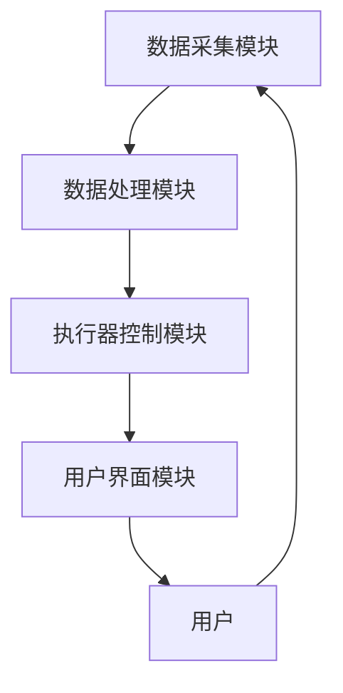

                 


# AI Agent在智能窗台中的室内植物智能照料

## 关键词：AI Agent，智能窗台，室内植物，智能照料，算法原理，系统架构，项目实战

## 摘要

本文详细探讨了AI Agent在智能窗台中的应用，特别是在室内植物照料方面。通过介绍AI Agent的基本概念、智能窗台的设计、算法原理、系统架构以及项目实战等内容，本文为读者提供了一套完整的解决方案，帮助实现室内植物的智能化管理。

---

# 第一部分: AI Agent与智能窗台的背景与概念

## 第1章: AI Agent与智能窗台概述

### 1.1 AI Agent的基本概念

#### 1.1.1 人工智能代理（AI Agent）的定义

AI Agent，即人工智能代理，是一种能够感知环境并采取行动以实现目标的智能实体。它可以是一个软件程序，也可以是一个物理设备，通过传感器和执行器与环境交互。

#### 1.1.2 AI Agent的核心特征

AI Agent具有以下核心特征：
- **自主性**：能够在没有外部干预的情况下自主运行。
- **反应性**：能够实时感知环境并做出反应。
- **目标导向**：具有明确的目标，并通过行动实现目标。
- **学习能力**：能够通过数据和经验不断优化自身的行为。

#### 1.1.3 AI Agent与传统自动化的区别

AI Agent与传统自动化的主要区别在于其智能化和自主性。传统自动化系统通常基于固定的规则运行，而AI Agent能够通过学习和推理动态调整其行为，以适应环境的变化。

---

### 1.2 智能窗台的概念与应用场景

#### 1.2.1 智能窗台的定义

智能窗台是一种集成AI技术的智能设备，用于监测和控制室内植物的生长环境，包括光照、温度、湿度、土壤 pH 值等参数。通过AI Agent的协调，智能窗台能够自动调整光照、湿度等条件，以优化植物的生长环境。

#### 1.2.2 智能窗台的主要功能

智能窗台的主要功能包括：
- **环境监测**：实时监测室内环境参数，如光照强度、温度、湿度、CO2浓度等。
- **自动调节**：根据监测数据自动调整光照、温度、湿度等条件，以优化植物的生长环境。
- **智能决策**：基于历史数据和实时数据，AI Agent能够做出最优决策，例如在光照不足时自动开启补光灯。
- **远程控制**：通过手机APP或其他远程控制设备，用户可以随时随地查看植物的生长状态并进行手动干预。

#### 1.2.3 智能窗台在室内植物照料中的应用

智能窗台在室内植物照料中的应用主要体现在以下几个方面：
- **自动化管理**：通过AI Agent实现植物生长环境的自动化管理，减少人工干预。
- **精准照料**：基于实时数据和AI算法，实现对植物的精准照料，提高植物的生长效率和质量。
- **数据记录与分析**：智能窗台能够记录植物的生长数据，并通过数据分析为用户提供优化建议。

---

## 第2章: 室内植物智能照料的背景与需求

### 2.1 室内植物照料的现状与挑战

#### 2.1.1 室内植物照料的传统方式

传统的室内植物照料方式主要依赖人工管理，包括定期浇水、修剪、调整光照等。这种方式不仅效率低下，而且容易受到人为因素的影响，导致植物生长状态不稳定。

#### 2.1.2 传统方式的局限性

- **效率低下**：人工照料需要大量时间和精力，特别是在大规模种植的情况下，效率问题尤为突出。
- **缺乏精准性**：人工判断容易受到主观因素影响，难以实现精准的环境控制。
- **成本高昂**：人工管理需要大量的人力投入，尤其是在高端植物种植或商业用途中，成本问题尤为突出。

#### 2.1.3 智能化照料的需求

随着科技的进步，人们对智能化生活的追求日益增强。在室内植物照料方面，智能化管理的需求主要体现在以下几个方面：
- **提高效率**：通过自动化管理减少人工干预，提高照料效率。
- **精准控制**：基于实时数据和AI算法实现精准的环境控制，提高植物的生长质量。
- **降低成本**：通过自动化管理和优化决策降低人工成本和资源浪费。

---

### 2.2 AI Agent在植物照料中的优势

#### 2.2.1 AI Agent的核心优势

- **智能决策**：AI Agent能够基于实时数据和历史数据，通过学习和推理做出最优决策。
- **自主运行**：AI Agent能够在没有人工干预的情况下自主运行，适应环境的变化。
- **自我优化**：通过不断学习和优化，AI Agent能够逐步提高其决策的准确性和效率。

#### 2.2.2 AI Agent在植物照料中的具体应用

- **环境监测与调节**：AI Agent能够实时监测植物生长环境，并根据数据自动调节光照、温度、湿度等参数。
- **精准浇水**：通过土壤湿度传感器和AI算法，AI Agent能够实现精准的浇水控制，避免过度浇水或干旱。
- **病虫害监测**：通过图像识别技术，AI Agent能够检测植物的病虫害状态，并及时发出警报。

#### 2.2.3 AI Agent与物联网技术的结合

AI Agent与物联网技术的结合是智能窗台的核心技术之一。通过物联网设备，AI Agent能够实时采集植物生长环境的数据，并通过云平台进行存储和分析。同时，AI Agent可以通过物联网设备对植物生长环境进行远程控制，实现智能化管理。

---

## 第3章: AI Agent与智能窗台的核心概念

### 3.1 AI Agent与智能窗台的关系

#### 3.1.1 AI Agent在智能窗台中的角色

在智能窗台中，AI Agent主要负责数据的采集、分析和决策。它能够通过传感器获取植物生长环境的数据，并通过算法计算出最优的控制策略，指导执行机构（如补光灯、喷雾器等）进行操作。

#### 3.1.2 智能窗台的系统架构

智能窗台的系统架构通常包括以下几个部分：
- **传感器模块**：用于采集植物生长环境的数据，如光照强度、温度、湿度等。
- **执行器模块**：用于根据AI Agent的决策执行具体的动作，如开启补光灯、调节喷雾器等。
- **数据处理模块**：用于对采集的数据进行分析和处理，并通过AI算法生成控制策略。
- **用户界面模块**：用于与用户进行交互，如显示植物的生长状态、接收用户的指令等。

#### 3.1.3 AI Agent与智能窗台的协同工作

AI Agent与智能窗台的协同工作主要体现在数据的采集、分析和决策过程中。AI Agent通过传感器获取数据，利用算法生成控制策略，并通过执行器模块实现对植物生长环境的调节。

---

### 3.2 智能窗台的实体关系与系统架构

#### 3.2.1 实体关系图（ER图）

以下是智能窗台系统的实体关系图：

```mermaid
erDiagram
    user {
        u1: 用户
    }
    device {
        d1: 智能窗台设备
    }
    environment {
        e1: 植物生长环境
    }
    data {
        dt1: 数据
    }
    action {
        a1: 行动
    }
    user -> device: 控制
    device -> environment: 监测
    environment -> data: 产生
    device -> data: 采集
    data -> action: 分析
    action -> environment: 调节
```

---

## 第4章: AI Agent的算法原理与数学模型

### 4.1 AI Agent的核心算法

#### 4.1.1 机器学习算法在AI Agent中的应用

在AI Agent中，机器学习算法主要用于数据分析和决策。常用的机器学习算法包括回归分析、分类算法、聚类算法等。

#### 4.1.2 基于强化学习的AI Agent

强化学习是一种通过试错方法来优化决策的算法。在智能窗台中，强化学习可以用于优化植物的生长环境。例如，AI Agent可以通过尝试不同的光照强度和湿度水平，找到最优的组合以促进植物的生长。

#### 4.1.3 状态转移矩阵与概率计算

在强化学习中，状态转移矩阵用于描述不同状态下动作的转移概率。例如，假设状态包括“光照充足”、“湿度适宜”等，动作包括“增加光照”、“减少湿度”等，状态转移矩阵可以描述从当前状态到下一个状态的概率。

---

### 4.2 数学模型与公式

#### 4.2.1 状态空间与动作空间的定义

- **状态空间**：表示环境中的所有可能状态。例如，光照强度、温度、湿度等。
- **动作空间**：表示AI Agent在每个状态下可以执行的所有动作。例如，调整光照强度、调节湿度等。

#### 4.2.2 奖励函数与目标函数

- **奖励函数**：用于衡量AI Agent的决策是否优秀。例如，如果AI Agent成功调节了光照和湿度，使得植物生长状态良好，则给予正向奖励。
- **目标函数**：用于优化AI Agent的目标。例如，最大化植物的生长速度或健康指数。

#### 4.2.3 动态模型与策略优化

动态模型描述了环境状态的变化过程。例如，给定当前状态和动作，环境将转移到下一个状态，并产生相应的奖励。

策略优化的目标是找到一个策略，使得在长期运行中，AI Agent获得的奖励最大化。

---

## 第5章: 系统分析与架构设计

### 5.1 系统功能设计

#### 5.1.1 系统功能模块划分

智能窗台系统可以划分为以下几个功能模块：
- **数据采集模块**：负责采集植物生长环境的数据，如光照强度、温度、湿度等。
- **数据处理模块**：对采集的数据进行分析和处理，并生成控制策略。
- **执行器控制模块**：根据控制策略，通过执行器调节植物生长环境。
- **用户界面模块**：提供人机交互界面，方便用户查看植物生长状态和进行手动干预。

#### 5.1.2 功能模块的交互流程

以下是功能模块的交互流程图：



---

### 5.2 系统架构设计

#### 5.2.1 分层架构设计

智能窗台系统的架构设计通常采用分层架构，包括以下几层：
- **感知层**：负责数据的采集和初步处理。
- **网络层**：负责数据的传输和通信。
- **计算层**：负责数据分析和处理，生成控制策略。
- **执行层**：负责根据控制策略调节植物生长环境。

#### 5.2.2 模块化设计

模块化设计有助于系统的扩展和维护。例如，数据采集模块可以独立于数据处理模块进行优化，而不会影响整个系统的运行。

#### 5.2.3 系统的可扩展性与灵活性

智能窗台系统的设计需要考虑到未来的扩展性。例如，未来可能需要添加更多的传感器或执行器，或者引入更复杂的AI算法。因此，系统设计需要预留足够的扩展空间。

---

## 第6章: 项目实战

### 6.1 环境安装与配置

#### 6.1.1 硬件设备安装

硬件设备包括智能窗台设备、传感器、执行器等。安装过程中需要注意设备的连接和调试。

#### 6.1.2 软件环境配置

软件环境包括AI算法框架（如TensorFlow、PyTorch）、物联网平台（如MQTT）、数据库（如MySQL）等。需要确保所有软件环境的版本兼容性。

---

### 6.2 系统核心实现

#### 6.2.1 数据采集与处理

以下是数据采集与处理的Python代码示例：

```python
import serial

# 连接传感器
ser = serial.Serial('COM3', 9600)

# 读取数据
while True:
    data = ser.readline().decode().strip()
    if data:
        # 处理数据
        print(data)
```

---

#### 6.2.2 AI算法实现

以下是基于强化学习的AI算法实现示例：

```python
import numpy as np

# 初始化状态空间和动作空间
states = ['光照充足', '湿度适宜']
actions = ['增加光照', '减少湿度']

# 定义奖励函数
def reward_fn(current_state, action, next_state):
    if next_state == '生长良好':
        return 1
    else:
        return -1

# 定义状态转移矩阵
transition_matrix = np.array([[0.8, 0.2],
                              [0.3, 0.7]])

# 强化学习算法实现
def policy_gradient():
    pass

# 训练算法
policy_gradient()
```

---

#### 6.2.3 系统集成与测试

系统集成与测试是项目实战的重要部分。需要确保各个模块之间的协同工作，并通过实际测试验证系统的功能和性能。

---

## 第7章: 总结与展望

### 7.1 总结

本文详细探讨了AI Agent在智能窗台中的应用，特别是在室内植物照料方面。通过介绍AI Agent的基本概念、智能窗台的设计、算法原理、系统架构以及项目实战等内容，本文为读者提供了一套完整的解决方案，帮助实现室内植物的智能化管理。

---

### 7.2 展望

随着AI技术的不断发展，智能窗台的应用前景广阔。未来，可以通过引入更复杂的AI算法（如深度学习、强化学习）和更先进的物联网技术，进一步提升智能窗台的智能化水平和管理效率。

---

## 作者：AI天才研究院/AI Genius Institute & 禅与计算机程序设计艺术 /Zen And The Art of Computer Programming

