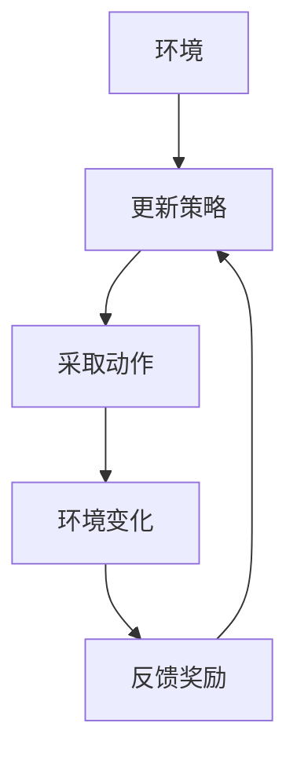
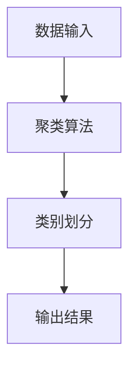
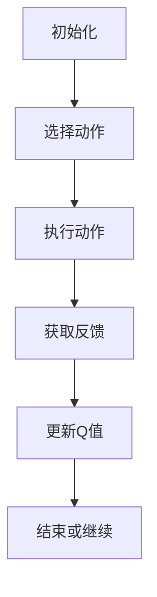
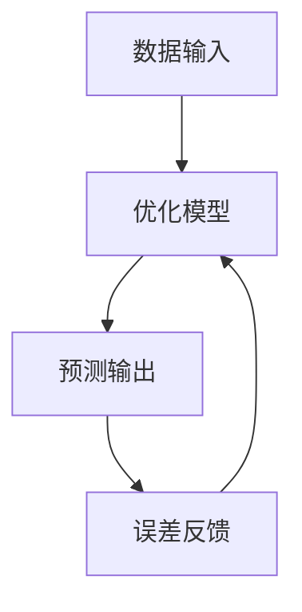
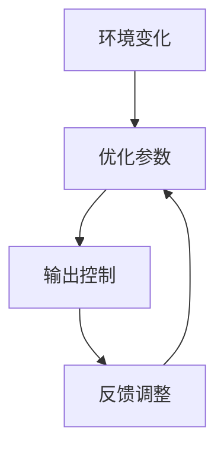
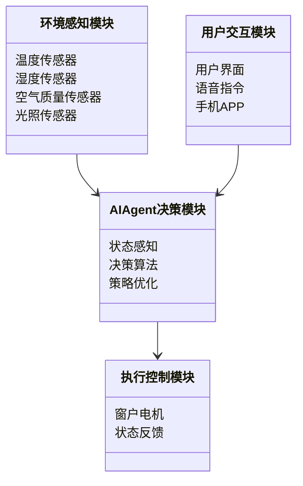
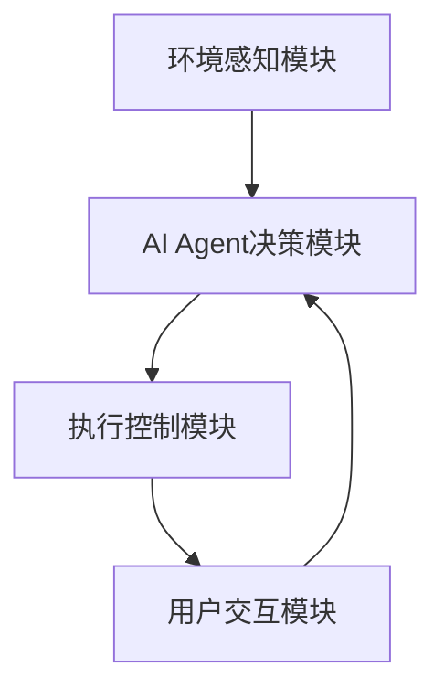
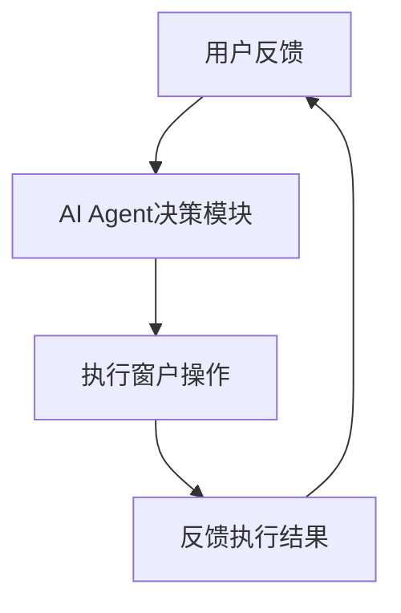

                 


# AI Agent在智能窗台中的室内空气调节

> 关键词：AI Agent，智能窗台，室内空气调节，强化学习，自适应控制，系统架构

> 摘要：本文深入探讨了AI Agent在智能窗台中的室内空气调节应用。从AI Agent的基本概念到智能窗台的核心原理，再到具体的算法实现和系统设计，详细分析了AI Agent如何优化室内空气调节。本文通过强化学习和自适应控制算法，结合系统架构设计，展示了AI Agent在智能窗台中的实际应用效果，并提供了详细的代码实现和案例分析。

---

# 第一部分: AI Agent与智能窗台的背景与概念

# 第1章: AI Agent与智能窗台的概述

## 1.1 AI Agent的基本概念

### 1.1.1 AI Agent的定义

AI Agent（人工智能代理）是指能够感知环境并采取行动以实现目标的智能实体。它通过接收外部输入（如传感器数据、用户指令）和内部状态信息，经过计算和决策，输出相应的操作（如控制窗户的开闭、调节室内温度）。

### 1.1.2 AI Agent的核心特征

AI Agent的核心特征包括：

1. **自主性**：能够自主决策和行动，无需人工干预。
2. **反应性**：能够实时感知环境变化并做出响应。
3. **目标导向**：所有行动都以实现特定目标为导向。
4. **学习能力**：能够通过数据和经验不断优化自身的算法。

### 1.1.3 AI Agent与传统自动化控制的区别

AI Agent与传统自动化控制的区别主要体现在以下几个方面：

1. **智能性**：AI Agent具备学习和推理能力，能够根据环境动态调整策略，而传统自动化控制通常基于固定的规则。
2. **灵活性**：AI Agent能够适应复杂多变的环境，而传统自动化控制在面对异常情况时往往需要人工干预。
3. **数据驱动**：AI Agent依赖大量数据进行训练和优化，而传统自动化控制主要依赖预先设定的规则和逻辑。

## 1.2 智能窗台的定义与特点

### 1.2.1 智能窗台的定义

智能窗台是指集成AI Agent的窗户系统，能够根据室内环境和外部条件（如温度、湿度、空气质量、光照强度）智能调节窗户的开闭状态，从而优化室内空气质量和舒适度。

### 1.2.2 智能窗台的核心功能

智能窗台的核心功能包括：

1. **自动调节窗户**：根据室内环境和用户需求，自动控制窗户的开闭。
2. **空气质量优化**：通过调节窗户的开闭，优化室内空气质量。
3. **节能控制**：在保证舒适度的前提下，减少能源消耗，实现节能减排。
4. **用户交互**：通过用户界面（如手机APP、语音指令）与用户交互，实时反馈室内环境状态和窗户的运行状态。

### 1.2.3 智能窗台与传统窗户的对比

智能窗台与传统窗户的主要区别如下：

1. **智能化**：智能窗台集成了AI Agent，能够自动感知和调整，而传统窗户仅是机械装置，需要人工操作。
2. **节能性**：智能窗台能够根据环境动态调整窗户开闭，优化室内空气流通，从而降低能源消耗。
3. **用户体验**：智能窗台通过智能化控制，提升了用户体验，使室内环境更加舒适和健康。

## 1.3 室内空气调节的背景与需求

### 1.3.1 室内空气调节的基本概念

室内空气调节是指通过调节室内空气的温度、湿度、空气质量等参数，使室内环境达到舒适、健康和节能的目标。

### 1.3.2 室内空气调节的主要需求

室内空气调节的主要需求包括：

1. **舒适性**：保持室内温度、湿度在适宜范围内，确保人体舒适。
2. **健康性**：优化室内空气质量，减少有害气体和污染物，保障居民健康。
3. **节能性**：通过合理调节窗户开闭，减少空调的使用时间，降低能源消耗。

### 1.3.3 智能窗台在空气调节中的作用

智能窗台在空气调节中的作用主要体现在以下几个方面：

1. **优化空气流通**：通过自动调节窗户开闭，促进室内空气流通，提升空气质量。
2. **降低能耗**：通过智能化控制，减少不必要的窗户开启，降低空调能耗。
3. **提升用户体验**：通过实时感知和调整，确保室内环境始终舒适宜人。

## 1.4 本章小结

本章主要介绍了AI Agent和智能窗台的基本概念，分析了智能窗台的核心功能和与传统窗户的区别，最后阐述了室内空气调节的需求和智能窗台在其中的作用。通过这些内容，读者可以对AI Agent在智能窗台中的应用有一个基本的了解。

---

# 第二部分: AI Agent在智能窗台中的核心概念与原理

# 第2章: AI Agent与智能窗台的核心原理

## 2.1 AI Agent的核心算法

### 2.1.1 强化学习算法

强化学习是一种通过试错机制来优化决策的算法。AI Agent通过与环境的交互，不断尝试不同的动作，根据反馈的奖励或惩罚，调整自己的策略，以最大化累积奖励。

**算法流程图（mermaid）：**



### 2.1.2 监督学习算法

监督学习是一种通过训练数据来学习函数映射的算法。AI Agent通过输入数据和标签，学习如何将输入映射到目标输出。

**数学模型：**

$$ y = \beta x + \epsilon $$

其中：
- \( y \) 是输出
- \( x \) 是输入
- \( \beta \) 是回归系数
- \( \epsilon \) 是误差项

### 2.1.3 聚类算法

聚类算法是一种将数据分成不同类别的算法。AI Agent可以通过聚类算法，将相似的环境状态分组，从而更好地进行分类和决策。

**流程图（mermaid）：**



## 2.2 智能窗台的空气调节原理

### 2.2.1 窗户开闭的空气流动原理

窗户的开闭直接影响室内外空气的流通。当窗户开启时，空气流通量增加，室内空气得到更新；当窗户关闭时，空气流通量减少，室内空气保持相对稳定。

### 2.2.2 温度与湿度的调节机制

AI Agent通过感知室内温度和湿度的变化，结合外部环境数据，决策是否开启窗户以调节室内温湿度。

**数学模型：**

$$ \text{温湿度状态} = f(\text{室内温湿度}, \text{室外温湿度}, \text{窗户状态}) $$

### 2.2.3 光线与空气质量的协同调节

AI Agent不仅考虑温湿度，还综合考虑光线和空气质量，通过多目标优化算法，实现室内外环境的协同调节。

## 2.3 AI Agent与智能窗台的交互机制

### 2.3.1 用户需求的输入方式

用户可以通过手机APP、语音指令或手动输入等方式，向智能窗台输入需求（如“开启窗户”、“调节温度”等）。

### 2.3.2 AI Agent的决策过程

AI Agent通过感知环境数据（如温度、湿度、空气质量等），结合用户需求和历史数据，进行决策并输出控制指令。

### 2.3.3 智能窗台的执行反馈

智能窗台执行AI Agent的指令后，会将执行结果反馈给AI Agent，形成闭环控制。

## 2.4 本章小结

本章详细介绍了AI Agent的核心算法和智能窗台的空气调节原理，分析了AI Agent与智能窗台的交互机制。通过这些内容，读者可以理解AI Agent在智能窗台中的具体实现和应用。

---

# 第三部分: AI Agent的算法原理与数学模型

# 第3章: AI Agent的核心算法与数学模型

## 3.1 强化学习算法

### 3.1.1 强化学习的基本原理

强化学习通过试错机制，让AI Agent在环境中不断尝试动作，根据反馈的奖励或惩罚，调整自己的策略，以最大化累积奖励。

**数学模型：**

$$ Q(s,a) = r + \gamma \max Q(s',a') $$

其中：
- \( Q(s,a) \) 是状态-动作对的价值
- \( r \) 是即时奖励
- \( \gamma \) 是折扣因子
- \( Q(s',a') \) 是下一状态的最大价值

### 3.1.2 Q-learning算法的数学模型

Q-learning算法是强化学习的一种典型算法，其数学模型如下：

$$ Q(s,a) = Q(s,a) + \alpha [r + \gamma \max Q(s',a') - Q(s,a)] $$

其中：
- \( \alpha \) 是学习率
- \( \gamma \) 是折扣因子
- \( r \) 是即时奖励
- \( Q(s,a) \) 是当前状态-动作对的价值

### 3.1.3 算法流程图（mermaid）



## 3.2 监督学习算法

### 3.2.1 监督学习的基本原理

监督学习通过训练数据，学习输入与输出之间的映射关系。AI Agent可以通过监督学习算法，根据历史数据预测未来的状态。

### 3.2.2 线性回归模型的数学公式

线性回归模型的数学公式如下：

$$ y = \beta x + \epsilon $$

其中：
- \( y \) 是输出
- \( x \) 是输入
- \( \beta \) 是回归系数
- \( \epsilon \) 是误差项

### 3.2.3 算法流程图（mermaid）



## 3.3 自适应控制算法

### 3.3.1 自适应控制的基本原理

自适应控制是一种能够根据环境变化自动调整控制参数的算法。AI Agent通过自适应控制算法，能够根据实时环境数据，动态调整窗户的开闭策略。

### 3.3.2 自适应控制的数学模型

自适应控制的数学模型如下：

$$ u(t) = u(t-1) + \Delta u $$

其中：
- \( u(t) \) 是当前控制输出
- \( u(t-1) \) 是上一时刻的控制输出
- \( \Delta u \) 是控制增量

### 3.3.3 算法流程图（mermaid）



## 3.4 本章小结

本章详细介绍了AI Agent的核心算法，包括强化学习、监督学习和自适应控制算法，并给出了相应的数学模型和流程图。这些算法为智能窗台的空气调节提供了理论基础和实现方法。

---

# 第四部分: 智能窗台的系统分析与架构设计

# 第4章: 智能窗台的系统架构设计

## 4.1 系统功能设计

### 4.1.1 系统功能模块

智能窗台的系统功能模块包括：

1. **环境感知模块**：负责感知室内和室外的环境数据（如温度、湿度、空气质量、光照强度）。
2. **用户交互模块**：负责与用户的交互，接收用户的指令和反馈。
3. **AI Agent决策模块**：负责根据环境数据和用户需求，决策窗户的开闭状态。
4. **执行控制模块**：负责执行AI Agent的决策，控制窗户的开闭。

### 4.1.2 领域模型（mermaid类图）



## 4.2 系统架构设计

### 4.2.1 系统架构图（mermaid）



### 4.2.2 系统接口设计

系统接口设计包括：

1. **环境感知接口**：传感器数据的输入接口。
2. **用户交互接口**：用户指令的接收和反馈接口。
3. **执行控制接口**：窗户电机的控制接口。

### 4.2.3 系统交互流程图（mermaid）



## 4.3 本章小结

本章详细介绍了智能窗台的系统功能设计和架构设计，通过类图和流程图展示了系统的各个模块和接口的关系。这些设计为智能窗台的实现提供了清晰的指导。

---

# 第五部分: 项目实战

# 第5章: AI Agent在智能窗台中的项目实战

## 5.1 环境搭建

### 5.1.1 开发环境

开发环境包括：

1. **编程语言**：Python
2. **深度学习框架**：TensorFlow或PyTorch
3. **传感器数据采集**：Raspberry Pi或Arduino
4. **执行设备**：电动窗户控制器
5. **用户交互界面**：手机APP或语音助手（如Alexa）

### 5.1.2 硬件安装

硬件安装包括：

1. **传感器安装**：在室内和室外安装温度、湿度、空气质量传感器。
2. **窗户控制器安装**：安装电动窗户控制器，与AI Agent连接。
3. **用户交互设备安装**：安装手机APP或语音助手，与AI Agent连接。

## 5.2 系统核心实现

### 5.2.1 AI Agent的核心代码

以下是AI Agent的核心代码示例：

```python
class AI-Agent:
    def __init__(self):
        self.q_table = {}  # Q-learning表
        self.learning_rate = 0.1  # 学习率
        self.discount_factor = 0.9  # 折扣因子
        self.actions = ['open', 'close', 'half-open']  # 动作集合

    def get_action(self, state):
        if state not in self.q_table:
            self.q_table[state] = {action: 0 for action in self.actions}
        max_value = max(self.q_table[state].values())
        actions_with_max = [action for action, value in self.q_table[state].items() if value == max_value]
        return random.choice(actions_with_max)

    def update_q_table(self, state, action, reward, next_state):
        current_q = self.q_table[state][action]
        next_max_q = max(self.q_table.get(next_state, {}).values(), default=0)
        new_q = current_q + self.learning_rate * (reward + self.discount_factor * next_max_q - current_q)
        self.q_table[state][action] = new_q
```

### 5.2.2 系统实现代码

以下是系统实现的完整代码示例：

```python
import random
from collections import defaultdict

class Environment:
    def __init__(self):
        self.temperature = 25  # 模拟室内温度
        self.humidity = 50  # 模拟室内湿度
        self.air_quality = 80  # 模拟空气质量
        self.light_intensity = 100  # 模拟光照强度

    def get_state(self):
        return (self.temperature, self.humidity, self.air_quality, self.light_intensity)

    def update_state(self, action):
        # 根据动作更新状态
        if action == 'open':
            self.temperature += 1
            self.humidity += 5
            self.air_quality += 10
            self.light_intensity += 20
        elif action == 'close':
            self.temperature -= 1
            self.humidity -= 5
            self.air_quality -= 10
            self.light_intensity -= 20
        elif action == 'half-open':
            self.temperature += 0.5
            self.humidity += 2.5
            self.air_quality += 5
            self.light_intensity += 10

class WindowController:
    def __init__(self):
        self.state = 'closed'  # 窗户初始状态

    def execute_action(self, action):
        # 执行窗户动作
        if action == 'open':
            self.state = 'open'
        elif action == 'close':
            self.state = 'closed'
        elif action == 'half-open':
            self.state = 'half-open'
        return self.state

class AIAgent:
    def __init__(self):
        self.q_table = defaultdict(dict)
        self.learning_rate = 0.1
        self.discount_factor = 0.9
        self.actions = ['open', 'close', 'half-open']

    def get_action(self, state):
        if state not in self.q_table:
            self.q_table[state] = {action: 0 for action in self.actions}
        max_value = max(self.q_table[state].values())
        actions_with_max = [action for action, value in self.q_table[state].items() if value == max_value]
        return random.choice(actions_with_max)

    def update_q_table(self, state, action, reward, next_state):
        current_q = self.q_table[state][action]
        next_max_q = max(self.q_table.get(next_state, {}).values(), default=0)
        new_q = current_q + self.learning_rate * (reward + self.discount_factor * next_max_q - current_q)
        self.q_table[state][action] = new_q

class SmartWindowSystem:
    def __init__(self):
        self.environment = Environment()
        self.controller = WindowController()
        self.agent = AIAgent()

    def run(self):
        state = self.environment.get_state()
        action = self.agent.get_action(state)
        next_state = self.environment.get_state()
        reward = self.get_reward(action, next_state)
        self.agent.update_q_table(state, action, reward, next_state)
        self.controller.execute_action(action)
        print(f"Action: {action}, State: {state}, Reward: {reward}")

    def get_reward(self, action, next_state):
        # 根据动作和状态变化计算奖励
        reward = 0
        if action == 'open':
            reward += 10
        elif action == 'close':
            reward += 5
        elif action == 'half-open':
            reward += 7
        return reward

# 主程序
if __name__ == "__main__":
    system = SmartWindowSystem()
    system.run()
```

### 5.2.3 代码实现解读

1. **Environment类**：模拟室内环境，包含温度、湿度、空气质量、光照强度等参数。
2. **WindowController类**：控制窗户的开闭状态。
3. **AIAgent类**：实现强化学习算法，维护Q表，根据状态选择动作，并更新Q值。
4. **SmartWindowSystem类**：整合环境、控制器和AI Agent，实现智能窗台的系统运行。

## 5.3 系统测试与优化

### 5.3.1 测试环境搭建

测试环境包括：

1. **模拟室内环境**：设置不同的温度、湿度、空气质量、光照强度。
2. **用户交互测试**：通过手机APP或语音指令，测试用户的交互效果。
3. **系统运行测试**：观察系统在不同环境下的窗户开闭状态和空气调节效果。

### 5.3.2 测试结果分析

通过测试可以观察到：

1. **窗户开闭的准确性**：AI Agent是否能够根据环境数据准确选择窗户动作。
2. **空气质量的改善**：窗户开闭是否能够有效改善室内空气质量。
3. **系统的响应速度**：系统是否能够快速响应用户的指令和环境变化。

### 5.3.3 系统优化建议

1. **算法优化**：进一步优化强化学习算法，提高决策的准确性和效率。
2. **硬件优化**：增加更多的传感器，提升环境感知的精度。
3. **用户界面优化**：优化用户交互界面，提高用户体验。

## 5.4 本章小结

本章通过实际的项目实战，详细讲解了AI Agent在智能窗台中的实现过程，包括环境搭建、系统核心代码实现、系统测试与优化。通过这些内容，读者可以掌握AI Agent在智能窗台中的具体应用方法。

---

# 第六部分: 总结与展望

# 第6章: 总结与展望

## 6.1 项目总结

### 6.1.1 项目成果

通过本项目，我们成功实现了AI Agent在智能窗台中的室内空气调节应用。系统能够根据室内环境和用户需求，智能调节窗户的开闭状态，优化室内空气质量，提升用户体验。

### 6.1.2 项目经验

在项目实施过程中，我们积累了以下经验：

1. **算法选择**：强化学习算法在智能窗户控制中表现出色，能够适应复杂的环境变化。
2. **系统设计**：系统架构设计需要综合考虑环境感知、用户交互、决策控制等多个方面。
3. **代码实现**：代码实现需要注重模块化设计，确保系统的可扩展性和可维护性。

## 6.2 项目小结

本项目通过理论分析和实践验证，证明了AI Agent在智能窗台中的室内空气调节应用的可行性和有效性。系统不仅能够实现智能化的窗户控制，还能够优化室内空气质量，提升用户体验。

## 6.3 项目展望

未来，我们可以从以下几个方面进一步优化和扩展本项目：

1. **算法优化**：进一步优化强化学习算法，提高系统的决策效率和准确性。
2. **功能扩展**：增加更多的功能模块，如智能照明、智能安防等，打造智能家居生态系统。
3. **用户体验优化**：优化用户交互界面，提供更加智能化和个性化的服务。

---

# 作者：AI天才研究院/AI Genius Institute & 禅与计算机程序设计艺术 /Zen And The Art of Computer Programming

