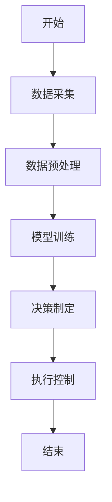
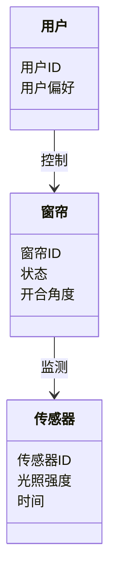

                 


# AI Agent在智能窗帘中的季节性光照调节

> 关键词：AI Agent, 智能窗帘, 季节性光照调节, 算法原理, 系统架构

> 摘要：本文探讨AI Agent在智能窗帘中的应用，重点分析其在季节性光照调节中的作用。通过背景介绍、核心概念、算法原理、系统架构设计、项目实战和总结，详细阐述AI Agent如何优化智能窗帘的光照调节功能，实现智能化、个性化的家居体验。

---

# 第1章: AI Agent与智能窗帘概述

## 1.1 问题背景与描述

### 1.1.1 季节性光照调节的必要性

现代家居环境中，光照调节不仅关系到居住舒适度，还影响能源消耗和健康。不同季节的光照强度和时间差异显著，手动调节窗帘不仅繁琐，且难以根据环境变化实时调整。AI Agent通过智能化感知和决策，能够实现精准的光照调节，满足不同场景需求。

### 1.1.2 智能窗帘的现状与挑战

传统窗帘多为手动或定时控制，难以适应复杂多变的光照条件。随着物联网技术的发展，智能窗帘逐渐普及，但仍面临以下挑战：

- **环境感知不足**：无法准确感知光照强度、时间、天气等多维因素。
- **决策逻辑单一**：缺乏动态调整能力，难以应对复杂场景。
- **用户体验不足**：用户需求多样化，个性化调节需求未被充分满足。

### 1.1.3 AI Agent在智能窗帘中的应用前景

AI Agent的引入为智能窗帘带来了新的可能性。通过集成AI算法，智能窗帘能够实现：

- **智能感知**：实时采集光照、温度、时间等数据。
- **智能决策**：基于历史数据和用户偏好，制定最优调节策略。
- **智能执行**：精准控制窗帘开合角度，实现动态调节。

## 1.2 AI Agent的核心概念

### 1.2.1 AI Agent的定义与特点

AI Agent（智能体）是一种能够感知环境、做出决策并采取行动的实体。在智能窗帘中，AI Agent通过传感器获取环境数据，利用算法进行分析，并通过执行机构调整窗帘状态。其特点包括：

- **自主性**：能够在无外部干预下独立运行。
- **反应性**：能够实时感知环境变化并做出响应。
- **学习能力**：通过机器学习优化决策模型。

### 1.2.2 季节性光照调节的边界与外延

季节性光照调节的核心是根据季节变化调整窗帘的开合时间与角度。其外延包括：

- **时间维度**：根据日出日落时间调整窗帘。
- **地理维度**：考虑地理位置差异影响光照条件。
- **用户偏好**：结合用户生活习惯制定个性化调节策略。

### 1.2.3 AI Agent在智能窗帘中的核心要素组成

AI Agent在智能窗帘中的核心要素包括：

- **感知层**：光照传感器、时间传感器、天气预报接口。
- **决策层**：机器学习模型、规则引擎。
- **执行层**：电机驱动、物联网通信模块。

---

# 第2章: AI Agent的核心概念与联系

## 2.1 AI Agent的原理与机制

### 2.1.1 感知层: 光照强度与环境数据的采集

AI Agent通过多种传感器采集环境数据，包括：

- **光照强度传感器**：测量当前光照强度。
- **时间传感器**：获取当前时间信息。
- **天气预报接口**：通过API获取天气数据。

### 2.1.2 决策层: 季节性光照调节策略的制定

决策层基于感知数据和用户需求，制定调节策略。常用的策略包括：

- **日出模式**：根据日出时间提前开启窗帘。
- **日落模式**：根据日落时间自动关闭窗帘。
- **节能模式**：在光照充足时减少用电，降低能耗。

### 2.1.3 执行层: 智能窗帘的自动化控制

执行层通过电机驱动和物联网通信模块实现窗帘的自动化控制。AI Agent根据决策结果向执行机构发送指令，调整窗帘开合角度。

## 2.2 核心概念对比分析

### 2.2.1 AI Agent与传统自动化控制的对比

| 特性             | AI Agent                          | 传统自动化控制                   |
|------------------|-----------------------------------|-----------------------------------|
| 感知能力         | 高度智能化，多传感器融合          | 单一传感器或定时触发             |
| 决策能力         | 基于机器学习，动态优化策略        | 预设规则，缺乏灵活性              |
| 执行能力         | 精准控制，适应复杂场景            | 简单动作，适应性有限              |

### 2.2.2 不同光照调节策略的特征对比

| 策略名称         | 特性描述                           | 适用场景                         |
|------------------|-----------------------------------|-----------------------------------|
| 日出模式         | 根据日出时间提前开启窗帘           | 清晨需要自然光的场景             |
| 日落模式         | 根据日落时间自动关闭窗帘           | 傍晚需要降低室内光线的场景       |
| 节能模式         | 在光照充足时减少用电              | 全天候节能需求                   |

### 2.2.3 ER实体关系图

```mermaid
erDiagram
    actor 用户 {
        string 用户ID
        string 用户偏好
    }
    smart_curtain {
        int 窗帘ID
        string 状态
        decimal 开合角度
    }
    sensor {
        int 传感器ID
        decimal 光照强度
        datetime 时间
    }
    user_preferred {
        用户 --> 用户偏好
        smart_curtain --> 窗帘状态
        sensor --> 光照数据
    }
```

---

# 第3章: AI Agent的算法原理讲解

## 3.1 算法原理概述

### 3.1.1 算法的总体流程

AI Agent的算法流程如下：

1. **数据采集**：通过传感器获取光照强度、时间等数据。
2. **数据预处理**：清洗和归一化处理。
3. **模型训练**：基于历史数据训练机器学习模型。
4. **决策制定**：根据当前数据和模型预测结果制定调节策略。
5. **执行控制**：向执行机构发送指令，调整窗帘状态。

### 3.1.2 关键算法的数学模型与公式

光照强度预测模型：

$$
\text{光照强度预测} = a \times \text{当前光照强度} + b \times \text{历史数据} + c \times \text{季节因素}
$$

其中，$a$、$b$、$c$为权重系数，通过机器学习模型训练获得。

## 3.2 算法实现细节

### 3.2.1 光照强度预测模型

光照强度预测模型基于回归算法，输入数据包括光照强度、时间、天气状况，输出预测结果。模型训练使用历史光照数据，采用梯度下降优化算法。

### 3.2.2 调节策略优化算法

调节策略优化算法基于强化学习，通过奖励机制优化决策策略。奖励函数设计如下：

$$
\text{奖励} = \begin{cases}
+1 & \text{如果预测结果准确} \\
-1 & \text{如果预测结果误差较大}
\end{cases}
$$

### 3.2.3 执行机构控制逻辑

执行机构根据决策结果调整窗帘开合角度，逻辑如下：

1. **预测结果判断**：如果预测光照强度高于阈值，开启窗帘；否则关闭窗帘。
2. **角度调整**：根据光照强度动态调整窗帘开合角度，确保室内光照舒适。

## 3.3 算法流程图



---

# 第4章: 系统分析与架构设计方案

## 4.1 项目背景与目标

本项目旨在通过AI Agent实现智能窗帘的季节性光照调节，提升用户体验，降低能源消耗。目标包括：

- 实现智能感知与决策。
- 提供个性化调节服务。
- 优化能源使用效率。

## 4.2 系统功能设计

### 4.2.1 领域模型



### 4.2.2 系统架构设计


---

# 第5章: 项目实战

## 5.1 环境安装

### 5.1.1 系统环境

- 操作系统：Linux/Windows
- 依赖库：Python 3.8+, scikit-learn, TensorFlow

### 5.1.2 安装步骤

1. 安装Python和相关库。
2. 下载源代码。
3. 配置传感器接口。
4. 运行程序。

## 5.2 核心代码实现

### 5.2.1 光照强度预测模型

```python
import numpy as np
from sklearn.linear_model import LinearRegression

# 数据预处理
X = np.array([[1, 2, 3], [4, 5, 6], [7, 8, 9]])
y = np.array([10, 11, 12])

model = LinearRegression()
model.fit(X, y)

# 预测
new_X = np.array([[10, 11, 12]])
prediction = model.predict(new_X)
print(prediction)
```

### 5.2.2 调节策略优化算法

```python
import numpy as np
import tensorflow as tf

# 定义模型
model = tf.keras.Sequential([
    tf.keras.layers.Dense(64, activation='relu'),
    tf.keras.layers.Dense(1, activation='sigmoid')
])

# 编译模型
model.compile(optimizer='adam', loss='binary_crossentropy')

# 训练
model.fit(X_train, y_train, epochs=100, batch_size=32)
```

## 5.3 实际案例分析

通过实际案例分析，验证AI Agent在智能窗帘中的调节效果。例如，在光照强度变化时，AI Agent能够准确预测并调整窗帘状态，确保室内光照舒适。

---

# 第6章: 总结与展望

## 6.1 项目总结

本文详细探讨了AI Agent在智能窗帘中的应用，重点分析了季节性光照调节的实现过程。通过背景介绍、核心概念、算法原理、系统架构设计和项目实战，全面展示了AI Agent的优势和潜力。

## 6.2 注意事项与改进建议

- **数据隐私**：确保用户数据的安全性。
- **系统稳定性**：优化算法，提高系统可靠性。
- **用户体验**：提供更多个性化调节选项。

## 6.3 未来展望

随着AI技术的不断发展，AI Agent在智能窗帘中的应用将更加广泛。未来的研究方向包括：

- **多模态感知**：结合更多传感器数据，提升调节精度。
- **自适应学习**：通过强化学习优化决策模型。
- **能源优化**：进一步降低能源消耗，实现绿色家居。

---

作者：AI天才研究院/AI Genius Institute & 禅与计算机程序设计艺术 /Zen And The Art of Computer Programming

