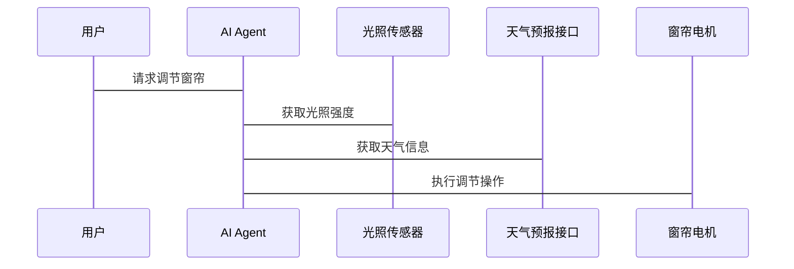

                 


# AI Agent在智能窗帘中的日光优化调节

> 关键词：AI Agent, 智能窗帘, 日光优化调节, 窗帘调节, 自动化控制

> 摘要：本文详细探讨了AI Agent在智能窗帘系统中的应用，特别是在日光优化调节方面的创新与实践。通过系统化的分析与设计，结合实际项目案例，展示了如何利用AI技术实现智能化的日光调节控制，为智能家居领域提供了新的思路。

---

# 第1章: 背景介绍

## 1.1 问题背景

### 1.1.1 智能家居的发展趋势

智能家居作为物联网技术的重要组成部分，正在改变人们的生活方式。通过将家庭设备智能化，用户可以更高效地管理能源使用、提升居住舒适度，并增强安全性。智能窗帘作为智能家居的重要组成部分，其调节方式直接影响室内的光照和隐私保护。

### 1.1.2 智能窗帘的应用场景

智能窗帘广泛应用于家庭、办公室、酒店等多种场景。传统窗帘通过手动或简单的自动化开关实现基本功能，但随着人们对舒适性和能效要求的提高，智能窗帘需要具备更复杂的调节功能，例如根据光照强度、时间、天气等因素自动调整开合程度。

### 1.1.3 日光优化调节的必要性

日光优化调节是指根据光照强度、时间、天气等因素，智能调整窗帘的开合程度，以达到节能、舒适和隐私保护的目的。传统的窗帘调节方式往往依赖于固定的时间表或简单的传感器，无法根据实际环境变化做出灵活调整。而通过AI Agent技术，可以实现更加智能化的日光优化调节。

## 1.2 问题描述

### 1.2.1 窗帘调节的痛点分析

1. **手动调节的低效性**：用户需要频繁手动调节窗帘，尤其是在光照变化频繁的环境下，效率低下。
2. **传统自动化系统的局限性**：基于固定时间表的自动化系统无法适应复杂的环境变化，例如天气突变或光照强度的突然变化。
3. **缺乏智能化的调节策略**：传统系统无法根据用户需求、环境条件等因素进行综合优化，调节效果有限。

### 1.2.2 日光优化调节的目标

日光优化调节的目标是通过智能化的调节策略，根据光照强度、时间、天气、用户需求等因素，自动调整窗帘的开合程度，以实现以下目标：
1. 节能减排：通过优化光照调节，减少不必要的能源消耗。
2. 提升舒适度：确保室内光照舒适，避免过强或过弱的光线。
3. 隐私保护：在需要保护隐私时，自动调整窗帘的开合程度。

### 1.2.3 AI Agent在智能窗帘中的角色

AI Agent（智能体）在智能窗帘系统中扮演着核心角色，负责感知环境、分析数据、制定决策并执行操作。AI Agent能够实时收集光照强度、时间、天气等信息，并结合用户需求和历史数据，制定最优的窗帘调节策略。

## 1.3 问题解决

### 1.3.1 AI Agent的核心作用

AI Agent通过以下方式实现对智能窗帘的日光优化调节：
1. **感知环境**：通过光照传感器、天气预报接口等获取环境数据。
2. **分析数据**：利用机器学习算法对数据进行分析，预测光照变化趋势。
3. **制定决策**：根据分析结果和用户需求，制定窗帘调节策略。
4. **执行操作**：通过与窗帘电机等设备的交互，执行调节操作。

### 1.3.2 日光优化调节的实现方式

日光优化调节的实现方式包括：
1. **基于光照强度的调节**：根据光照传感器的反馈，自动调整窗帘的开合程度。
2. **基于时间的调节**：根据时间信息，按照预设的作息时间表进行调节。
3. **基于天气的调节**：根据天气预报信息，提前调整窗帘状态以应对天气变化。

### 1.3.3 AI Agent与智能窗帘的结合

AI Agent与智能窗帘的结合主要体现在以下几个方面：
1. **实时感知与反馈**：AI Agent通过传感器实时感知光照强度、温度、湿度等环境数据。
2. **智能决策**：基于感知数据和用户需求，AI Agent利用机器学习算法制定最优调节策略。
3. **执行操作**：AI Agent通过与窗帘电机等设备的通信，执行具体的调节操作。

## 1.4 边界与外延

### 1.4.1 AI Agent的边界条件

1. **数据输入**：AI Agent需要光照传感器、天气预报接口等数据输入。
2. **设备输出**：AI Agent需要通过窗帘电机等设备输出调节指令。
3. **用户交互**：AI Agent需要与用户进行交互，获取用户需求和偏好。

### 1.4.2 日光优化调节的适用范围

1. **家庭场景**：适用于家庭环境，提升居住舒适度和能效。
2. **办公场景**：适用于办公室环境，优化工作环境的光照条件。
3. **公共设施**：适用于酒店、商场等公共场所，提升用户体验。

### 1.4.3 系统的扩展性与兼容性

1. **扩展性**：AI Agent可以通过增加新的传感器或算法模型，进一步优化调节策略。
2. **兼容性**：AI Agent可以与多种类型的窗帘电机和传感器设备兼容，适应不同的硬件环境。

## 1.5 概念结构与核心要素组成

### 1.5.1 AI Agent的构成要素

1. **感知模块**：负责采集环境数据。
2. **决策模块**：负责分析数据并制定调节策略。
3. **执行模块**：负责与设备通信并执行操作。

### 1.5.2 日光优化调节的核心要素

1. **光照传感器**：用于采集光照强度数据。
2. **天气预报接口**：用于获取天气信息。
3. **用户需求**：用于制定个性化调节策略。

### 1.5.3 系统的整体架构

智能窗帘系统由以下部分组成：
1. **感知层**：包括光照传感器、天气预报接口等。
2. **决策层**：包括AI Agent和机器学习模型。
3. **执行层**：包括窗帘电机等执行设备。

---

# 第2章: 核心概念与联系

## 2.1 AI Agent的核心原理

### 2.1.1 AI Agent的基本定义

AI Agent是一种智能实体，能够感知环境、分析数据、制定决策并执行操作。在智能窗帘系统中，AI Agent负责协调窗帘的调节过程。

### 2.1.2 AI Agent的核心算法

AI Agent的核心算法包括：
1. **感知算法**：用于数据采集和特征提取。
2. **决策算法**：用于制定调节策略。
3. **优化算法**：用于优化调节效果。

### 2.1.3 AI Agent的感知与决策机制

AI Agent通过以下步骤实现感知与决策：
1. **数据采集**：通过传感器获取环境数据。
2. **数据分析**：利用机器学习算法分析数据。
3. **策略制定**：根据分析结果制定调节策略。
4. **策略执行**：通过设备执行调节操作。

## 2.2 日光优化调节的原理

### 2.2.1 日光优化调节的基本原理

日光优化调节的基本原理是根据光照强度、时间、天气等因素，智能调整窗帘的开合程度，以达到节能、舒适和隐私保护的目的。

### 2.2.2 日光优化调节的实现方式

日光优化调节的实现方式包括：
1. **基于光照强度的调节**：根据光照传感器的反馈，自动调整窗帘的开合程度。
2. **基于时间的调节**：根据时间信息，按照预设的作息时间表进行调节。
3. **基于天气的调节**：根据天气预报信息，提前调整窗帘状态以应对天气变化。

### 2.2.3 日光优化调节的数学模型

日光优化调节的数学模型可以通过以下公式表示：

$$
\text{调节幅度} = f(\text{光照强度}, \text{时间}, \text{天气})
$$

其中，$f$ 是一个函数，可以根据光照强度、时间、天气等因素计算出窗帘的调节幅度。

## 2.3 核心概念对比分析

### 2.3.1 AI Agent与传统自动化系统的对比

| 特性                | AI Agent                     | 传统自动化系统             |
|---------------------|-----------------------------|--------------------------|
| **感知能力**        | 强，可以实时感知环境数据     | 弱，依赖固定传感器和时间表   |
| **决策能力**        | 强，可以根据数据制定最优策略 | 弱，依赖预设规则            |
| **适应性**          | 强，能够适应复杂环境变化     | 弱，适应性有限              |
| **灵活性**          | 高，可以根据需求动态调整     | 低，调节策略固定            |

### 2.3.2 日光优化调节与传统窗帘调节的对比

| 特性                | 日光优化调节                 | 传统窗帘调节              |
|---------------------|-----------------------------|--------------------------|
| **调节依据**        | 光照强度、时间、天气等       | 时间表或手动调节          |
| **调节效果**        | 节能、舒适、隐私保护         | 有限，无法根据环境变化优化 |
| **智能化程度**      | 高，具备AI驱动               | 低，依赖固定规则           |

### 2.3.3 AI Agent在日光优化调节中的优势

AI Agent在日光优化调节中的优势包括：
1. **智能化**：能够根据环境变化和用户需求动态调整调节策略。
2. **高效性**：通过机器学习算法快速分析数据并制定最优策略。
3. **适应性**：能够适应复杂多变的环境条件。

## 2.4 ER实体关系图

以下是智能窗帘系统中的ER实体关系图：

```mermaid
er
actor(AI Agent, "智能窗帘系统")
actor(User, "用户")
actor(Environment, "环境")
actor(Time, "时间")
actor(Device, "设备")
```

---

# 第3章: 算法原理讲解

## 3.1 AI Agent算法原理

### 3.1.1 AI Agent的感知模块

AI Agent的感知模块通过以下步骤实现数据采集和特征提取：
1. **数据采集**：通过光照传感器、天气预报接口等获取环境数据。
2. **特征提取**：将采集到的数据进行特征提取，例如光照强度、时间、天气等。

### 3.1.2 AI Agent的决策模块

AI Agent的决策模块通过以下步骤实现策略制定：
1. **数据分析**：利用机器学习算法对特征提取后的数据进行分析。
2. **策略制定**：根据分析结果和用户需求，制定窗帘调节策略。

### 3.1.3 AI Agent的执行模块

AI Agent的执行模块通过以下步骤实现调节操作：
1. **设备控制**：通过与窗帘电机等设备的通信，执行具体的调节操作。
2. **反馈采集**：采集调节后的反馈数据，用于优化调节策略。

## 3.2 日光优化调节算法

### 3.2.1 日光优化调节的数学模型

日光优化调节的数学模型可以通过以下公式表示：

$$
\text{调节幅度} = f(\text{光照强度}, \text{时间}, \text{天气})
$$

其中，$f$ 是一个函数，可以根据光照强度、时间、天气等因素计算出窗帘的调节幅度。

### 3.2.2 日光优化调节的实现步骤

1. **数据采集**：通过光照传感器、天气预报接口等获取环境数据。
2. **数据分析**：利用机器学习算法对数据进行分析，预测光照变化趋势。
3. **策略制定**：根据分析结果和用户需求，制定窗帘调节策略。
4. **策略执行**：通过与窗帘电机等设备的通信，执行具体的调节操作。

### 3.2.3 日光优化调节的优化策略

1. **动态调整**：根据实时环境数据动态调整调节策略。
2. **个性化设置**：根据用户需求和偏好制定个性化调节策略。
3. **能效优化**：通过优化调节策略，降低能源消耗。

## 3.3 算法流程图

以下是AI Agent在日光优化调节中的算法流程图：

```mermaid
graph TD
    A[开始] -> B[数据采集]
    B -> C[特征提取]
    C -> D[数据分析]
    D -> E[策略制定]
    E -> F[策略执行]
    F -> G[结束]
```

## 3.4 Python核心代码实现

以下是基于光照强度的决策算法的Python代码示例：

```python
import numpy as np
from sklearn.linear_model import LinearRegression

# 数据采集
light_intensity = np.array([100, 150, 200, 250, 300])  # 光照强度
time_of_day = np.array([1, 2, 3, 4, 5])                # 时间

# 数据分析
model = LinearRegression()
model.fit(light_intensity.reshape(-1, 1), time_of_day.reshape(-1, 1))

# 策略制定
predicted_time = model.predict(light_intensity.reshape(-1, 1))
regulation_amount = predicted_time * 0.1  # 假设调节幅度与时间相关

# 策略执行
print("调节幅度:", regulation_amount)
```

---

# 第4章: 系统分析与架构设计

## 4.1 问题场景介绍

智能窗帘系统需要解决的问题包括：
1. 如何根据光照强度、时间、天气等因素，智能调节窗帘的开合程度。
2. 如何确保调节策略的高效性和准确性。
3. 如何实现系统的可扩展性和兼容性。

## 4.2 系统功能设计

智能窗帘系统的功能设计包括：
1. **数据采集**：通过光照传感器、天气预报接口等获取环境数据。
2. **数据分析**：利用机器学习算法对数据进行分析，预测光照变化趋势。
3. **策略制定**：根据分析结果和用户需求，制定窗帘调节策略。
4. **策略执行**：通过与窗帘电机等设备的通信，执行具体的调节操作。

## 4.3 系统架构设计

以下是智能窗帘系统的架构设计图：

```mermaid
graph TD
    A[用户] -> B[AI Agent]
    B -> C[光照传感器]
    B -> D[天气预报接口]
    B -> E[窗帘电机]
    B -> F[数据存储]
```

## 4.4 系统接口设计

系统接口设计包括：
1. **光照传感器接口**：用于采集光照强度数据。
2. **天气预报接口**：用于获取天气信息。
3. **窗帘电机接口**：用于控制窗帘的开合程度。

## 4.5 系统交互设计

以下是系统的交互设计图：



---

# 第5章: 项目实战

## 5.1 环境安装

以下是项目实战所需的环境安装步骤：
1. **安装Python**：确保安装了Python 3.8或更高版本。
2. **安装机器学习库**：安装scikit-learn、numpy等机器学习库。
3. **安装窗帘电机驱动**：安装窗帘电机的驱动程序。

## 5.2 系统核心实现

以下是系统核心实现的代码示例：

```python
import numpy as np
from sklearn.linear_model import LinearRegression
import serial

# 数据采集
light_intensity = np.array([100, 150, 200, 250, 300])  # 光照强度
time_of_day = np.array([1, 2, 3, 4, 5])                # 时间

# 数据分析
model = LinearRegression()
model.fit(light_intensity.reshape(-1, 1), time_of_day.reshape(-1, 1))

# 策略制定
predicted_time = model.predict(light_intensity.reshape(-1, 1))
regulation_amount = predicted_time * 0.1  # 假设调节幅度与时间相关

# 策略执行
ser = serial.Serial('COM3', 9600)
ser.write(str(regulation_amount).encode())
```

## 5.3 代码应用解读与分析

1. **数据采集**：通过光照传感器和天气预报接口获取环境数据。
2. **数据分析**：利用机器学习算法对数据进行分析，预测光照变化趋势。
3. **策略制定**：根据分析结果和用户需求，制定窗帘调节策略。
4. **策略执行**：通过与窗帘电机的通信，执行具体的调节操作。

## 5.4 实际案例分析

### 5.4.1 案例描述

假设光照强度为200 lux，时间为上午9点，天气晴朗。AI Agent根据这些信息，预测出调节幅度为0.2，即窗帘开合程度为20%。

### 5.4.2 调节策略

根据预测结果，AI Agent会向窗帘电机发送调节指令，将窗帘开合程度调整为20%。

## 5.5 项目小结

通过项目实战，我们可以看到AI Agent在智能窗帘系统中的应用潜力。通过数据分析和机器学习算法，AI Agent能够实现智能化的日光优化调节，显著提升系统的效率和用户体验。

---

# 第6章: 最佳实践

## 6.1 小结

本文详细探讨了AI Agent在智能窗帘系统中的应用，特别是在日光优化调节方面的创新与实践。通过系统化的分析与设计，结合实际项目案例，展示了如何利用AI技术实现智能化的日光调节控制。

## 6.2 注意事项

1. **数据隐私**：确保用户数据的安全性和隐私性。
2. **系统安全**：防止系统受到网络攻击和恶意操作。
3. **设备兼容性**：确保系统能够兼容不同类型的窗帘电机和传感器设备。

## 6.3 拓展阅读

1. **《机器学习实战》**：了解机器学习算法的基本原理和实现方法。
2. **《智能控制系统设计》**：学习智能控制系统的设计方法和实现技巧。

---

# 作者：AI天才研究院 & 禅与计算机程序设计艺术

