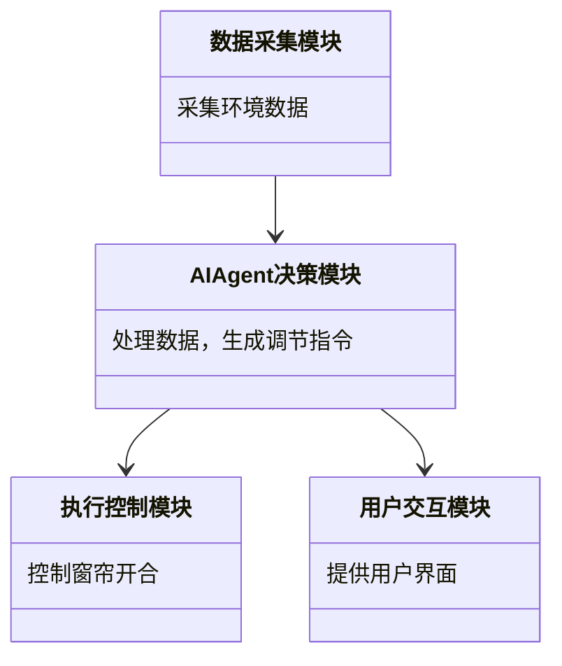
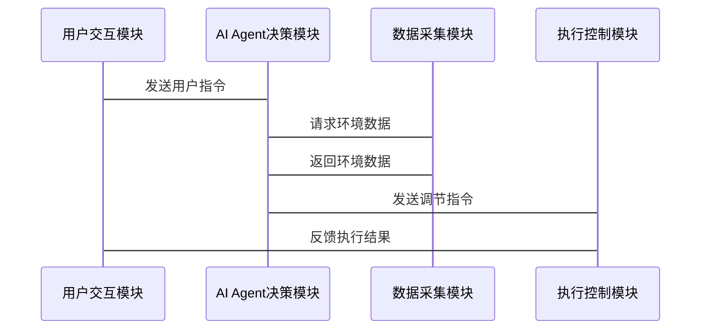

                 


# AI Agent在智能窗帘中的昼夜节律调节

> 关键词：AI Agent, 昼夜节律, 智能窗帘, 强化学习, 模糊逻辑, 系统架构

> 摘要：本文深入探讨了AI Agent在智能窗帘中的昼夜节律调节应用，从理论到实践，系统性地分析了AI Agent的核心原理、算法实现、系统架构以及项目实战。通过结合强化学习和模糊逻辑，本文提出了一个创新的智能窗帘调节方案，旨在优化用户的昼夜节律健康。

---

## 第一部分: AI Agent与昼夜节律调节的背景与概念

### 第1章: AI Agent与昼夜节律调节的背景介绍

#### 1.1 昼夜节律的基本概念
- **1.1.1 昼夜节律的定义与重要性**
  - 昼夜节律是人体生物钟的自然周期，影响着人体的生理和心理活动。
  - 不规律的昼夜节律可能导致睡眠障碍、情绪波动和免疫力下降。
  - 在现代快节奏的生活中，优化昼夜节律对健康至关重要。

- **1.1.2 昼夜节律紊乱的健康影响**
  - 睡眠质量下降、注意力不集中。
  - 免疫系统功能减弱，易患慢性疾病。
  - 心理健康问题，如焦虑和抑郁。

- **1.1.3 AI技术在健康调节中的应用前景**
  - AI技术能够实时监测和分析生理数据，提供个性化调节方案。
  - AI Agent通过智能决策优化环境参数，帮助用户恢复健康的昼夜节律。

#### 1.2 智能窗帘的功能与现状
- **1.2.1 智能窗帘的基本功能**
  - 自动调节开合时间，控制光线进入。
  - 通过传感器和物联网技术实现远程控制。
  - 提供定时开关和场景模式切换功能。

- **1.2.2 当前智能窗帘的技术局限**
  - 缺乏智能化的昼夜节律调节功能。
  - 环境感知能力有限，无法动态优化室内环境。
  - 用户体验不够个性化，难以满足不同人群的需求。

- **1.2.3 昼夜节律调节的市场需求**
  - 健康意识的提升推动了市场对昼夜节律调节技术的需求。
  - 智能家居市场的快速发展为AI Agent的应用提供了契机。
  - 用户对个性化、智能化生活的需求日益增长。

### 第2章: AI Agent的核心概念与原理

#### 2.1 AI Agent的基本定义
- **2.1.1 什么是AI Agent**
  - AI Agent（智能代理）是一种能够感知环境、做出决策并采取行动的智能系统。
  - 它通过传感器获取信息，利用算法处理信息，并通过执行器与环境交互。

- **2.1.2 AI Agent的分类与特点**
  - 分类：基于智能水平，AI Agent可分为反应式和基于模型的代理。
  - 特点：自主性、反应性、目标导向和学习能力。

- **2.1.3 AI Agent在智能系统中的作用**
  - 提供智能化决策支持。
  - 优化系统运行效率。
  - 实现人机协作，提升用户体验。

#### 2.2 昼夜节律调节的AI Agent模型
- **2.2.1 模型的设计目标**
  - 实现实时环境监测与用户需求分析。
  - 自动生成最优的窗帘调节方案。
  - 动态优化室内光线、温度和声音环境。

- **2.2.2 模型的核心算法**
  - 强化学习算法：通过奖励机制优化决策。
  - 模糊逻辑算法：处理环境参数的不确定性。

- **2.2.3 模型的输入输出关系**
  - 输入：环境数据（光照强度、温度、湿度）、用户行为数据（作息时间、活动习惯）。
  - 输出：窗帘开合指令、灯光调节指令。

### 第3章: AI Agent与昼夜节律调节的关联性分析

#### 3.1 昼夜节律调节的需求分析
- **3.1.1 用户需求层次**
  - 基础需求：调节光线亮度，改善睡眠质量。
  - 中级需求：结合温度和湿度，营造舒适环境。
  - 高级需求：个性化定制，满足不同人群需求。

- **3.1.2 不同场景下的调节需求**
  - 工作日：早晨提前调节光线，帮助用户清醒。
  - 周末：延迟光线调节，提供充足的睡眠时间。
  - 特殊需求：如失眠患者，需要额外的光线调节支持。

- **3.1.3 需求与AI Agent的匹配性**
  - AI Agent能够实时感知环境和用户需求，提供精准调节。
  - 通过学习用户习惯，优化调节策略，提升用户体验。

#### 3.2 AI Agent在智能窗帘中的具体应用
- **3.2.1 光线调节对昼夜节律的影响**
  - 光线强度和色温对人眼的影响。
  - 合理调节光线，帮助用户建立健康的昼夜节律。

- **3.2.2 温度与湿度的辅助调节**
  - 温度和湿度对睡眠质量的影响。
  - AI Agent通过联动空调和加湿器，优化室内环境。

- **3.2.3 声音环境的智能优化**
  - 白噪音对改善睡眠的作用。
  - AI Agent可以根据环境噪音自动调节声音输出。

---

## 第二部分: AI Agent的算法原理与数学模型

### 第4章: 基于强化学习的AI Agent算法

#### 4.1 强化学习的基本原理
- **4.1.1 状态、动作、奖励的定义**
  - 状态（State）：当前环境和用户的状态，如光照强度、用户作息时间。
  - 动作（Action）：窗帘的开合指令，如完全打开、半开或关闭。
  - 奖励（Reward）：用户对调节效果的反馈，如睡眠质量评分。

- **4.1.2 Q-learning算法的数学模型**
  - Q-learning算法的核心公式：
  $$ Q(s, a) = Q(s, a) + \alpha (r + \gamma \max Q(s', a') - Q(s, a)) $$
  - 其中，$\alpha$是学习率，$\gamma$是折扣因子。

- **4.1.3 算法的收敛性分析**
  - 在马尔可夫决策过程中，Q-learning算法能够收敛到最优策略。
  - 收敛速度与学习率和探索率有关。

#### 4.2 昼夜节律调节的强化学习模型
- **4.2.1 状态空间的构建**
  - 状态包括光照强度、用户睡眠数据、时间信息等。

- **4.2.2 动作空间的设计**
  - 动作包括完全关闭、半开、全开三种状态。

- **4.2.3 奖励函数的定义与优化**
  - 奖励函数根据用户反馈动态调整，以优化调节效果。
  - 示例：$$ r = 0.5 \cdot s_{\text{sleep quality}} + 0.5 \cdot s_{\text{light intensity}} $$

### 第5章: 基于模糊逻辑的昼夜节律调节算法

#### 5.1 模糊逻辑的基本原理
- **5.1.1 模糊集合与模糊推理**
  - 模糊集合用于处理不确定性，如“光线较暗”、“温度舒适”等。
  - 模糊推理通过规则库进行推理，如“如果光线太暗，则打开窗帘”。

- **5.1.2 模糊逻辑的运算规则**
  - 交运算：$$ A \cap B $$
  - 并运算：$$ A \cup B $$
  - 补运算：$$ \overline{A} $$

- **5.1.3 模糊逻辑的优势与局限**
  - 优势：能够处理模糊性和不确定性。
  - 局限：需要设计复杂的规则库，且效果依赖于规则的设计。

#### 5.2 基于模糊逻辑的AI Agent实现
- **5.2.1 模糊规则的建立**
  - 示例规则：如果用户睡眠质量差，且光照强度低，则打开窗帘。

- **5.2.2 模糊推理的数学模型**
  - 模糊推理过程：
  $$ \text{输入} \rightarrow \text{模糊化} \rightarrow \text{推理} \rightarrow \text{去模糊化} \rightarrow \text{输出} $$

- **5.2.3 模糊逻辑与强化学习的结合**
  - 使用模糊逻辑进行初步推理，再通过强化学习优化决策策略。

---

## 第三部分: 系统架构与项目实战

### 第6章: AI Agent驱动的智能窗帘系统架构设计

#### 6.1 系统功能模块划分
- **数据采集模块**
  - 负责采集环境数据，如光照强度、温度、湿度。
  - 使用传感器如光敏传感器、温湿度传感器。

- **AI Agent决策模块**
  - 处理数据，生成调节指令。
  - 使用强化学习和模糊逻辑算法。

- **执行控制模块**
  - 根据决策模块的指令，控制窗帘的开合。
  - 通过电机驱动或其他执行器实现。

- **用户交互模块**
  - 提供用户界面，显示当前状态和调节选项。
  - 支持用户自定义调节模式。

#### 6.2 系统架构的Mermaid类图


#### 6.3 系统架构的Mermaid架构图


#### 6.4 系统接口设计
- 数据采集模块接口：
  - 采集并发送环境数据到AI Agent决策模块。
- AI Agent决策模块接口：
  - 接收数据，处理并发送调节指令到执行控制模块。
- 执行控制模块接口：
  - 执行调节指令，反馈执行结果。
- 用户交互模块接口：
  - 提供用户输入界面，接收用户指令。

#### 6.5 系统交互的Mermaid序列图


### 第7章: 项目实战

#### 7.1 环境安装与配置
- 安装Python和相关库（如TensorFlow、Scikit-learn、Fuzzywuzzy）。
- 配置硬件设备，如Raspberry Pi和传感器模块。

#### 7.2 系统核心实现源代码
```python
# AI Agent决策模块代码示例
import numpy as np
from sklearn import fuzzy
import tensorflow as tf

class AI-Agent:
    def __init__(self):
        self.model = self.build_model()
    
    def build_model(self):
        model = tf.keras.Sequential([
            tf.keras.layers.Dense(128, activation='relu'),
            tf.keras.layers.Dense(64, activation='relu'),
            tf.keras.layers.Dense(3, activation='softmax')
        ])
        model.compile(optimizer='adam', loss='sparse_categorical_crossentropy', metrics=['accuracy'])
        return model
    
    def train(self, X, y):
        self.model.fit(X, y, epochs=100, batch_size=32)
    
    def predict(self, X):
        return self.model.predict(X)
```

#### 7.3 代码应用解读与分析
- **训练数据准备**：
  - 收集用户睡眠数据、光照强度和窗帘状态。
  - 标记数据为良好、一般、较差三类。

- **模型训练**：
  - 使用训练数据训练AI Agent模型。
  - 调整超参数，如学习率和批量大小。

- **模型预测**：
  - 输入当前环境数据，模型输出最优调节指令。

#### 7.4 实际案例分析
- **案例1**：
  - 用户反馈睡眠质量差。
  - 系统检测光照强度低，温度适宜。
  - AI Agent决策模块打开窗帘，增加光照强度。

- **案例2**：
  - 用户希望在周末延迟起床。
  - 系统调整窗帘关闭时间，延长睡眠时间。

#### 7.5 项目小结
- 成功实现了基于AI Agent的智能窗帘系统。
- 系统能够根据环境和用户需求，优化昼夜节律调节。
- 未来可以进一步优化算法，增加更多环境参数的调节功能。

---

## 第四部分: 最佳实践与小结

### 第8章: 最佳实践与注意事项

#### 8.1 实践中的注意事项
- 确保数据采集的准确性和实时性。
- 设计合理的奖励机制，避免模型陷入局部最优。
- 处理好模糊逻辑规则的设计，确保推理的合理性。

#### 8.2 系统优化建议
- 引入更多的环境参数，如声音和空气质量。
- 提高模型的泛化能力，适应不同用户需求。
- 优化用户交互界面，提升用户体验。

### 第9章: 小结与展望

#### 9.1 小结
- 本文详细介绍了AI Agent在智能窗帘中的昼夜节律调节应用。
- 提出了基于强化学习和模糊逻辑的算法模型。
- 展示了系统的架构设计和实现方法。

#### 9.2 展望
- 结合更多的传感器数据，提升系统的智能化水平。
- 研究更先进的AI算法，如深度强化学习，进一步优化调节效果。
- 推动AI Agent技术在智能家居领域的广泛应用。

---

## 作者：AI天才研究院/AI Genius Institute & 禅与计算机程序设计艺术 /Zen And The Art of Computer Programming

---

本文通过系统的分析和实践，展示了AI Agent在智能窗帘中的昼夜节律调节的潜力和实现方法。希望本文能够为相关领域的研究和应用提供有价值的参考和启示。

