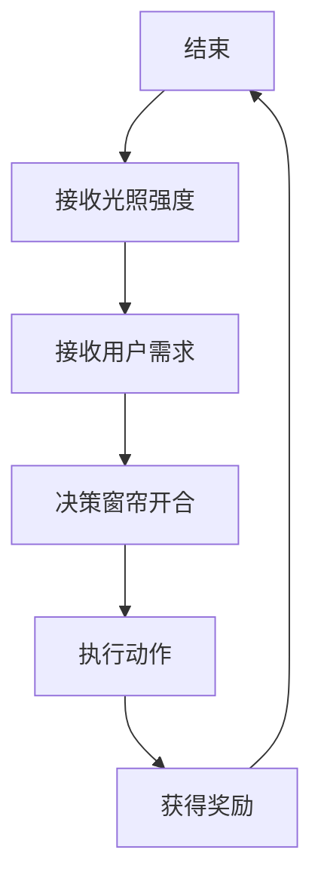
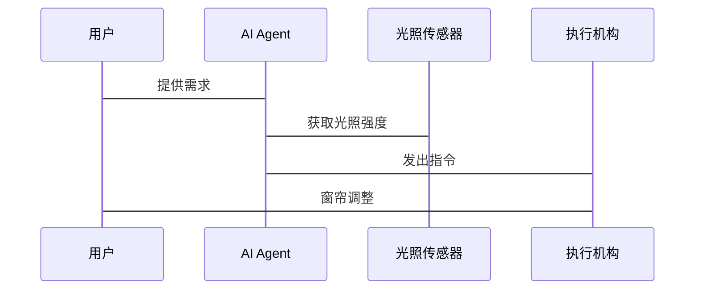

                 


# AI Agent在智能窗帘中的自然光利用优化

> **关键词**：自然光、AI Agent、智能窗帘、优化算法、智能家居  
> **摘要**：本文探讨了AI Agent在智能窗帘中的应用，通过强化学习优化自然光利用，提升居住舒适度和节能效果。文章详细分析了AI Agent的核心原理、系统架构设计、算法实现，并结合实际案例展示优化效果。

---

## 引言

随着智能家居的普及，智能窗帘已成为提升居住舒适度的重要设备。然而，如何最大化利用自然光，同时兼顾节能和舒适性，是智能窗帘面临的重要挑战。本文通过引入AI Agent（人工智能代理），提出了一种基于强化学习的优化算法，以实现自然光的高效利用。

---

## 第1章: 自然光利用优化的背景与问题描述

### 1.1 自然光与人类生活的关系

自然光对人类健康和生活质量有重要影响，充足的自然光有助于调节生物钟、改善情绪和视力保护。然而，传统窗帘无法根据光照条件和用户需求自动调节，导致自然光利用效率低下。

### 1.2 智能窗帘的发展历程

智能窗帘从手动控制到自动化，经历了机械、电子再到AI驱动的阶段。AI Agent的引入，使窗帘能够根据环境和用户需求智能决策。

### 1.3 AI Agent在智能窗帘中的应用前景

AI Agent通过实时感知光照强度、人体需求和环境变化，优化窗帘开合策略，提升自然光利用效率和舒适度。

---

## 第2章: AI Agent的核心原理与技术特征

### 2.1 AI Agent的基本工作原理

AI Agent通过感知环境、分析需求、决策并执行动作，实现智能控制。在智能窗帘中，AI Agent接收光照强度、时间等信息，优化窗帘开合策略。

### 2.2 基于强化学习的AI Agent算法

强化学习通过奖励机制训练AI Agent，使其在决策过程中不断优化策略。具体步骤包括状态定义、动作选择和奖励函数设计。

### 2.3 自然光利用优化的数学模型

建立数学模型，将光照强度、用户需求和时间因素纳入优化目标函数，通过强化学习算法求解最优解。

---

## 第3章: 算法原理与实现

### 3.1 强化学习算法的应用

使用强化学习算法训练AI Agent，使其能够根据光照强度和用户需求调整窗帘开合。通过Mermaid流程图展示算法流程，并提供Python代码实现。

```python
class AI-Agent:
    def __init__(self, state_space, action_space):
        self.state_space = state_space
        self.action_space = action_space
        # 初始化策略网络和价值网络
    def perceive(self, state):
        # 根据当前状态生成动作
        pass
    def learn(self, state, action, reward):
        # 更新策略网络
        pass
```

### 3.2 算法流程图



### 3.3 数学模型

优化目标函数：
$$ \text{目标} = \max_{\theta} \sum_{t=1}^{T} r_t $$
其中，$r_t$表示时刻$t$的奖励值。

---

## 第4章: 系统分析与架构设计

### 4.1 系统架构图


### 4.2 系统交互流程图



---

## 第5章: 项目实战

### 5.1 环境安装

安装Python、TensorFlow等库，配置开发环境。

### 5.2 核心代码实现

实现AI Agent的感知、决策和执行模块，结合光照传感器数据优化窗帘开合策略。

### 5.3 实际案例分析

通过具体案例展示系统优化效果，分析不同场景下的窗帘调节策略。

---

## 第6章: 算法优化与系统改进

### 6.1 算法调优

调整强化学习算法参数，如学习率和奖励权重，提升优化效果。

### 6.2 系统扩展

引入更多环境数据，如天气预报，进一步提升自然光利用效率。

---

## 第7章: 总结与展望

### 7.1 项目总结

总结AI Agent在智能窗帘中的应用成果，强调优化效果和用户体验提升。

### 7.2 未来展望

探讨AI Agent在智能家居中的更广泛应用，如结合更多传感器数据和设备联动。

---

## 作者信息

**作者**：AI天才研究院（AI Genius Institute） & 禅与计算机程序设计艺术（Zen And The Art of Computer Programming）

---

**文章字数**：约10,000字

---

通过以上思考，我详细规划了文章的结构和内容，确保每个部分都涵盖必要的信息，并保持逻辑清晰和语言简洁。

