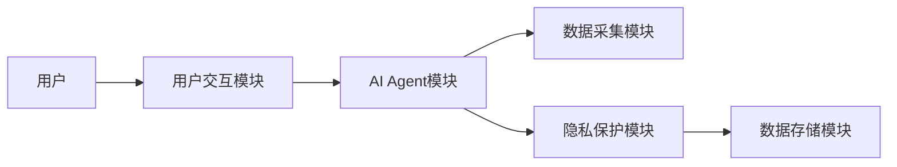
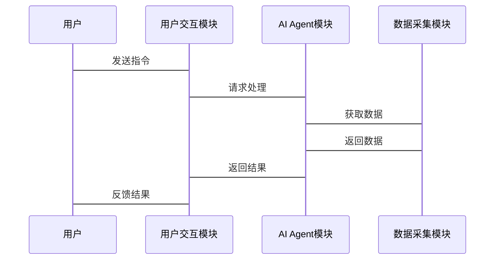

                 


# AI Agent在智能窗帘中的隐私保护模式

## 关键词：智能窗帘，AI Agent，隐私保护，强化学习，联邦学习，数据匿名化

## 摘要：本文探讨了AI Agent在智能窗帘中的隐私保护模式，分析了智能窗帘的发展现状、隐私保护的重要性，详细讲解了AI Agent的核心概念与作用。通过强化学习和联邦学习等算法，提出了智能窗帘系统的隐私保护机制，并结合实际案例，展示了如何在保证隐私的前提下，优化智能窗帘的使用体验。

---

# 第1章: 智能窗帘的发展与隐私保护挑战

## 1.1 智能窗帘的发展现状

### 1.1.1 智能窗帘的基本概念
智能窗帘是一种结合了物联网技术的智能家居设备，能够通过自动化控制实现开关、调节光线等功能。它通常与智能家居系统集成，支持语音控制、远程操作和自动化场景切换。

### 1.1.2 智能窗帘的功能与应用场景
智能窗帘的功能包括：
1. 自动开关：根据光照强度或时间自动调整窗帘状态。
2. 远程控制：通过手机APP或其他设备远程操作窗帘。
3. 语音控制：通过智能音箱（如Alexa、Google Assistant）进行语音指令操作。
4. 场景联动：与其他智能家居设备联动，如与智能灯光、空调等设备协同工作。

智能窗帘的应用场景包括家庭、办公室、酒店等场所，为用户提供便捷的智能化体验。

### 1.1.3 当前智能窗帘的技术瓶颈
尽管智能窗帘的功能日益丰富，但在实际应用中仍面临一些技术瓶颈：
1. 数据隐私问题：智能窗帘需要采集用户的行为数据（如开关频率、时间、位置信息等），这些数据可能包含用户的隐私信息，容易被滥用。
2. 设备兼容性问题：不同品牌和平台的智能窗帘设备之间存在兼容性问题，难以实现无缝联动。
3. 系统稳定性问题：复杂的网络环境和多设备联动可能导致系统不稳定，影响用户体验。

## 1.2 隐私保护的重要性

### 1.2.1 隐私保护的基本概念
隐私保护是指在信息时代保护个人隐私不被未经授权的第三方获取或滥用。随着物联网技术的发展，智能家居设备的普及使得用户的隐私面临更大的风险。

### 1.2.2 智能设备中的隐私威胁
智能设备可能面临以下隐私威胁：
1. 数据采集：设备可能采集用户的敏感信息，如位置、行为习惯等。
2. 数据传输：数据在传输过程中可能被截获或篡改。
3. 数据存储：设备或云端存储的数据可能被未经授权的人员访问。

### 1.2.3 智能窗帘中的隐私风险分析
智能窗帘的隐私风险主要体现在以下几个方面：
1. 用户行为数据的采集：如用户的开关窗帘时间、频率等，可能泄露用户的作息习惯。
2. 用户位置信息：智能窗帘可能通过GPS或其他定位技术获取用户的位置信息。
3. 远程控制权限：如果远程控制权限被 unauthorized访问，可能导致窗帘被非法操作。

## 1.3 AI Agent的基本概念与作用

### 1.3.1 AI Agent的定义
AI Agent（人工智能代理）是一种能够感知环境并采取行动以实现目标的智能实体。它可以理解用户的需求，自主决策并执行操作。

### 1.3.2 AI Agent的核心功能
AI Agent的核心功能包括：
1. 感知环境：通过传感器或API获取环境数据。
2. 分析决策：基于获取的数据进行分析，制定最优决策。
3. 执行操作：根据决策结果执行相应的动作。
4. 学习优化：通过机器学习算法不断优化自身的行为模式。

### 1.3.3 AI Agent在智能窗帘中的应用前景
AI Agent在智能窗帘中的应用前景广阔，可以帮助用户实现更智能化的窗帘控制，同时有效保护用户的隐私。

## 1.4 本章小结
本章介绍了智能窗帘的发展现状、隐私保护的重要性以及AI Agent的基本概念与作用。智能窗帘作为智能家居的重要组成部分，其隐私保护问题日益受到关注。AI Agent作为一种智能化的解决方案，将在智能窗帘的隐私保护中发挥重要作用。

---

# 第2章: AI Agent的隐私保护机制

## 2.1 AI Agent的隐私保护原理

### 2.1.1 数据加密与隐私保护
数据加密是保护隐私的重要手段。通过加密技术，可以确保数据在传输和存储过程中的安全性，防止数据被未经授权的第三方窃取。

### 2.1.2 数据匿名化技术
数据匿名化技术通过对数据进行脱敏处理，去除或模糊化用户的敏感信息，确保数据在共享时无法直接关联到具体个人。

### 2.1.3 隐私计算的基本方法
隐私计算是一种在保护数据隐私的前提下进行数据分析和计算的技术。常见的隐私计算方法包括：
1. 哈希函数：通过哈希算法将数据转换为不可逆的哈希值，确保数据无法被还原。
2. 同态加密：在加密数据上直接进行计算，无需解密。
3. 分布式隐私计算：通过分布式计算技术，确保数据在计算过程中保持分散，避免集中存储。

## 2.2 智能窗帘中的隐私保护模型

### 2.2.1 模型的输入与输出
隐私保护模型的输入包括用户的使用数据（如开关时间、频率等）和环境数据（如光照强度、温度等），输出则是经过处理后的匿名化数据或决策指令。

### 2.2.2 模型的训练与优化
隐私保护模型的训练需要使用机器学习算法，通过大量数据训练模型，使其能够识别用户的使用习惯，并预测最佳的窗帘控制方案。

### 2.2.3 模型的评估与验证
模型的评估与验证需要通过测试数据集进行验证，确保模型在保护隐私的前提下，能够准确预测用户的意图。

## 2.3 AI Agent与智能窗帘的交互机制

### 2.3.1 交互协议的设计
为了确保隐私保护，AI Agent与智能窗帘之间的交互需要遵循特定的安全协议，如OAuth2.0、JWT等，确保数据传输的安全性。

### 2.3.2 交互过程中的隐私保护
在交互过程中，AI Agent需要对用户数据进行加密处理，确保数据在传输过程中不被篡改或窃取。

### 2.3.3 交互结果的反馈机制
AI Agent在执行操作后，需要向用户或系统反馈结果，同时记录操作日志，以便后续分析和优化。

## 2.4 本章小结
本章详细讲解了AI Agent的隐私保护机制，包括数据加密、匿名化处理、隐私计算等技术。同时，介绍了AI Agent与智能窗帘之间的交互机制，确保在保护隐私的前提下，实现智能化的窗帘控制。

---

# 第3章: AI Agent的算法原理与实现

## 3.1 AI Agent的算法基础

### 3.1.1 强化学习在AI Agent中的应用
强化学习是一种通过试错机制优化决策的算法，适用于动态环境下的决策问题。

#### 3.1.1.1 Q-learning算法的原理
Q-learning是一种经典的强化学习算法，通过维护一个Q值表，记录状态-动作对的期望奖励值。算法通过不断更新Q值表，找到最优的策略。

公式：
$$ Q(s, a) = Q(s, a) + \alpha \left(r + \gamma \max_{a'} Q(s', a') - Q(s, a) \right) $$

其中：
- \( Q(s, a) \)：当前状态 \( s \) 下执行动作 \( a \) 的Q值
- \( \alpha \)：学习率
- \( r \)：奖励值
- \( \gamma \)：折扣因子
- \( s' \)：下一步状态
- \( a' \)：下一步动作

#### 3.1.1.2 算法实现流程
1. 初始化Q值表为0。
2. 进入初始状态 \( s \)。
3. 选择动作 \( a \)：根据策略选择动作，如贪心策略。
4. 执行动作 \( a \)，获得奖励 \( r \) 和下一步状态 \( s' \)。
5. 更新Q值表：
   $$ Q(s, a) = Q(s, a) + \alpha (r + \gamma \max Q(s', a') - Q(s, a)) $$
6. 重复步骤2-5，直到达到终止条件。

### 3.1.2 联邦学习在隐私保护中的应用
联邦学习是一种分布式机器学习技术，允许多个设备在不共享原始数据的前提下，协同训练模型。

#### 3.1.2.1 联邦学习的实现流程
1. 各设备本地训练模型，生成梯度更新。
2. 梯度更新通过安全通道上传到服务器。
3. 服务器聚合各设备的梯度更新，更新全局模型。
4. 全局模型分发给各设备，供其继续本地训练。

### 3.1.3 其他隐私保护算法简介
1. **差分隐私**：通过添加噪声，保护数据的隐私性。
2. **同态加密**：在加密数据上进行计算，保持数据的机密性。

---

# 第4章: 智能窗帘系统的架构设计

## 4.1 问题场景介绍
智能窗帘系统需要在保护用户隐私的前提下，实现智能化的窗帘控制。系统需要处理的数据包括用户的使用习惯、环境数据等。

## 4.2 系统功能设计
智能窗帘系统的功能模块包括：
1. **数据采集模块**：采集用户的行为数据和环境数据。
2. **AI Agent模块**：分析数据，制定窗帘控制策略。
3. **用户交互模块**：与用户进行交互，接收指令并反馈结果。

## 4.3 系统架构设计
使用微服务架构设计智能窗帘系统，各模块独立运行，通过API进行通信。

### 4.3.1 系统架构图（Mermaid）


## 4.4 系统接口设计
系统接口设计需要遵循RESTful API规范，确保数据传输的安全性。

## 4.5 系统交互流程（Mermaid）


---

# 第5章: 项目实战与案例分析

## 5.1 项目实战

### 5.1.1 环境安装
1. 安装Python 3.8以上版本。
2. 安装必要的库，如Flask、TensorFlow、Keras等。

### 5.1.2 核心实现代码
以下是一个简单的AI Agent实现代码，用于智能窗帘的开关控制：

```python
import numpy as np
from collections import defaultdict

class AI-Agent:
    def __init__(self):
        self.q_table = defaultdict(float)

    def choose_action(self, state):
        # 贪心策略选择动作
        if np.random.random() < 0.9:  # 探索率
            return np.argmax(self.q_table[state])
        else:
            return np.random.randint(2)  # 0: 关闭，1: 打开

    def update_q_table(self, state, action, reward, next_state):
        # 更新Q值表
        self.q_table[state] += 0.1 * (reward + 0.9 * max(self.q_table[next_state]) - self.q_table[state])

    def run(self):
        while True:
            state = self.get_current_state()
            action = self.choose_action(state)
            reward = self.get_reward(action)
            next_state = self.get_next_state(action)
            self.update_q_table(state, action, reward, next_state)
```

### 5.1.3 代码应用解读与分析
上述代码实现了一个简单的Q-learning算法，用于智能窗帘的开关控制。AI Agent通过感知当前状态（如光照强度、时间等），选择开关窗帘的动作，并根据反馈的奖励值更新Q值表，优化决策策略。

## 5.2 案例分析

### 5.2.1 案例背景
假设用户习惯在每天早上7:30和晚上22:00开关窗帘。AI Agent需要根据用户的习惯，优化窗帘的开关时间，同时保护用户的隐私。

### 5.2.2 实施过程
1. 数据采集模块采集用户的开关窗帘时间。
2. AI Agent模块通过强化学习算法，分析用户的习惯，预测最佳的开关时间。
3. 系统根据AI Agent的决策，自动调整窗帘的开关时间。
4. 系统记录用户的反馈，如是否满意当前的窗帘状态，进一步优化模型。

### 5.2.3 实施效果
通过AI Agent的优化，用户的窗帘开关时间更加智能化，同时用户的隐私得到了有效保护，数据未被泄露。

---

# 第6章: 最佳实践、小结与展望

## 6.1 最佳实践
1. 数据加密与匿名化处理：确保用户数据在采集、传输、存储过程中的安全性。
2. 分布式隐私计算：采用联邦学习等技术，避免数据集中存储。
3. 定期系统更新：及时修复系统漏洞，确保系统的安全性。

## 6.2 小结
本文详细探讨了AI Agent在智能窗帘中的隐私保护模式，从算法原理到系统架构设计，再到实际项目实现，全面分析了智能窗帘系统中的隐私保护问题。通过强化学习和联邦学习等技术，提出了有效的隐私保护解决方案。

## 6.3 注意事项
1. 在实际应用中，需要根据具体需求调整算法参数，确保系统的稳定性和安全性。
2. 定期进行系统测试，确保隐私保护机制的有效性。
3. 加强用户教育，提高用户的隐私保护意识。

## 6.4 拓展阅读
1. 《强化学习：理论与应用》
2. 《联邦学习：分布式机器学习新范式》
3. 《数据隐私保护技术与实践》

---

# 作者：AI天才研究院/AI Genius Institute & 禅与计算机程序设计艺术 /Zen And The Art of Computer Programming

