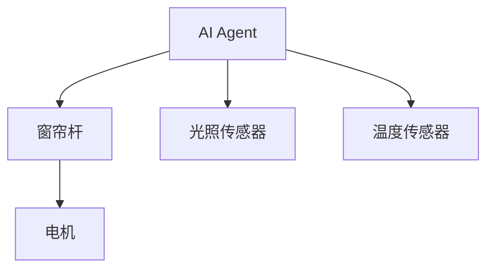
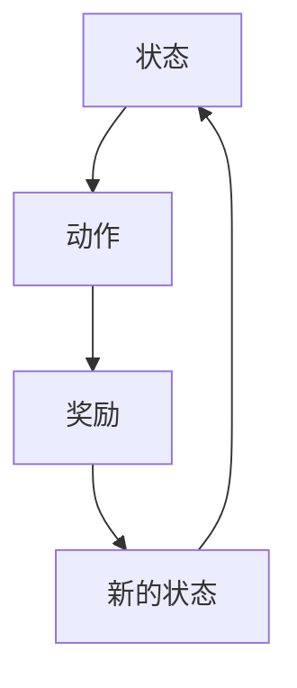
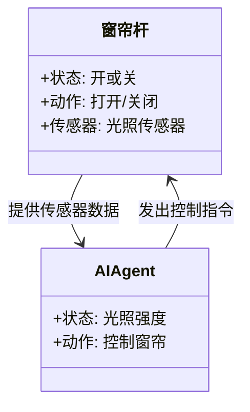
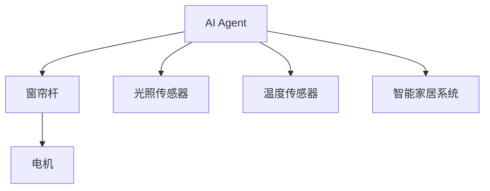
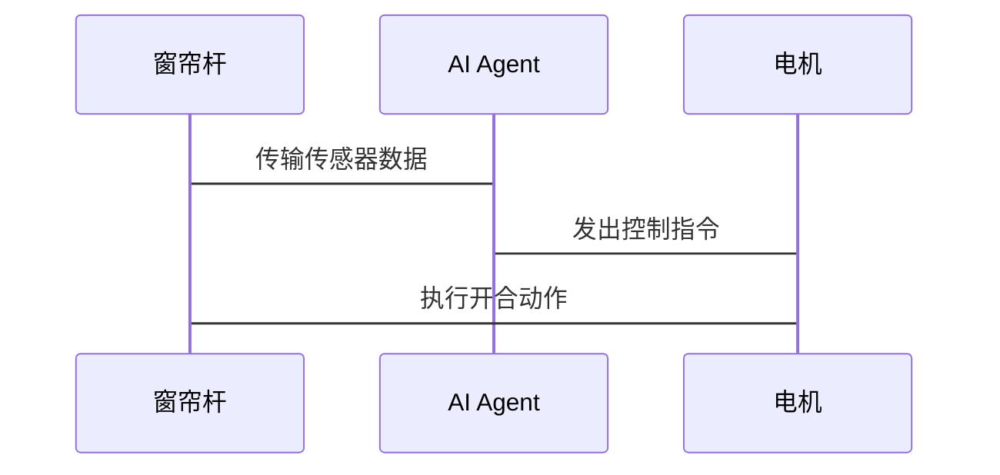

                 


# AI Agent在智能窗帘杆中的日光优化

> 关键词：AI Agent, 智能窗帘杆, 日光优化, 强化学习, 算法实现, 系统架构

> 摘要：本文详细探讨了AI Agent在智能窗帘杆中的日光优化应用，分析了AI Agent的核心原理、日光优化的数学模型，设计了基于强化学习的算法实现，并提出了系统的架构设计方案。文章还提供了项目实战指导和最佳实践建议，帮助读者全面理解和掌握AI Agent在智能窗帘杆中的日光优化技术。

---

## 第一部分: AI Agent与日光优化概述

### 第1章: AI Agent与日光优化的背景介绍

#### 1.1 AI Agent的基本概念

##### 1.1.1 AI Agent的定义
AI Agent（人工智能代理）是指能够感知环境、自主决策并执行任务的智能实体。它能够通过传感器获取信息，利用算法处理信息，并通过执行器与环境交互。

##### 1.1.2 AI Agent的核心特征
- **自主性**：能够自主决策，无需外部干预。
- **反应性**：能够实时感知环境并做出反应。
- **学习能力**：能够通过经验优化决策策略。
- **协作性**：能够与其他系统或人类协作完成任务。

##### 1.1.3 AI Agent在智能系统中的作用
AI Agent广泛应用于自动驾驶、智能助手、机器人等领域，其核心作用是通过智能决策优化系统性能。

---

#### 1.2 日光优化的背景与意义

##### 1.2.1 日光优化的定义
日光优化是指通过智能调节窗帘的开合状态，优化室内光照强度和分布，以达到节能减排、提升舒适度的目的。

##### 1.2.2 日光优化在智能家居中的应用价值
- **节能减排**：通过合理调节窗帘，减少不必要的照明使用，降低能源消耗。
- **提升舒适度**：根据室内人员的需求，调节光照强度，营造舒适的居住环境。
- **智能控制**：结合智能家居系统，实现自动化管理。

##### 1.2.3 智能窗帘杆的日光优化目标
智能窗帘杆的日光优化目标包括最大化自然光照利用、最小化能源消耗、提升用户舒适度等。

---

#### 1.3 AI Agent在智能窗帘杆中的应用

##### 1.3.1 智能窗帘杆的定义与功能
智能窗帘杆是一种集成传感器、执行器和AI Agent的智能设备，能够根据光照、温度、用户需求等因素自动调节窗帘的开合状态。

##### 1.3.2 AI Agent在智能窗帘杆中的作用
- **环境感知**：通过光照传感器感知室内光照强度。
- **决策优化**：基于感知信息，优化窗帘的开合策略。
- **执行控制**：通过电机驱动窗帘执行开合动作。

##### 1.3.3 日光优化的具体应用场景
- **节能模式**：在光照充足时关闭窗帘，减少室内温度上升，降低空调能耗。
- **舒适模式**：根据用户需求调节光照强度，营造舒适的居住环境。
- **自动化模式**：结合智能家居系统，实现全自动化控制。

---

## 第2章: AI Agent与日光优化的核心概念与联系

### 2.1 AI Agent的原理与实现

#### 2.1.1 AI Agent的基本原理
AI Agent通过感知环境、分析信息、制定决策、执行操作的过程，实现智能控制。其核心是基于环境信息的决策优化算法。

#### 2.1.2 AI Agent的核心算法
- **监督学习**：基于标注数据进行训练，适用于规则明确的任务。
- **无监督学习**：通过数据聚类等方法发现隐含模式。
- **强化学习**：通过试错优化决策策略，适用于动态环境中的任务。

#### 2.1.3 AI Agent的决策机制
强化学习是一种常用的决策机制，通过定义状态、动作和奖励函数，优化决策策略。

---

### 2.2 日光优化的数学模型

#### 2.2.1 日光优化的目标函数
$$ \text{目标函数} = \text{光照强度} + \text{能耗优化} $$

#### 2.2.2 日光优化的约束条件
- **光照强度约束**：室内光照强度应在合理范围内。
- **能耗约束**：窗帘的开合动作应尽量减少能源消耗。
- **时间约束**：优化策略应考虑时间段的差异。

#### 2.2.3 日光优化的评价指标
- **能源效率**：单位时间内能源消耗的减少量。
- **舒适度评分**：用户对光照舒适度的评分。
- **响应时间**：窗帘对环境变化的反应速度。

---

### 2.3 AI Agent与日光优化的系统架构

#### 2.3.1 系统架构的组成
- **传感器模块**：光照传感器、温度传感器等。
- **执行器模块**：电机驱动窗帘开合。
- **AI Agent模块**：负责决策和控制。
- **通信模块**：与智能家居系统交互。

#### 2.3.2 AI Agent与日光优化的交互流程
1. **感知环境**：传感器采集光照强度、温度等信息。
2. **分析决策**：AI Agent根据传感器数据优化窗帘开合策略。
3. **执行操作**：驱动电机执行开合动作。
4. **反馈优化**：根据环境变化和用户反馈优化策略。

#### 2.3.3 实体关系图（Mermaid）


---

## 第三部分: AI Agent的日光优化算法原理

### 第3章: AI Agent的日光优化算法

#### 3.1 强化学习在日光优化中的应用

##### 3.1.1 强化学习的基本原理
强化学习是一种通过试错优化决策策略的算法。智能体通过与环境交互，学习最优策略以最大化累计奖励。

##### 3.1.2 Q-learning算法在日光优化中的应用
Q-learning是一种常用的强化学习算法，适用于离散状态和动作空间。

##### 3.1.3 算法流程图（Mermaid）


##### 3.1.4 Python实现代码
```python
import numpy as np

# 初始化Q表
Q = np.zeros([状态空间大小, 动作空间大小])

# 参数设置
alpha = 0.1  # 学习率
gamma = 0.9  # 折扣因子

# Q-learning算法
def q_learning(状态):
    for 动作 in range(动作空间大小):
        Q[状态, 动作] = Q[状态, 动作] + alpha * (奖励 + gamma * max(Q[新状态, :]) - Q[状态, 动作])
    return Q

# 示例调用
q_learning(当前状态)
```

---

## 第四部分: 系统分析与架构设计

### 第4章: 系统分析与架构设计

#### 4.1 项目场景介绍
智能窗帘杆系统需要实现基于光照强度的智能调节，结合AI Agent优化日光利用。

#### 4.2 系统功能设计

##### 4.2.1 领域模型类图（Mermaid）


#### 4.3 系统架构设计

##### 4.3.1 系统架构图（Mermaid）


#### 4.4 系统接口设计
- **输入接口**：光照传感器、温度传感器数据。
- **输出接口**：电机控制信号。
- **通信接口**：与智能家居系统的数据交互。

#### 4.5 系统交互流程图（Mermaid）


---

## 第五部分: 项目实战

### 第5章: 项目实战

#### 5.1 环境安装

##### 5.1.1 安装Python环境
```bash
python --version
pip install numpy
pip install matplotlib
```

#### 5.2 核心代码实现

##### 5.2.1 AI Agent核心代码
```python
class AI_Agent:
    def __init__(self):
        self.state = 0  # 当前状态
        self.actions = ['open', 'close']  # 可选动作
        self.reward = 0  # 奖励值

    def perceive(self, light_intensity):
        self.state = light_intensity  # 感知光照强度

    def decide(self):
        # 简单的决策逻辑：当光照强度低于阈值时打开窗帘
        if self.state < 50:
            return 'open'
        else:
            return 'close'

    def update_reward(self, reward):
        self.reward = reward
```

##### 5.2.2 窗帘杆控制代码
```python
class Curtain:
    def __init__(self):
        self.state = 'close'  # 当前状态

    def open(self):
        self.state = 'open'

    def close(self):
        self.state = 'close'

    def get_state(self):
        return self.state
```

#### 5.3 代码应用解读与分析
- **AI Agent**：通过感知光照强度，决定窗帘的开合状态。
- **窗帘杆**：根据AI Agent的决策执行开合动作。
- **系统交互**：AI Agent与窗帘杆通过接口进行数据交互。

#### 5.4 实际案例分析
假设当前光照强度为40，AI Agent决定打开窗帘。执行后，系统反馈奖励值为+1。

#### 5.5 项目小结
通过AI Agent实现智能窗帘杆的日光优化，能够有效提升能源利用效率和用户舒适度。

---

## 第六部分: 最佳实践

### 第6章: 最佳实践

#### 6.1 小结
AI Agent在智能窗帘杆中的日光优化是一个复杂的系统工程，涉及感知、决策和执行等多个环节。

#### 6.2 注意事项
- **数据质量**：确保传感器数据的准确性和实时性。
- **算法优化**：根据实际需求调整强化学习的参数。
- **系统安全**：确保系统免受网络攻击。

#### 6.3 拓展阅读
- **强化学习**：深入学习Q-learning等强化学习算法。
- **系统架构**：研究分布式系统架构设计。

---

## 附录

### 附录A: 参考文献
- 强化学习相关论文
- AI Agent相关技术文档
- 智能家居系统设计资料

### 附录B: 代码索引
- AI Agent核心代码
- 窗帘杆控制代码
- 系统交互代码

---

作者：AI天才研究院/AI Genius Institute & 禅与计算机程序设计艺术 /Zen And The Art of Computer Programming

---

本文通过系统化的分析和实践，详细探讨了AI Agent在智能窗帘杆中的日光优化技术，为读者提供了一个全面的技术视角和实践指南。

