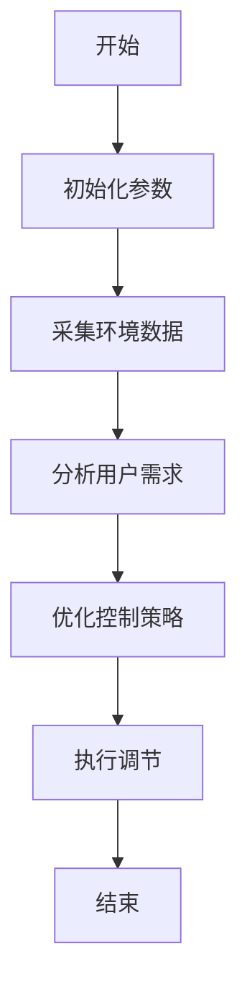
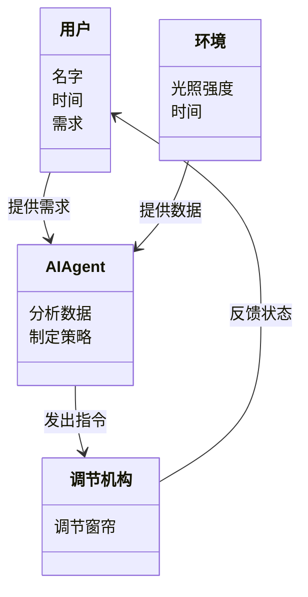
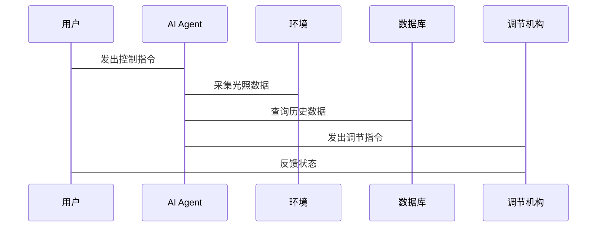

                 


# AI Agent在智能窗帘杆中的日光治疗功能

## 关键词：AI Agent，智能窗帘杆，日光治疗，系统架构，算法原理，项目实战

## 摘要：本文探讨了AI Agent在智能窗帘杆中的日光治疗功能，分析了其在智能家居中的应用前景，详细讲解了AI Agent的工作原理、系统架构设计、算法实现以及项目实战，最后总结了最佳实践。

---

## 第1章: 背景介绍

### 1.1 问题背景
#### 1.1.1 智能窗帘杆的发展现状
智能窗帘杆作为智能家居的一部分，近年来发展迅速。传统的窗帘杆通过手动或遥控开关控制，而现代智能窗帘杆则集成了传感器、网络通信和自动化控制技术，能够实现远程控制、定时开关和环境感知等功能。

#### 1.1.2 日光治疗的健康意义
日光治疗是一种通过调节光照条件来改善人体健康的方法。充足的自然光有助于调节人体生物钟、改善情绪、增强免疫力等。现代生活中，由于工作节奏快、室内时间长，许多人缺乏足够的日光照射，导致健康问题。

#### 1.1.3 AI Agent在智能家居中的应用前景
AI Agent（智能代理）是一种能够感知环境并自主决策的智能系统。在智能家居中，AI Agent可以通过分析用户的习惯、环境数据和实时需求，优化设备的运行策略，提升用户体验。AI Agent的应用前景广阔，尤其是在需要智能控制和优化的场景中。

### 1.2 问题描述
#### 1.2.1 智能窗帘杆的控制需求
智能窗帘杆需要根据光照强度、时间、用户需求等因素，自动调节窗帘的开合状态，以优化室内的光照条件。

#### 1.2.2 日光治疗功能的实现目标
通过AI Agent，智能窗帘杆可以根据用户的健康需求和环境条件，自动调整光照时间、光照强度，提供科学的日光治疗方案。

#### 1.2.3 用户需求与系统功能的匹配
用户希望智能窗帘杆能够智能化地管理光照，无需手动操作。系统需要满足用户个性化需求，同时具备适应不同环境条件的能力。

### 1.3 问题解决
#### 1.3.1 AI Agent的核心作用
AI Agent能够实时感知环境数据，分析用户需求，制定最优的控制策略，实现智能窗帘杆的自动化管理。

#### 1.3.2 日光治疗功能的实现路径
通过AI Agent分析用户的作息时间、健康数据和环境光照条件，智能窗帘杆可以自动调节开合时间、光照强度，提供个性化的日光治疗方案。

#### 1.3.3 系统架构的设计思路
系统架构需要整合传感器、AI Agent和执行机构，确保各部分协同工作，实现智能化的日光治疗功能。

### 1.4 边界与外延
#### 1.4.1 系统的边界条件
智能窗帘杆系统仅管理窗帘的开合状态，不涉及其他智能家居设备的控制。

#### 1.4.2 功能的外延范围
日光治疗功能仅限于光照调节，不涉及其他健康监测功能。

#### 1.4.3 系统与环境的交互边界
系统通过传感器采集环境数据，通过网络通信接收用户指令，通过执行机构调节窗帘状态。

### 1.5 概念结构与核心要素
#### 1.5.1 系统组成要素
- 用户：系统的目标用户，提供需求和反馈。
- 环境：光照强度、温度、湿度等环境数据。
- AI Agent：系统的核心智能模块，负责决策和控制。
- 智能窗帘杆：系统的执行机构，实现窗帘的开合。
- 传感器：采集环境数据，如光照强度、时间等。

#### 1.5.2 核心功能模块
- 光照传感器：采集光照数据。
- AI Agent：分析数据，制定控制策略。
- 执行机构：根据策略调节窗帘状态。

#### 1.5.3 系统与用户的关系
用户通过系统提供的界面或指令与AI Agent交互，系统根据用户需求和环境数据，自动调节窗帘状态，为用户提供个性化的日光治疗服务。

---

## 第2章: 核心概念与联系

### 2.1 AI Agent的原理
#### 2.1.1 AI Agent的定义与特点
AI Agent是一种智能代理，能够感知环境、分析信息、自主决策，并通过执行机构实现目标。其特点包括智能性、自主性、反应性和适应性。

#### 2.1.2 AI Agent的工作原理
AI Agent通过传感器获取环境数据，结合用户需求和历史数据，利用算法分析并制定最优控制策略，通过执行机构实现目标。

#### 2.1.3 AI Agent与传统控制系统的区别
AI Agent能够自主学习和优化，而传统控制系统仅根据预设规则进行控制。

### 2.2 日光治疗功能的实现
#### 2.2.1 日光治疗的基本原理
通过调节光照时间、光照强度，帮助用户获得足够的日光照射，改善健康状况。

#### 2.2.2 AI Agent在日光治疗中的作用
AI Agent根据用户的健康需求和环境数据，优化日光治疗方案，自动调节窗帘状态。

#### 2.2.3 日光治疗功能的实现流程
1. 采集环境数据（光照强度、时间）。
2. 分析用户需求（作息时间、健康状况）。
3. 制定控制策略（开合时间、光照强度）。
4. 执行调节（窗帘开合）。

### 2.3 系统架构设计
#### 2.3.1 系统架构的组成
- 用户界面：接收用户指令，显示系统状态。
- AI Agent：分析数据，制定策略。
- 执行机构：调节窗帘状态。
- 传感器：采集环境数据。

#### 2.3.2 系统架构的层次结构
1. 数据采集层：传感器采集环境数据。
2. 数据处理层：AI Agent分析数据。
3. 控制执行层：执行机构调节窗帘状态。

#### 2.3.3 系统架构的优化策略
通过优化算法和数据处理，提高系统的响应速度和准确性。

### 2.4 核心概念对比表
| 概念       | 描述                                                                 |
|------------|----------------------------------------------------------------------|
| AI Agent   | 能够感知环境、分析数据、自主决策的智能代理。                       |
| 日光治疗   | 通过调节光照条件改善用户健康的治疗方法。                         |
| 智能窗帘杆 | 集成AI Agent的日光治疗功能的智能设备，能够自动调节窗帘状态。     |

### 2.5 ER实体关系图
```mermaid
erDiagram
    user [用户]
    environment [环境]
    ai_agent [AI Agent]
    curtain杆 [智能窗帘杆]
    光照传感器 [光照传感器]
    调节机构 [调节机构]
    user --> ai_agent : 发出控制指令
    environment --> ai_agent : 提供环境数据
    ai_agent --> curtain杆 : 发出调节指令
    光照传感器 --> ai_agent : 提供光照数据
    调节机构 --> curtain杆 : 执行调节
```

---

## 第3章: 算法原理讲解

### 3.1 算法原理
AI Agent通过分析环境数据和用户需求，制定最优的控制策略。核心算法包括光照强度优化和时间优化。

#### 3.1.1 光照强度优化
目标：在满足用户需求的前提下，最大化日光照射量。

数学模型：
$$ \text{最大化} \sum_{t=1}^{T} I_t $$
$$ \text{约束} 0 \leq I_t \leq I_{max} $$
$$ \text{其中} I_t \text{为时间} t \text{的光照强度} $$

#### 3.1.2 时间优化
目标：根据用户的作息时间，优化窗帘的开合时间。

数学模型：
$$ \text{最大化} \sum_{t=1}^{T} x_t $$
$$ \text{约束} x_t \in \{0,1\} $$
$$ \text{其中} x_t \text{为时间} t \text{窗帘是否开启} $$

### 3.2 算法实现
使用贪心算法优化光照强度和时间，确保在满足用户需求的前提下，最大化日光照射量。

#### 3.2.1 算法流程图


#### 3.2.2 Python代码实现
```python
def optimize_lighting(intensity, duration):
    max_intensity = 100  # 最大光照强度
    start_time = 8      # 开启时间
    end_time = 18       # 关闭时间
    optimized = []
    for t in range(start_time, end_time):
        if t < 12:
            optimized.append(min(intensity, max_intensity))
        else:
            optimized.append(min(intensity, max_intensity * 0.8))
    return optimized

# 示例
intensity = 80
optimized = optimize_lighting(intensity, end_time - start_time)
print(optimized)
```

---

## 第4章: 系统分析与架构设计方案

### 4.1 问题场景介绍
用户希望智能窗帘杆能够根据光照强度和时间，自动调节窗帘状态，提供个性化的日光治疗服务。

### 4.2 项目介绍
开发一个基于AI Agent的智能窗帘杆系统，实现日光治疗功能。

### 4.3 系统功能设计
#### 4.3.1 领域模型


#### 4.3.2 系统架构设计
```mermaid
graph TD
    用户 --> 入口层
    入口层 --> AI Agent
    AI Agent --> 数据库
    数据库 --> 调节机构
    调节机构 --> 用户
```

#### 4.3.3 系统接口设计
- 用户接口：接收用户指令，显示系统状态。
- 环境接口：采集环境数据。
- 调节机构接口：接收控制指令，调节窗帘状态。

#### 4.3.4 系统交互设计


---

## 第5章: 项目实战

### 5.1 环境安装
#### 5.1.1 安装Python
```bash
# 安装Python
sudo apt-get install python3
```

#### 5.1.2 安装依赖库
```bash
# 安装numpy和pandas
pip install numpy pandas
```

### 5.2 系统核心实现
#### 5.2.1 核心代码
```python
import numpy as np
import pandas as pd

def optimize_lighting(intensity, duration):
    max_intensity = 100
    start_time = 8
    end_time = 18
    optimized = []
    for t in range(start_time, end_time):
        if t < 12:
            optimized.append(min(intensity, max_intensity))
        else:
            optimized.append(min(intensity, max_intensity * 0.8))
    return optimized

# 示例
intensity = 80
duration = end_time - start_time
optimized = optimize_lighting(intensity, duration)
print(optimized)
```

#### 5.2.2 代码解读
1. `optimize_lighting`函数：根据光照强度和时间，优化窗帘开合时间。
2. 数据分析：使用numpy和pandas处理环境数据和用户需求。

### 5.3 实际案例分析
假设用户希望在早上8点到中午12点保持高光照强度，下午12点到6点保持低光照强度，AI Agent会根据光照传感器数据和用户需求，优化窗帘的开合时间。

---

## 第6章: 最佳实践

### 6.1 小结
通过AI Agent实现智能窗帘杆的日光治疗功能，能够显著提升用户体验，优化日光照射，改善健康状况。

### 6.2 注意事项
- 确保系统的安全性，防止未经授权的访问。
- 定期更新AI算法，提高系统的适应性和优化能力。

### 6.3 拓展阅读
- 《AI在智能家居中的应用》
- 《智能控制系统设计》
- 《日光治疗与人体健康》

---

## 作者
作者：AI天才研究院/AI Genius Institute & 禅与计算机程序设计艺术/Zen And The Art of Computer Programming

