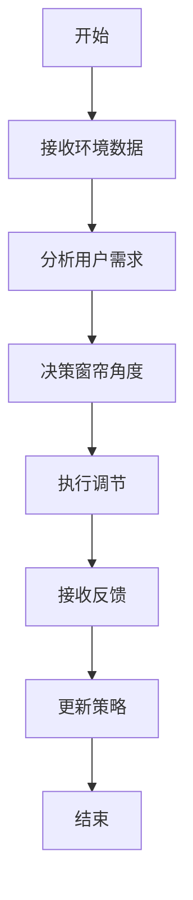

                 


# AI Agent在智能窗帘杆中的自然光优化

## 关键词：AI Agent，智能窗帘杆，自然光优化，强化学习，系统架构设计

## 摘要：  
本文探讨了AI Agent在智能窗帘杆中的应用，重点分析了如何通过AI技术优化自然光的利用。文章从问题背景、核心概念、算法原理、系统架构设计、项目实战等多方面展开，详细阐述了AI Agent如何感知、决策和优化自然光的调节过程。通过具体案例分析和系统架构设计，展示了AI技术在智能窗帘杆中的实际应用价值。

---

## 第一部分: 问题背景与概念

### 第1章: 问题背景与描述

#### 1.1 问题背景
自然光的利用对于节能减排、提升室内舒适度具有重要意义。然而，传统窗帘杆的调节方式单一，难以根据光照强度、用户需求和环境变化进行智能优化。AI Agent作为一种智能决策系统，能够通过感知和学习，实现对自然光的精准调节。

#### 1.2 问题描述
- **自然光优化的目标**：最大化自然光的利用，减少能源浪费，同时避免过强或过弱的光照对用户的影响。
- **智能窗帘杆的调节机制**：通过传感器感知光照强度、温度、湿度等环境参数，并根据用户需求调整窗帘的开合程度。
- **AI Agent的具体任务**：实时感知环境数据，学习用户偏好，制定最优的窗帘调节策略。

#### 1.3 问题解决与边界
- **解决方案**：AI Agent通过强化学习和反馈机制，动态调整窗帘杆的开合角度，实现自然光的智能优化。
- **边界与限制**：系统仅考虑自然光的调节，不涉及人工光源的控制；用户需求的输入范围有限。
- **外延与扩展**：未来可以扩展至结合人工光源和智能家居系统，实现全场景的光环境优化。

### 第2章: 核心概念与联系

#### 2.1 AI Agent的核心原理
- **定义与特征**：AI Agent是一种能够感知环境、自主决策并执行任务的智能体。它具有感知能力、学习能力、决策能力和执行能力。
- **分类与应用场景**：在智能窗帘杆中，AI Agent主要应用于环境感知、用户行为预测和智能调节。
- **AI Agent的角色**：作为智能窗帘杆的核心决策系统，AI Agent负责接收传感器数据，分析用户需求，并制定调节策略。

#### 2.2 智能窗帘杆的系统构成
- **物理结构**：包括窗帘杆、电机、传感器（光照强度、温度、湿度）和通信模块。
- **传感器与执行器**：光照传感器用于感知自然光强度，电机负责调节窗帘的开合角度。
- **通信机制**：通过Wi-Fi或蓝牙与用户终端设备（手机、平板）进行数据交互。

#### 2.3 AI Agent与智能窗帘杆的关系
- **自然光感知与分析**：AI Agent通过光照传感器获取实时光照强度，并结合历史数据和用户需求，预测未来的光照变化。
- **窗帘杆的控制与优化**：AI Agent根据当前光照强度和用户需求，动态调整窗帘的开合角度，实现自然光的最优利用。
- **用户需求的匹配**：通过学习用户的使用习惯和偏好，AI Agent能够提供个性化的自然光调节方案。

#### 2.4 核心概念对比表
| 比较维度 | AI Agent | 传统自动化控制 | 自然光优化 |
|----------|-----------|----------------|------------|
| 控制方式 | 智能决策 | 固定程序 | 用户自定义 |
| 学习能力 | 具备 | 无 | 部分具备 |
| 适应性 | 高 | 低 | 中 |

#### 2.5 ER实体关系图
```mermaid
erDiagram
    class 窗帘杆 {
        窗帘杆ID
        当前角度
        状态
    }
    class 光线传感器 {
        传感器ID
        光照强度
        时间戳
    }
    class 用户需求 {
        用户ID
        光照偏好
        时间范围
    }
    窗帘杆 --> 光线传感器 : 包含
    窗帘杆 --> 用户需求 : 关联
```

---

## 第二部分: 算法原理

### 第3章: AI Agent的算法原理

#### 3.1 算法原理概述
- **强化学习**：通过试错和奖励机制，AI Agent学习最优的窗帘调节策略。
- **监督学习**：基于用户的历史数据，AI Agent预测用户的光照偏好。
- **反馈机制**：根据用户的实时反馈，动态调整窗帘的开合角度。

#### 3.2 算法流程图


#### 3.3 数学模型与公式
- **强化学习的数学模型**：
  $$ R = r_t + \gamma r_{t+1} + \gamma^2 r_{t+2} + \dots $$
  其中，\( R \) 为总奖励，\( r_t \) 为第 \( t \) 步的奖励，\( \gamma \) 为折扣因子。
- **监督学习的数学模型**：
  $$ y = f(x; \theta) $$
  其中，\( x \) 为输入数据，\( y \) 为预测值，\( \theta \) 为模型参数。

#### 3.4 举例说明
- **强化学习的实例分析**：假设当前光照强度为100 lux，用户偏好为80-120 lux。AI Agent通过调整窗帘角度，使光照强度逐步接近目标范围。
- **监督学习的实例分析**：根据用户过去10天的光照调节记录，AI Agent预测明天的光照调节需求。

---

## 第三部分: 系统分析与架构设计

### 第4章: 系统分析与架构设计

#### 4.1 项目背景与目标
- **项目背景**：随着智能家居的普及，用户对智能窗帘杆的需求日益增加。
- **项目目标**：实现基于AI Agent的智能窗帘杆，优化自然光的利用。
- **项目范围**：仅考虑自然光的调节，不涉及其他光源。

#### 4.2 系统功能设计
- **自然光感知模块**：通过光线传感器实时感知光照强度。
- **AI Agent决策模块**：根据光照强度和用户需求，决策窗帘的开合角度。
- **窗帘杆执行模块**：根据决策结果，调整窗帘的开合角度。
- **用户交互模块**：通过手机或平板接收用户的调节指令。

#### 4.3 系统架构设计
```mermaid
graph TD
    AI-Agent --> 窗帘杆 : 控制指令
    窗帘杆 --> 光线传感器 : 光照数据
    窗帘杆 --> 用户需求 : 用户指令
    AI-Agent --> 用户需求 : 预测结果
    AI-Agent --> 光线传感器 : 状态反馈
```

---

## 第四部分: 项目实战

### 第5章: 项目实战

#### 5.1 环境安装
- **硬件安装**：安装窗帘杆、光线传感器和电机。
- **软件安装**：部署AI Agent和相关算法框架。

#### 5.2 系统核心实现
```python
# 示例代码：AI Agent的决策模块
def decide_blade_angle(current_light, user_preference):
    # 简单的决策逻辑
    if current_light < user_preference[0]:
        return "open"
    elif current_light > user_preference[1]:
        return "close"
    else:
        return "adjust"
```

#### 5.3 案例分析
- **案例1**：用户偏好光照强度为80-120 lux，当前光照强度为150 lux。AI Agent决策关闭窗帘。
- **案例2**：用户偏好光照强度为100-140 lux，当前光照强度为90 lux。AI Agent决策打开窗帘。

---

## 第五部分: 总结与展望

### 第6章: 总结与展望

#### 6.1 最佳实践 Tips
- 确保传感器的高精度和稳定性。
- 定期更新AI Agent的决策模型，以适应用户需求的变化。
- 优化算法的运行效率，减少延迟。

#### 6.2 本章小结
本文详细探讨了AI Agent在智能窗帘杆中的应用，分析了自然光优化的核心概念、算法原理和系统架构设计，并通过实际案例展示了AI技术在智能窗帘杆中的巨大潜力。

#### 6.3 注意事项
- 确保系统的安全性，防止数据泄露。
- 定期维护硬件设备，确保其正常运行。

#### 6.4 拓展阅读
- 《强化学习：理论与应用》
- 《智能系统架构设计》

---

## 作者：AI天才研究院/AI Genius Institute & 禅与计算机程序设计艺术 /Zen And The Art of Computer Programming

---

希望这篇文章能够为读者提供清晰的思路和详细的解读，帮助大家更好地理解AI Agent在智能窗帘杆中的应用。

