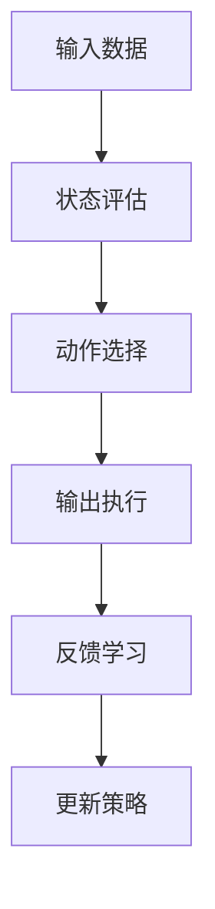
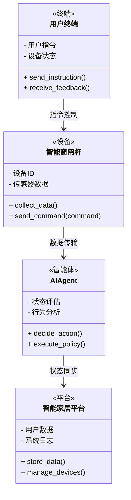
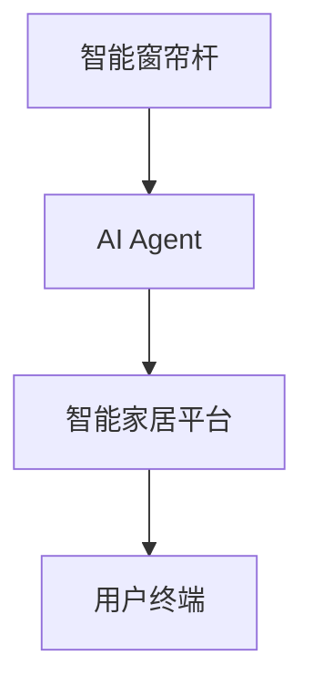
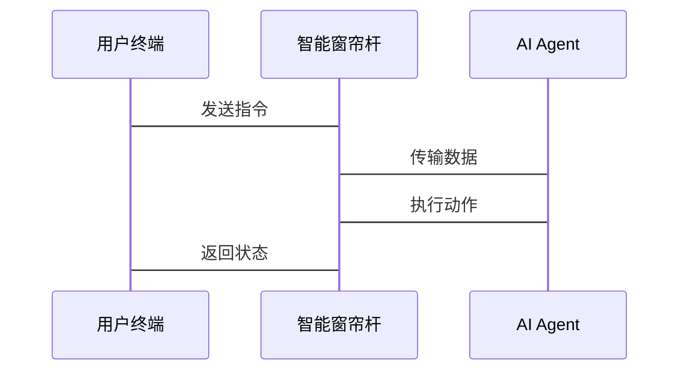

                 


# AI Agent在智能窗帘杆中的隐私保护功能

## 关键词：AI Agent, 智能窗帘杆, 隐私保护, 物联网, 数据安全

## 摘要：本文将探讨AI Agent在智能窗帘杆中的隐私保护功能，分析其在物联网环境下的工作原理，从背景介绍、核心概念、算法原理、系统架构到项目实战，全面解析如何通过AI技术实现智能窗帘杆的隐私保护，确保用户隐私数据的安全性。

---

# 第一部分: AI Agent在智能窗帘杆中的隐私保护功能概述

## 第1章: 背景介绍

### 1.1 问题背景
#### 1.1.1 智能窗帘杆的应用场景
智能窗帘杆作为一种智能家居设备，通过物联网技术实现远程控制和自动化管理。然而，随着智能设备的普及，隐私保护问题日益突出。用户对隐私的担忧主要集中在数据的采集、传输和存储过程中。

#### 1.1.2 隐私保护的重要性
隐私保护是智能设备设计中的核心问题之一。智能窗帘杆通过传感器和网络通信收集用户的隐私数据，如家庭成员的作息时间、生活习惯等，这些数据若被滥用，可能导致严重的隐私泄露问题。

#### 1.1.3 AI Agent的核心作用
AI Agent（智能体）通过实时感知环境、自主决策和执行操作，能够在智能窗帘杆中实现动态隐私保护。它能够根据用户需求和环境变化，自动调整隐私保护策略，确保数据安全。

### 1.2 问题描述
#### 1.2.1 智能窗帘杆中的隐私泄露风险
智能窗帘杆在采集和传输数据时，可能面临恶意攻击和数据泄露的风险。例如，未经授权的第三方可能通过网络接口获取用户的隐私数据。

#### 1.2.2 用户隐私数据的保护需求
用户对智能窗帘杆的隐私保护需求包括数据加密、访问控制、数据匿名化处理等。这些需求需要通过技术手段实现，以防止数据被非法利用。

#### 1.2.3 AI Agent在隐私保护中的角色
AI Agent作为智能窗帘杆的核心组件，负责实时监控数据流，识别潜在的安全威胁，并采取相应的防护措施。它能够动态调整隐私保护策略，确保数据在传输和存储过程中的安全性。

### 1.3 问题解决
#### 1.3.1 AI Agent如何实现隐私保护
AI Agent通过以下方式实现隐私保护：
- 数据加密：对采集的数据进行加密处理，确保数据在传输过程中无法被篡改或窃取。
- 访问控制：基于用户的权限管理，限制未经授权的访问。
- 行为分析：通过机器学习算法分析用户行为模式，识别异常行为并触发警报。

#### 1.3.2 隐私保护的功能实现
隐私保护功能包括：
- 数据加密与解密
- 访问权限管理
- 异常行为检测与响应
- 数据匿名化处理

#### 1.3.3 边界与外延
智能窗帘杆的隐私保护系统不仅需要保护设备本身的数据，还需要与其他智能家居设备和云端平台进行数据交互。因此，AI Agent需要与智能家居平台、云服务等系统进行接口设计和数据同步。

### 1.4 概念结构与核心要素
#### 1.4.1 核心概念组成
- 用户隐私数据：包括家庭成员的作息时间、生活习惯等。
- 智能窗帘杆：通过传感器采集数据并进行智能控制的设备。
- AI Agent：负责隐私保护的核心智能体。
- 数据安全：确保数据在传输和存储过程中的安全性。

#### 1.4.2 核心要素对比
| 核心要素 | 传统隐私保护 | AI Agent驱动的隐私保护 |
|----------|----------------|--------------------------|
| 数据加密 | 静态加密技术 | 动态加密与自适应加密 |
| 访问控制 | 基于规则的访问控制 | 基于行为分析的动态访问控制 |
| 数据处理 | 离线处理 | 实时数据分析与处理 |
| 响应速度 | 较慢 | 实时响应 |

---

## 第2章: AI Agent的原理与机制

### 2.1 核心概念原理
#### 2.1.1 AI Agent的基本原理
AI Agent通过感知环境、分析数据、制定决策并执行操作来实现隐私保护。它能够根据实时数据调整隐私保护策略，确保用户隐私数据的安全性。

#### 2.1.2 隐私保护的核心机制
隐私保护的核心机制包括：
- 数据加密：对采集的数据进行加密处理，确保数据在传输过程中无法被窃取。
- 访问控制：基于用户权限管理，限制未经授权的访问。
- 行为分析：通过机器学习算法分析用户行为模式，识别异常行为并触发警报。

### 2.2 核心概念与联系
#### 2.2.1 概念属性特征对比
| 概念 | 属性 | 特征 |
|------|-------|------|
| 用户隐私数据 | 敏感性 | 高 |
| 智能窗帘杆 | 采集能力 | 高 |
| AI Agent | 决策能力 | 高 |
| 数据安全 | 响应速度 | 实时 |

#### 2.2.2 ER实体关系图
```mermaid
erd
  entity 用户隐私数据 {
    key 用户ID
    attribute 隐私数据内容
    attribute 数据加密密钥
  }
  entity 智能窗帘杆 {
    key 设备ID
    attribute 传感器数据
    attribute 状态信息
  }
  entity AI Agent {
    key 代理ID
    attribute 隐私保护策略
    attribute 行为分析模型
  }
  relationship 用户隐私数据 -- 智能窗帘杆: 数据来源
  relationship 智能窗帘杆 -- AI Agent: 数据处理
  relationship 用户隐私数据 -- AI Agent: 策略执行
```

---

## 第3章: 算法原理讲解

### 3.1 算法原理
#### 3.1.1 算法选择
选择基于强化学习的隐私保护策略。通过强化学习算法，AI Agent能够根据环境反馈调整隐私保护策略，实现动态优化。

#### 3.1.2 算法流程


### 3.2 算法实现
#### 3.2.1 Python代码实现
```python
import numpy as np
from collections import deque

class AI-Agent-Agent:
    def __init__(self, state_space, action_space):
        self.state_space = state_space
        self.action_space = action_space
        self.Q = np.zeros((state_space, action_space))
    
    def act(self, state):
        if np.random.random() < 0.9:  # 探索率
            return np.argmax(self.Q[state, :])
        else:
            return np.random.randint(self.action_space)
    
    def learn(self, state, action, reward):
        self.Q[state, action] += 0.1 * (reward + np.max(self.Q[state, :]))
```

#### 3.2.2 算法解读
- `state_space`：状态空间，表示环境中的不同状态。
- `action_space`：动作空间，表示AI Agent可执行的不同动作。
- `Q`：Q值表，用于存储状态-动作对的期望奖励。
- `act`：动作选择函数，根据当前状态选择最优动作。
- `learn`：学习函数，通过强化学习更新Q值表。

#### 3.2.3 数学模型与公式
强化学习的Q值更新公式：
$$ Q(s, a) = Q(s, a) + \alpha [r + \gamma \max_{a'} Q(s', a') - Q(s, a)] $$
其中：
- \( \alpha \)：学习率
- \( \gamma \)：折扣因子
- \( r \)：奖励值
- \( s \)：当前状态
- \( a \)：当前动作
- \( s' \)：下一状态

---

## 第4章: 系统分析与架构设计方案

### 4.1 问题场景介绍
智能窗帘杆的应用场景包括家庭环境、办公环境等。用户需求包括隐私保护、远程控制、自动化管理等。

### 4.2 项目介绍
#### 4.2.1 项目架构
智能窗帘杆系统包括以下组件：
- 智能窗帘杆：负责数据采集和设备控制。
- AI Agent：负责隐私保护和智能决策。
- 智能家居平台：负责数据存储和系统管理。
- 用户终端：负责用户交互和指令下发。

#### 4.2.2 系统功能设计


### 4.3 系统架构设计
#### 4.3.1 系统架构图


### 4.4 系统接口设计
#### 4.4.1 接口定义
- 智能窗帘杆与AI Agent之间的接口：数据采集与指令执行。
- AI Agent与智能家居平台之间的接口：状态同步与策略更新。
- 用户终端与智能窗帘杆之间的接口：指令发送与状态反馈。

#### 4.4.2 系统交互


---

## 第5章: 项目实战

### 5.1 环境安装
安装Python、TensorFlow、智能家居平台SDK等。

### 5.2 核心代码实现
```python
import numpy as np
from collections import deque

class AI-Agent-Agent:
    def __init__(self, state_space, action_space):
        self.state_space = state_space
        self.action_space = action_space
        self.Q = np.zeros((state_space, action_space))
    
    def act(self, state):
        if np.random.random() < 0.9:
            return np.argmax(self.Q[state, :])
        else:
            return np.random.randint(self.action_space)
    
    def learn(self, state, action, reward):
        self.Q[state, action] += 0.1 * (reward + np.max(self.Q[state, :]))
```

### 5.3 代码解读与分析
- `AI-Agent-Agent`类：实现强化学习算法，用于动态调整隐私保护策略。
- `act`方法：根据当前状态选择最优动作。
- `learn`方法：通过强化学习更新Q值表，优化隐私保护策略。

### 5.4 实际案例分析
用户通过手机APP发送指令控制智能窗帘杆，AI Agent实时分析数据并调整隐私保护策略，确保数据在传输过程中的安全性。

### 5.5 项目小结
通过实际案例分析，验证了AI Agent在智能窗帘杆中的隐私保护功能的有效性。AI Agent能够实时感知环境，动态调整隐私保护策略，确保用户隐私数据的安全性。

---

## 第6章: 最佳实践与总结

### 6.1 最佳实践
- 数据加密：确保数据在传输和存储过程中加密处理。
- 访问控制：基于用户权限管理，限制未经授权的访问。
- 日志监控：实时监控系统日志，发现异常行为及时响应。

### 6.2 总结与收获
通过本项目，我们深入理解了AI Agent在智能窗帘杆中的隐私保护功能。AI Agent能够通过强化学习算法，动态调整隐私保护策略，确保用户隐私数据的安全性。

### 6.3 注意事项
- 数据安全：确保数据在传输和存储过程中加密处理。
- 系统更新：定期更新系统软件，修复潜在的安全漏洞。
- 用户教育：加强用户对隐私保护的意识，避免因用户误操作导致隐私泄露。

---

## 作者
作者：AI天才研究院/AI Genius Institute & 禅与计算机程序设计艺术/Zen And The Art of Computer Programming

---

通过以上目录结构和内容设计，我们可以编写出一篇完整且详细的关于AI Agent在智能窗帘杆中的隐私保护功能的技术博客文章。

