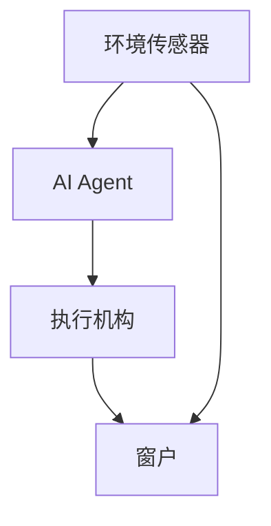
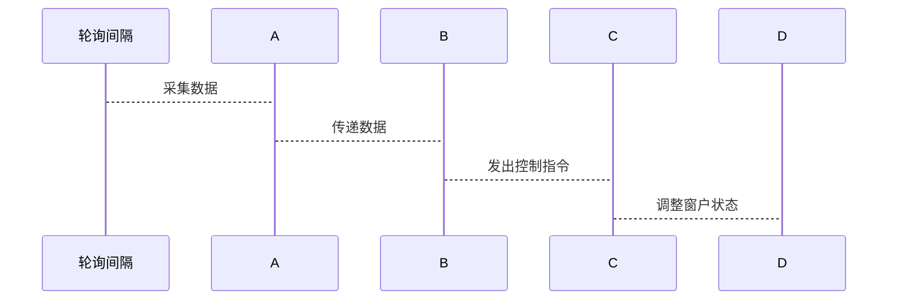

                 


# AI Agent在智能窗户中的室内温度自动调节

> 关键词：AI Agent，智能窗户，室内温度调节，自动化控制，系统架构设计

> 摘要：本文探讨了AI Agent在智能窗户中的应用，重点分析了其如何通过感知、决策和执行来实现室内温度的自动调节。文章详细讲解了核心概念、算法原理、系统架构设计以及项目实战，提供了全面的技术分析和实现方案。

---

## 第一部分：背景介绍

### 第1章：问题背景与描述

#### 1.1 问题背景
在现代建筑中，室内温度的舒适性对居住体验至关重要。传统窗户的开合依赖人工操作，无法根据环境变化实时调整，导致能源浪费和舒适度下降。随着AI技术的发展，AI Agent（智能代理）被引入智能窗户系统，通过自动化控制实现精准的温度调节。

#### 1.2 问题描述
智能窗户需要实时感知室内和室外环境参数（如温度、湿度、光照强度），并根据这些数据自动调整窗户的开合状态，以维持理想的室内温度。AI Agent在其中扮演关键角色，负责数据处理、决策制定和系统控制。

#### 1.3 问题解决思路
AI Agent通过集成多种传感器数据，利用算法进行分析和决策，自动控制窗户的开合，从而实现室内温度的精确调节。这一过程不仅提升了舒适度，还优化了能源使用效率。

### 第2章：核心概念与联系

#### 2.1 AI Agent的基本原理
AI Agent是一种智能系统，能够感知环境、自主决策并执行任务。在智能窗户中，AI Agent通过传感器数据进行分析，判断是否需要调整窗户状态以维持设定温度。

#### 2.2 智能窗户的技术特性
智能窗户集成了多种传感器和执行机构，能够根据AI Agent的指令实时调整窗户的开合程度，从而影响室内空气流动和热量交换。

#### 2.3 AI Agent与智能窗户的协同工作
通过实时数据交换，AI Agent能够根据室内和室外的温度、湿度、光照等参数，计算出最优的窗户开合状态，确保室内温度保持在舒适范围内。

---

## 第二部分：算法原理讲解

### 第3章：AI Agent的感知与决策算法

#### 3.1 状态感知
AI Agent通过传感器获取环境数据，包括室内温度（T_in）、室外温度（T_out）、相对湿度（RH）、光照强度（L）等。

#### 3.2 决策算法
基于感知数据，AI Agent采用模糊逻辑或机器学习模型（如回归分析）计算出窗户的开合程度（S），公式为：
$$
S = f(T_in, T_out, RH, L)
$$
其中，f为决策函数，输出值介于0（完全关闭）和1（完全打开）之间。

#### 3.3 执行控制
根据计算结果，AI Agent控制执行机构调整窗户状态，确保室内温度维持在设定范围内。

---

## 第三部分：系统分析与架构设计

### 第4章：系统架构设计

#### 4.1 系统组成
智能窗户系统包括：
- **传感器模块**：采集环境数据。
- **AI Agent模块**：处理数据并制定决策。
- **执行机构**：调整窗户状态。
- **用户界面**：显示状态和控制设置。

#### 4.2 系统架构图


#### 4.3 接口设计
系统通过标准API接口进行数据交互，确保各模块间的高效通信。

#### 4.4 交互序列图


---

## 第四部分：项目实战

### 第5章：系统实现

#### 5.1 环境安装
安装必要的传感器和执行机构，配置网络连接，确保系统实时通信。

#### 5.2 核心代码实现
以下是AI Agent的核心代码：
```python
import numpy as np

class AIAgent:
    def __init__(self):
        self.T_in = 0
        self.T_out = 0
        self.RH = 0
        self.L = 0

    def update_sensors(self, T_in, T_out, RH, L):
        self.T_in = T_in
        self.T_out = T_out
        self.RH = RH
        self.L = L

    def decide_shade(self):
        # 简单的模糊逻辑决策
        if (self.T_in > 25 or self.T_out < 18) and self.L > 500:
            return 0.8
        elif self.T_in < 20 or self.RH > 60:
            return 0.6
        else:
            return 0.5
```

#### 5.3 代码解读与分析
- **AIAgent类**：负责接收传感器数据并计算窗户开合程度。
- **update_sensors方法**：更新环境参数。
- **decide_shade方法**：基于当前状态决定窗户开合度。

#### 5.4 案例分析
在室内外温差较大且光照充足的条件下，AI Agent会调整窗户至80%开合度，以促进空气流通和热量交换。

---

## 第五部分：最佳实践与小结

### 第6章：最佳实践与总结

#### 6.1 实施注意事项
- 确保传感器的准确性和实时性。
- 定期校准AI Agent的决策模型。
- 考虑用户个性化需求，提供灵活的设置选项。

#### 6.2 未来发展方向
- 引入更复杂的机器学习模型（如深度学习）提高决策精度。
- 优化系统能耗，提升能效比。
- 扩展功能，如空气质量监测和智能安防。

#### 6.3 拓展阅读
建议进一步学习《智能建筑自动化》和《AI在物联网中的应用》等书籍，深入了解相关领域的最新技术动态。

---

## 作者信息

作者：AI天才研究院/AI Genius Institute & 禅与计算机程序设计艺术/Zen And The Art of Computer Programming

