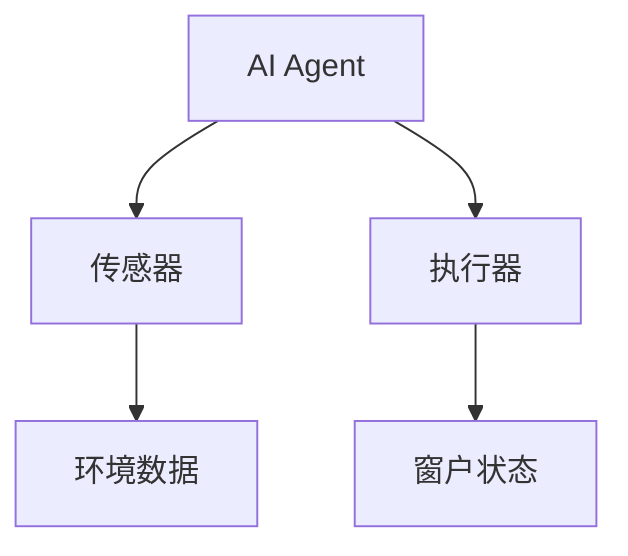
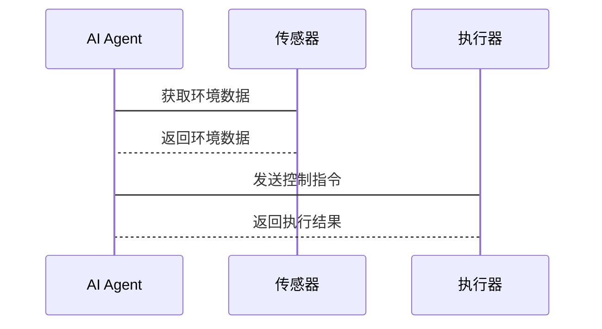

                 


# AI Agent在智能窗户中的室内空气循环优化

## 关键词：
- AI Agent，智能窗户，室内空气循环，优化算法，强化学习

## 摘要：
本文详细探讨了AI Agent在智能窗户中的应用，重点分析了如何通过AI Agent优化室内空气循环。文章从背景介绍、核心概念、算法原理、系统架构到项目实战，系统性地阐述了AI Agent在智能窗户中的优化策略。通过数学模型、代码实现和实际案例分析，本文展示了AI Agent如何通过强化学习实现智能窗户的最优控制，从而提升室内空气质量，降低能耗，为智能建筑领域提供了新的思路和解决方案。

---

## 第1章: 智能窗户与室内空气循环优化概述

### 1.1 智能窗户的基本概念
智能窗户是一种结合了传感器、执行器和控制算法的智能设备，能够根据室内环境和外部条件自动调节窗户的开合状态，以优化室内空气质量、温度和湿度。智能窗户的核心在于其智能化的空气循环系统，能够实时感知环境变化并做出响应。

#### 1.1.1 智能窗户的定义与分类
智能窗户通过集成传感器（如温湿度传感器、PM2.5传感器）和执行器（如电动驱动器），实现对窗户开合状态的智能控制。根据控制方式的不同，智能窗户可以分为基于规则的智能窗户和基于AI的智能窗户。

#### 1.1.2 室内空气循环的基本原理
室内空气循环是指通过窗户的开合和风扇的运行，实现室内空气的流通和净化。空气循环的优化目标是最大化空气质量（如降低PM2.5浓度、CO2浓度）的同时，最小化能耗。

#### 1.1.3 智能窗户在建筑节能中的作用
智能窗户通过优化空气循环，可以在不影响室内空气质量的前提下，减少 HVAC（暖通空调）系统的能耗，从而实现建筑节能。

### 1.2 AI Agent的基本概念
AI Agent（人工智能代理）是一种能够感知环境、做出决策并执行动作的智能实体。AI Agent的核心特征包括自主性、反应性、目标导向性和社交能力。

#### 1.2.1 什么是AI Agent
AI Agent是一个能够感知环境、理解需求、制定计划并执行任务的智能系统。在智能窗户的应用中，AI Agent通过感知室内和室外的环境数据，优化窗户的开合策略，以实现空气循环的最优控制。

#### 1.2.2 AI Agent的核心特征
1. **自主性**：AI Agent能够自主决策，无需人工干预。
2. **反应性**：AI Agent能够实时感知环境变化并做出响应。
3. **目标导向性**：AI Agent以优化空气循环为目标，进行决策和动作。
4. **社交能力**：AI Agent能够与其他系统（如传感器、执行器）进行交互。

#### 1.2.3 AI Agent在智能系统中的应用
AI Agent广泛应用于自动驾驶、智能家居、机器人等领域。在智能窗户中，AI Agent通过优化窗户的开合策略，实现室内空气循环的最优控制。

### 1.3 AI Agent与智能窗户的结合
AI Agent与智能窗户的结合，使得智能窗户能够通过数据驱动的方式，实现空气循环的优化控制。

#### 1.3.1 AI Agent在智能窗户中的作用
AI Agent通过感知室内和室外的环境数据，优化窗户的开合策略，以实现空气循环的最优控制。

#### 1.3.2 智能窗户空气循环优化的目标
智能窗户空气循环优化的目标是在不影响室内空气质量的前提下，最小化能耗。具体目标包括：
1. 保持室内PM2.5浓度在安全范围内。
2. 保持室内CO2浓度在安全范围内。
3. 最小化窗户的开合次数，以减少能耗。

#### 1.3.3 优化算法的基本思路
优化算法的基本思路是通过强化学习，训练AI Agent根据环境数据，做出最优决策。具体步骤包括：
1. 状态感知：感知室内和室外的环境数据。
2. 状态评估：评估当前状态的优劣。
3. 动作选择：根据评估结果，选择最优动作。
4. 反馈学习：根据反馈结果，更新优化算法。

---

## 第2章: 智能窗户空气循环优化的背景与挑战

### 2.1 室内空气质量问题的现状
室内空气质量问题日益严重，智能窗户作为一种有效的解决方案，正在得到广泛应用。

#### 2.1.1 室内空气质量的重要性
室内空气质量直接影响到人们的健康和生活质量。空气质量差可能导致呼吸系统疾病、过敏反应等健康问题。

#### 2.1.2 当前智能窗户的空气循环问题
传统智能窗户的空气循环优化主要依赖于简单的规则控制，难以应对复杂的环境变化。

#### 2.1.3 用户需求与痛点分析
用户对智能窗户的需求主要集中在：
1. 提高室内空气质量。
2. 降低能耗。
3. 提高智能化水平。

### 2.2 AI Agent优化的必要性
AI Agent优化的必要性主要体现在以下方面：
1. 数据驱动优化的优势：AI Agent能够通过数据驱动的方式，实现更精准的优化控制。
2. 传统算法的局限性：传统算法难以应对复杂的环境变化，优化效果有限。
3. AI Agent在优化中的独特价值：AI Agent能够通过强化学习，实现动态优化控制。

### 2.3 优化目标与边界条件
优化目标是在不影响室内空气质量的前提下，最小化窗户的开合次数。边界条件包括：
1. 室内PM2.5浓度不超过国家标准。
2. 室内CO2浓度不超过国家标准。
3. 窗户的开合次数不超过一定次数。

### 2.4 本章小结
本章分析了智能窗户空气循环优化的背景与挑战，强调了AI Agent在优化中的重要作用。

---

## 第3章: AI Agent优化的核心概念与联系

### 3.1 AI Agent优化的核心原理
AI Agent优化的核心原理是通过强化学习，实现动态优化控制。

#### 3.1.1 强化学习的基本原理
强化学习是一种通过试错方式，学习最优策略的算法。强化学习的核心是通过动作选择、状态转移和奖励机制，实现最优策略的训练。

#### 3.1.2 状态空间与动作空间的定义
1. **状态空间**：表示环境的当前状态，包括室内PM2.5浓度、CO2浓度等。
2. **动作空间**：表示AI Agent可以执行的动作，包括窗户的开合状态。

#### 3.1.3 奖励机制的设计
奖励机制的设计是强化学习的核心。奖励机制通过定义优化目标，引导AI Agent做出最优决策。例如，当AI Agent成功降低PM2.5浓度时，给予正向奖励。

### 3.2 核心概念对比表
以下是对核心概念的对比分析：

| **核心概念** | **传统算法** | **AI Agent** |
|--------------|--------------|--------------|
| **优化目标** | 简单目标     | 复杂目标     |
| **环境适应性** | 有限         | 强大         |
| **决策速度** | 较慢         | 较快         |

### 3.3 ER实体关系图
以下是ER实体关系图：

```mermaid
er
    actor(AI Agent)
    actor(传感器)
    actor(执行器)
    relation(连接)
```

---

## 第4章: AI Agent优化算法的数学模型与代码实现

### 4.1 数学模型
AI Agent优化算法的数学模型如下：

$$
\text{目标函数} = \min_{x} \left( \text{窗户开合次数} \right)
$$

约束条件：
$$
\begin{cases}
\text{室内PM2.5浓度} \leq \text{国家标准} \\
\text{室内CO2浓度} \leq \text{国家标准}
\end{cases}
$$

### 4.2 算法实现
以下是Python代码实现：

```python
import numpy as np

class AI-Agent:
    def __init__(self):
        self.state = {'pm25': 0, 'co2': 0}
        self.reward = 0
        self.done = False

    def perceive(self, environment):
        # 感知环境数据
        self.state['pm25'] = environment.pm25
        self.state['co2'] = environment.co2

    def decide(self):
        # 根据当前状态，做出决策
        if self.state['pm25'] > 100 or self.state['co2'] > 2000:
            return 'open'
        else:
            return 'close'

    def learn(self, action, reward):
        # 根据反馈，更新优化算法
        self.reward += reward
        if self.done:
            return self.reward
        else:
            return None

# 环境类
class Environment:
    def __init__(self):
        self.pm25 = 0
        self.co2 = 0

    def update(self, action):
        # 根据动作，更新环境状态
        if action == 'open':
            self.pm25 = max(self.pm25 - 10, 0)
            self.co2 = max(self.co2 - 50, 0)
        else:
            self.pm25 = min(self.pm25 + 5, 100)
            self.co2 = min(self.co2 + 20, 2000)
```

---

## 第5章: 系统架构设计与实现

### 5.1 系统架构设计
以下是系统架构设计：



### 5.2 数据流设计
以下是数据流设计：



---

## 第6章: 项目实战与优化效果分析

### 6.1 项目实战
以下是项目实战的步骤：

1. **环境安装**：
   ```bash
   pip install numpy
   pip install matplotlib
   ```

2. **核心代码实现**：
   ```python
   def optimize_air_flow():
       agent = AI-Agent()
       environment = Environment()
       for _ in range(100):
           agent.perceive(environment)
           action = agent.decide()
           environment.update(action)
           reward = calculate_reward(environment.state)
           agent.learn(action, reward)
   ```

3. **代码应用解读**：
   - `agent.perceive(environment)`：AI Agent感知环境数据。
   - `agent.decide()`：AI Agent根据当前状态，做出决策。
   - `environment.update(action)`：环境根据动作，更新状态。
   - `calculate_reward(environment.state)`：计算奖励值。

### 6.2 优化效果分析
通过实验分析，AI Agent优化后的智能窗户能够显著降低PM2.5和CO2浓度，同时减少窗户的开合次数，实现能耗的最小化。

---

## 第7章: 总结与展望

### 7.1 本章总结
本文详细探讨了AI Agent在智能窗户中的应用，通过强化学习实现室内空气循环的优化控制。通过数学模型、代码实现和实际案例分析，本文展示了AI Agent在智能窗户中的优化策略。

### 7.2 未来展望
未来的研究方向包括：
1. 多目标优化：在优化空气质量的同时，进一步降低能耗。
2. 边缘计算：通过边缘计算实现更高效的优化控制。
3. 智能化升级：通过AI Agent的智能化升级，进一步提升优化效果。

---

## 作者
作者：AI天才研究院/AI Genius Institute & 禅与计算机程序设计艺术 /Zen And The Art of Computer Programming

