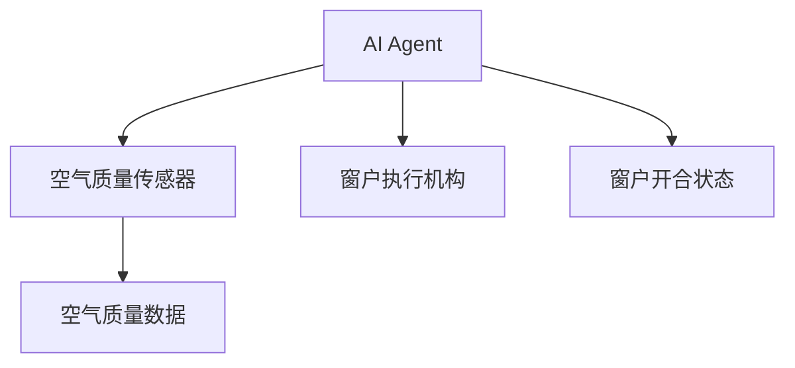

                 


# AI Agent在智能窗户中的室内空气质量控制

## 关键词：室内空气质量，AI Agent，智能窗户，传感器，环境控制，算法优化

## 摘要：本文探讨了AI Agent在智能窗户中的应用，重点分析了如何通过AI Agent优化室内空气质量。文章从背景、概念、算法、系统架构到项目实战，详细阐述了AI Agent在智能窗户中的实现过程，并通过实际案例展示了其在环境控制中的优势。

---

## 第一部分: AI Agent与智能窗户概述

### 第1章: AI Agent与智能窗户的背景介绍

#### 1.1 问题背景
- **1.1.1 室内空气质量的重要性**  
  室内空气质量直接影响居住者的健康和舒适度。随着人们对居住环境的要求越来越高，智能窗户在调节室内空气质量方面扮演着重要角色。通过AI Agent，智能窗户能够实时感知环境变化，并做出相应的调整，如开启或关闭窗户，以维持最佳的空气质量。

- **1.1.2 智能窗户的定义与特点**  
  智能窗户是一种结合了物联网技术的窗户系统，能够根据外部环境和室内需求自动调整开合状态。其特点包括：
  - 自动化控制：通过传感器和执行机构实现自动化操作。
  - 智能感知：能够实时感知空气质量、温度、湿度等参数。
  - 节能环保：通过优化通风策略降低能耗。

- **1.1.3 AI Agent在智能窗户中的作用**  
  AI Agent（智能代理）作为智能窗户的核心控制单元，负责接收传感器数据，分析环境变化，并通过算法优化窗户的开合策略，以维持室内空气质量在最佳状态。

---

#### 1.2 问题描述
- **1.2.1 室内空气质量监测的挑战**  
  室内空气质量受多种因素影响，如室外污染物、室内人员活动、温度和湿度等。传统的手动调节窗户方式效率低下，难以实时应对环境变化。

- **1.2.2 智能窗户的控制目标**  
  智能窗户的目标是通过自动化控制，保持室内空气质量在健康和舒适的范围内，同时节约能源。

- **1.2.3 AI Agent在智能窗户中的应用场景**  
  AI Agent可以在以下场景中发挥作用：
  - 实时监测室内空气质量，根据数据调整窗户开合。
  - 在雾霾天气或高污染时段自动关闭窗户，防止污染物进入。
  - 根据室内二氧化碳浓度自动开启窗户，保证空气新鲜。

---

#### 1.3 问题解决
- **1.3.1 AI Agent的核心功能**  
  AI Agent的核心功能包括：
  - 数据采集：接收来自传感器的空气质量数据。
  - 数据分析：通过算法处理数据，判断当前环境状态。
  - 决策控制：根据分析结果，发出控制指令，调整窗户开合状态。

- **1.3.2 智能窗户的空气质量优化策略**  
  智能窗户通过AI Agent实现以下优化策略：
  - 根据室外空气质量动态调整窗户开合时间。
  - 在保证空气质量的前提下，优化通风策略以降低能耗。

- **1.3.3 AI Agent与智能窗户的协同工作**  
  AI Agent与智能窗户协同工作，通过实时数据反馈和智能决策，实现对室内空气质量的精确控制。

---

#### 1.4 边界与外延
- **1.4.1 系统的边界条件**  
  系统的边界条件包括：
  - 仅考虑室内空气质量，不涉及温度和湿度的全面控制。
  - 窗户的开合仅依赖于空气质量数据，不考虑其他因素（如声音、光线等）。

- **1.4.2 系统的外延功能**  
  系统的外延功能包括：
  - 结合温度和湿度传感器，实现更全面的环境控制。
  - 集成智能家居系统，与其他设备协同工作。

- **1.4.3 系统的限制与假设**  
  系统的限制包括：
  - 仅适用于单个房间或独立空间。
  - 传感器精度有限，可能存在数据偏差。

---

#### 1.5 概念结构与核心要素
- **1.5.1 系统的核心概念**  
  系统的核心概念包括：
  - AI Agent：智能代理，负责数据处理和决策。
  - 传感器：采集空气质量数据。
  - 执行机构：根据指令调整窗户开合。

- **1.5.2 系统的组成部分**  
  系统的组成部分包括：
  - 传感器模块：监测室内空气质量。
  - AI Agent模块：处理数据并发出控制指令。
  - 执行机构：调整窗户开合状态。

- **1.5.3 系统的核心要素组成**  
  系统的核心要素包括：
  - 空气质量传感器：CO2传感器、PM2.5传感器。
  - AI算法：用于数据处理和决策的算法。
  - 窗户执行机构：电动窗户驱动器。

---

### 第2章: AI Agent的核心概念与联系

#### 2.1 AI Agent的原理
- **2.1.1 AI Agent的定义**  
  AI Agent是一种能够感知环境并采取行动以实现目标的智能实体。在智能窗户中，AI Agent负责接收空气质量数据，并根据预设的目标（如保持空气质量在健康范围内）调整窗户的开合状态。

- **2.1.2 AI Agent的核心原理**  
  AI Agent的核心原理包括：
  - 感知：通过传感器获取环境数据。
  - 决策：基于感知数据进行分析和判断。
  - 执行：根据决策结果采取行动。

- **2.1.3 AI Agent的感知、决策与执行**  
  AI Agent通过以下步骤实现对智能窗户的控制：
  1. 感知：接收空气质量传感器的数据。
  2. 决策：根据数据判断当前环境状态，决定是否需要调整窗户开合。
  3. 执行：向执行机构发送指令，调整窗户开合状态。

---

#### 2.2 核心概念对比
- **2.2.1 AI Agent与传统控制系统的对比**  
  | 对比维度 | AI Agent | 传统控制系统 |
  |----------|-----------|---------------|
  | 智能性   | 高        | 低            |
  | 灵活性   | 高        | 低            |
  | 决策能力 | 强        | 依赖预设规则  |

- **2.2.2 AI Agent与规则引擎的对比**  
  | 对比维度 | AI Agent          | 规则引擎         |
  |----------|--------------------|-----------------|
  | 决策方式 | 基于机器学习模型  | 基于预设规则    |
  | 灵活性   | 高                | 低              |
  | 复杂性   | 高                | 低              |

- **2.2.3 AI Agent与机器学习模型的对比**  
  | 对比维度 | AI Agent          | 机器学习模型    |
  |----------|--------------------|----------------|
  | 应用场景 | 实时决策与控制    | 数据分析与预测  |
  | 反馈机制 | 实时反馈          | 批量反馈        |
  | 适应性   | 强                | 弱              |

---

#### 2.3 实体关系图


---

## 第二部分: 算法原理与实现

### 第3章: 算法原理与实现

#### 3.1 选择与优化
- **3.1.1 算法选择**  
  在智能窗户的空气质量控制中，选择合适的算法至关重要。本文选择PID（比例-积分-微分）控制算法，因为它能够根据空气质量偏差实时调整窗户开合状态，具有良好的稳定性和响应性。

- **3.1.2 算法优化**  
  PID控制算法通过调整比例系数、积分系数和微分系数，实现对窗户开合的精确控制。优化过程中，需要根据实际应用场景调整这些系数，以达到最佳的控制效果。

---

#### 3.2 PID控制算法实现
- **3.2.1 算法流程**  
  PID控制算法的流程如下：
  1. 获取当前空气质量数据。
  2. 计算空气质量偏差（设定值与当前值的差）。
  3. 计算PID输出，决定窗户开合的程度。
  4. 根据PID输出调整窗户开合状态。
  5. 重复上述步骤，实时优化窗户开合。

- **3.2.2 算法实现代码**  
  ```python
  def pid_control(setpoint, current, dt):
      # PID参数
      Kp = 1.0
      Ki = 0.5
      Kd = 0.2
      
      # 计算偏差
      error = setpoint - current
      
      # 积分项
      integral += error * dt
      
      # 微分项
      derivative = (error - previous_error) / dt
      
      # PID输出
      output = Kp * error + Ki * integral + Kd * derivative
      
      # 窗户开合控制
      if output > 0.5:
          window_state = 'open'
      else:
          window_state = 'close'
      
      return window_state
  ```

- **3.2.3 数学模型与公式**  
  PID控制的数学模型如下：
  $$ output = K_p \cdot e + K_i \cdot \int e \, dt + K_d \cdot \frac{de}{dt} $$
  其中，$e$ 是偏差，$K_p$、$K_i$、$K_d$ 分别是比例系数、积分系数和微分系数。

---

#### 3.3 优化与实现
- **3.3.1 算法优化**  
  通过调整PID参数，可以进一步优化算法的控制效果。例如，增加积分系数可以减少稳态误差，而增加微分系数可以提高系统的响应速度。

- **3.3.2 算法实现**  
  通过Python代码实现PID控制算法，并将其集成到智能窗户系统中。系统通过传感器获取空气质量数据，AI Agent调用PID算法计算输出，调整窗户的开合状态。

---

## 第三部分: 系统分析与架构设计

### 第4章: 系统分析与架构设计

#### 4.1 项目场景介绍
- **4.1.1 项目背景**  
  本项目旨在通过AI Agent优化智能窗户的空气质量控制，实现室内空气质量的实时监测与智能调节。

- **4.1.2 项目目标**  
  项目目标包括：
  - 实现室内空气质量的实时监测。
  - 通过AI Agent优化窗户的开合策略。
  - 实现智能化的空气质量控制，提升居住舒适度。

- **4.1.3 功能需求**  
  系统的功能需求包括：
  - 实时采集室内空气质量数据。
  - 根据空气质量数据调整窗户开合状态。
  - 提供用户界面，显示空气质量状态和窗户开合状态。

---

#### 4.2 系统功能设计
- **4.2.1 领域模型**  
  ```mermaid
  classDiagram
      class 空气质量传感器 {
          void getData()
      }
      class AI Agent {
          void processData()
          void sendCommand()
      }
      class 窗户执行机构 {
          void executeCommand()
      }
      空气质量传感器 --> AI Agent
      AI Agent --> 窗户执行机构
  ```

- **4.2.2 系统功能模块**  
  系统功能模块包括：
  - 数据采集模块：负责采集空气质量数据。
  - 数据处理模块：对数据进行分析和处理。
  - 控制执行模块：根据处理结果调整窗户开合状态。

---

#### 4.3 系统架构设计
- **4.3.1 系统架构图**  
  ```mermaid
  architecture
      Client <-- UI界面
      Client --> AI Agent
      AI Agent --> 空气质量传感器
      AI Agent --> 窗户执行机构
  ```

- **4.3.2 系统组件**  
  系统组件包括：
  - 传感器组件：空气质量传感器。
  - 控制组件：AI Agent。
  - 执行机构：窗户驱动器。
  - 用户界面：显示空气质量状态和窗户状态。

---

#### 4.4 系统接口设计
- **4.4.1 接口描述**  
  - 空气质量传感器接口：提供空气质量数据。
  - AI Agent接口：接收数据并发出控制指令。
  - 窗户执行机构接口：接收指令并调整窗户状态。

- **4.4.2 接口交互流程图**  
  ```mermaid
  sequenceDiagram
      用户界面 --> AI Agent: 请求空气质量数据
      AI Agent --> 空气质量传感器: 获取数据
      AI Agent --> 窗户执行机构: 调整窗户状态
  ```

---

## 第四部分: 项目实战与案例分析

### 第5章: 项目实战与案例分析

#### 5.1 环境安装与配置
- **5.1.1 环境要求**  
  - 操作系统：Windows/Mac/Linux。
  - 开发工具：Python 3.8及以上版本，Jupyter Notebook。
  - 传感器：支持I2C或UART接口的空气质量传感器（如MQ-135）。
  - 执行机构：电动窗户驱动器。

- **5.1.2 系统安装**  
  1. 安装Python和必要的库（如`paho-mqtt`、`numpy`）。
  2. 配置传感器和执行机构的硬件连接。
  3. 配置网络连接，确保传感器和AI Agent能够通信。

---

#### 5.2 核心代码实现
- **5.2.1 核心代码**  
  ```python
  import paho.mqtt.client as mqtt
  import time

  # MQTT配置
  MQTT_Broker = "localhost"
  MQTT_Port = 1883
  Topic = "airquality"

  # 初始化MQTT客户端
  client = mqtt.Client()
  client.connect(MQTT_Broker, MQTT_Port, 60)

  # 发布空气质量数据
  def publish_data():
      while True:
          # 模拟空气质量数据
          co2_level = 800 + (10 * (1 if time.time() % 2 < 1 else -1))
          client.publish(Topic, str(co2_level))
          time.sleep(1)

  # 启动发布线程
  import threading
  thread = threading.Thread(target=publish_data)
  thread.start()
  ```

- **5.2.2 代码解读**  
  该代码通过MQTT协议发布空气质量数据，模拟传感器数据的实时采集。数据每隔1秒发布一次，模拟空气质量波动。

---

#### 5.3 代码应用与分析
- **5.3.1 代码应用**  
  通过上述代码，可以实现空气质量数据的实时采集和发布。AI Agent可以通过订阅MQTT主题，获取数据并进行处理。

- **5.3.2 代码分析**  
  代码通过多线程实现数据的实时发布，确保数据采集的连续性和实时性。MQTT协议的选择确保了数据传输的高效性和可靠性。

---

#### 5.4 案例分析
- **5.4.1 实际案例**  
  一个实际案例中，AI Agent通过MQTT协议接收空气质量数据，分析后决定窗户的开合状态。例如，当CO2浓度超过800 ppm时，AI Agent会指令窗户开启，以增加通风。

- **5.4.2 案例分析**  
  在上述案例中，AI Agent通过PID算法优化窗户开合时间，确保室内空气质量在健康范围内，同时最大限度地节约能源。

---

## 第五部分: 最佳实践与总结

### 第6章: 最佳实践与总结

#### 6.1 最佳实践
- **6.1.1 小结**  
  通过本文的介绍，我们了解了AI Agent在智能窗户中的应用，包括其核心概念、算法原理和系统架构设计。

- **6.1.2 注意事项**  
  - 确保传感器和执行机构的硬件连接可靠。
  - 定期校准传感器，确保数据准确性。
  - 根据实际应用场景调整PID参数，以达到最佳控制效果。

- **6.1.3 拓展阅读**  
  - 《PID控制算法及其应用》
  - 《智能窗户的设计与实现》
  - 《AI在物联网中的应用》

---

## 作者：AI天才研究院/AI Genius Institute & 禅与计算机程序设计艺术/Zen And The Art of Computer Programming

---

**以上是完整的目录大纲结构，具体内容可根据实际需求进行扩展和完善。**

