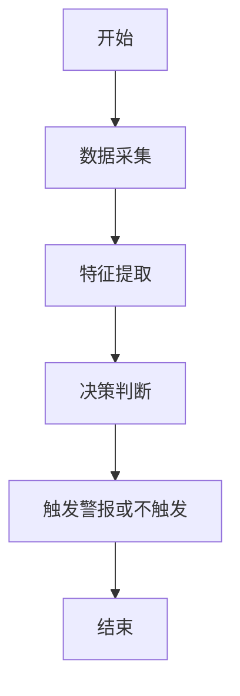
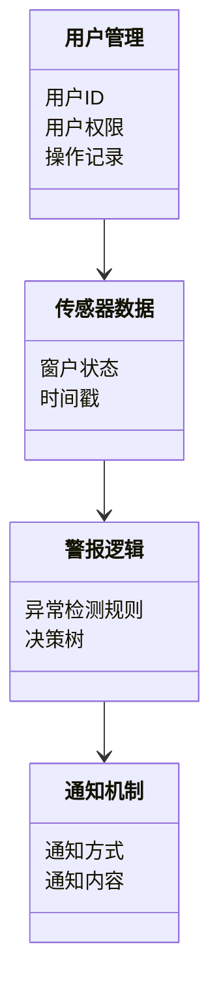
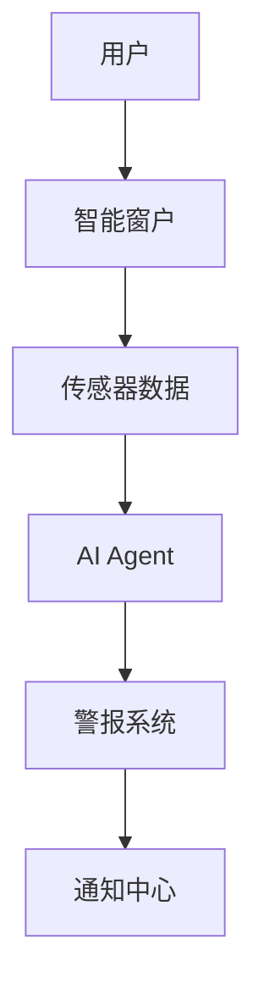

                 


# AI Agent在智能窗户中的防盗警报系统

> 关键词：AI Agent, 智能窗户, 防盗警报系统, 物联网, 传感器数据, 机器学习

> 摘要：本文探讨了AI Agent在智能窗户防盗警报系统中的应用，分析了系统的核心概念、算法原理、系统架构设计及实际案例，旨在为读者提供全面的技术指导。

---

## 第一部分: 背景介绍

### 第1章: 问题背景

#### 1.1 智能窗户的发展现状
随着物联网技术的快速发展，智能窗户已成为现代建筑的重要组成部分。智能窗户通过集成传感器、通信模块和控制算法，能够实现对窗户状态的实时监控和智能化管理。然而，智能窗户在防盗功能上的不足，使其在实际应用中面临诸多挑战。

#### 1.2 突破性问题与需求分析
传统防盗系统依赖于单一的传感器和简单的逻辑判断，存在误报率高、响应速度慢等问题。随着智能家居的普及，用户对防盗系统的智能化和精准化提出了更高要求。AI Agent的引入，为智能窗户的防盗功能带来了新的可能性。

#### 1.3 问题解决的重要性
通过引入AI Agent，智能窗户防盗警报系统能够实现对复杂环境的智能感知和决策，从而提高防盗系统的准确性和效率。这种技术不仅提升了用户体验，也为智能家居的安全性提供了有力保障。

### 第2章: 问题描述

#### 2.1 突破性问题的详细描述
智能窗户防盗警报系统需要实时监测窗户的状态，并能够在检测到异常情况时迅速做出反应。系统需要处理多种输入信号，包括传感器数据、环境信息以及用户操作数据，并基于这些数据做出决策。

#### 2.2 问题解决的边界与外延
防盗警报系统的核心功能是检测非法入侵，但其外延功能包括用户权限管理、历史数据记录和远程通知等。系统需要与智能窗户的其他功能模块（如温控系统、照明系统）进行无缝集成。

#### 2.3 概念结构与核心要素
智能窗户防盗警报系统的概念结构包括以下几个核心要素：
1. **用户管理**：用户权限和操作记录。
2. **传感器数据**：窗户状态、环境数据（如温度、湿度）。
3. **警报逻辑**：基于传感器数据和用户操作的决策规则。
4. **通知机制**：通过手机APP、短信或智能家居中枢通知用户。

---

## 第二部分: 核心概念与联系

### 第3章: 核心概念原理

#### 3.1 AI Agent的基本原理
AI Agent是一种能够感知环境、做出决策并执行操作的智能实体。在智能窗户防盗系统中，AI Agent通过接收传感器数据和用户指令，分析窗户状态，判断是否存在异常情况，并根据预设规则触发警报。

#### 3.2 智能窗户防盗警报系统的工作原理
系统通过集成多种传感器（如位置传感器、压力传感器）实时监测窗户状态。当系统检测到窗户异常打开或关闭时，AI Agent会根据历史数据和当前环境信息，判断是否触发警报。

#### 3.3 AI Agent与智能窗户的结合方式
AI Agent通过与智能窗户的传感器和执行机构进行交互，实现对窗户状态的实时监控和智能控制。系统采用事件驱动的方式，当检测到异常事件时，AI Agent会启动相应的警报流程。

### 第4章: 概念属性特征对比

#### 4.1 AI Agent与传统防盗系统的对比
| 特性                | AI Agent防盗系统         | 传统防盗系统           |
|---------------------|--------------------------|------------------------|
| 感知能力            | 高度智能化               | 基于简单传感器         |
| 决策能力            | 基于机器学习模型         | 基于固定规则           |
| 响应速度            | 快速且精准               | 较慢且可能存在误报     |

#### 4.2 智能窗户与传统窗户的对比
| 特性                | 智能窗户                 | 传统窗户               |
|---------------------|--------------------------|------------------------|
| 功能                | 集成传感器和AI算法        | 仅机械结构             |
| 操作方式            | 智能控制和远程操作       | 手动操作               |
| 安全性               | 高，支持防盗报警         | 低，依赖物理锁具       |

---

## 第三部分: 算法原理讲解

### 第5章: 算法原理

#### 5.1 基于规则的AI Agent推理算法
基于规则的推理算法是一种简单且易于实现的决策方法。系统通过预设的规则（如“如果窗户在非工作时间打开，则触发警报”）来判断是否需要启动警报。

#### 5.2 基于机器学习的警报预测算法
基于机器学习的算法能够通过历史数据训练模型，识别异常行为模式。常用的算法包括支持向量机（SVM）和随机森林（Random Forest）。

#### 5.3 算法的数学模型与公式
以下是基于机器学习的警报预测算法的数学模型：

$$
y = \sum_{i=1}^{n} w_i x_i + b
$$

其中：
- $y$ 是预测结果
- $w_i$ 是特征权重
- $x_i$ 是输入特征
- $b$ 是偏置项

---

### 第6章: 算法实现

#### 6.1 算法流程图


#### 6.2 Python代码实现
以下是基于机器学习的警报预测算法的Python代码示例：
```python
import numpy as np
from sklearn import svm

# 数据预处理
X = np.array([[1, 2, 3], [4, 5, 6], [7, 8, 9]])
y = np.array([0, 1, 0])

# 训练模型
model = svm.SVC()
model.fit(X, y)

# 预测
new_data = np.array([[10, 11, 12]])
prediction = model.predict(new_data)
print("预测结果:", prediction)
```

---

## 第四部分: 系统分析与架构设计方案

### 第7章: 系统分析

#### 7.1 问题场景介绍
智能窗户防盗警报系统的应用场景包括家庭住宅、办公室和公共场所。系统需要支持多种用户角色（如家庭成员、物业管理人员）和多种通知方式（如短信、邮件）。

#### 7.2 系统功能设计

##### 7.2.1 领域模型类图


### 第8章: 系统架构设计

#### 8.1 系统架构图


#### 8.2 接口设计
系统接口包括：
1. 用户操作接口：通过APP或网页进行用户管理。
2. 传感器数据接口：与智能窗户的传感器模块通信。
3. 警报系统接口：与智能家居中枢或其他报警设备集成。

---

## 第五部分: 项目实战

### 第9章: 项目实战

#### 9.1 环境安装
以下是Python环境的安装步骤：
1. 安装Python：从官方网站下载并安装最新版本的Python。
2. 安装依赖库：使用pip安装所需的库（如numpy、scikit-learn）。

#### 9.2 系统核心实现
以下是AI Agent的核心实现代码：
```python
import numpy as np
from sklearn.ensemble import RandomForestClassifier

# 数据预处理
X = np.array([[1, 2, 3], [4, 5, 6], [7, 8, 9]])
y = np.array([0, 1, 0])

# 训练模型
model = RandomForestClassifier(n_estimators=100)
model.fit(X, y)

# 预测
new_data = np.array([[10, 11, 12]])
prediction = model.predict(new_data)
print("预测结果:", prediction)
```

---

## 第六部分: 总结与展望

### 第10章: 总结与展望

#### 10.1 最佳实践 tips
- 定期更新模型参数，以提高预测准确性。
- 优化系统响应速度，确保用户体验。

#### 10.2 小结
本文详细介绍了AI Agent在智能窗户防盗警报系统中的应用，包括系统设计、算法实现和实际案例分析。通过引入AI技术，智能窗户防盗系统能够实现更高的安全性和智能化水平。

#### 10.3 注意事项
- 确保系统数据的安全性，防止数据泄露。
- 定期维护系统，确保传感器和通信模块的正常运行。

#### 10.4 拓展阅读
建议读者进一步学习机器学习和物联网技术，了解更多的AI Agent应用场景。

---

**作者：AI天才研究院/AI Genius Institute & 禅与计算机程序设计艺术 /Zen And The Art of Computer Programming**

