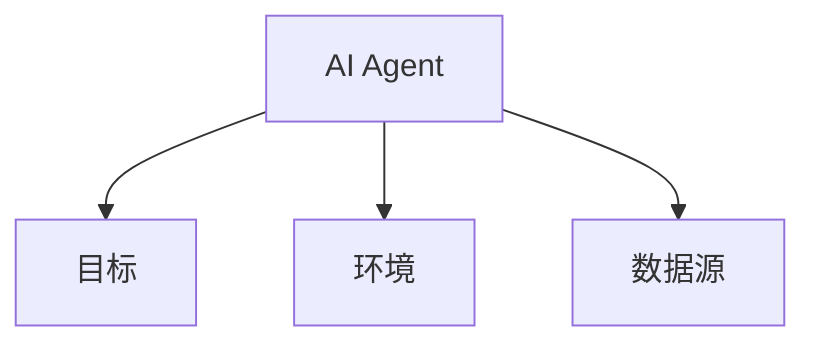
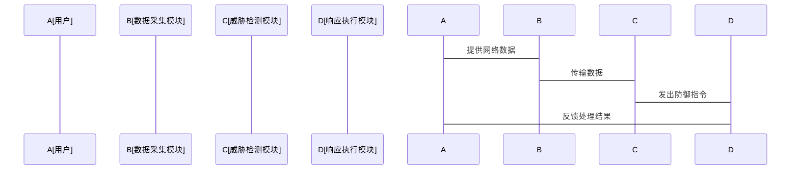

                 


# AI Agent在智能网络安全中的应用

> 关键词：AI Agent, 智能网络安全, 网络安全, 人工智能, 智能系统

> 摘要：随着人工智能技术的快速发展，AI Agent在智能网络安全中的应用越来越广泛。本文详细探讨了AI Agent的基本概念、核心原理、算法模型及其在网络安全中的实际应用。通过分析AI Agent的优势与挑战，本文为读者提供了深入的技术见解和实践指导，帮助读者更好地理解AI Agent在智能网络安全中的重要性与应用场景。

---

# 第1章: AI Agent与智能网络安全背景

## 1.1 AI Agent的基本概念

### 1.1.1 AI Agent的定义与特点

AI Agent（人工智能代理）是一种能够感知环境、自主决策并执行任务的智能实体。它具备以下特点：

- **自主性**：AI Agent能够自主决策，无需外部干预。
- **反应性**：能够实时感知环境变化并做出响应。
- **学习能力**：通过数据和经验不断优化自身的决策能力。
- **协作性**：能够与其他AI Agent或系统进行协作。

### 1.1.2 AI Agent的核心要素与功能

AI Agent的核心要素包括感知、决策、执行和学习能力。其主要功能包括：

- 数据采集与处理
- 风险评估与预警
- 自动化响应与防御
- 学习与优化

### 1.1.3 AI Agent与传统安全技术的区别

传统安全技术依赖于规则和预定义策略，而AI Agent能够通过学习和适应环境，动态调整安全策略，具有更强的灵活性和主动性。

---

## 1.2 智能网络安全的背景与挑战

### 1.2.1 网络安全的传统模式与局限性

传统网络安全模式依赖于防火墙、入侵检测系统等静态规则，难以应对日益复杂的网络安全威胁，如零日攻击、高级持续性威胁（APT）等。

### 1.2.2 智能化网络安全的需求与趋势

随着网络安全威胁的多样化和复杂化，传统方法已无法满足需求。智能化网络安全通过引入AI、大数据和机器学习等技术，提升安全防御能力。

### 1.2.3 AI Agent在智能网络安全中的作用

AI Agent能够实时监测网络流量、识别异常行为、主动防御威胁，显著提升了网络安全的主动性和智能化水平。

---

## 1.3 AI Agent在智能网络安全中的应用前景

### 1.3.1 AI Agent的潜在应用场景

- **威胁检测与响应**：实时监测网络中的异常行为，快速响应潜在威胁。
- **漏洞发现与修复**：通过学习发现潜在漏洞并自动修复。
- **用户行为分析**：基于用户行为分析识别内部威胁。

### 1.3.2 企业采用AI Agent的优势

- **提高安全效率**：自动化处理安全事件，减少人工干预。
- **增强防御能力**：通过智能学习提升防御精准度。
- **降低运营成本**：自动化处理减少人力资源投入。

### 1.3.3 AI Agent应用的挑战与机遇

- **技术挑战**：AI Agent的开发和部署需要高度专业的技术能力。
- **数据依赖**：AI Agent依赖高质量的数据进行训练和推理。
- **伦理与隐私问题**：AI Agent的应用需考虑用户隐私和数据安全。

---

## 1.4 本章小结

本章介绍了AI Agent的基本概念、核心功能以及在智能网络安全中的作用。通过分析传统安全技术的局限性，探讨了AI Agent在智能化网络安全中的重要性与应用前景。

---

# 第2章: AI Agent的核心概念与原理

## 2.1 AI Agent的核心原理

### 2.1.1 AI Agent的感知与决策机制

AI Agent通过传感器或数据接口感知环境信息，利用机器学习算法进行分析和推理，最终做出决策并执行动作。

### 2.1.2 AI Agent的学习与自适应能力

AI Agent通过监督学习、无监督学习和强化学习等方法，不断优化自身的模型和策略，提升应对复杂环境的能力。

### 2.1.3 AI Agent的通信与协作能力

AI Agent能够与其他AI Agent或系统进行通信和协作，共同完成复杂的任务。

---

## 2.2 AI Agent与相关概念的对比

### 2.2.1 AI Agent与传统AI的区别

| 特性       | AI Agent                            | 传统AI                              |
|------------|-------------------------------------|--------------------------------------|
| 自主性      | 高                                   | 低                                   |
| 适应性      | 强                                   | 弱                                   |
| 应用场景     | 动态、复杂环境                     | 静态、简单环境                     |

### 2.2.2 AI Agent与智能体（Agent）的区别

AI Agent是一种具备人工智能的智能体，而智能体（Agent）可以是基于规则的非智能实体。AI Agent的核心在于其自主决策和学习能力。

### 2.2.3 AI Agent与机器学习模型的区别

AI Agent结合了机器学习模型和自主决策机制，能够根据环境反馈动态调整行为，而机器学习模型仅负责数据处理和预测。

---

## 2.3 AI Agent的ER实体关系图



---

## 2.4 本章小结

本章详细讲解了AI Agent的核心原理和与相关概念的对比，帮助读者更好地理解AI Agent的定义和特点。

---

# 第3章: AI Agent的算法原理

## 3.1 常见AI Agent算法介绍

### 3.1.1 强化学习算法

强化学习是一种通过奖励机制来优化决策策略的算法。其核心是通过与环境交互，不断探索和利用最优动作。

### 3.1.2 监督学习算法

监督学习通过标记数据训练模型，使其能够对新数据进行分类或回归预测。

### 3.1.3 无监督学习算法

无监督学习通过发现数据中的模式和结构，识别潜在的群组或异常。

---

## 3.2 AI Agent的决策树算法

### 3.2.1 决策树的构建过程

决策树是一种基于树状结构的分类模型，通过特征选择和剪枝优化构建最优决策树。

### 3.2.2 决策树的优化与剪枝

剪枝是通过去除冗余节点来提高决策树的泛化能力，避免过拟合。

### 3.2.3 决策树的实现代码示例

```python
class DecisionTree:
    def __init__(self):
        self.tree = None

    def fit(self, X, y):
        self.tree = self._build_tree(X, y)

    def _build_tree(self, X, y):
        # 简单决策树构建逻辑
        pass

    def predict(self, X):
        return self._predict(X, self.tree)

    def _predict(self, X, node):
        # 预测逻辑
        pass
```

---

## 3.3 AI Agent的数学模型与公式

### 3.3.1 决策树的熵公式

$$ entropy = -\sum_{i=1}^{n} p_i \log p_i $$

其中，\( p_i \) 是第i个类别的概率。

---

## 3.4 本章小结

本章介绍了AI Agent常用的算法原理，包括强化学习、监督学习和无监督学习，并通过决策树算法示例展示了算法的实现过程。

---

# 第4章: AI Agent在智能网络安全中的系统架构设计

## 4.1 系统功能设计

### 4.1.1 系统功能模块

- **数据采集模块**：负责采集网络流量、日志等数据。
- **威胁检测模块**：利用机器学习算法检测潜在威胁。
- **响应执行模块**：根据检测结果执行相应的防御动作。

### 4.1.2 系统功能流程

1. 数据采集模块收集网络数据。
2. 威胁检测模块分析数据，识别异常行为。
3. 响应执行模块根据检测结果采取防御措施。

---

## 4.2 系统架构设计

### 4.2.1 系统架构图


---

## 4.3 系统接口设计

- **数据接口**：与数据源（如防火墙、日志服务器）对接。
- **API接口**：提供给上层应用调用接口。

---

## 4.4 系统交互设计

### 4.4.1 系统交互流程



---

## 4.5 本章小结

本章通过系统架构设计和交互流程图，详细描述了AI Agent在智能网络安全中的系统实现过程。

---

# 第5章: AI Agent的项目实战

## 5.1 环境安装与配置

### 5.1.1 环境需求

- Python 3.8+
- TensorFlow、Scikit-learn等机器学习库
- 数据集准备

### 5.1.2 安装步骤

```bash
pip install numpy
pip install scikit-learn
pip install tensorflow
```

---

## 5.2 核心代码实现

### 5.2.1 数据预处理

```python
import numpy as np
from sklearn import tree

# 数据预处理代码
X = np.array([[...], [...]])
y = np.array([...])
```

### 5.2.2 模型训练与预测

```python
model = tree.DecisionTreeClassifier()
model.fit(X, y)
predictions = model.predict(X_test)
```

---

## 5.3 案例分析与结果解读

### 5.3.1 案例分析

通过实际案例分析，展示了AI Agent在威胁检测中的应用效果。

### 5.3.2 结果解读

通过对模型预测结果的分析，评估AI Agent的性能和准确性。

---

## 5.4 本章小结

本章通过项目实战，详细讲解了AI Agent在智能网络安全中的具体实现过程和应用效果。

---

# 第6章: 最佳实践与注意事项

## 6.1 最佳实践

- **数据质量**：确保数据的完整性和准确性。
- **模型优化**：通过交叉验证和超参数调优提升模型性能。
- **持续学习**：定期更新模型以应对新的安全威胁。

## 6.2 注意事项

- **数据隐私**：保护用户数据隐私，避免数据泄露。
- **系统稳定性**：确保系统在高负载下的稳定运行。
- **多模型融合**：结合多种算法提升整体防御效果。

---

## 6.3 本章小结

本章总结了AI Agent在智能网络安全中的最佳实践和注意事项，帮助读者更好地进行实际应用。

---

# 第7章: 小结与展望

## 7.1 小结

本文详细探讨了AI Agent在智能网络安全中的应用，从基本概念到算法原理，再到系统架构设计和项目实战，全面分析了AI Agent的优势与挑战。

## 7.2 展望

未来，随着AI技术的不断发展，AI Agent在智能网络安全中的应用将更加广泛和深入。通过结合边缘计算、区块链等新技术，AI Agent将为网络安全带来更多的创新和突破。

---

# 作者

作者：AI天才研究院/AI Genius Institute & 禅与计算机程序设计艺术 /Zen And The Art of Computer Programming

---

以上是《AI Agent在智能网络安全中的应用》的技术博客文章的完整目录和内容概要。希望这篇博客能够为读者提供深入的技术见解和实践指导。

