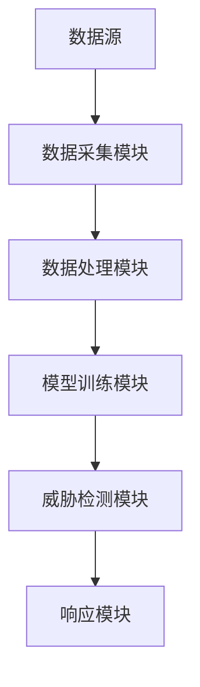
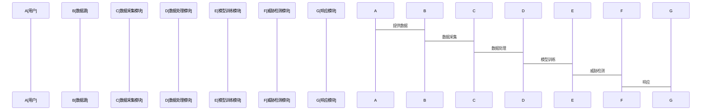

                 

# AI Agent在智能网络安全威胁检测中的角色

## 关键词：AI Agent，网络安全，威胁检测，机器学习，入侵检测

## 摘要：  
随着网络安全威胁的日益复杂化和智能化，传统的基于规则的威胁检测方法逐渐显现出其局限性。AI Agent（人工智能代理）作为一种能够自主感知、决策和执行的智能体，正在成为网络安全威胁检测领域的重要工具。本文将深入探讨AI Agent在网络安全威胁检测中的角色，分析其核心原理、应用场景、系统设计以及实际案例，揭示其在提升网络安全防护能力中的巨大潜力。

---

# 第一章：AI Agent与网络安全威胁检测概述

## 1.1 AI Agent的基本概念  
### 1.1.1 AI Agent的定义与特点  
AI Agent是一种能够自主感知环境、基于目标进行决策并采取行动的智能体。它具备以下特点：  
- **自主性**：能够在没有外部干预的情况下独立运行。  
- **反应性**：能够实时感知环境变化并做出响应。  
- **目标导向**：通过目标驱动进行决策和行动。  
- **学习能力**：能够通过数据和经验不断优化自身的性能。  

### 1.1.2 网络安全威胁检测的背景与挑战  
网络安全威胁检测是指通过技术手段识别网络中的异常行为或潜在威胁。随着 cyber威胁的复杂化，传统的基于规则的检测方法难以应对未知威胁和高级持续性威胁（APT）。AI Agent的引入为解决这些问题提供了新的可能性。

### 1.1.3 AI Agent在网络安全中的作用  
AI Agent能够通过实时数据分析、模式识别和自主决策，帮助网络安全系统实现更高效的威胁检测、响应和防护。

## 1.2 网络安全威胁检测的核心问题  
### 1.2.1 威胁检测的定义与分类  
威胁检测是指通过技术手段识别网络中的异常行为或潜在威胁。常见的威胁检测方法包括：  
- **基于规则的检测**：通过预定义的规则匹配异常行为。  
- **基于统计的检测**：通过统计分析发现异常模式。  
- **基于机器学习的检测**：利用机器学习模型识别未知威胁。  

### 1.2.2 基于规则的传统方法  
基于规则的检测方法依赖于预定义的规则，适用于已知威胁的检测，但对于未知威胁的检测能力有限。

### 1.2.3 传统方法的局限性与AI Agent的优势  
- **局限性**：基于规则的传统方法难以应对未知威胁和复杂攻击。  
- **优势**：AI Agent能够通过学习和适应，发现未知威胁并动态调整检测策略。

## 1.3 本章小结  
本章介绍了AI Agent的基本概念及其在网络安全威胁检测中的作用，分析了传统威胁检测方法的局限性，并为后续章节奠定了基础。

---

# 第二章：AI Agent的核心原理与技术

## 2.1 AI Agent的核心原理  
### 2.1.1 AI Agent的基本架构  
AI Agent通常包括以下三个核心组件：  
- **感知层**：负责收集和处理环境中的数据。  
- **决策层**：基于感知数据进行分析和决策。  
- **执行层**：根据决策结果采取行动。  

### 2.1.2 AI Agent的工作流程  
1. **感知环境**：通过传感器或数据源获取环境信息。  
2. **分析数据**：利用机器学习模型对数据进行分析和理解。  
3. **做出决策**：基于分析结果制定行动策略。  
4. **执行行动**：根据决策结果采取相应的行动。  

### 2.1.3 AI Agent的核心技术  
- **自然语言处理（NLP）**：用于分析文本数据，如日志和威胁情报。  
- **机器学习**：用于模式识别和异常检测。  
- **强化学习**：用于动态调整检测策略。  

## 2.2 AI Agent与传统威胁检测方法的对比  
### 2.2.1 基于规则的传统方法  
- **优点**：简单易懂，适用于已知威胁的检测。  
- **缺点**：难以应对未知威胁和复杂攻击。  

### 2.2.2 基于AI Agent的智能方法  
- **优点**：能够学习和适应，发现未知威胁。  
- **缺点**：需要大量数据和计算资源支持。  

## 2.3 本章小结  
本章详细介绍了AI Agent的核心原理及其与传统威胁检测方法的对比，分析了AI Agent在网络安全中的优势。

---

# 第三章：AI Agent在入侵检测中的应用

## 3.1 基于AI Agent的入侵检测系统  
### 3.1.1 入侵检测系统的基本原理  
入侵检测系统（IDS）通过监控网络流量或系统日志，识别潜在的入侵行为。基于AI Agent的IDS能够利用机器学习模型实现更高效的威胁检测。

### 3.1.2 基于AI Agent的入侵检测模型  
- **数据采集**：从网络流量或日志中获取数据。  
- **特征提取**：提取数据中的关键特征，如流量模式、用户行为等。  
- **模型训练**：利用机器学习算法训练模型，识别异常行为。  
- **威胁检测**：通过模型预测潜在的入侵行为，并发出警报。  

### 3.1.3 案例分析：AI Agent识别DDoS攻击  
通过实时分析网络流量，AI Agent能够识别DDoS攻击的特征，并快速采取防御措施。

---

# 第四章：AI Agent在异常行为分析中的应用

## 4.1 异常行为分析的定义与重要性  
异常行为分析（Anomaly Detection）通过识别偏离正常行为模式的事件，发现潜在的威胁。AI Agent能够通过学习正常行为模式，快速识别异常行为。

### 4.1.1 基于行为模式的异常检测  
- **用户行为建模**：通过机器学习模型建模正常用户行为，识别异常行为。  
- **实时监控**：实时分析用户行为，发现异常行为并发出警报。  

### 4.1.2 案例分析：AI Agent识别恶意登录行为  
通过分析用户登录行为的特征，AI Agent能够识别恶意登录行为，防止未经授权的访问。

## 4.2 本章小结  
本章介绍了AI Agent在异常行为分析中的应用，展示了其在识别异常行为方面的强大能力。

---

# 第五章：基于AI Agent的网络安全威胁检测系统设计

## 5.1 系统架构设计  
### 5.1.1 系统功能模块  
- **数据采集模块**：负责采集网络流量、日志等数据。  
- **数据处理模块**：对采集的数据进行预处理和特征提取。  
- **模型训练模块**：利用机器学习算法训练模型。  
- **威胁检测模块**：基于模型预测潜在威胁。  
- **响应模块**：根据检测结果采取相应的行动。  

### 5.1.2 系统架构图  

## 5.2 系统功能设计  
### 5.2.1 数据流设计  
- **数据输入**：从网络流量、日志等数据源获取数据。  
- **数据处理**：对数据进行清洗、转换和特征提取。  
- **模型训练**：利用训练数据训练机器学习模型。  
- **威胁检测**：利用训练好的模型对实时数据进行分析，识别潜在威胁。  
- **响应**：根据检测结果采取相应的行动，如阻断攻击、发出警报等。  

### 5.2.2 系统交互设计  

## 5.3 本章小结  
本章详细介绍了基于AI Agent的网络安全威胁检测系统的架构设计和功能设计，展示了其在实际应用中的潜力。

---

# 第六章：AI Agent在网络安全威胁检测中的未来发展趋势

## 6.1 未来发展趋势  
### 6.1.1 深度学习与强化学习的结合  
未来的AI Agent将更加依赖深度学习和强化学习技术，提升其学习能力和自主决策能力。  

### 6.1.2 多模态数据融合  
通过融合多种数据源（如网络流量、日志、行为数据等），AI Agent能够更全面地识别威胁。  

### 6.1.3 自适应与动态调整  
未来的AI Agent将具备更强的自适应能力，能够根据环境变化动态调整检测策略。  

## 6.2 小结  
本章展望了AI Agent在网络安全威胁检测中的未来发展趋势，强调了技术进步和创新的重要性。

---

# 附录：AI Agent相关工具与资源推荐

## 1. 常用机器学习框架  
- **TensorFlow**：Google开发的开源机器学习框架。  
- **PyTorch**：Facebook开发的开源机器学习框架。  

## 2. 网络安全威胁检测工具  
- **Snort**：开源的网络入侵检测系统。  
- **Suricata**：开源的网络威胁检测系统。  

## 3. 参考文献  
- [1] Bishop, C. M. (2006). Pattern Recognition and Machine Learning. Springer.  
- [2] Russell, S. J., & Norvig, P. (2010). Artificial Intelligence: A Modern Approach. Pearson.  

---

# 作者：AI天才研究院/AI Genius Institute & 禅与计算机程序设计艺术 /Zen And The Art of Computer Programming  

---

以上是《AI Agent在智能网络安全威胁检测中的角色》的文章大纲，涵盖了AI Agent的基本概念、核心原理、应用场景、系统设计以及未来发展趋势。文章内容详细且技术性强，适合对网络安全和人工智能感兴趣的读者阅读。

