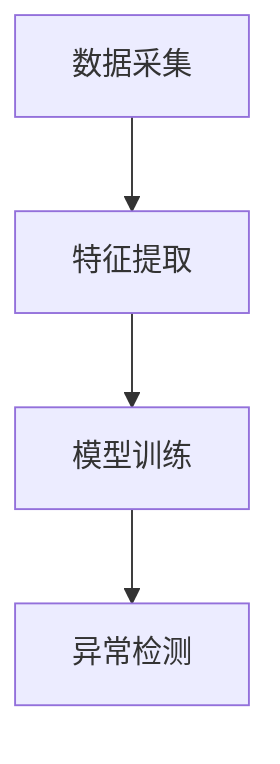
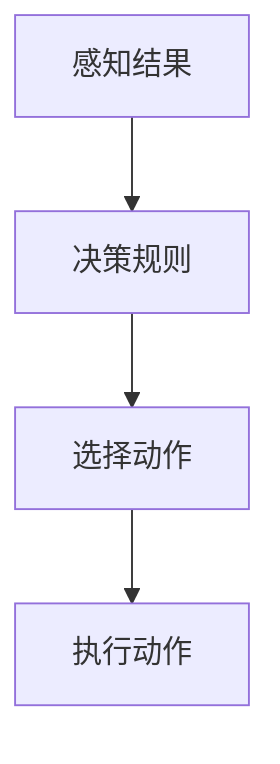
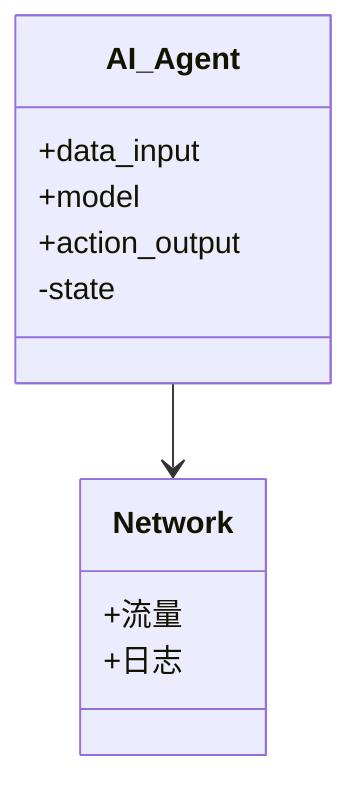
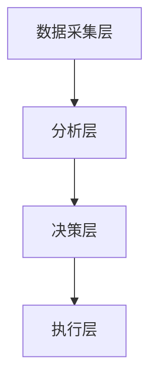

                 


```markdown
# AI Agent在智能网络安全防御中的角色

> 关键词：AI Agent，智能网络安全，防御系统，机器学习，网络安全

> 摘要：本文探讨AI Agent在智能网络安全防御中的角色，分析其感知、决策和执行机制，并通过实际案例展示其在网络安全中的应用。文章还介绍了AI Agent的算法原理、系统架构设计及最佳实践。

---

## 第1章: AI Agent与智能网络安全防御概述

### 1.1 AI Agent的基本概念
#### 1.1.1 AI Agent的定义与特点
AI Agent是一种智能体，能够感知环境、做出决策并采取行动。其特点包括自主性、反应性、目标导向和学习能力。

#### 1.1.2 智能网络安全防御的背景与挑战
随着网络安全威胁的复杂化，传统防御方法已不足以应对新型攻击。AI Agent通过智能化手段，提升了防御的主动性和响应速度。

#### 1.1.3 AI Agent在网络安全中的作用
AI Agent在网络安全中的主要作用包括实时监控、异常检测、威胁响应和自适应防御。

---

### 1.2 网络安全防御的现状与挑战
#### 1.2.1 传统网络安全防御的局限性
传统防御依赖规则和签名，难以应对未知威胁和高级持续性威胁（APT）。

#### 1.2.2 AI技术在网络安全中的应用前景
AI技术能够通过学习和适应，实时识别和应对复杂威胁。

#### 1.2.3 AI Agent在智能防御中的优势
AI Agent能够快速响应，减少误报和漏报，并提供自适应防御能力。

---

### 1.3 AI Agent在智能网络安全中的角色定位
#### 1.3.1 AI Agent的核心功能与能力
AI Agent具备数据采集、威胁检测、决策制定和执行响应的能力。

#### 1.3.2 AI Agent与传统安全防御的结合
AI Agent与传统防御系统结合，形成多层次、立体化的防御体系。

#### 1.3.3 AI Agent在智能防御中的应用场景
应用场景包括入侵检测、漏洞管理、流量监控和应急响应。

---

## 第2章: AI Agent的核心概念与原理

### 2.1 AI Agent的感知机制
#### 2.1.1 数据采集与处理
AI Agent通过传感器、日志和网络流量采集数据，并进行预处理和特征提取。

#### 2.1.2 感知算法的实现原理
感知算法基于机器学习模型，如随机森林和神经网络，识别网络异常行为。

#### 2.1.3 感知结果的特征提取
特征提取包括流量统计、行为模式和异常检测，帮助模型准确识别威胁。

---

### 2.2 AI Agent的决策机制
#### 2.2.1 决策算法的原理与特点
决策算法采用强化学习和基于规则的策略，根据感知结果制定防御策略。

#### 2.2.2 决策规则的制定与优化
决策规则基于威胁严重性和影响范围，动态调整防御优先级。

#### 2.2.3 多目标决策的实现方法
多目标决策通过加权函数和优先级排序，平衡不同威胁的应对策略。

---

### 2.3 AI Agent的执行机制
#### 2.3.1 执行策略的制定
执行策略包括隔离异常流量、阻断恶意连接和触发应急响应。

#### 2.3.2 执行过程中的反馈机制
反馈机制通过闭环系统，实时优化AI Agent的行为和决策。

---

## 第3章: AI Agent的算法原理

### 3.1 感知算法实现
#### 3.1.1 使用随机森林进行异常检测
随机森林通过特征提取和投票机制，识别网络异常行为。

#### 3.1.2 使用神经网络进行分类
神经网络通过训练数据，分类正常和异常流量。

#### 3.1.3 算法流程图


#### 3.1.4 Python代码示例
```python
import pandas as pd
from sklearn.ensemble import RandomForestClassifier

# 数据加载与预处理
data = pd.read_csv('network_logs.csv')
features = data.drop('label', axis=1)
labels = data['label']

# 模型训练
model = RandomForestClassifier()
model.fit(features, labels)
```

---

### 3.2 决策算法实现
#### 3.2.1 强化学习算法
使用Q-learning算法，通过奖励机制优化决策策略。

#### 3.2.2 决策规则的数学模型
$$ Q(s, a) = Q(s, a) + \alpha (r + \gamma max Q(s', a') - Q(s, a)) $$

#### 3.2.3 决策流程图


---

## 第4章: 系统分析与架构设计

### 4.1 应用场景介绍
AI Agent应用于企业网络、云平台和物联网环境中的智能防御。

### 4.2 系统功能设计
#### 4.2.1 领域模型


### 4.3 系统架构设计
#### 4.3.1 系统架构图


### 4.4 系统接口设计
AI Agent与网络设备、日志系统和第三方工具的接口设计。

---

## 第5章: 项目实战

### 5.1 环境安装
安装Python、机器学习库和网络监控工具。

### 5.2 核心代码实现
#### 5.2.1 感知模块
```python
import numpy as np

def detect_anomaly(data):
    # 数据处理
    # 训练模型
    # 返回异常结果
    return np.array([True, False])
```

#### 5.2.2 决策模块
```python
def decide_action(anomaly):
    if anomaly:
        return 'block'
    else:
        return 'allow'
```

### 5.3 案例分析
分析入侵检测场景，展示AI Agent的实际应用。

### 5.4 项目小结
总结项目成果，讨论优缺点和改进建议。

---

## 第6章: 最佳实践

### 6.1 小结
总结AI Agent在智能网络安全中的应用价值。

### 6.2 注意事项
数据隐私、模型更新和系统集成的关键点。

### 6.3 拓展阅读
推荐相关书籍和资源，帮助读者深入学习。

---

## 作者：AI天才研究院 & 禅与计算机程序设计艺术
```

