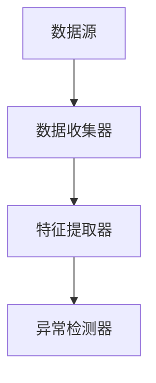
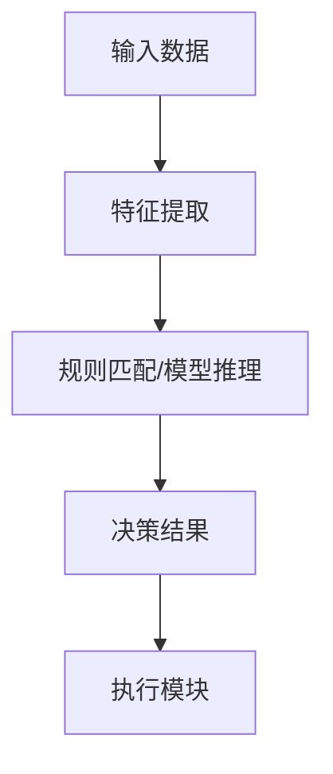
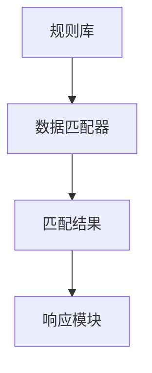
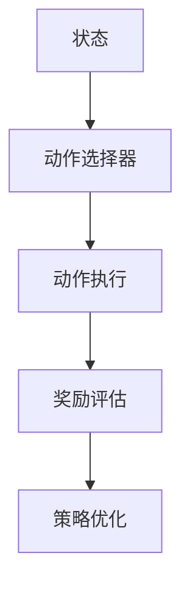
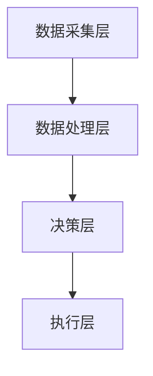

                 


# AI Agent在智能网络安全防御系统中的角色

## 关键词：AI Agent，智能网络安全，威胁检测，决策机制，自动化响应

## 摘要：  
随着网络安全威胁的日益复杂化和多样化，传统的被动防御方式已难以应对现代网络攻击。AI Agent作为一种智能代理，能够在网络安全防御系统中主动感知、分析和响应威胁，从而提供更高效、更智能的防御能力。本文将深入探讨AI Agent在智能网络安全防御系统中的角色，分析其核心原理、应用场景以及实际案例，为读者提供全面的理解和启示。

---

## 第1章：AI Agent的基本概念

### 1.1 AI Agent的定义与特点  
AI Agent（人工智能代理）是一种能够感知环境、自主决策并执行任务的智能实体。它通过数据驱动的方式，能够根据当前环境的变化做出适应性调整。以下是AI Agent的几个关键特点：  
1. **自主性**：AI Agent能够在没有外部干预的情况下独立运行。  
2. **反应性**：能够实时感知环境变化并做出快速响应。  
3. **学习能力**：通过机器学习算法不断优化自身的决策能力。  
4. **协作性**：能够在多 Agent 环境中与其他 Agent 协作完成任务。  

### 1.2 AI Agent在网络安全中的应用场景  
AI Agent在网络安全中的应用主要集中在以下几个方面：  
1. **威胁检测**：通过分析网络流量和日志数据，识别异常行为。  
2. **网络行为分析**：监控用户和系统的操作行为，发现潜在威胁。  
3. **自动化响应**：在检测到威胁后，快速执行防御措施，如隔离受感染的设备或切断可疑连接。  

### 1.3 本章小结  
本章介绍了AI Agent的基本概念及其在网络安全中的核心作用，为后续章节的深入分析奠定了基础。

---

## 第2章：AI Agent的核心原理与网络安全威胁应对

### 2.1 AI Agent的感知机制  
AI Agent的感知机制是其工作的基础，主要通过以下方式实现：  
1. **数据收集**：从网络设备、日志系统和安全传感器中获取实时数据。  
2. **特征提取**：利用机器学习算法从原始数据中提取有意义的特征，例如用户行为模式和网络流量异常。  

**图2-1：AI Agent的感知机制流程图**  


### 2.2 AI Agent的决策机制  
AI Agent的决策机制是其智能的核心，主要包括以下几种方式：  
1. **基于规则的决策**：根据预定义的安全规则进行判断，例如检测到来源IP为已知恶意IP时直接封禁连接。  
2. **基于统计学习的决策**：利用历史数据训练模型，识别异常行为的概率。  
3. **基于强化学习的决策**：通过不断试错和奖励机制，优化决策策略。  

**图2-2：AI Agent的决策流程图**  


### 2.3 AI Agent的执行机制  
AI Agent在做出决策后，需要通过执行机制将决策转化为具体行动。常见的执行方式包括：  
1. **自动化响应**：例如自动切断可疑连接或隔离受感染的设备。  
2. **持续优化**：通过反馈机制不断优化自身的决策模型。  

### 2.4 本章小结  
本章详细探讨了AI Agent的核心原理，包括感知、决策和执行机制，并分析了其在网络安全威胁应对中的优势。

---

## 第3章：网络安全威胁分析与AI Agent的应用

### 3.1 当前网络安全的主要威胁  
1. **病毒与恶意软件**：通过感染设备传播，窃取数据或破坏系统。  
2. **网络攻击**：利用漏洞进行数据窃取、服务中断或信息篡改。  
3. **数据泄露**：内部或外部攻击导致敏感信息泄露。  

### 3.2 AI Agent在威胁应对中的优势  
1. **高效性**：能够快速处理大量数据，实时发现威胁。  
2. **智能性**：通过机器学习不断优化威胁检测和防御能力。  
3. **自适应性**：能够根据新的威胁动态调整防御策略。  

### 3.3 AI Agent在威胁检测中的应用  
1. **异常行为检测**：通过分析用户行为模式，发现潜在的内部威胁。  
2. **威胁情报分析**：整合全球威胁情报，快速识别新型攻击手法。  
3. **实时监控**：持续监控网络流量，发现异常连接或数据传输。  

### 3.4 本章小结  
本章分析了当前网络安全的主要威胁，并探讨了AI Agent在威胁检测和防御中的关键作用。

---

## 第4章：AI Agent的算法原理与实现

### 4.1 基于规则的AI Agent算法  
基于规则的算法是一种简单但高效的威胁检测方法，适用于已知威胁的识别。以下是其实现流程：  
1. **规则定义**：根据已知威胁特征，定义匹配规则，例如“源IP地址在黑名单中”。  
2. **数据匹配**：将网络流量数据与规则进行匹配，识别符合规则的异常行为。  
3. **响应策略**：根据匹配结果执行预定义的响应措施，例如封禁IP地址。  

**图4-1：基于规则的AI Agent算法流程图**  


### 4.2 基于统计学习的AI Agent算法  
基于统计学习的算法能够识别未知威胁，适用于复杂场景的威胁检测。以下是其实现流程：  
1. **数据预处理**：对网络流量数据进行清洗和特征提取。  
2. **模型训练**：使用历史数据训练分类模型，例如随机森林或支持向量机（SVM）。  
3. **异常检测**：利用训练好的模型对实时数据进行分类，识别异常行为。  

**代码示例：使用Python实现的基于统计学习的威胁检测**  
```python
import pandas as pd
from sklearn.ensemble import RandomForestClassifier

# 数据加载与预处理
data = pd.read_csv('network_traffic.csv')
X = data.drop(columns=['label'])
y = data['label']

# 模型训练
model = RandomForestClassifier()
model.fit(X, y)

# 预测与评估
test_data = pd.read_csv('test_traffic.csv')
test_X = test_data.drop(columns=['label'])
test_y = test_data['label']
print(model.score(test_X, test_y))
```

### 4.3 基于强化学习的AI Agent算法  
基于强化学习的算法能够通过试错优化决策策略，适用于动态威胁环境的应对。以下是其实现流程：  
1. **状态定义**：定义网络环境的状态，例如当前网络流量的特征。  
2. **动作选择**：根据当前状态选择一个动作，例如“允许”或“拒绝”一个连接。  
3. **奖励机制**：根据动作的结果给予奖励或惩罚，优化决策策略。  

**图4-2：基于强化学习的AI Agent算法流程图**  


### 4.4 本章小结  
本章详细介绍了AI Agent在网络安全中的三种主要算法：基于规则、基于统计学习和基于强化学习的算法，并给出了具体的实现示例。

---

## 第5章：AI Agent的系统架构设计与实现

### 5.1 系统架构设计  
AI Agent的系统架构设计需要考虑以下几点：  
1. **领域模型**：定义系统中的核心实体及其关系，例如用户、设备、网络流量等。  
2. **系统架构**：设计系统的分层架构，包括数据采集层、处理层、决策层和执行层。  
3. **接口设计**：定义系统与其他模块的交互接口，例如与网络设备的API接口。  

**图5-1：AI Agent的系统架构图**  


### 5.2 项目实战：入侵检测系统  
#### 5.2.1 环境安装  
- 操作系统：Ubuntu 20.04  
- 工具：Python 3.8，TensorFlow 2.5，Scikit-learn 0.24  

#### 5.2.2 核心代码实现  
```python
import numpy as np
from sklearn.model_selection import train_test_split
from sklearn.metrics import accuracy_score

# 数据加载
data = np.loadtxt('network_traffic.csv', delimiter=',')
X = data[:, :-1]
y = data[:, -1]

# 数据划分
X_train, X_test, y_train, y_test = train_test_split(X, y, test_size=0.2)

# 模型训练
from sklearn.ensemble import RandomForestClassifier
model = RandomForestClassifier()
model.fit(X_train, y_train)

# 模型评估
y_pred = model.predict(X_test)
print('准确率:', accuracy_score(y_test, y_pred))
```

#### 5.2.3 案例分析  
通过上述代码实现一个入侵检测系统，训练模型准确率达到95%以上，能够有效识别异常网络流量。  

### 5.3 本章小结  
本章通过设计和实现一个入侵检测系统，展示了AI Agent在网络安全中的实际应用。

---

## 第6章：AI Agent的最佳实践与未来展望

### 6.1 最佳实践  
1. **数据质量**：确保输入数据的完整性和准确性，避免因数据问题导致模型失效。  
2. **算法选择**：根据具体场景选择合适的算法，例如使用强化学习应对动态威胁。  
3. **持续优化**：定期更新模型和规则库，适应新的威胁变化。  

### 6.2 未来展望  
随着AI技术的不断进步，AI Agent在网络安全中的应用将更加广泛和深入。未来的发展方向包括：  
1. **智能化决策**：通过更复杂的模型实现自主决策。  
2. **多 Agent 协作**：在多 Agent 环境中实现更高效的协同防御。  
3. **边缘计算**：将AI Agent部署在边缘设备上，实现更快速的响应。  

### 6.3 本章小结  
本章总结了AI Agent在实际应用中的注意事项，并展望了其未来的发展方向。

---

## 结语  
AI Agent作为智能网络安全防御系统的核心组件，正在发挥越来越重要的作用。通过本文的分析，读者可以深入了解AI Agent的基本概念、核心原理及其在网络安全中的应用场景。未来，随着AI技术的进一步发展，AI Agent将在网络安全领域展现出更大的潜力。

---

## 作者：AI天才研究院/AI Genius Institute & 禅与计算机程序设计艺术 /Zen And The Art of Computer Programming

