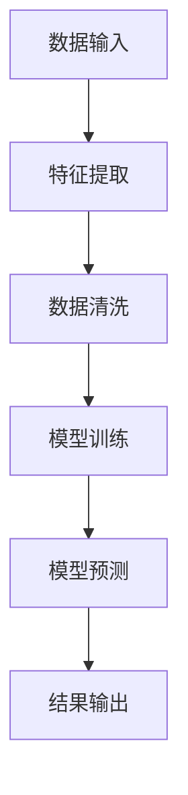
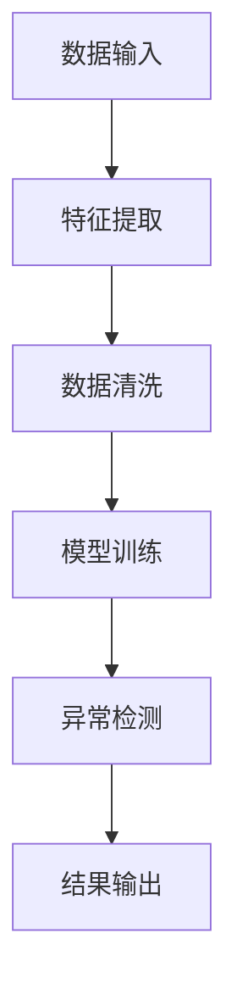
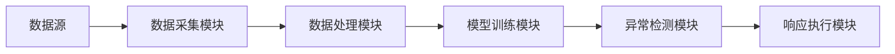

                 


# AI Agent在智能网络攻击检测中的角色

## 关键词：
- AI Agent
- 智能网络攻击检测
- 异常检测
- 机器学习
- 网络安全

## 摘要：
随着网络攻击的复杂性和多样性的不断增加，传统的网络攻击检测方法逐渐显现出其局限性。本文探讨了AI Agent在智能网络攻击检测中的角色与应用。通过分析AI Agent的核心概念、算法原理、系统架构以及实际应用场景，本文详细阐述了AI Agent如何通过多模态数据融合、深度学习算法和自主决策机制，显著提升网络攻击检测的效率和准确性。同时，本文还探讨了AI Agent在实际网络环境中的挑战与解决方案，并展望了未来的研究方向。

---

# 第一部分: 网络攻击检测的背景与挑战

## 第1章: 网络攻击的现状与趋势

### 1.1 网络攻击的现状
- 当前网络攻击的主要形式包括DDoS攻击、钓鱼攻击、恶意软件传播、APT（Advanced Persistent Threats）攻击等。
- 网络攻击的隐蔽性和复杂性不断提高，传统的基于规则的检测方法难以应对未知威胁。

### 1.2 网络攻击检测的挑战
- 数据量大：网络流量数据呈指数级增长，传统方法难以处理。
- 数据异构性：网络数据来源多样，格式复杂，难以统一建模。
- 威胁动态变化：攻击者不断进化，传统的静态规则难以应对新的攻击手法。
- 资源限制：企业通常缺乏足够的安全专家和技术资源。

### 1.3 智能化网络攻击检测的需求
- 需要实时处理海量数据。
- 需要自动识别未知威胁。
- 需要动态调整检测策略以应对新的攻击手法。

---

## 第2章: AI Agent在网络安全中的角色与价值

### 2.1 AI Agent的基本概念
- AI Agent：一种能够感知环境、自主决策并采取行动的智能实体。
- 在网络安全领域，AI Agent通常用于实时监控网络流量、分析日志数据、识别异常行为，并采取相应的防护措施。

### 2.2 AI Agent的核心特征
| 特征 | 描述 |
|------|------|
| 智能感知 | 能够通过多种数据源（如网络流量、日志、行为数据）感知网络环境。 |
| 自主决策 | 基于感知到的信息，通过机器学习算法做出决策。 |
| 实时响应 | 能够在检测到威胁后快速采取行动，如阻断攻击、发出警报。 |
| 自适应能力 | 能够根据环境变化动态调整检测策略。 |

### 2.3 AI Agent在网络安全中的价值
- 提高检测效率：通过自动化处理海量数据，减少人工干预。
- 增强检测精度：利用机器学习算法识别复杂攻击模式。
- 实现动态防护：能够根据威胁变化实时调整防护策略。

---

# 第二部分: AI Agent的算法原理与数学模型

## 第3章: 基于监督学习的网络攻击检测

### 3.1 监督学习算法原理
- 监督学习：通过训练数据中的标签信息，学习数据与标签之间的关系，用于预测新数据的标签。
- 常用算法：支持向量机（SVM）、随机森林（Random Forest）、神经网络等。

### 3.2 算法流程图


### 3.3 数学模型
- 支持向量机（SVM）：用于分类任务。
$$
\text{目标函数：} \min \frac{1}{2}\|w\|^2 + C \sum_{i=1}^n \xi_i
$$

- 神经网络：用于处理非线性关系。
$$
y = \sigma(wx + b)
$$

### 3.4 应用案例
- 案例：使用SVM算法检测DDoS攻击。
- 数据特征：流量速率、包长度、源IP、目的IP等。
- 模型训练：使用历史攻击数据训练SVM模型。
- 模型预测：实时监控网络流量，识别异常流量。

---

## 第4章: 基于无监督学习的网络攻击检测

### 4.1 无监督学习算法原理
- 无监督学习：通过分析数据的内在结构，发现数据中的异常模式。
- 常用算法：聚类分析（K-Means）、异常检测（Isolation Forest）。

### 4.2 算法流程图


### 4.3 数学模型
- Isolation Forest：用于异常检测。
$$
\text{目标函数：} \min \sum_{i=1}^n (y_i - y_i')^2
$$

### 4.4 应用案例
- 案例：使用Isolation Forest算法检测恶意软件传播。
- 数据特征：文件行为、进程调用、网络连接等。
- 模型训练：分析正常行为数据，建立基线。
- 模型预测：识别偏离基线的异常行为。

---

# 第三部分: AI Agent的系统架构与实现

## 第5章: 系统功能设计

### 5.1 系统功能模块
| 模块 | 功能 |
|------|------|
| 数据采集模块 | 实时采集网络流量、日志、行为数据。 |
| 数据处理模块 | 对数据进行清洗、特征提取和标准化处理。 |
| 模型训练模块 | 训练机器学习模型，生成检测规则。 |
| 异常检测模块 | 实时检测网络中的异常行为。 |
| 响应执行模块 | 根据检测结果采取相应行动，如阻断攻击、发出警报。 |

### 5.2 系统架构图


---

## 第6章: 项目实战与代码实现

### 6.1 环境安装
- 安装Python、TensorFlow、Scikit-learn、Pandas等库。
```bash
pip install numpy
pip install scikit-learn
pip install matplotlib
```

### 6.2 核心代码实现
```python
import numpy as np
from sklearn.svm import SVC
from sklearn.metrics import accuracy_score

# 数据加载
X_train = np.load('X_train.npy')
y_train = np.load('y_train.npy')

# 模型训练
model = SVC(C=1.0, kernel='rb

