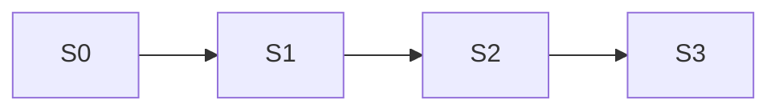
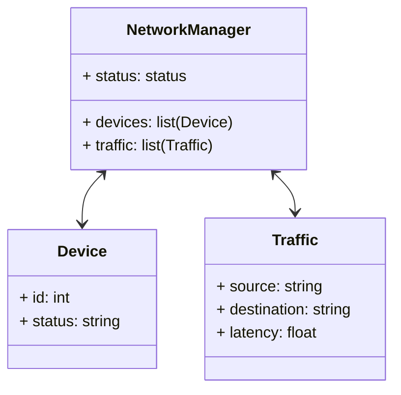
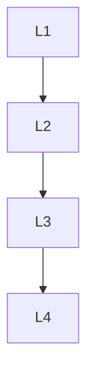
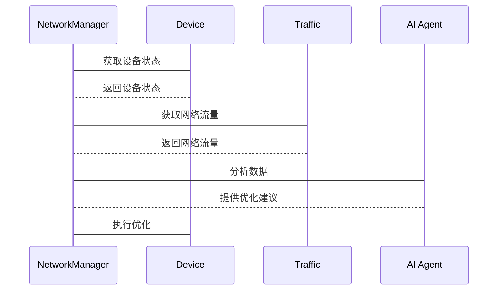

                 


# AI Agent在智能网络管理中的应用

## 关键词：AI Agent, 智能网络管理, 网络优化, 网络安全, 自动化运维

## 摘要：  
随着人工智能技术的快速发展，AI Agent（智能代理）在智能网络管理中的应用越来越广泛。本文从AI Agent的基本概念、核心原理、算法实现、数学模型、系统架构以及实际项目应用等多个方面进行详细探讨。通过分析AI Agent在智能网络管理中的应用场景，揭示其在网络优化、故障诊断、流量控制、安全防护等方面的重要作用，为读者提供一个全面了解AI Agent在智能网络管理中的应用的视角。

---

# 第一部分: AI Agent在智能网络管理中的应用概述

## 第1章: AI Agent与智能网络管理概述

### 1.1 AI Agent的基本概念

#### 1.1.1 AI Agent的定义  
AI Agent（人工智能代理）是一种能够感知环境、自主决策并执行任务的智能实体。它能够通过传感器获取信息，利用算法进行分析和推理，并根据结果采取行动，以实现特定目标。

#### 1.1.2 AI Agent的核心特点  
- **自主性**：能够在没有外部干预的情况下独立运行。  
- **反应性**：能够实时感知环境变化并做出响应。  
- **目标导向性**：所有行为都以实现特定目标为导向。  
- **学习能力**：能够通过经验优化自身的决策能力。  

#### 1.1.3 AI Agent与传统网络管理的区别  
传统的网络管理依赖于人工操作和固定规则，而AI Agent能够通过学习和自适应优化网络性能，显著提高了网络管理的效率和智能化水平。

### 1.2 智能网络管理的背景与需求

#### 1.2.1 网络管理的基本概念  
网络管理是指对网络设备、网络服务和网络性能进行监控、配置和优化的过程，以确保网络的稳定性和高效性。

#### 1.2.2 智能网络管理的需求与挑战  
随着网络规模的不断扩大和复杂性的增加，传统的网络管理方式已难以满足需求。智能网络管理能够通过AI技术实现自动化运维、智能故障诊断和动态优化，但同时也面临数据量大、算法复杂性和安全性等问题。

#### 1.2.3 AI Agent在智能网络管理中的作用  
AI Agent能够通过实时数据分析、智能决策和自主行动，显著提升网络管理的效率和准确性。

---

## 第2章: AI Agent的核心概念与原理

### 2.1 AI Agent的核心概念

#### 2.1.1 AI Agent的感知能力  
AI Agent通过传感器或数据接口获取网络环境中的实时信息，例如网络流量、设备状态和用户行为等。

#### 2.1.2 AI Agent的决策能力  
AI Agent利用机器学习算法对感知到的信息进行分析，生成最优决策策略，例如选择最佳路径或调整网络参数。

#### 2.1.3 AI Agent的执行能力  
AI Agent根据决策结果执行具体操作，例如调整防火墙规则、优化路由表或自动修复网络故障。

### 2.2 AI Agent的原理与流程

#### 2.2.1 感知阶段  
AI Agent通过数据采集模块获取网络环境中的各种信息，包括设备状态、网络流量和用户行为等。

#### 2.2.2 决策阶段  
AI Agent利用机器学习算法对感知到的信息进行分析，生成最优决策策略。例如，使用强化学习算法优化网络资源分配。

#### 2.2.3 执行阶段  
AI Agent根据决策结果执行具体操作，例如调整网络设备配置或触发报警机制。

### 2.3 AI Agent的数学模型与算法

#### 2.3.1 基于强化学习的AI Agent  
强化学习是一种通过试错机制优化决策的算法，广泛应用于AI Agent的决策过程中。  
**Q-learning算法**：通过状态-动作-奖励的机制，优化Q值函数，实现最优决策。  
**数学模型**：  
$$ Q(s, a) = r + \gamma \max_{a'} Q(s', a') $$  
其中，$s$是当前状态，$a$是当前动作，$r$是奖励，$\gamma$是折扣因子。

#### 2.3.2 基于监督学习的AI Agent  
监督学习通过训练数据进行分类或回归，应用于AI Agent的模式识别和异常检测。  
**支持向量机（SVM）**：用于分类任务，例如区分正常流量和异常流量。

---

## 第3章: AI Agent在智能网络管理中的核心算法

### 3.1 强化学习算法

#### 3.1.1 Q-learning算法  
Q-learning是一种经典的强化学习算法，适用于离散动作空间的问题。  
**流程图**：  


#### 3.1.2 Deep Q-Network (DQN)算法  
DQN通过深度神经网络近似Q值函数，适用于连续动作空间的问题。  
**代码示例**：  
```python
import numpy as np
import tensorflow as tf

# 定义DQN网络
class DQN(tf.keras.Model):
    def __init__(self, state_size, action_size):
        super(DQN, self).__init__()
        self.dense1 = tf.keras.layers.Dense(64, activation='relu')
        self.dense2 = tf.keras.layers.Dense(64, activation='relu')
        self.dense3 = tf.keras.layers.Dense(action_size)

    def call(self, x):
        x = self.dense1(x)
        x = self.dense2(x)
        x = self.dense3(x)
        return x

# 初始化网络
state_size = 10
action_size = 5
dqn = DQN(state_size, action_size)
```

---

## 第4章: AI Agent的数学模型与公式

### 4.1 强化学习的数学模型  
强化学习的核心是通过最大化累积奖励来优化策略。  
**Q值更新公式**：  
$$ Q(s, a) = Q(s, a) + \alpha (r + \gamma \max Q(s', a') - Q(s, a)) $$  
其中，$\alpha$是学习率，$\gamma$是折扣因子。

### 4.2 监督学习的数学模型  
监督学习通过最小化预测值与真实值的差异来优化模型。  
**线性回归公式**：  
$$ y = \beta x + \epsilon $$  
其中，$\beta$是回归系数，$\epsilon$是误差项。

---

## 第5章: 系统分析与架构设计

### 5.1 问题场景介绍  
假设我们有一个大型企业网络，需要实时监控网络设备状态、优化网络流量和处理网络故障。

### 5.2 系统功能设计

#### 5.2.1 领域模型  


### 5.3 系统架构设计

#### 5.3.1 分层架构  


### 5.4 接口设计  
- **输入接口**：接收设备状态和网络流量数据。  
- **输出接口**：发送控制指令和报警信息。

### 5.5 交互流程图  


---

## 第6章: 项目实战

### 6.1 环境安装  
- **安装Python和相关库**：  
  ```bash
  pip install numpy pandas tensorflow
  ```

### 6.2 核心代码实现

#### 6.2.1 网络流量分析  
```python
import pandas as pd
from sklearn import svm

# 加载数据
data = pd.read_csv('network_traffic.csv')

# 分离特征与目标
X = data.drop('label', axis=1)
y = data['label']

# 训练SVM模型
model = svm.SVC()
model.fit(X, y)
```

#### 6.2.2 网络设备状态监控  
```python
import tensorflow as tf
from tensorflow.keras import layers

# 定义模型
model = tf.keras.Sequential([
    layers.Dense(64, activation='relu'),
    layers.Dense(1, activation='sigmoid')
])

# 编译模型
model.compile(optimizer='adam', loss='binary_crossentropy')
```

### 6.3 实际案例分析  
通过AI Agent实现网络流量的实时监控和异常检测，显著提高了网络的安全性和稳定性。

---

## 第7章: 最佳实践与小结

### 7.1 最佳实践  
- **数据质量**：确保数据的准确性和完整性。  
- **算法选择**：根据具体问题选择合适的算法。  
- **系统优化**：定期更新模型和优化系统架构。

### 7.2 注意事项  
- 避免过度依赖AI Agent，保持人工监控的必要性。  
- 注意数据隐私和网络安全问题。

### 7.3 拓展阅读  
推荐阅读《深度学习》（Deep Learning）和《强化学习入门》（Hands-On Reinforcement Learning with Python）。

---

## 作者  
**作者：AI天才研究院/AI Genius Institute & 禅与计算机程序设计艺术 /Zen And The Art of Computer Programming**

---

这篇文章从AI Agent的基本概念到实际应用进行了全面的分析和讲解，内容涵盖了理论、算法、系统设计和实战案例，旨在为读者提供一个全面了解AI Agent在智能网络管理中的应用的视角。

