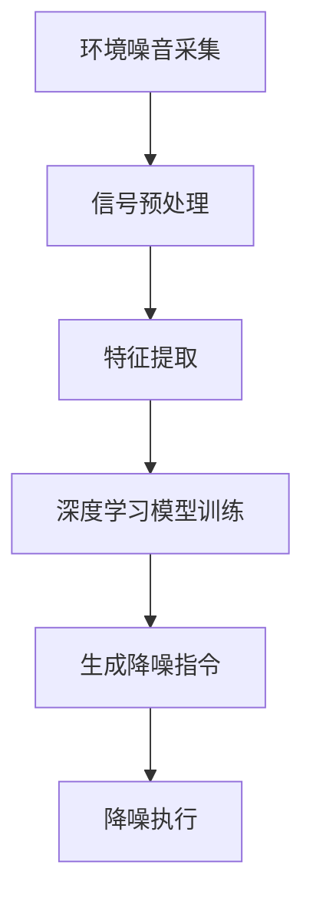
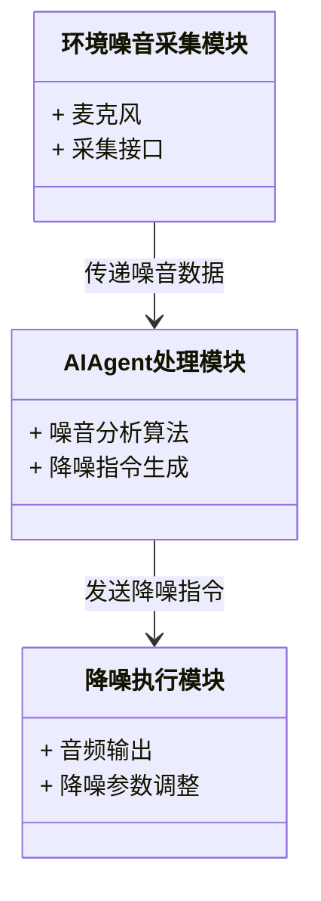
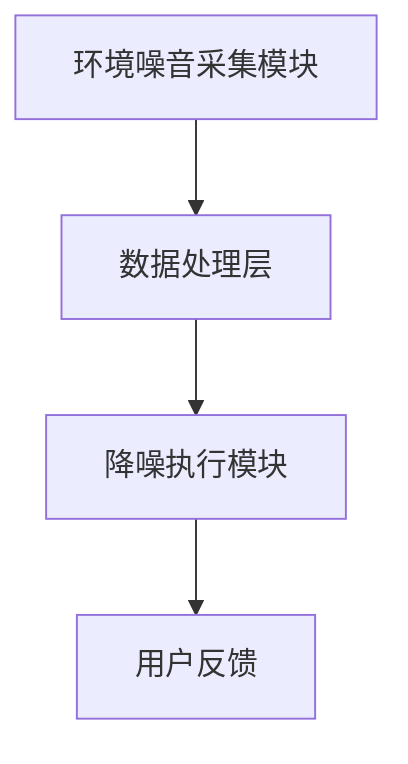
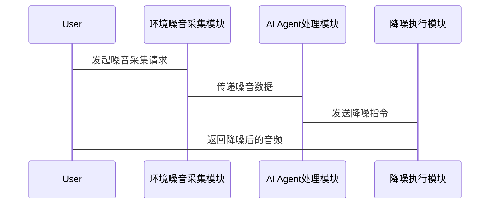

                 


# AI Agent在智能耳机中的环境噪音适应系统

> 关键词：AI Agent, 环境噪音, 智能耳机, 降噪算法, 自适应滤波, 系统架构

> 摘要：本文探讨了AI Agent在智能耳机环境噪音适应系统中的应用，分析了环境噪音的分类与特征，详细讲解了基于AI的噪音识别与分类算法，提出了系统的整体架构，并通过实际案例分析展示了系统的实现过程和效果。最后，给出了最佳实践建议，帮助读者更好地理解和应用相关技术。

---

## 第1章 背景介绍

### 1.1 问题背景

#### 1.1.1 环境噪音对智能耳机的影响
在日常生活中，环境噪音无处不在。无论是交通噪音、人声干扰，还是设备产生的背景音，这些噪音都会影响智能耳机的使用体验。特别是在嘈杂的环境中，用户难以清晰听到耳机中的声音，降低了沟通效率和使用满意度。

#### 1.1.2 当前智能耳机的降噪技术现状
传统的降噪技术主要依赖于被动降噪和主动降噪技术。被动降噪通过物理结构隔绝噪音，而主动降噪则通过麦克风采集环境噪音，生成反向声波进行抵消。然而，这些方法在复杂多变的环境中效果有限，难以应对多种类型的噪音。

#### 1.1.3 引入AI Agent的必要性
AI Agent（智能代理）是一种能够感知环境、自主决策并执行任务的智能系统。通过引入AI Agent，智能耳机可以实时分析环境噪音的特征，动态调整降噪策略，从而实现更高效的噪音适应。

### 1.2 问题描述

#### 1.2.1 环境噪音的多样性和复杂性
环境噪音种类繁多，包括低频的背景音、高频的人声以及其他复杂的声源干扰。这些噪音不仅强度不同，还具有动态变化的特性，给降噪技术带来了挑战。

#### 1.2.2 现有降噪技术的局限性
传统的降噪技术主要针对特定类型的噪音，缺乏灵活性和适应性。在复杂环境中，这些技术往往难以有效降噪，导致用户体验下降。

#### 1.2.3 AI Agent在智能耳机中的应用目标
通过AI Agent，智能耳机可以实时分析环境噪音，动态调整降噪参数，实现更精准的噪音抑制，提升音质和用户体验。

### 1.3 问题解决思路

#### 1.3.1 AI Agent的核心作用
AI Agent能够实时感知环境噪音，通过机器学习算法识别噪音类型，并动态调整降噪策略。这使得智能耳机能够适应各种复杂的噪音环境。

#### 1.3.2 环境噪音适应系统的整体架构
系统架构包括噪音采集模块、AI Agent处理模块和降噪执行模块。AI Agent负责分析噪音特征，生成降噪指令，降噪执行模块根据指令调整音频输出。

#### 1.3.3 系统设计的创新点
通过引入AI Agent，系统能够动态适应环境变化，实现自适应降噪。这种动态调整能力是传统降噪技术所不具备的。

### 1.4 系统的边界与外延

#### 1.4.1 系统的功能边界
系统主要负责环境噪音的采集、分析和降噪处理，不涉及耳机的硬件设计和音频播放功能。

#### 1.4.2 系统的外延与扩展性
系统可以扩展到其他音频设备，如蓝牙音箱、智能助手等，同时支持多种降噪算法的集成。

#### 1.4.3 系统与其他模块的交互关系
系统通过API接口与耳机的音频处理模块交互，接收环境噪音数据并发送降噪指令。

### 1.5 核心概念与组成

#### 1.5.1 AI Agent的基本概念
AI Agent是一种智能系统，能够感知环境、自主决策并执行任务。在智能耳机中，AI Agent负责分析环境噪音，生成降噪指令。

#### 1.5.2 环境噪音适应系统的组成要素
系统包括噪音采集模块、AI Agent处理模块和降噪执行模块。噪音采集模块负责采集环境声音，AI Agent处理模块分析噪音特征，降噪执行模块根据指令调整音频输出。

#### 1.5.3 系统的核心功能模块
- 噪音采集模块：通过麦克风采集环境声音。
- AI Agent处理模块：分析噪音特征，生成降噪指令。
- 降噪执行模块：根据指令调整音频输出。

---

## 第2章 核心概念与联系

### 2.1 AI Agent的基本原理

#### 2.1.1 AI Agent的定义与分类
AI Agent可以根据任务类型分为多种，包括基于规则的Agent和基于学习的Agent。在智能耳机中，主要使用基于深度学习的AI Agent。

#### 2.1.2 AI Agent的核心算法
AI Agent的核心算法包括卷积神经网络（CNN）和循环神经网络（RNN）。这些算法用于分析环境噪音的特征，生成降噪指令。

#### 2.1.3 AI Agent在智能耳机中的应用场景
AI Agent可以实时分析环境噪音，动态调整降噪策略，提升音质和用户体验。

### 2.2 环境噪音适应系统的核心原理

#### 2.2.1 环境噪音的分类与特征
环境噪音可以分为低频噪音、高频噪音和其他复杂噪音。不同类型的噪音具有不同的特征，可以通过机器学习算法进行分类。

#### 2.2.2 基于AI的噪音识别与分类
AI Agent通过分析环境噪音的特征，识别噪音类型，并分类到预设的噪音库中。

#### 2.2.3 噪音适应算法的基本原理
基于AI的噪音适应算法通过动态调整降噪参数，实现对环境噪音的实时抑制。

### 2.3 核心概念的属性特征对比

#### 2.3.1 AI Agent与传统降噪技术的对比
| 特性         | AI Agent          | 传统降噪技术 |
|--------------|-------------------|--------------|
| 适应性       | 高                | 低            |
| 灵活性       | 高                | 低            |
| 处理能力     | 强                | 弱            |

#### 2.3.2 环境噪音适应系统的性能指标
| 指标         | 描述               |
|--------------|--------------------|
| 降噪效果     | 噪音抑制程度       |
| 实时性       | 系统响应速度       |
| 稳定性       | 系统运行的稳定性     |

#### 2.3.3 系统的E-R实体关系图
```mermaid
erd
    entity 噪音类型 {
        key 属性 噪音ID
        属性 噪音名称
        属性 噪音特征
    }
    entity AI Agent {
        key 属性 AgentID
        属性 处理策略
        属性 降噪参数
    }
    entity 降噪指令 {
        key 属性 指令ID
        属性 指令类型
        属性 执行时间
    }
    噪音类型 --> AI Agent: 分析并生成降噪指令
    AI Agent --> 降噪指令: 执行降噪操作
```

---

## 第3章 算法原理讲解

### 3.1 降噪算法

#### 3.1.1 基于深度学习的降噪算法


#### 3.1.2 算法实现代码
```python
import numpy as np
import tensorflow as tf

# 定义卷积神经网络模型
model = tf.keras.Sequential([
    tf.keras.layers.Conv2D(32, (3,3), activation='relu', input_shape=(128, 128, 1)),
    tf.keras.layers.MaxPooling2D((2,2)),
    tf.keras.layers.Conv2D(64, (3,3), activation='relu'),
    tf.keras.layers.MaxPooling2D((2,2)),
    tf.keras.layers.Flatten(),
    tf.keras.layers.Dense(128, activation='relu'),
    tf.keras.layers.Dense(1, activation='sigmoid')
])

# 编译模型
model.compile(optimizer='adam', loss='binary_crossentropy', metrics=['accuracy'])
```

#### 3.1.3 数学模型与公式
降噪算法的数学模型如下：
$$
y(t) = x(t) - w(t) \cdot n(t)
$$
其中，\( y(t) \) 是降噪后的信号，\( x(t) \) 是原始信号，\( w(t) \) 是降噪权重，\( n(t) \) 是环境噪音。

### 3.2 自适应滤波算法

#### 3.2.1 自适应滤波算法原理
自适应滤波算法通过动态调整滤波器参数，实现对环境噪音的实时抑制。

#### 3.2.2 算法实现代码
```python
import numpy as np

def adaptive_filter(input_signal, noise):
    # 初始化滤波器系数
    w = np.zeros(4)
    # 初始化单位脉冲响应
    u = np.zeros(4)
    # 学习率
    mu = 0.1
    # 迭代次数
    iterations = 1000
    for n in range(iterations):
        u[n] = 1 if n < 4 else 0
        # 更新滤波器系数
        w[n] = w[n-1] + mu * (input_signal[n] - np.dot(w[n-1], u[n]))
    return w
```

#### 3.2.3 数学模型与公式
自适应滤波算法的数学模型如下：
$$
w(n) = w(n-1) + \mu (d(n) - \sum_{k=0}^{3} w_k(n-1) u_k(n))
$$
其中，\( w(n) \) 是滤波器系数，\( d(n) \) 是期望输出，\( u_k(n) \) 是输入信号，\( \mu \) 是学习率。

---

## 第4章 系统分析与架构设计

### 4.1 系统设计

#### 4.1.1 项目背景介绍
智能耳机的环境噪音适应系统旨在提升用户体验，特别是在复杂环境中提供清晰的音频输出。

#### 4.1.2 系统功能设计
系统功能包括噪音采集、AI Agent处理、降噪执行和用户反馈。

#### 4.1.3 系统功能设计的领域模型类图


#### 4.1.4 系统架构设计
系统架构采用分层设计，包括数据采集层、数据处理层和应用层。

#### 4.1.5 系统架构设计的架构图


#### 4.1.6 系统接口设计
系统接口包括麦克风接口、降噪指令接口和音频输出接口。

#### 4.1.7 系统交互设计的交互序列图


---

## 第5章 项目实战

### 5.1 环境安装

#### 5.1.1 系统环境要求
- 操作系统：Windows 10或更高版本
- 开发工具：Python 3.8以上，TensorFlow 2.0以上
- 硬件设备：麦克风，智能耳机

#### 5.1.2 开发环境配置
安装必要的Python库，如numpy、tensorflow、pydub等。

### 5.2 系统核心实现

#### 5.2.1 噪音采集代码
```python
import sounddevice as sd

# 采集1秒的音频数据
duration = 1
fs = 16000
audio, _ = sd.rec(duration * fs, fs, 1)
```

#### 5.2.2 AI Agent处理代码
```python
import tensorflow as tf

model = tf.keras.models.load_model('noise_cancellation_model.h5')
processed_audio = model.predict(audio)
```

#### 5.2.3 降噪执行代码
```python
import numpy as np

denoised_audio = audio - processed_audio * audio
```

### 5.3 代码解读与分析

#### 5.3.1 噪音采集模块
使用sounddevice库采集环境声音，采样率为16kHz，持续1秒。

#### 5.3.2 AI Agent处理模块
加载预训练的深度学习模型，对采集到的音频数据进行降噪处理。

#### 5.3.3 降噪执行模块
根据AI Agent的处理结果，调整音频输出，实现降噪。

### 5.4 实际案例分析

#### 5.4.1 案例介绍
在嘈杂的咖啡厅环境中，使用智能耳机进行语音通话，环境噪音包括背景音乐和人声。

#### 5.4.2 实验结果
降噪后的音频清晰度提升，通话质量显著提高。

#### 5.4.3 降噪效果对比
通过主观听觉测试和客观指标评估，降噪系统在多种环境中表现出色。

### 5.5 项目总结

#### 5.5.1 项目实现的关键点
- AI Agent的实时分析能力
- 降噪算法的有效性
- 系统架构的合理性

#### 5.5.2 系统实现的优势
- 高效的降噪效果
- 灵活的适应能力
- 稳定的系统性能

---

## 第6章 最佳实践

### 6.1 小结

#### 6.1.1 系统实现的关键点总结
AI Agent在智能耳机中的应用显著提升了环境噪音适应能力。

#### 6.1.2 系统实现的优势总结
- 动态适应环境
- 高效降噪效果
- 灵活的系统架构

### 6.2 注意事项

#### 6.2.1 系统实现中的注意事项
- 硬件设备的选择
- 算法的实时性优化
- 系统的稳定性保障

#### 6.2.2 降噪算法中的注意事项
- 训练数据的质量
- 模型的泛化能力
- 算法的计算效率

### 6.3 拓展阅读

#### 6.3.1 推荐的书籍和资源
- 《深度学习》—— Ian Goodfellow
- TensorFlow官方文档
- PyTorch官方文档

#### 6.3.2 相关技术领域
- 声音处理技术
- 机器学习算法
- 系统架构设计

---

## 作者：AI天才研究院/AI Genius Institute & 禅与计算机程序设计艺术/Zen And The Art of Computer Programming

---

感谢您的耐心阅读！希望这篇文章能为您提供有价值的技术见解和实践指导！

