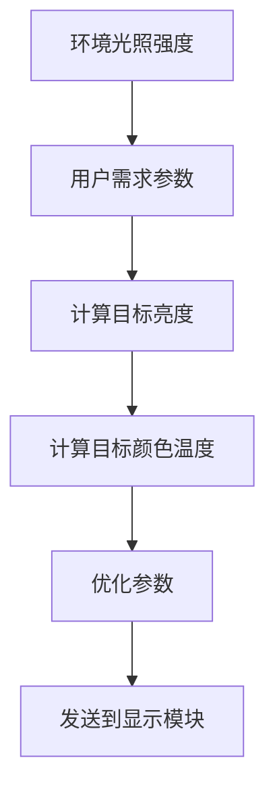
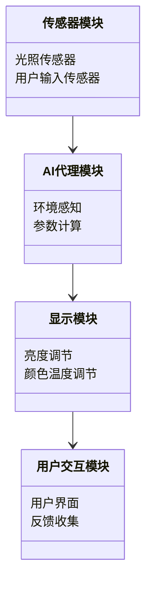
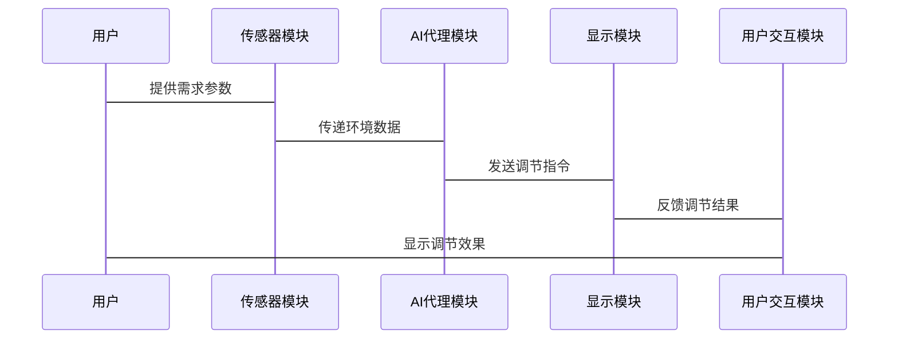

                 


# AI Agent在智能背光板中的护眼模式调节

## 关键词：AI Agent，护眼模式，背光板，动态调节，亮度调节，颜色温度，健康显示

## 摘要：本文探讨了AI Agent在智能背光板中的应用，重点分析护眼模式的动态调节机制。通过数学模型和系统架构设计，详细讲解AI代理如何优化背光设置，减少眼睛疲劳。文章包括背景介绍、算法原理、系统设计、项目实战等内容，为技术实践提供深度指导。

---

## 第一部分：引言

### 1.1 问题背景与意义

#### 1.1.1 问题背景介绍
现代生活中，人们长时间使用电子设备，导致眼睛疲劳和健康问题。传统背光调节方法存在固定模式和缺乏个性化的问题，难以满足不同用户的视觉需求。

#### 1.1.2 传统背光调节的不足
传统调节方式通常基于固定模式，无法根据环境变化和用户需求实时调整，导致视觉舒适度不足。

#### 1.1.3 AI Agent在护眼模式中的优势
AI Agent能够实时感知环境光和用户需求，动态调整背光参数，提供个性化和智能化的护眼模式，显著提升视觉舒适度。

---

### 1.2 本书内容概述

#### 1.2.1 本书的核心目标
介绍AI Agent在智能背光板中的应用，分析其在护眼模式调节中的算法和系统设计。

#### 1.2.2 本书的主要内容框架
涵盖AI Agent基础、算法原理、系统架构、项目实战和总结展望。

#### 1.2.3 本书的适用读者群体
适合技术爱好者、软件架构师、电子工程师及AI研究人员阅读。

---

## 第二部分：AI Agent与智能背光板基础

### 2.1 AI Agent的基本概念

#### 2.1.1 AI Agent的定义与特点
AI Agent是智能系统的核心，具备感知环境、自主决策和执行任务的能力。

#### 2.1.2 AI Agent的核心技术与实现
涉及感知、决策和执行技术，通过传感器、算法和执行机构实现智能调节。

#### 2.1.3 AI Agent在智能设备中的应用
广泛应用于智能家居、医疗设备和汽车等领域，提升设备智能化水平。

### 2.2 智能背光板的组成与原理

#### 2.2.1 背光板的基本组成
包括光源、导光板、扩散板和背光驱动电路，共同实现均匀的背光效果。

#### 2.2.2 背光调节的原理
通过调整电流或电压，改变光源亮度和颜色，实现显示效果的优化。

#### 2.2.3 护眼模式的基本概念与实现
护眼模式通过调节亮度、颜色温度和对比度，减少蓝光和闪烁，降低眼睛疲劳。

### 2.3 AI Agent与护眼模式的结合

#### 2.3.1 AI Agent在护眼模式中的角色
作为智能调节的核心，AI Agent实时感知环境和用户需求，动态调整背光参数。

#### 2.3.2 护眼模式调节的核心问题
包括亮度、颜色温度和动态对比度调节，需综合考虑环境光照和个人视觉需求。

#### 2.3.3 AI Agent与护眼模式调节的关系
AI Agent通过感知和决策，优化背光参数，实现个性化和智能化的护眼调节。

---

## 第三部分：AI Agent的核心算法原理

### 3.1 算法原理概述

#### 3.1.1 AI Agent的基本算法框架
包括感知、决策和执行三个步骤，感知环境信息，决策最优参数，执行调节操作。

#### 3.1.2 算法的核心思想与实现步骤
通过感知环境光照和用户需求，AI Agent计算并优化亮度、颜色温度和对比度参数。

#### 3.1.3 算法的数学模型与公式
亮度调节公式：  
$$ L(t) = L_0 + \alpha \cdot (I(t) - I_0) $$  
颜色温度调节公式：  
$$ C(t) = C_0 + \beta \cdot (T(t) - T_0) $$  
其中，$L(t)$为当前亮度，$I(t)$为环境光照强度，$C(t)$为当前颜色温度，$T(t)$为用户需求温度。

### 3.2 算法实现细节

#### 3.2.1 算法的输入与输出
输入：环境光照强度、用户需求参数  
输出：优化后的亮度、颜色温度和对比度值

#### 3.2.2 算法的实现流程
1. 采集环境光照和用户需求信息。
2. 计算目标亮度和颜色温度。
3. 优化参数并发送到显示模块。

#### 3.2.3 算法的优化与改进
通过机器学习模型优化算法，提升调节的准确性和响应速度。

### 3.3 算法的数学模型与公式

#### 3.3.1 算法的数学表达式
亮度调节模型：  
$$ L(t) = \max(L_{min}, \min(L_{max}, L_0 + \alpha \cdot (I(t) - I_0))) $$  
颜色温度调节模型：  
$$ C(t) = \max(C_{min}, \min(C_{max}, C_0 + \beta \cdot (T(t) - T_0))) $$  

#### 3.3.2 算法的公式推导与解释
通过环境光照强度和用户需求调整亮度和颜色温度，确保参数在合理范围内。

#### 3.3.3 算法的数学模型可视化
使用Mermaid流程图展示算法的整体流程：



---

## 第四部分：系统架构与设计

### 4.1 系统架构概述

#### 4.1.1 系统的整体架构
系统由传感器模块、AI代理模块、显示模块和用户交互模块组成。

#### 4.1.2 系统的模块划分
- 传感器模块：采集环境光照和用户输入。
- AI代理模块：处理数据，计算最优参数。
- 显示模块：执行亮度和颜色温度调节。
- 用户交互模块：反馈调节效果，收集用户反馈。

#### 4.1.3 系统的交互流程
用户输入需求，传感器采集数据，AI代理计算参数，显示模块执行调节，用户反馈结果。

### 4.2 项目介绍

#### 4.2.1 系统功能设计
- 实时采集环境光照和用户需求。
- 动态调节亮度和颜色温度。
- 提供个性化调节模式。

#### 4.2.2 领域模型设计
使用Mermaid类图展示系统模块关系：



#### 4.2.3 系统架构设计
整体架构采用分层设计，传感器层、AI代理层、显示层和用户交互层协同工作。

#### 4.2.4 系统接口设计
定义标准接口，确保各模块之间的通信和数据交换。

#### 4.2.5 系统交互设计
使用Mermaid序列图展示系统交互流程：



---

## 第五部分：项目实战

### 5.1 项目介绍与环境配置

#### 5.1.1 项目介绍
本项目通过AI代理实现智能背光板的护眼模式调节，提升用户体验。

#### 5.1.2 环境配置
- 系统环境：Windows 10或更高版本
- 开发工具：Python 3.8以上，PyTorch 1.9以上
- 传感器：光强度传感器和用户输入传感器
- 显示模块：支持亮度和颜色温度调节的背光板

### 5.2 核心代码实现

#### 5.2.1 传感器数据采集
```python
import numpy as np
import pandas as pd

def get_light_intensity():
    # 模拟环境光照强度
    return np.random.uniform(0, 100)

def get_user_input():
    # 模拟用户需求输入
    return input("请输入需求参数：")
```

#### 5.2.2 AI代理算法实现
```python
def calculate_brightness(target_intensity):
    current_intensity = get_light_intensity()
    alpha = 0.5
    return current_intensity + alpha * (target_intensity - current_intensity)

def calculate_color_temperature(target_temp):
    current_temp = get_light_intensity()
    beta = 0.3
    return current_temp + beta * (target_temp - current_temp)
```

#### 5.2.3 显示模块控制
```python
def set_brightness(brightness_value):
    # 模拟设置亮度
    print(f"设置亮度为：{brightness_value}")

def set_color_temperature(color_temp_value):
    # 模拟设置颜色温度
    print(f"设置颜色温度为：{color_temp_value}")
```

### 5.3 项目实战与案例分析

#### 5.3.1 动态调节亮度案例
用户在不同光照环境下使用设备，AI代理根据环境光照和用户需求动态调节亮度，提升视觉舒适度。

#### 5.3.2 动态调节颜色温度案例
根据用户需求和环境光照，AI代理调节颜色温度，减少蓝光，降低眼睛疲劳。

#### 5.3.3 综合调节案例
结合亮度和颜色温度调节，实现个性化的护眼模式，满足不同用户的需求。

### 5.4 项目小结与经验总结

#### 5.4.1 项目小结
通过AI代理实现智能背光调节，显著提升护眼效果和用户体验。

#### 5.4.2 经验总结
传感器精度和算法优化对调节效果至关重要，需结合实际需求进行系统调优。

---

## 第六部分：总结与展望

### 6.1 总结与回顾

#### 6.1.1 本书内容总结
详细介绍了AI Agent在智能背光板中的应用，分析了算法和系统设计，展示了项目实战。

#### 6.1.2 核心观点回顾
AI代理通过动态调节亮度和颜色温度，显著提升护眼效果和用户体验。

### 6.2 未来展望

#### 6.2.1 技术发展与趋势
AI代理在智能显示领域的应用将更加广泛，算法优化和系统集成将不断提升用户体验。

#### 6.2.2 新的研究方向
研究AI代理与其他健康显示技术的结合，探索更先进的护眼模式调节方法。

### 6.3 最佳实践 Tips

#### 6.3.1 实践建议
在实际应用中，结合具体需求选择合适的传感器和算法模型，确保系统稳定性和调节效果。

#### 6.3.2 注意事项
重视数据隐私和系统兼容性，确保用户数据安全和系统流畅运行。

#### 6.3.3 拓展阅读
推荐相关领域的书籍和论文，深入学习AI代理和健康显示技术的知识。

---

## 作者信息

作者：AI天才研究院/AI Genius Institute & 禅与计算机程序设计艺术 /Zen And The Art of Computer Programming

---

通过以上目录大纲，文章详细探讨了AI Agent在智能背光板中的护眼模式调节，从理论到实践，为读者提供全面的技术指导。

