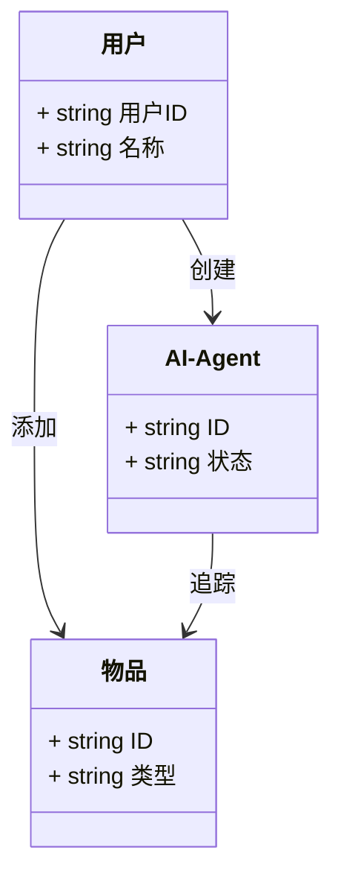

                 


# AI Agent在智能背包中的物品追踪

> 关键词：AI Agent, 智能背包, 物品追踪, 算法原理, 系统架构, 项目实战

> 摘要：本文深入探讨了AI Agent在智能背包中的物品追踪应用，从背景介绍、核心概念、算法原理、系统架构到项目实战，全面分析了AI Agent如何通过感知、决策和执行机制实现智能物品管理。通过实际案例和代码实现，展示了AI Agent在智能背包中的创新应用和未来发展方向。

---

# 第一部分: AI Agent与智能背包概述

## 第1章: AI Agent与智能背包的背景介绍

### 1.1 AI Agent的基本概念
#### 1.1.1 AI Agent的定义与特点
AI Agent（人工智能代理）是一种能够感知环境、自主决策并执行任务的智能体。它具备以下特点：
- **自主性**：能够独立运行，无需人工干预。
- **反应性**：能够实时感知环境变化并做出响应。
- **目标导向**：具备明确的目标，能够优化行动以达到目标。

#### 1.1.2 AI Agent的核心要素与功能
AI Agent的核心要素包括：
- **感知模块**：通过传感器或其他数据源获取环境信息。
- **决策模块**：基于感知信息进行推理和决策。
- **执行模块**：根据决策结果执行具体操作。

#### 1.1.3 AI Agent在智能背包中的应用价值
AI Agent在智能背包中的应用价值主要体现在：
- **智能物品管理**：通过AI Agent实现物品的自动识别、分类和追踪。
- **提高效率**：减少人工操作，提升物品管理效率。
- **增强用户体验**：通过智能化服务提升用户的使用体验。

### 1.2 物品追踪的背景与问题
#### 1.2.1 物品识别与追踪的定义与应用场景
物品追踪是指通过技术手段实时定位和监控物品的位置或状态。其应用场景包括：
- **物流管理**：实时追踪货物的位置。
- **个人物品管理**：帮助用户追踪丢失或 misplaced 的个人物品。

#### 1.2.2 智能背包中的物品管理需求
智能背包作为一种智能设备，需要具备以下物品管理功能：
- **物品识别**：能够识别背包中的物品。
- **物品定位**：能够实时定位背包中物品的位置。
- **物品状态监测**：能够监测物品的状态（如温度、湿度等）。

#### 1.2.3 当前物品追踪技术的局限性
当前物品追踪技术主要依赖于RFID、蓝牙或GPS等技术，存在以下局限性：
- **成本高**：RFID和GPS设备成本较高，难以大规模应用。
- **精度低**：在复杂环境中，定位精度有限。
- **功能单一**：传统追踪技术仅能实现基本的定位功能，缺乏智能化。

### 1.3 AI Agent在物品追踪中的问题解决
#### 1.3.1 AI Agent如何实现物品追踪
AI Agent通过以下方式实现物品追踪：
- **感知模块**：利用摄像头、传感器等设备感知背包中的物品信息。
- **决策模块**：基于感知信息，判断物品的位置和状态。
- **执行模块**：通过执行机构（如LED灯、蜂鸣器等）提供反馈或采取行动。

#### 1.3.2 AI Agent与传统物品追踪技术的对比
| 对比维度 | AI Agent | 传统追踪技术 |
|----------|-----------|---------------|
| 成本     | 较低       | 较高           |
| 精度     | 高         | 中等           |
| 功能     | 智能化     | 单一化         |
| 灵活性   | 高         | 低             |

#### 1.3.3 AI Agent在智能背包中的创新应用
AI Agent在智能背包中的创新应用包括：
- **智能识别**：通过图像识别技术实现物品的自动识别。
- **智能定位**：通过室内定位技术实现物品的精确定位。
- **智能监测**：通过传感器技术实现物品状态的实时监测。

---

## 第2章: AI Agent与物品追踪的核心概念

### 2.1 AI Agent的核心原理
#### 2.1.1 AI Agent的感知、决策与执行机制
AI Agent的核心原理可以分为三个主要部分：
1. **感知模块**：通过传感器、摄像头等设备获取环境信息。
2. **决策模块**：基于感知信息进行推理和决策。
3. **执行模块**：根据决策结果执行具体操作。

#### 2.1.2 AI Agent的自主性与智能性
AI Agent的自主性体现在其无需人工干预即可完成任务，而其智能性则体现在其能够通过学习和推理不断提升自身的决策能力。

#### 2.1.3 AI Agent在物品追踪中的任务分解
AI Agent在物品追踪中的任务分解包括：
- **目标识别**：识别背包中的目标物品。
- **位置定位**：确定目标物品的位置。
- **状态监测**：监测目标物品的状态。

### 2.2 物品追踪的核心原理
#### 2.2.1 物品识别技术
物品识别技术包括图像识别和语音识别等技术，能够实现对背包中物品的自动识别。

#### 2.2.2 物品定位技术
物品定位技术包括室内定位和GPS定位等技术，能够实现对背包中物品的精确定位。

#### 2.2.3 物品状态监测技术
物品状态监测技术包括温度传感器、湿度传感器等技术，能够实现对背包中物品状态的实时监测。

### 2.3 AI Agent与物品追踪的结合
#### 2.3.1 AI Agent在物品识别中的应用
AI Agent通过图像识别技术实现物品的自动识别，能够快速准确地识别背包中的物品。

#### 2.3.2 AI Agent在物品定位中的应用
AI Agent通过室内定位技术实现物品的精确定位，能够在复杂环境中快速找到目标物品的位置。

#### 2.3.3 AI Agent在物品状态监测中的应用
AI Agent通过传感器技术实现物品状态的实时监测，能够及时发现物品状态异常并采取相应措施。

---

## 第3章: AI Agent与物品追踪的核心概念联系

### 3.1 AI Agent与物品追踪的核心概念对比
#### 3.1.1 AI Agent与传统物品追踪技术的对比
AI Agent与传统物品追踪技术的对比可以体现在以下几个方面：
- **技术实现**：AI Agent采用智能化技术，传统技术依赖于硬件设备。
- **功能扩展**：AI Agent能够实现智能化服务，传统技术仅能实现基本的定位功能。
- **成本效益**：AI Agent在功能扩展方面更具成本效益。

#### 3.1.2 AI Agent在物品追踪中的优势
AI Agent在物品追踪中的优势包括：
- **智能化**：能够实现物品的自动识别、定位和监测。
- **高精度**：通过智能化算法实现高精度的物品追踪。
- **灵活性**：能够适应不同的应用场景和需求。

#### 3.1.3 AI Agent在智能背包中的创新应用
AI Agent在智能背包中的创新应用包括：
- **智能化管理**：通过AI Agent实现物品的智能化管理。
- **高效便捷**：通过智能化服务提升用户的使用体验。
- **成本优化**：通过智能化技术降低物品管理的成本。

### 3.2 AI Agent与物品追踪的ER实体关系图
```mermaid
er
actor: 用户
agent: AI Agent
item: 物品
tracking_system: 追踪系统
```

### 3.3 AI Agent与物品追踪的领域模型类图


---

# 第二部分: AI Agent在物品追踪中的算法原理

## 第4章: AI Agent的感知与决策算法

### 4.1 AI Agent的感知算法
#### 4.1.1 图像识别算法
图像识别算法用于识别背包中的物品，可以通过以下步骤实现：
1. **图像采集**：通过摄像头获取背包中的物品图像。
2. **图像预处理**：对图像进行去噪、增强等预处理操作。
3. **特征提取**：提取图像中的特征信息。
4. **分类识别**：通过分类器实现物品的自动识别。

#### 4.1.2 语音识别算法
语音识别算法用于识别背包中的语音指令，可以通过以下步骤实现：
1. **语音采集**：通过麦克风获取用户的语音指令。
2. **语音预处理**：对语音信号进行降噪、增强等预处理操作。
3. **特征提取**：提取语音信号中的特征信息。
4. **语音识别**：通过识别器实现语音的自动识别。

### 4.2 AI Agent的决策算法
#### 4.2.1 基于规则的决策算法
基于规则的决策算法是一种简单有效的决策方法，可以通过以下步骤实现：
1. **规则定义**：定义决策规则。
2. **条件判断**：根据当前状态判断是否满足决策条件。
3. **决策执行**：执行相应的决策操作。

#### 4.2.2 基于机器学习的决策算法
基于机器学习的决策算法是一种更高级的决策方法，可以通过以下步骤实现：
1. **数据采集**：采集背包中物品的相关数据。
2. **数据预处理**：对数据进行清洗、归一化等预处理操作。
3. **模型训练**：训练决策模型。
4. **决策推理**：通过推理引擎实现决策推理。

### 4.3 AI Agent的执行算法
#### 4.3.1 执行模块的设计
执行模块的设计需要考虑以下几点：
1. **执行机构**：包括LED灯、蜂鸣器等执行机构。
2. **控制策略**：制定控制策略以实现决策结果的执行。
3. **反馈机制**：通过反馈机制实现执行结果的监测和调整。

#### 4.3.2 执行算法的实现
执行算法的实现可以通过以下步骤实现：
1. **接收决策结果**：接收决策模块的决策结果。
2. **触发执行机构**：根据决策结果触发相应的执行机构。
3. **反馈执行结果**：将执行结果反馈给决策模块。

---

## 第5章: AI Agent的数学模型与公式推导

### 5.1 AI Agent的感知模型
#### 5.1.1 图像识别的概率模型
图像识别的概率模型可以通过以下公式表示：
$$ P(y|x) = \frac{P(x|y)P(y)}{P(x)} $$
其中，$P(y|x)$表示在观察到图像$x$的情况下，物品类型为$y$的概率。

#### 5.1.2 语音识别的马尔可夫模型
语音识别的马尔可夫模型可以通过以下公式表示：
$$ P(y|x) = \prod_{i=1}^{n} P(y_i|y_{i-1}, x) $$

### 5.2 AI Agent的决策模型
#### 5.2.1 基于Q-learning的决策模型
基于Q-learning的决策模型可以通过以下公式表示：
$$ Q(s, a) = r + \gamma \max_{a'} Q(s', a') $$
其中，$s$表示当前状态，$a$表示当前动作，$r$表示奖励，$\gamma$表示折扣因子。

#### 5.2.2 基于神经网络的决策模型
基于神经网络的决策模型可以通过以下公式表示：
$$ y = f(x) $$
其中，$f$表示神经网络模型，$x$表示输入数据，$y$表示输出结果。

---

## 第6章: AI Agent的系统架构设计

### 6.1 系统应用场景
#### 6.1.1 智能背包的使用场景
智能背包的使用场景包括：
- **日常使用**：用户在日常生活中的物品管理。
- **商务场景**：商务人士在出差或会议中的物品管理。
- **特殊场景**：如医疗、救援等特殊场景中的物品管理。

### 6.2 系统功能设计
#### 6.2.1 系统功能模块
系统功能模块包括：
- **物品识别模块**：实现物品的自动识别。
- **物品定位模块**：实现物品的精确定位。
- **物品状态监测模块**：实现物品状态的实时监测。

#### 6.2.2 系统功能流程
系统功能流程包括：
1. **物品识别**：通过图像识别技术实现物品的自动识别。
2. **物品定位**：通过室内定位技术实现物品的精确定位。
3. **物品监测**：通过传感器技术实现物品状态的实时监测。

### 6.3 系统架构设计
#### 6.3.1 系统架构的组成部分
系统架构的组成部分包括：
- **感知层**：包括摄像头、传感器等感知设备。
- **决策层**：包括决策模块和推理引擎。
- **执行层**：包括执行机构和反馈机制。

#### 6.3.2 系统架构的通信机制
系统架构的通信机制包括：
- **数据传输**：通过无线通信技术实现设备间的数据传输。
- **指令执行**：通过控制指令实现执行机构的操作。

---

## 第7章: AI Agent的项目实战

### 7.1 项目环境安装
#### 7.1.1 系统环境要求
系统环境要求包括：
- **操作系统**：Windows/Mac/Linux
- **Python版本**：Python 3.x
- **依赖库**：OpenCV、TensorFlow等。

#### 7.1.2 环境安装步骤
环境安装步骤包括：
1. **安装Python**：下载并安装Python 3.x。
2. **安装依赖库**：使用pip命令安装OpenCV、TensorFlow等依赖库。

### 7.2 系统核心代码实现
#### 7.2.1 物品识别核心代码
物品识别核心代码如下：
```python
import cv2
import numpy as np

# 加载预训练模型
model = cv2.dnn.readNetFromTensorFlow('model.pb', 'model.txt')

# 图像预处理
def preprocess_image(image):
    # 转换为blob格式
    blob = cv2.dnn.blobFromImage(image, 1.0, (224, 224), (104.0, 117.0, 123.0))
    return blob

# 图像识别
def recognize_item(image):
    blob = preprocess_image(image)
    model.setInput(blob)
    outputs = model.forward()
    class_id = np.argmax(outputs[0])
    return class_id
```

#### 7.2.2 物品定位核心代码
物品定位核心代码如下：
```python
import cv2

# 图像定位
def locate_item(image):
    # 使用OpenCV进行目标检测
    detector = cv2.ORB_create()
    kp = detector.detect(image)
    return kp
```

### 7.3 项目实现与案例分析
#### 7.3.1 项目实现步骤
项目实现步骤包括：
1. **环境搭建**：安装必要的开发环境和依赖库。
2. **代码实现**：实现物品识别、定位和监测的核心代码。
3. **系统测试**：进行功能测试和性能测试。
4. **结果分析**：分析测试结果并进行优化。

#### 7.3.2 项目案例分析
项目案例分析包括：
- **案例1**：背包中物品识别的案例分析。
- **案例2**：背包中物品定位的案例分析。

### 7.4 项目小结
项目小结包括：
- **项目总结**：总结项目的实现过程和取得的成果。
- **经验总结**：总结项目实施中的经验和教训。
- **优化建议**：提出进一步优化的建议和方向。

---

## 第8章: AI Agent在物品追踪中的最佳实践

### 8.1 小结
- **AI Agent的核心价值**：AI Agent通过智能化技术实现了物品的自动识别、定位和监测，显著提升了物品管理的效率和用户体验。
- **系统架构的优势**：系统架构的分层设计和模块化设计使得系统具有良好的可扩展性和可维护性。
- **算法原理的创新**：基于深度学习的感知和决策算法在实际应用中表现出色，具有较高的精度和灵活性。

### 8.2 注意事项
- **数据隐私**：在实际应用中需要注意数据的隐私保护。
- **系统安全**：需要加强系统的安全性，防止黑客攻击。
- **用户体验**：需要注重用户体验设计，确保系统的易用性和友好性。

### 8.3 拓展阅读
- **推荐书籍**：《深度学习》、《人工智能：一种现代的方法》。
- **推荐博客**：推荐关注AI领域的技术博客，获取最新的技术动态和研究成果。
- **推荐工具**：推荐使用TensorFlow、PyTorch等深度学习框架进行实践。

---

# 结语

通过本文的详细分析，我们可以看到AI Agent在智能背包中的物品追踪应用具有广阔的发展前景。AI Agent通过智能化技术实现了物品的自动识别、定位和监测，显著提升了物品管理的效率和用户体验。未来，随着AI技术的不断发展，AI Agent在智能背包中的应用将更加广泛和深入。

作者：AI天才研究院/AI Genius Institute & 禅与计算机程序设计艺术 /Zen And The Art of Computer Programming

