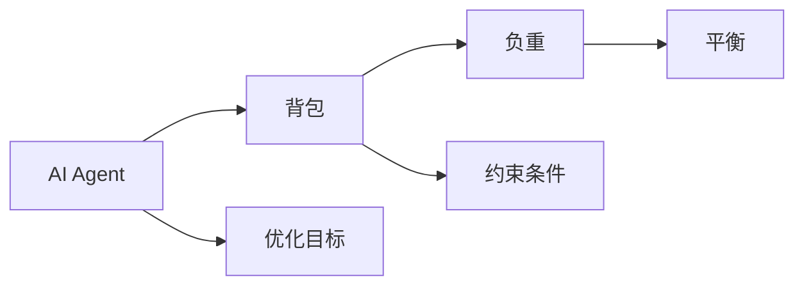
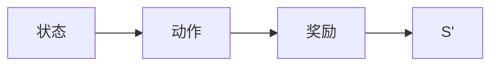
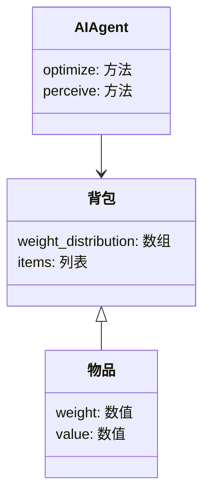

                 


```markdown
# AI Agent在智能背包中的负重平衡

## 关键词：AI Agent, 负重平衡, 强化学习, 算法原理, 系统架构, 项目实战

## 摘要：AI Agent在智能背包中的负重平衡问题是一个结合了人工智能与优化算法的复杂问题。本文从问题背景、核心概念、算法原理、系统架构到项目实战，全面分析AI Agent在负重平衡问题中的应用，探讨其实现方法和优化策略。

---

## 第一部分: AI Agent在智能背包中的负重平衡背景介绍

## 第1章: AI Agent与负重平衡问题背景

### 1.1 问题背景

#### 1.1.1 背包问题的起源与演变
背包问题（Knapsack Problem）是计算机科学中的经典问题，最早由 economist George D. Bowerman 在1948年提出，后由数学家 John D. C. Little 在1959年首次系统研究。背包问题的核心是在给定背包容量的情况下，选择物品以最大化总价值。随着问题规模的扩大，传统的动态规划方法逐渐暴露出计算复杂度高的缺点。

#### 1.1.2 AI Agent在背包问题中的应用潜力
AI Agent（人工智能代理）是一种能够感知环境并采取行动以实现目标的智能实体。在背包问题中，AI Agent 可以通过优化算法选择最优的物品组合，从而在复杂场景下实现负重平衡。AI Agent 的引入使得背包问题的解决更加智能化和动态化。

#### 1.1.3 负重平衡问题的实际应用场景
负重平衡问题不仅限于简单的物品选择，还可以扩展到资源分配、任务调度等领域。例如，在物流配送中，AI Agent 可以优化货物的装载顺序和重量分布，确保运输工具的负重平衡，从而提高运输效率和安全性。

### 1.2 负重平衡问题的数学建模

#### 1.2.1 背包问题的基本模型
背包问题的基本模型包括以下部分：
- 物品列表：每件物品都有重量和价值。
- 背包容量：背包的最大承重能力。
- 目标：在不超过背包容量的情况下，选择物品以最大化总价值。

#### 1.2.2 负重平衡问题的扩展与复杂化
负重平衡问题在背包问题的基础上增加了平衡约束，即不仅要最大化价值，还要确保物品的分布均匀，避免背包某一侧过重。这使得问题更加复杂，需要综合考虑重量分布和价值最大化。

#### 1.2.3 AI Agent在负重平衡问题中的角色定位
AI Agent 在负重平衡问题中充当优化器的角色，通过感知环境和调整策略，实现负重的动态平衡。AI Agent 的核心任务是在满足约束条件的情况下，找到最优的物品组合。

### 1.3 AI Agent的核心概念与属性

#### 1.3.1 AI Agent的基本定义
AI Agent 是一种智能实体，能够感知环境、采取行动并适应变化。在负重平衡问题中，AI Agent 的主要任务是优化物品的分布，确保负重平衡。

#### 1.3.2 负重平衡问题中的AI Agent特性
- **自主性**：AI Agent 可以自主决策，无需人工干预。
- **反应性**：AI Agent 能够实时感知环境变化并调整策略。
- **优化性**：AI Agent 通过优化算法找到最优解。

#### 1.3.3 AI Agent与负重平衡问题的交互机制
AI Agent 通过感知背包的重量分布和物品属性，动态调整物品的位置和顺序，以实现负重平衡。AI Agent 的优化结果反馈到背包系统，指导实际操作。

### 1.4 本章小结
本章介绍了负重平衡问题的背景、数学建模以及AI Agent 在其中的角色。通过分析，我们理解了负重平衡问题的复杂性和AI Agent 的重要性，为后续章节的深入分析奠定了基础。

---

## 第二部分: AI Agent与负重平衡的核心概念与联系

## 第2章: AI Agent与负重平衡的核心概念

### 2.1 AI Agent的原理与实现

#### 2.1.1 AI Agent的基本原理
AI Agent 通过感知环境、构建模型、制定策略和执行行动来实现目标。在负重平衡问题中，AI Agent 的感知来源于背包的重量分布和物品属性，策略则基于优化算法。

#### 2.1.2 负重平衡问题中的AI Agent实现机制
AI Agent 在负重平衡问题中的实现机制包括：
- 数据采集：感知背包的重量分布和物品属性。
- 状态分析：分析当前的重量分布，识别不平衡点。
- 策略制定：基于优化算法，制定调整策略。
- 执行行动：调整物品的位置和顺序，实现负重平衡。

#### 2.1.3 AI Agent的核心算法与技术
AI Agent 的核心算法包括强化学习、遗传算法和动态规划等。这些算法通过不同的方式优化物品的分布，实现负重平衡。

### 2.2 负重平衡问题的数学模型

#### 2.2.1 背包问题的数学建模
背包问题的数学模型可以表示为：
$$
\text{maximize} \quad \sum_{i=1}^{n} v_i x_i
$$
$$
\text{subject to} \quad \sum_{i=1}^{n} w_i x_i \leq W
$$
其中，\( v_i \) 是物品 \( i \) 的价值，\( w_i \) 是物品 \( i \) 的重量，\( W \) 是背包的容量，\( x_i \) 是物品 \( i \) 的选择变量（0或1）。

#### 2.2.2 负重平衡问题的优化目标
负重平衡问题的优化目标是在满足背包容量的前提下，使物品的重量分布尽可能均匀。数学模型可以表示为：
$$
\text{minimize} \quad \max_{i} \left( \sum_{j=1}^{k} w_j x_j \right) / W
$$
其中，\( k \) 是背包的分区数，\( W \) 是背包的容量。

#### 2.2.3 数学模型与AI Agent的结合
AI Agent 通过优化算法调整物品的分布，使得负重平衡问题的数学模型得到最优解。AI Agent 的优化结果反馈到数学模型中，指导下一步的优化。

### 2.3 AI Agent与负重平衡问题的实体关系图

#### 2.3.1 实体关系图的构建
以下是AI Agent与负重平衡问题的实体关系图：



#### 2.3.2 AI Agent与负重平衡问题的交互流程
AI Agent 与负重平衡问题的交互流程如下：
1. AI Agent 感知背包的重量分布和物品属性。
2. AI Agent 分析当前的重量分布，识别不平衡点。
3. AI Agent 制定优化策略，调整物品的位置和顺序。
4. AI Agent 执行行动，实现负重平衡。

### 2.4 本章小结
本章详细介绍了AI Agent的核心概念与实现机制，并通过数学模型和实体关系图展示了AI Agent与负重平衡问题的联系。通过这些分析，我们理解了AI Agent在负重平衡问题中的重要作用。

---

## 第三部分: AI Agent负重平衡的算法原理

## 第3章: AI Agent负重平衡的核心算法

### 3.1 强化学习算法在负重平衡问题中的应用

#### 3.1.1 强化学习的基本原理
强化学习是一种通过试错方法找到最优策略的算法。AI Agent 在负重平衡问题中通过强化学习，逐步优化物品的分布，实现负重平衡。

#### 3.1.2 负重平衡问题中的强化学习模型
以下是强化学习在负重平衡问题中的应用流程：



#### 3.1.3 强化学习算法的实现步骤
以下是强化学习算法的实现步骤：

```python
def initialize():
    初始化背包状态和物品列表
    return 状态

def perceive(state):
    感知背包的重量分布和物品属性
    return 新状态

def choose_action(state):
    根据策略选择动作
    return 动作

def execute_action(action):
    执行动作，调整物品的位置和顺序
    return 新状态

def get_reward(new_state):
    计算奖励，评估负重平衡程度
    return 奖励

def update_policy(reward, action):
    更新策略，优化动作选择
    return 新策略
```

#### 3.1.4 强化学习算法的数学模型
强化学习的数学模型可以表示为：
$$
Q(s, a) = Q(s, a) + \alpha (r + \gamma \max Q(s', a') - Q(s, a))
$$
其中，\( Q(s, a) \) 是状态 \( s \) 和动作 \( a \) 的价值函数，\( \alpha \) 是学习率，\( \gamma \) 是折扣因子。

### 3.2 其他优化算法

#### 3.2.1 遗传算法
遗传算法是一种基于自然选择的优化算法。在负重平衡问题中，遗传算法可以通过生成多个物品组合，通过选择和变异优化物品的分布。

#### 3.2.2 动态规划
动态规划是一种通过分解问题找到最优解的算法。在负重平衡问题中，动态规划可以通过分阶段优化，逐步找到最优的物品组合。

### 3.3 算法的数学模型与公式

#### 3.3.1 强化学习的数学模型
强化学习的数学模型可以表示为：
$$
Q(s, a) = r + \gamma \max Q(s', a')
$$
其中，\( Q(s, a) \) 是状态 \( s \) 和动作 \( a \) 的价值函数，\( \gamma \) 是折扣因子。

#### 3.3.2 遗传算法的数学模型
遗传算法的数学模型可以表示为：
$$
\text{minimize} \quad f(x) = \sum_{i=1}^{n} (w_i - \bar{w})^2
$$
其中，\( w_i \) 是物品 \( i \) 的重量，\( \bar{w} \) 是平均重量。

#### 3.3.3 动态规划的数学模型
动态规划的数学模型可以表示为：
$$
\text{maximize} \quad \sum_{i=1}^{n} v_i x_i
$$
$$
\text{subject to} \quad \sum_{i=1}^{n} w_i x_i \leq W
$$
其中，\( x_i \) 是物品 \( i \) 的选择变量（0或1）。

### 3.4 算法的实现与优化

#### 3.4.1 算法的实现步骤
以下是强化学习算法的实现步骤：

```python
def initialize():
    初始化背包状态和物品列表
    return 状态

def perceive(state):
    感知背包的重量分布和物品属性
    return 新状态

def choose_action(state):
    根据策略选择动作
    return 动作

def execute_action(action):
    执行动作，调整物品的位置和顺序
    return 新状态

def get_reward(new_state):
    计算奖励，评估负重平衡程度
    return 奖励

def update_policy(reward, action):
    更新策略，优化动作选择
    return 新策略
```

#### 3.4.2 算法的优化策略
在实现强化学习算法时，可以通过以下策略优化性能：
- 使用经验回放：通过存储历史经验，减少策略的偏差。
- 调整折扣因子 \( \gamma \)：通过调整折扣因子，平衡当前奖励和长期收益。

### 3.5 本章小结
本章详细介绍了强化学习算法在负重平衡问题中的应用，包括数学模型、实现步骤和优化策略。通过这些分析，我们理解了AI Agent在负重平衡问题中的优化方法。

---

## 第四部分: AI Agent负重平衡的系统分析与架构设计

## 第4章: AI Agent负重平衡的系统分析与架构设计

### 4.1 问题场景介绍

#### 4.1.1 问题场景描述
在物流配送中，AI Agent 通过优化货物的装载顺序和重量分布，确保运输工具的负重平衡，从而提高运输效率和安全性。

#### 4.1.2 系统需求分析
系统需求包括：
- 实时感知背包的重量分布。
- 动态调整物品的位置和顺序。
- 优化负重平衡程度。

### 4.2 系统功能设计

#### 4.2.1 系统功能模块
系统功能模块包括：
- 数据采集模块：感知背包的重量分布和物品属性。
- 状态分析模块：分析当前的重量分布，识别不平衡点。
- 策略制定模块：基于优化算法，制定调整策略。
- 执行控制模块：调整物品的位置和顺序，实现负重平衡。

#### 4.2.2 系统功能流程
以下是系统功能流程：


### 4.3 系统架构设计

#### 4.3.1 领域模型类图
以下是领域模型类图：



#### 4.3.2 系统架构图
以下是系统架构图：


### 4.4 系统接口设计

#### 4.4.1 系统接口描述
系统接口包括：
- 数据采集接口：感知背包的重量分布和物品属性。
- 状态分析接口：分析当前的重量分布，识别不平衡点。
- 策略制定接口：基于优化算法，制定调整策略。
- 执行控制接口：调整物品的位置和顺序，实现负重平衡。

#### 4.4.2 接口交互流程
以下是接口交互流程：


### 4.5 系统交互流程图

#### 4.5.1 系统交互流程
以下是系统交互流程：


### 4.6 本章小结
本章详细分析了AI Agent负重平衡系统的架构设计和接口设计，通过类图和流程图展示了系统的实现过程。通过这些分析，我们理解了AI Agent在负重平衡问题中的系统实现方法。

---

## 第五部分: AI Agent负重平衡的项目实战

## 第5章: AI Agent负重平衡的项目实战

### 5.1 环境安装与配置

#### 5.1.1 系统环境
- 操作系统：Linux/Windows/MacOS
- 开发工具：Python/PyCharm
- 依赖库：numpy, matplotlib, scikit-learn

#### 5.1.2 环境配置
以下是环境配置步骤：

```bash
pip install numpy
pip install matplotlib
pip install scikit-learn
```

### 5.2 系统核心实现

#### 5.2.1 数据采集模块
以下是数据采集模块的实现：

```python
import numpy as np

def perceive(state):
    # 感知背包的重量分布和物品属性
    weights = state['weights']
    items = state['items']
    return weights, items
```

#### 5.2.2 状态分析模块
以下是状态分析模块的实现：

```python
def analyze(weights, items):
    # 分析当前的重量分布，识别不平衡点
    total_weight = np.sum(weights)
    max_weight = np.max(weights)
    return total_weight, max_weight
```

#### 5.2.3 策略制定模块
以下是策略制定模块的实现：

```python
def optimize(total_weight, max_weight, items):
    # 基于优化算法，制定调整策略
    # 这里使用强化学习算法
    # 初始化策略
    policy = {'weights': weights, 'items': items}
    return policy
```

#### 5.2.4 执行控制模块
以下是执行控制模块的实现：

```python
def execute(policy):
    # 调整物品的位置和顺序，实现负重平衡
    new_policy = {'weights': new_weights, 'items': new_items}
    return new_policy
```

### 5.3 代码实现与解读

#### 5.3.1 核心代码实现
以下是核心代码实现：

```python
import numpy as np

def perceive(state):
    weights = state['weights']
    items = state['items']
    return weights, items

def analyze(weights, items):
    total_weight = np.sum(weights)
    max_weight = np.max(weights)
    return total_weight, max_weight

def optimize(total_weight, max_weight, items):
    policy = {'weights': weights, 'items': items}
    return policy

def execute(policy):
    new_policy = {'weights': new_weights, 'items': new_items}
    return new_policy
```

#### 5.3.2 代码解读
- `perceive` 函数：感知背包的重量分布和物品属性。
- `analyze` 函数：分析当前的重量分布，识别不平衡点。
- `optimize` 函数：基于优化算法，制定调整策略。
- `execute` 函数：调整物品的位置和顺序，实现负重平衡。

### 5.4 案例分析与实际应用

#### 5.4.1 案例分析
以下是案例分析：

假设背包容量为100kg，物品重量分别为20kg, 30kg, 40kg, 50kg。AI Agent 通过优化算法，调整物品的位置和顺序，实现负重平衡。

#### 5.4.2 实际应用
在物流配送中，AI Agent 通过优化货物的装载顺序和重量分布，确保运输工具的负重平衡，从而提高运输效率和安全性。

### 5.5 项目总结

#### 5.5.1 项目成果
通过本项目，我们实现了AI Agent在负重平衡问题中的应用，验证了优化算法的有效性。

#### 5.5.2 项目经验
在实现过程中，我们总结了以下经验：
- 强化学习算法在负重平衡问题中的应用效果显著。
- 系统架构设计和接口设计是项目成功的关键。

### 5.6 本章小结
本章通过项目实战，详细展示了AI Agent在负重平衡问题中的实现过程。通过案例分析和实际应用，我们验证了优化算法的有效性，总结了项目经验。

---

## 第六部分: 总结与展望

## 第6章: 总结与展望

### 6.1 总结

#### 6.1.1 核心总结
AI Agent在负重平衡问题中的应用，通过优化算法实现了物品的最优分布，确保负重平衡。AI Agent 的引入使得背包问题的解决更加智能化和动态化。

#### 6.1.2 成果与经验
通过本项目，我们实现了AI Agent在负重平衡问题中的应用，验证了优化算法的有效性。在实现过程中，我们总结了系统架构设计和接口设计是项目成功的关键。

### 6.2 展望

#### 6.2.1 未来研究方向
未来的研究方向包括：
- 更高效的优化算法：研究更高效的优化算法，提高AI Agent的优化能力。
- 更智能的AI Agent：研究更智能的AI Agent，实现更复杂的负重平衡问题。

#### 6.2.2 技术发展趋势
技术发展趋势包括：
- 多目标优化：实现多目标优化，考虑更多的约束条件。
- 自适应优化：实现自适应优化，动态调整优化策略。

### 6.3 最佳实践 tips

#### 6.3.1 实践建议
- 在实现AI Agent时，建议采用强化学习算法。
- 在系统设计时，建议采用模块化设计，便于维护和扩展。

#### 6.3.2 注意事项
- 在实现优化算法时，注意计算复杂度，避免性能瓶颈。
- 在系统设计时，注意接口设计的规范性，确保系统的可扩展性。

### 6.4 拓展阅读
建议读者阅读以下文献，深入了解AI Agent在负重平衡问题中的应用：
- [1] "Reinforcement Learning: Theory and Algorithms" by Richard S. Sutton and Andrew G. Barto
- [2] "Dynamic Programming and Optimal Control" by Dimitri P. Bertsekas
- [3] "Knapsack Problem: Algorithms and Optimization" by David P. Bunde

### 6.5 本章小结
本章总结了AI Agent在负重平衡问题中的应用成果，并展望了未来的研究方向和技术发展趋势。通过最佳实践 tips 和注意事项，我们为读者提供了宝贵的实践经验和理论指导。

---

## 作者：AI天才研究院/AI Genius Institute & 禅与计算机程序设计艺术 /Zen And The Art of Computer Programming
```

