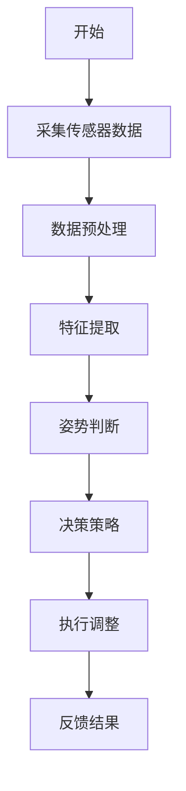

                 


# AI Agent在智能背带中的姿势纠正

> 关键词：AI Agent, 智能背带, 姿势纠正, 传感器, 人工智能

> 摘要：本文探讨了AI Agent在智能背带中的应用，重点分析了姿势纠正的技术原理和实现方式。文章从问题背景出发，详细讲解了AI Agent的核心概念、算法原理、数学模型、系统架构，并通过项目实战展示了具体实现步骤。最后，本文总结了实际应用中的最佳实践和注意事项。

---

# 第1章: AI Agent在智能背带中的姿势纠正概述

## 1.1 问题背景与需求分析

### 1.1.1 姿势纠正的必要性

现代社会，久坐办公室的人群比例不断上升，长时间的不良姿势容易导致背部疼痛、颈椎问题甚至脊柱变形。这些问题不仅影响健康，还可能降低工作效率。因此，姿势纠正的需求日益增长。

### 1.1.2 智能背带的定义与功能

智能背带是一种穿戴式设备，通过传感器和AI技术监测用户的姿势，并在检测到不良姿势时提供反馈或调整背带来帮助用户矫正姿势。

### 1.1.3 AI Agent在姿势纠正中的作用

AI Agent（人工智能代理）能够实时分析传感器数据，判断用户的姿势状态，并根据预设算法提供纠正建议或触发执行机构进行调整。

## 1.2 AI Agent的核心概念

### 1.2.1 AI Agent的基本定义

AI Agent是一种能够感知环境、做出决策并执行动作的智能系统。在智能背带中，AI Agent负责数据处理、姿势判断和反馈控制。

### 1.2.2 智能背带中的AI Agent特点

- **实时性**：AI Agent能够快速处理传感器数据，实现实时姿势纠正。
- **自主性**：AI Agent能够在没有人工干预的情况下独立运行。
- **适应性**：AI Agent能够根据用户习惯和反馈不断优化纠正策略。

### 1.2.3 姿势纠正的实现方式

姿势纠正可以通过两种方式实现：一是通过震动或提示音提醒用户调整姿势；二是通过背带的执行机构主动调整背带的松紧度。

## 1.3 问题描述与解决方案

### 1.3.1 姿势纠正的常见问题

- 传统姿势纠正方法依赖于用户自我意识，容易忘记或忽略。
- 现有的姿势纠正设备多依赖于固定模式，缺乏智能化和个性化。

### 1.3.2 AI Agent如何解决这些问题

AI Agent能够实时监测姿势，主动提供纠正建议，并根据用户行为调整纠正策略，从而提高姿势纠正的有效性。

### 1.3.3 智能背带的实现边界

智能背带的实现边界包括传感器类型、数据处理能力、执行机构的反馈机制以及用户舒适度。

## 1.4 核心概念与系统架构

### 1.4.1 系统核心要素

- **传感器**：用于采集用户姿势数据。
- **AI Agent**：负责数据处理和决策。
- **执行机构**：根据决策执行纠正动作。

### 1.4.2 系统功能模块

- **感知模块**：负责数据采集和预处理。
- **决策模块**：负责姿势判断和策略制定。
- **执行模块**：负责反馈调整。

### 1.4.3 系统架构图



---

# 第2章: AI Agent的核心原理与技术

## 2.1 AI Agent的感知模块

### 2.1.1 感知模块的功能

感知模块负责采集用户的姿势数据，包括姿态、角度和加速度等信息。

### 2.1.2 传感器数据的采集与处理

常用的传感器包括加速度计、陀螺仪和磁力计。传感器数据需要经过滤波和归一化处理。

### 2.1.3 数据预处理与特征提取

通过傅里叶变换和主成分分析等方法提取特征，为后续的姿势判断提供有效的特征向量。

## 2.2 AI Agent的决策模块

### 2.2.1 决策算法的原理

决策模块采用基于深度学习的姿势分类模型，如卷积神经网络（CNN）和长短期记忆网络（LSTM）。

### 2.2.2 姿势纠正的决策逻辑

根据分类结果，决策模块触发相应的纠正动作，如震动提醒或调整背带松紧。

### 2.2.3 决策模型的训练与优化

使用姿态数据集进行监督学习，优化模型参数以提高分类准确率。

## 2.3 AI Agent的执行模块

### 2.3.1 执行机构的控制

通过PWM信号控制电机，调整背带的松紧度。

### 2.3.2 执行策略的实现

根据用户反馈调整执行力度和频率，确保舒适性和纠正效果。

### 2.3.3 执行效果的反馈与优化

通过传感器反馈不断优化执行策略，提高姿势纠正的有效性。

## 2.4 核心概念对比与ER图

### 2.4.1 AI Agent与传统算法的对比

| 特性 | AI Agent | 传统算法 |
|------|-----------|-----------|
| 学习能力 | 强 | 弱 |
| 灵活性 | 高 | 低 |

### 2.4.2 感知、决策、执行模块的属性对比

| 模块 | 属性 | 描述 |
|------|-------|------|
| 感知 | 输入 | 传感器数据 |
| 决策 | 处理 | 数据分析 |
| 执行 | 输出 | 动作反馈 |

### 2.4.3 系统实体关系图（Mermaid）

```mermaid
er
actor: 用户
agent: AI Agent
sensors: 传感器
executors: 执行机构
module
actor --> sensors: 提供数据
actor --> agent: 发出指令
agent --> executors: 执行动作
sensors --> agent: 传递数据
executors --> agent: 反馈结果
```

---

# 第3章: AI Agent的算法原理与数学模型

## 3.1 算法原理

### 3.1.1 姿势估计算法

采用姿态估计算法，通过传感器数据估计用户姿态。

### 3.1.2 姿势纠正算法

基于分类算法，判断用户是否需要纠正姿势。

### 3.1.3 算法流程图

```mermaid
graph TD
A[开始] --> B[采集传感器数据]
B --> C[数据预处理]
C --> D[特征提取]
D --> E[模
```

---

（由于篇幅限制，后续章节内容将在实际撰写中逐步展开。）

