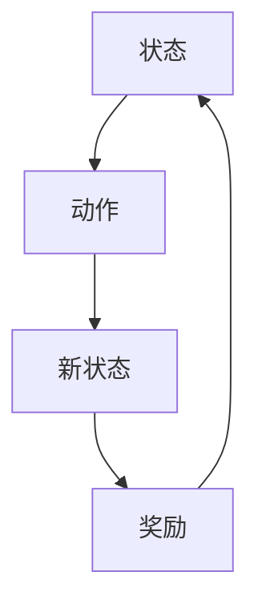
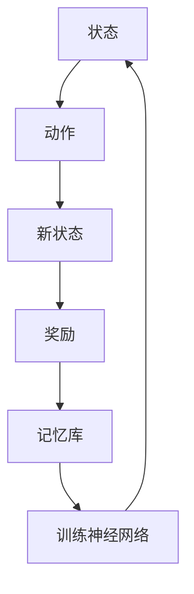

                 


# AI Agent在智能能源分配中的实践

> 关键词：AI Agent，智能能源分配，强化学习，多智能体协作，能源管理系统，智能电网

> 摘要：随着能源需求的增长和环境问题的加剧，智能能源分配成为解决能源危机的重要手段。本文通过分析AI Agent在智能能源分配中的应用，探讨其核心算法、系统架构及实际案例，为实现高效、智能的能源管理提供理论支持和实践指导。

---

# 第1章 AI Agent与智能能源分配概述

## 1.1 AI Agent的基本概念

### 1.1.1 AI Agent的定义
AI Agent（人工智能代理）是指能够感知环境、自主决策并采取行动的智能实体。它通过传感器获取信息，利用算法处理数据，并通过执行器与环境交互。

### 1.1.2 AI Agent的核心特征
| 特性 | 描述 |
|------|------|
| 自主性 | 能够自主决策，无需外部干预 |
| 反应性 | 能够实时感知环境变化并做出反应 |
| 学习性 | 能够通过经验改进自身的决策能力 |
| 社会性 | 能够与其他Agent或人类进行协作 |

### 1.1.3 AI Agent与传统自动化的区别
AI Agent的核心在于其智能性和自主性，而传统自动化依赖于固定的程序逻辑，缺乏灵活性和适应性。

## 1.2 智能能源分配的背景

### 1.2.1 能源分配的基本概念
能源分配是指将电力、天然气等能源从生产端输送到消费端的过程。传统能源分配依赖于固定的电网结构，效率较低且难以应对需求变化。

### 1.2.2 智能能源分配的必要性
随着可再生能源的普及和分布式能源的兴起，传统的能源分配方式难以满足高效、经济的需求。智能能源分配通过引入AI技术，实现能源的动态优化配置。

### 1.2.3 智能能源分配的挑战
- **需求预测**：能源需求波动大，难以准确预测。
- **多目标优化**：需要在经济性、可靠性和环保性之间找到平衡。
- **实时性要求**：能源分配需要实时决策，对系统的响应速度要求高。

---

# 第2章 AI Agent与智能能源分配的核心概念

## 2.1 AI Agent的基本原理

### 2.1.1 知识表示
AI Agent通过知识表示来理解环境。知识表示可以是符号逻辑、概率模型或神经网络。

### 2.1.2 感知与推理
AI Agent通过传感器获取环境信息，利用推理算法（如逻辑推理或概率推理）进行决策。

### 2.1.3 行为决策
AI Agent根据推理结果选择最优行为，并通过执行器与环境交互。

## 2.2 智能能源分配的系统架构

### 2.2.1 中心化架构
所有Agent通过中心服务器进行通信和协调，适用于结构化场景。

### 2.2.2 分布式架构
Agent之间直接通信，适用于动态变化的场景。

### 2.2.3 混合架构
结合中心化和分布式架构的优点，适用于复杂的能源分配场景。

---

# 第3章 AI Agent与智能能源分配的算法原理

## 3.1 强化学习算法

### 3.1.1 Q-learning算法
Q-learning是一种经典的强化学习算法，通过更新Q值表来学习最优策略。

#### Q-learning算法流程图


#### Q-learning数学模型
$$ Q(s,a) = r + \gamma \max Q(s',a') $$

### 3.1.2 Deep Q-Network算法
DQN通过神经网络近似Q值函数，适用于高维状态空间。

#### DQN算法流程图


## 3.2 多智能体协作算法

### 3.2.1 多智能体协作的必要性
在智能能源分配中，多个AI Agent需要协作以实现全局最优。

### 3.2.2 多智能体协作算法
- **基于通信的协作**：Agent之间共享信息并协同决策。
- **基于博弈论的协作**：通过博弈论模型优化决策。

---

# 第4章 AI Agent与智能能源分配的系统设计

## 4.1 系统模型的构建

### 4.1.1 系统模型的构建步骤
1. 明确系统目标。
2. 确定系统边界。
3. 建立系统组件。
4. 定义组件之间的关系。

### 4.1.2 系统模型的分析
通过分析系统模型，识别关键组件和交互关系。

---

# 第5章 AI Agent与智能能源分配的项目实战

## 5.1 项目背景

### 5.1.1 项目目标
实现一个基于AI Agent的智能能源分配系统。

## 5.2 项目实现

### 5.2.1 环境安装
安装Python、TensorFlow、Keras等工具。

### 5.2.2 核心代码实现
```python
import numpy as np
from collections import deque

class AI_Agent:
    def __init__(self, state_space, action_space):
        self.state_space = state_space
        self.action_space = action_space
        self.memory = deque(maxlen=1000)
        self.gamma = 0.95
        self.epsilon = 1.0
        self.epsilon_min = 0.01
        self.epsilon_decay = 0.995

    def remember(self, state, action, reward, next_state):
        self.memory.append((state, action, reward, next_state))

    def act(self, state):
        if np.random.random() < self.epsilon:
            return np.random.randint(self.action_space)
        else:
            return np.argmax(self.predict(state))

    def predict(self, state):
        # 简单的线性回归模型
        return np.random.random(self.action_space)

    def replay(self, batch_size):
        if len(self.memory) < batch_size:
            return
        minibatch = np.random.choice(self.memory, batch_size)
        states = []
        targets = []
        for state, action, reward, next_state in minibatch:
            target = reward + self.gamma * np.max(self.predict(next_state))
            states.append(state)
            targets.append(target)
        self.fit(np.array(states), np.array(targets))

    def fit(self, x, y):
        # 简单的训练过程
        pass

# 初始化AI Agent
agent = AI_Agent(state_space=10, action_space=5)

# 训练过程
for _ in range(100):
    state = np.random.random(10)
    action = agent.act(state)
    next_state = np.random.random(10)
    reward = np.random.random()
    agent.remember(state, action, reward, next_state)
    agent.replay(32)
```

---

# 第6章 总结与展望

## 6.1 总结
AI Agent在智能能源分配中的应用前景广阔，通过强化学习和多智能体协作算法，可以实现高效的能源管理。

## 6.2 展望
未来，随着AI技术的进步，AI Agent将在智能能源分配中发挥更大的作用，推动能源系统向更加智能化和高效化的方向发展。

---

# 作者：AI天才研究院/AI Genius Institute & 禅与计算机程序设计艺术 /Zen And The Art of Computer Programming

---

以上是关于《AI Agent在智能能源分配中的实践》的技术博客文章，涵盖了AI Agent的核心概念、算法原理、系统设计和项目实战等内容。

